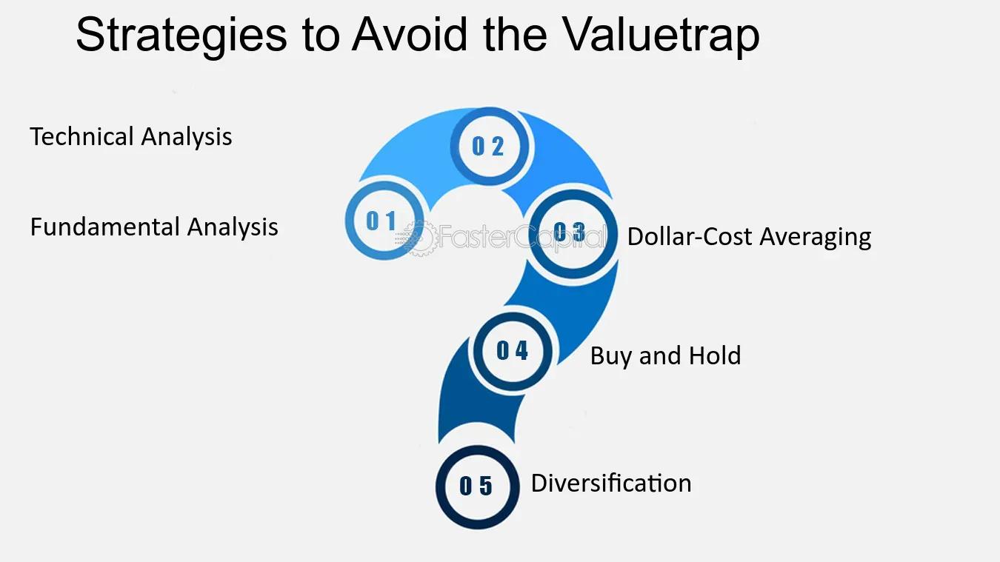

## Table of Contents

## What is a value trap in investing?

A value trap is when an investment looks cheap but is actually a bad choice. It tricks investors into thinking they are getting a good deal, but the company might have big problems. These problems could be things like too much debt, bad management, or losing money over time. When investors buy into a value trap, they might see the value of their investment go down instead of up.

Spotting a value trap can be tricky. Sometimes, a stock might look cheap because its price is low compared to its earnings or other measures. But if the company's problems are serious and not likely to get better, the low price is a trap. It's important for investors to do a lot of research and look at the company's overall health, not just its price. This way, they can avoid falling into a value trap and losing money.

## How can you identify a value trap?

To identify a value trap, you need to look beyond just the low price of a stock. A key sign of a value trap is when a company's earnings are going down over time. If the company is making less and less money, the low stock price might not be a good deal. It's also important to check if the company has a lot of debt. Too much debt can make it hard for the company to grow or even stay in business, turning a seemingly cheap stock into a trap.

Another way to spot a value trap is by looking at the company's management and their plans for the future. If the management team doesn't have a clear plan to fix the company's problems or if they have a history of making bad decisions, the stock might be a trap. You should also pay attention to the industry the company is in. If the whole industry is struggling, a low-priced stock in that industry might not be a good investment. By doing careful research and looking at the big picture, you can avoid falling into a value trap.

## What are common characteristics of companies that become value traps?

Companies that become value traps often have a few things in common. One big problem is that they might be losing money or making less money over time. This can happen because they are not selling as many products or services, or because they are spending too much money to keep the business running. Another common issue is that these companies might have a lot of debt. When a company owes a lot of money, it can be hard for them to pay it back, especially if they are not making enough money. This makes the company's future look risky, and the low stock price might not be a good deal after all.

Another characteristic of companies that become value traps is poor management. If the people running the company are not making good decisions or don't have a clear plan to fix the company's problems, it can lead to a value trap. Sometimes, the whole industry the company is in might be struggling, which makes it even harder for the company to do well. Investors need to look at all these factors to see if a low-priced stock is really a good deal or just a trap. By understanding these common characteristics, investors can make smarter choices and avoid losing money.

## What is the difference between a value trap and a genuinely undervalued stock?

A value trap is when a stock looks cheap but is actually a bad investment. It tricks people into thinking they are getting a good deal, but the company might have big problems like losing money, too much debt, or bad management. If someone buys a value trap, they might lose money because the stock price keeps going down instead of up. On the other hand, a genuinely undervalued stock is a good investment that is priced lower than it should be. This can happen if people are not paying attention to the company or if there is some temporary bad news. But if the company is strong and making money, the stock price will likely go up over time, making it a good buy.

The key difference between a value trap and an undervalued stock is the future outlook of the company. A value trap looks cheap but has serious problems that are not likely to get better. For example, if a company keeps losing money and has a lot of debt, it's probably a value trap. An undervalued stock, on the other hand, might look cheap because of short-term issues, but the company is actually doing well and has a bright future. By doing careful research and looking at the company's overall health, investors can tell the difference and avoid value traps while finding good undervalued stocks.

## How does financial analysis help in avoiding value traps?

Financial analysis helps in avoiding value traps by giving investors a clear picture of a company's health. When you look at the financial statements, you can see if the company is making money, how much debt it has, and if it's spending more than it's [earning](/wiki/earning-announcement). If a company's earnings are going down over time or if it has a lot of debt, it might be a value trap. By doing this analysis, investors can see if the low stock price is a real bargain or if it's just a trap.

Also, financial analysis can show if a company's problems are temporary or if they are likely to last. For example, if a company is losing money because of a short-term issue like a bad quarter or a one-time cost, the stock might be undervalued. But if the problems are deeper, like ongoing losses or bad management, the stock is probably a value trap. By understanding these details through financial analysis, investors can make smarter choices and avoid losing money on value traps.

## What role do qualitative factors play in identifying value traps?

Qualitative factors are really important when trying to spot value traps. They look at things you can't see in numbers, like how good the company's leaders are, what people think about the company, and how well the company is doing compared to others in its field. If the leaders of the company keep making bad choices or don't have a good plan to fix problems, the company might be a value trap. Also, if people don't like the company's products or if it's losing customers, that can be a big warning sign.

Another thing to think about is the industry the company is in. If the whole industry is having a hard time, a low-priced stock in that industry might not be a good deal. It's also helpful to see what other people who know a lot about the company are saying. If experts are worried about the company's future, it's a good idea to be careful. By looking at these qualitative factors, you can get a better idea of whether a cheap stock is really a good buy or if it's just a trap.

## Can you explain some historical examples of value traps?

One famous example of a value trap is Eastman Kodak. Back in the early 2000s, Kodak's stock looked really cheap. It was trading at a low price compared to how much money the company was making. But the problem was that digital cameras were becoming more popular, and Kodak was not keeping up with this change. The company was losing money and had a lot of debt. People who bought Kodak stock thinking it was a good deal ended up losing a lot of money as the stock price kept going down. Kodak's failure to adapt to new technology turned it into a value trap.

Another example is Sears Holdings. In the early 2010s, Sears' stock seemed like a bargain because it was priced low. But Sears was struggling because more people were shopping online instead of at big stores like Sears. The company was losing money, and it had a lot of debt. Even though the stock looked cheap, Sears was not fixing its problems. Investors who bought Sears stock hoping for a comeback lost money as the company's problems got worse. Sears is a good example of how a company can look like a good deal but actually be a value trap because of big problems that won't go away.

## What are the key financial ratios to watch out for to avoid value traps?

To avoid value traps, you need to look at some key financial ratios. One important ratio is the price-to-earnings (P/E) ratio. This tells you how much you are paying for each dollar of the company's earnings. A low P/E ratio might look like a good deal, but if the company's earnings are going down, it could be a trap. Another ratio to watch is the debt-to-equity ratio. This shows how much debt the company has compared to its equity. A high debt-to-equity ratio can mean the company is risky because it owes a lot of money and might have trouble paying it back.

Another useful ratio is the return on equity (ROE). This tells you how well the company is using its money to make more money. If the ROE is going down over time, it might mean the company is not doing well and could be a value trap. Finally, the price-to-book (P/B) ratio can also help. This compares the stock price to the company's book value. A low P/B ratio can seem like a bargain, but if the company is losing money or has other big problems, it's probably a trap. By keeping an eye on these ratios, you can get a better idea of whether a cheap stock is really a good deal or just a value trap.

## How can an investor use sector analysis to avoid value traps?

An investor can use sector analysis to avoid value traps by looking at how well the whole industry is doing. If the sector is struggling, a low-priced stock in that sector might not be a good deal. For example, if a lot of companies in the retail industry are losing money because people are shopping online more, a cheap retail stock might be a value trap. By understanding the trends and challenges in the sector, an investor can see if a company's problems are just part of a bigger issue that won't go away soon.

Also, sector analysis helps investors see if a company is doing better or worse than its competitors. If a company is doing worse than others in its sector, it might be a value trap even if its stock looks cheap. For instance, if most car companies are making money but one car company is losing money and has a lot of debt, its low stock price might be a trap. By comparing a company to others in its sector, an investor can tell if the low price is a real bargain or just a sign of bigger problems.

## What are some advanced strategies to differentiate a value trap from a turnaround opportunity?

To tell the difference between a value trap and a turnaround opportunity, you need to look at the company's plans and how well they are working. A turnaround opportunity is when a company has a clear plan to fix its problems and start making money again. They might be changing their products, getting new leaders, or finding new ways to save money. If the company is already showing signs that these plans are working, like making more money or getting more customers, it might be a good investment. But if the company keeps saying it will get better without showing any real progress, it's probably a value trap.

Another way to spot the difference is by looking at the company's money situation and what experts are saying. A turnaround opportunity usually has enough money to keep going while it fixes its problems. They might not have too much debt, and they should be able to pay their bills. On the other hand, a value trap often has a lot of debt and keeps losing money. Also, listening to what people who know a lot about the company are saying can help. If experts think the company can really turn things around, it might be a good investment. But if they are worried and don't see any real change happening, it's probably a value trap.

## How do macroeconomic factors influence the formation of value traps?

Macroeconomic factors can make it easier for value traps to form. When the economy is not doing well, like during a recession, many companies might struggle. If people are not spending as much money, businesses can lose money and their stock prices can go down. A company that looked like a good deal before the recession might now be a value trap because it's hard for them to make money when the whole economy is struggling. Also, if interest rates go up, companies with a lot of debt might have a harder time paying it back, turning their stocks into value traps.

On the other hand, some macroeconomic factors can hide value traps. For example, if the economy is doing really well, it might seem like all companies are doing great. But some companies might still have big problems, like bad management or too much debt. If investors are not careful, they might think these companies are good investments just because the economy is strong. But when the economy slows down, these hidden problems can make the stocks turn into value traps. By understanding how the economy is doing, investors can be more careful and avoid falling into these traps.

## What are the psychological biases that can lead investors into value traps, and how can they be mitigated?

One big psychological bias that can lead investors into value traps is called anchoring bias. This happens when investors focus too much on the past price of a stock and think it's a good deal just because it's lower now. For example, if a stock used to be $100 and now it's $50, an investor might think it's a bargain without looking at why the price went down. Another bias is confirmation bias, where investors only look for information that supports their belief that the stock is a good deal. They might ignore warning signs like the company losing money or having too much debt.

To avoid these biases, investors need to do a lot of research and look at the big picture. Instead of just focusing on the stock price, they should look at the company's financial health, its management, and what's happening in the industry. It's also helpful to talk to other people and listen to different opinions. This can help investors see things they might have missed and avoid making decisions based on just one piece of information. By being aware of these biases and taking steps to overcome them, investors can make smarter choices and avoid falling into value traps.

## What are effective investment strategies for risk management?

Effective investment strategies are fundamental for balancing the potential for returns with the management of financial risk. A well-crafted strategy not only mitigates risk but also aligns an investor’s risk tolerance with their investment objectives. Here, we explore key strategies that serve as pillars in the architecture of sound investment practices: diversification, asset allocation, and dynamic hedging.

### Diversification

Diversification is the practice of spreading investments across various financial instruments, industries, and other categories to minimize the impact of any single asset’s poor performance on the overall portfolio. The principle behind diversification is simple: not all investments will perform well at the same time, and not all will experience downturns simultaneously. 

Mathematically, diversification can be explained by the reduction in portfolio variance. The portfolio variance, $\sigma^2_p$, can be minimized through:

$$
\sigma^2_p = \sum (w_i^2 \sigma_i^2) + \sum \sum (w_i w_j \sigma_{ij})
$$

where:
- $w_i$ and $w_j$ are the weights of assets $i$ and $j$
- $\sigma_i^2$ is the variance of asset $i$
- $\sigma_{ij}$ is the covariance between assets $i$ and $j$

By reducing the covariance, through holding non-correlated or negatively correlated assets, overall risk is diminished while maintaining potential returns.

### Asset Allocation

Asset allocation involves dividing an investment portfolio among different asset categories, such as stocks, bonds, and cash. This strategy is based on the principle that different assets have different levels of risk and return, behaving differently over time. A common approach to asset allocation takes into consideration an investor's time horizon, risk tolerance, and financial goals.

For example, a conservative investor might have an asset allocation that consists of 50% bonds, 30% stocks, and 20% cash. Meanwhile, an aggressive investor might be 70% in stocks, 20% in bonds, and 10% in alternative investments. The efficiency of asset allocation can be evaluated using:

$$
E(R_p) = \sum w_i E(R_i)
$$

where:
- $E(R_p)$ is the expected return of the portfolio
- $w_i$ is the weight of asset $i$
- $E(R_i)$ is the expected return of asset $i$

### Dynamic Hedging

Dynamic hedging involves using financial derivatives to protect a portfolio against market fluctuations. Unlike static hedging, which uses a fixed strategy over time, dynamic hedging continuously adjusts the hedge position based on changes in market conditions or the value of the portfolio. This approach is particularly useful for managing exposure to currency risk, [interest rate](/wiki/interest-rate-trading-strategies) risk, and commodity price risk.

For instance, options can be used to create protective put positions, where a put option is purchased to protect against declines in a held asset's price. The Black-Scholes model, a widely used method for pricing options, helps determine the fair price of these derivatives:

$$
C = S_0 \Phi(d_1) - X e^{-rT} \Phi(d_2)
$$

where:
- $C$ is the call option price
- $S_0$ is the current stock price
- $X$ is the option strike price
- $r$ is the risk-free interest rate
- $T$ is the time to expiration
- $\Phi$ is the cumulative distribution function of the standard normal distribution
- $d_1$ and $d_2$ are factors calculated using related variables

### Strategy Adaptation

Investment strategies must be flexible, evolving in response to market changes and economic indicators. Investors should regularly review economic indicators such as interest rates, inflation, and GDP growth to adapt their strategies. Such adaptations may involve rebalancing a portfolio, changing the asset allocation to reflect shifts in risk tolerance, or implementing new hedging instruments in response to emerging risks.

Continuous learning and adaptation are essential components of successful risk management in investing. By understanding and applying these strategies, investors can better navigate the complexities of financial markets, aiming for optimized returns while keeping risk within acceptable levels.

## References & Further Reading

[1]: Bergstra, J., Bardenet, R., Bengio, Y., & Kégl, B. (2011). ["Algorithms for Hyper-Parameter Optimization."](https://papers.nips.cc/paper/4443-algorithms-for-hyper-parameter-optimization) Advances in Neural Information Processing Systems 24.

[2]: ["Advances in Financial Machine Learning"](https://www.amazon.com/Advances-Financial-Machine-Learning-Marcos/dp/1119482089) by Marcos Lopez de Prado

[3]: ["Evidence-Based Technical Analysis: Applying the Scientific Method and Statistical Inference to Trading Signals"](https://www.amazon.com/Evidence-Based-Technical-Analysis-Scientific-Statistical/dp/0470008741) by David Aronson

[4]: ["Machine Learning for Algorithmic Trading"](https://github.com/stefan-jansen/machine-learning-for-trading) by Stefan Jansen

[5]: ["Quantitative Trading: How to Build Your Own Algorithmic Trading Business"](https://www.amazon.com/Quantitative-Trading-Build-Algorithmic-Business/dp/1119800064) by Ernest P. Chan