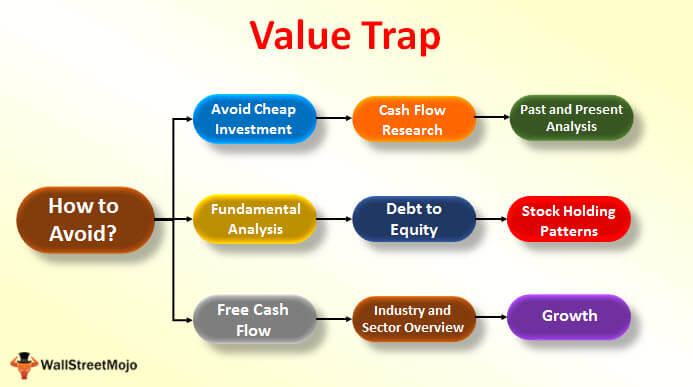

The landscape of investing is consistently undergoing transformation, significantly shaped by the element of financial risk, which remains a critical factor for every investor. As markets become increasingly complex, understanding financial risk and its nuances is paramount. Financial risk encompasses various types, including market, credit, and liquidity risks, each with its own unique implications for investment portfolios. The dynamism of these risks necessitates that investors remain vigilant and equipped with strategies to mitigate potential losses.

This article aims to unravel the complexities associated with financial risk by exploring integral concepts such as value traps and effective investment strategies. A value trap represents a common pitfall where a stock appears undervalued due to low price metrics, yet fails to deliver anticipated returns. Understanding and identifying these traps is essential for making informed investment decisions that can enhance portfolio performance.

Furthermore, the role of algorithmic trading in the investment landscape offers innovative solutions for addressing financial risk. By leveraging computer algorithms, algorithmic trading allows for the efficient execution of trades based on established criteria, effectively managing and reducing risk exposure in a rapidly changing market environment. This approach not only provides a technological edge but also enhances decision-making processes.

Through the integration of informed investment strategies and technology, investors can better navigate financial markets, improve risk management, and optimize investment outcomes. As we embark on this exploration, the core objective remains to equip investors with the knowledge and tools necessary to thrive in an evolving financial ecosystem.

## Table of Contents

## Understanding Financial Risk in Investment

Financial risk is a fundamental element of investment, affecting both individual and institutional portfolio decisions. This risk encompasses the possibility of losing money on an investment or a business venture. Understanding financial risk involves recognizing its different forms and their impacts on investment portfolios.

**Forms of Financial Risk**

1. **Market Risk**: This type of risk is associated with the fluctuations in the market that can affect the prices of securities. Market risk stems from factors like economic changes, political events, or natural disasters. For example, a sudden recession can lead to a sharp decline in stock prices, impacting portfolio values adversely.

2. **Credit Risk**: Credit risk involves the possibility that a borrower might default on a debt by failing to make required payments. This form of risk is critical for bond investors and banks. Historical trends, such as the 2008 financial crisis, highlighted how the underestimation of credit risk could lead to widespread financial instability.

3. **Liquidity Risk**: Liquidity risk is the danger of not being able to sell an investment quickly without incurring a significant loss. This risk is particularly relevant to those holding large positions in less liquid markets or assets. During market stress, illiquidity can exacerbate price declines as investors are unable to exit their positions efficiently.

**Historical Trends and Case Studies**

Throughout history, significant events have underscored the impact of financial risks. The 1987 stock market crash, also known as Black Monday, exemplifies how market risk can materialize rapidly, leading to a significant loss in investment value. More recently, the European debt crisis highlighted the intricacies of credit risk, affecting not just individual investments but entire economies. 

Case studies, such as the collapse of Lehman Brothers in 2008, provide valuable insights into the ramifications of unchecked credit risk and insufficient [liquidity](/wiki/liquidity-risk-premium). Lehman's heavy investment in subprime mortgages, combined with high leverage and inadequate liquidity management, precipitated its downfall, illustrating the interconnected nature of financial risks.

**Importance of Understanding Financial Risks**

Recognizing and comprehending these risks enables investors to formulate strategies aimed at risk mitigation. Market risk, for instance, can often be managed through diversification, spreading investments across various asset classes or sectors to reduce the impact of any one falling market. Credit risk assessment involves analyzing the creditworthiness of debt issuers and diversifying bond investments. Liquidity risk can be managed by maintaining a portion of the portfolio in high-quality liquid assets, ensuring that there are available resources to cover any withdrawals or immediate needs.

By acknowledging the multifaceted nature of financial risk, investors can better navigate the uncertainties of financial markets. Awareness and proactive management of these risks are essential for sustaining growth and capital preservation in investment portfolios.

## Identifying and Avoiding Value Traps

A 'value trap' is a scenario where a stock appears to be undervalued based on various valuation metrics such as price-to-earnings (P/E) or price-to-book (P/B) ratios, yet it does not provide the anticipated returns. These traps are misleading, often appealing to value investors looking for bargain opportunities, but eventually leading to stagnation or decline in asset value. Identifying potential value traps requires a multi-faceted approach involving both quantitative and qualitative factors.

**Identifying Potential Value Traps**

1. **Assessment of Financial Health**: A low valuation metric may indicate deeper issues in the company’s financial structure. It is crucial to analyze the balance sheet for signs of distress such as high debt ratios or declining cash flow. For instance, a continuously decreasing cash flow can signal limited operational efficiency or a challenging business environment.

2. **Industry and Market Trends**: Stocks that are cheap may correspond to industries in decline due to technological advancements or shifts in consumer behavior. An understanding of broader industry trends and competitive positioning provides insights into whether the company's low valuation is justified.

3. **Management and Governance Quality**: Evaluating the leadership team and corporate governance practices is essential. A history of poor decision-making or inadequate response to changing market conditions may lead to persistent underperformance despite attractive valuations.

4. **Earnings Quality and Growth Prospects**: Fluctuating earnings, reliance on one-time events for revenue, or lack of consistent growth can signal distress. Analyzing the drivers behind earnings performance helps assess whether expected future profitability is achievable.

**Avoiding Value Traps Using Financial Analysis and Qualitative Factors**

An effective analysis combines quantitative metrics with qualitative insights:

- **Quantitative Analysis**: Investors should look beyond simple ratios. Consider DCF (Discounted Cash Flow) models to determine intrinsic value, taking into account stable growth rates that reflect realistic future business conditions. Key metrics such as Return on Equity (ROE) and Return on Assets (ROA) provide a clearer indication of operational efficiency.

- **Qualitative Analysis**: Investigate the company's strategic initiatives and responsiveness to market changes. Strong brands, sustainable competitive advantages, and innovative product pipelines can indicate that a company is capable of overcoming current adversities.

Given the challenges of accurately identifying value traps, adopting a cautious and informed approach is paramount.

**Real-World Examples and Lessons from Value Traps**

The 2000s era technology bubble provides a classic example. Many tech companies were overvalued based on speculative forecasts that did not materialize. Investors drawn to superficially low prices after the bubble burst often found themselves in value traps as fundamental weaknesses became apparent.

More recently, the retail industry has faced disruption due to e-commerce growth. Companies with weakest digital presences and declining foot traffic in physical stores have at times appeared as value traps. 

One lesson is clear: comprehensive due diligence greatly reduces the risk of falling into value traps. This involves not only assessing a company’s current valuation but also critically evaluating its future growth potential, industry dynamics, and strategic positioning.

## Effective Investment Strategies for Risk Management

Effective investment strategies are fundamental for balancing the potential for returns with the management of financial risk. A well-crafted strategy not only mitigates risk but also aligns an investor’s risk tolerance with their investment objectives. Here, we explore key strategies that serve as pillars in the architecture of sound investment practices: diversification, asset allocation, and dynamic hedging.

### Diversification

Diversification is the practice of spreading investments across various financial instruments, industries, and other categories to minimize the impact of any single asset’s poor performance on the overall portfolio. The principle behind diversification is simple: not all investments will perform well at the same time, and not all will experience downturns simultaneously. 

Mathematically, diversification can be explained by the reduction in portfolio variance. The portfolio variance, $\sigma^2_p$, can be minimized through:

$$
\sigma^2_p = \sum (w_i^2 \sigma_i^2) + \sum \sum (w_i w_j \sigma_{ij})
$$

where:
- $w_i$ and $w_j$ are the weights of assets $i$ and $j$
- $\sigma_i^2$ is the variance of asset $i$
- $\sigma_{ij}$ is the covariance between assets $i$ and $j$

By reducing the covariance, through holding non-correlated or negatively correlated assets, overall risk is diminished while maintaining potential returns.

### Asset Allocation

Asset allocation involves dividing an investment portfolio among different asset categories, such as stocks, bonds, and cash. This strategy is based on the principle that different assets have different levels of risk and return, behaving differently over time. A common approach to asset allocation takes into consideration an investor's time horizon, risk tolerance, and financial goals.

For example, a conservative investor might have an asset allocation that consists of 50% bonds, 30% stocks, and 20% cash. Meanwhile, an aggressive investor might be 70% in stocks, 20% in bonds, and 10% in alternative investments. The efficiency of asset allocation can be evaluated using:

$$
E(R_p) = \sum w_i E(R_i)
$$

where:
- $E(R_p)$ is the expected return of the portfolio
- $w_i$ is the weight of asset $i$
- $E(R_i)$ is the expected return of asset $i$

### Dynamic Hedging

Dynamic hedging involves using financial derivatives to protect a portfolio against market fluctuations. Unlike static hedging, which uses a fixed strategy over time, dynamic hedging continuously adjusts the hedge position based on changes in market conditions or the value of the portfolio. This approach is particularly useful for managing exposure to currency risk, [interest rate](/wiki/interest-rate-trading-strategies) risk, and commodity price risk.

For instance, options can be used to create protective put positions, where a put option is purchased to protect against declines in a held asset's price. The Black-Scholes model, a widely used method for pricing options, helps determine the fair price of these derivatives:

$$
C = S_0 \Phi(d_1) - X e^{-rT} \Phi(d_2)
$$

where:
- $C$ is the call option price
- $S_0$ is the current stock price
- $X$ is the option strike price
- $r$ is the risk-free interest rate
- $T$ is the time to expiration
- $\Phi$ is the cumulative distribution function of the standard normal distribution
- $d_1$ and $d_2$ are factors calculated using related variables

### Strategy Adaptation

Investment strategies must be flexible, evolving in response to market changes and economic indicators. Investors should regularly review economic indicators such as interest rates, inflation, and GDP growth to adapt their strategies. Such adaptations may involve rebalancing a portfolio, changing the asset allocation to reflect shifts in risk tolerance, or implementing new hedging instruments in response to emerging risks.

Continuous learning and adaptation are essential components of successful risk management in investing. By understanding and applying these strategies, investors can better navigate the complexities of financial markets, aiming for optimized returns while keeping risk within acceptable levels.

## Integrating Algorithmic Trading in Investment Strategy

Algorithmic trading employs sophisticated computer algorithms to execute trades based on predetermined criteria, thereby allowing traders to make high-frequency trading decisions with minimal human intervention. This technology can manage financial risk effectively by analyzing vast datasets with speed and accuracy that surpasses human capabilities. By utilizing these algorithms, traders aim to exploit market efficiencies and manage risks more dynamically.

One of the primary benefits of [algorithmic trading](/wiki/algorithmic-trading) in mitigating financial risk lies in its ability to process and react to large volumes of data efficiently. This capability allows algorithms to identify trading opportunities and risks in fractions of a second, a crucial advantage in volatile markets. Algorithms can incorporate various parameters such as price, timing, and [volume](/wiki/volume-trading-strategy) to determine optimal trading strategies, thereby reducing human error and emotional biases in decision-making.

Three popular algorithmic trading strategies include [trend following](/wiki/trend-following), [arbitrage](/wiki/arbitrage), and [market making](/wiki/market-making):

1. **Trend Following**: This strategy involves algorithms that identify and trade based on significant market trends. By analyzing historical price data, these algorithms predict the future direction of asset prices, facilitating trades in the direction of the trend. The key here is the application of statistical analysis and machine learning to discern patterns that may not be immediately visible.

2. **Arbitrage**: Arbitrage algorithms exploit price discrepancies of the same asset in different markets or forms. These algorithms scan multiple exchanges simultaneously to identify inconsistencies in pricing and execute trades that capitalize on these discrepancies. The rapid execution capability of algorithms can lock in profits before the market corrects these inefficiencies.

3. **Market Making**: Market-making algorithms place both buy and sell orders to profit from the bid-ask spread. These algorithms continuously update the prices at which they are willing to buy or sell, creating a liquid market environment. The strategy requires sophisticated risk management to hedge against potential market movements.

Advances in [artificial intelligence](/wiki/ai-artificial-intelligence) (AI) and [machine learning](/wiki/machine-learning) have further enhanced the capabilities of algorithmic trading. AI systems can adapt to new information and refine trading strategies in real-time, improving the predictive accuracy of algorithms. These systems use advanced techniques including neural networks and natural language processing to analyze unstructured data such as news articles and social media posts, allowing traders to anticipate market movements influenced by external events.

Machine learning algorithms can also optimize trading parameters by learning from historical trading results. For example, [reinforcement learning](/wiki/reinforcement-learning)—a type of machine learning where algorithms learn optimal actions through trial and error—has been effectively applied in developing trading strategies that adjust dynamically to changing market conditions.

Incorporating algorithmic trading into investment strategies provides investors with the tools to manage risk more effectively. It also enables the execution of complex strategies at speeds and scales unattainable by human traders alone. As financial markets continue to evolve with increasing complexity, integration of algorithms offers an essential technological advantage in managing risks and optimizing investment performance.

The rapid advancements in AI and machine learning are reshaping the landscape of algorithmic trading. As these technologies continue to progress, their integration into trading strategies will likely play an increasingly pivotal role in financial markets.

## Case Studies: Success Stories and Lessons Learned

The examination of case studies in investment strategies reveals how data analytics and algorithmic trading can effectively mitigate financial risk while also highlighting the risks of value traps. These real-world examples serve as educational benchmarks for investors.

### Success Story: Renaissance Technologies

Renaissance Technologies, a notable quantitative investment management firm, exemplifies the efficacious use of algorithmic trading and data analytics. By leveraging sophisticated mathematical models and vast datasets, Renaissance Technologies has consistently achieved high returns. Their flagship Medallion Fund, which primarily employs algorithm-driven decisions, has delivered exceptional annualized returns exceeding 35% net of fees over three decades. The firm's success underscores the potential of machine learning and algorithms to analyze complex market patterns, manage risk, and optimize investment portfolios. This approach minimizes human error and biases, leading to more objective and data-driven investment decisions. 

### Success Story: Bridgewater Associates

Bridgewater Associates, under the leadership of Ray Dalio, has implemented an investment strategy known as "All Weather," which demonstrates how diversification can effectively manage financial risk. This strategy involves spreading investments across various asset classes to withstand different economic climates. Using data analytics, Bridgewater adjusts asset allocations dynamically based on economic indicators such as interest rates and inflation. This adaptive strategy has enabled Bridgewater to achieve robust performance across varied market conditions, highlighting the significance of continual data monitoring and risk assessment in investment decisions.

### Lessons Learned: Valeant Pharmaceuticals

Valeant Pharmaceuticals serves as a cautionary tale regarding value traps. Initially perceived as a lucrative investment, Valeant's aggressive acquisition strategy and financial manipulations obscured its fundamental weaknesses. Investors were initially attracted by its low price-to-earnings (P/E) ratio and rapid growth. However, failing to conduct comprehensive due diligence on the company's debt levels and reliance on unsustainable business practices resulted in significant investor losses when the company's valuation collapsed. This example emphasizes the critical importance of analyzing both quantitative metrics and qualitative factors, such as corporate governance and sustainable business models, to avoid value traps.

### Lessons Learned: Enron Corporation

The collapse of Enron Corporation further illustrates the dangers of value traps and the necessity for thorough risk analysis. Enron’s sophisticated financial presentations disguised fraudulent accounting practices, leading investors to overestimate the company’s market value. Despite appearing financially sound, the lack of transparency and unethical conduct eventually caused Enron’s downfall, with billions in investor losses. This case reinforces the necessity for investors to scrutinize financial statements beyond surface-level metrics and remain vigilant of potential red flags in corporate transparency and accountability.

In summary, these case studies underscore the vital role of data analytics and algorithmic strategies in managing investment risks effectively. While success stories illustrate the potential for high returns through technological integration, cautionary tales remind investors of the importance of comprehensive and diligent analysis to avoid the pitfalls of value traps.

## Conclusion

In summary, managing financial risk is a multifaceted challenge that requires a comprehensive understanding of various influencing factors. Effective investment requires identifying potential pitfalls, such as value traps, where stocks appear undervalued but fail to generate expected returns. Recognizing these traps involves thorough financial analysis and a keen eye for qualitative factors that may indicate declining business fundamentals.

Effective strategies to mitigate financial risk include diversification and strategic asset allocation, aiming to balance potential returns with risk exposure. This ensures that investments align with individual risk tolerance and broader market conditions. Techniques such as dynamic hedging enable investors to respond adeptly to market fluctuations, safeguarding portfolios against adverse movements.

The integration of algorithmic trading provides a technological edge, facilitating quicker and more informed decision-making. By leveraging algorithms that can analyze extensive datasets efficiently, investors can capitalize on emerging trends and market inefficiencies. These methods, supported by artificial intelligence and machine learning, enhance the precision and efficacy of trading strategies, offering significant advantages over traditional approaches.

As financial markets continue to evolve with rapid technological advancements, staying informed and adaptable remains crucial. The ability to integrate new tools and insights into investment strategies can significantly improve outcomes. Investors must maintain a proactive approach, continually refining their strategies to align with an ever-changing marketplace, ensuring sustainable and successful investing in the long term.

## References & Further Reading

[1]: Bergstra, J., Bardenet, R., Bengio, Y., & Kégl, B. (2011). ["Algorithms for Hyper-Parameter Optimization."](https://papers.nips.cc/paper/4443-algorithms-for-hyper-parameter-optimization) Advances in Neural Information Processing Systems 24.

[2]: ["Advances in Financial Machine Learning"](https://www.amazon.com/Advances-Financial-Machine-Learning-Marcos/dp/1119482089) by Marcos Lopez de Prado

[3]: ["Evidence-Based Technical Analysis: Applying the Scientific Method and Statistical Inference to Trading Signals"](https://www.amazon.com/Evidence-Based-Technical-Analysis-Scientific-Statistical/dp/0470008741) by David Aronson

[4]: ["Machine Learning for Algorithmic Trading"](https://github.com/stefan-jansen/machine-learning-for-trading) by Stefan Jansen

[5]: ["Quantitative Trading: How to Build Your Own Algorithmic Trading Business"](https://www.amazon.com/Quantitative-Trading-Build-Algorithmic-Business/dp/1119800064) by Ernest P. Chan