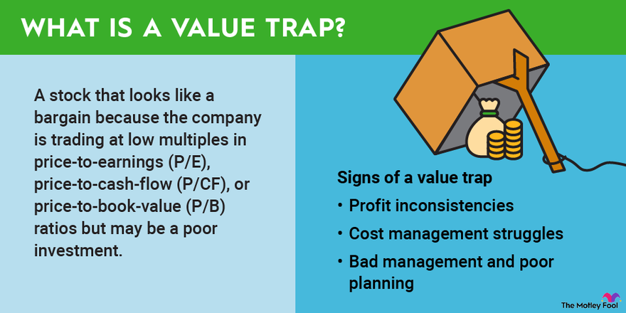

## Table of Contents

## What is a value trap in investing?

A value trap is when an investment looks cheap but is actually a bad choice. It tricks investors into thinking they are getting a good deal, but the company might have big problems that make it a risky investment. These problems could be things like losing money, having too much debt, or not being able to compete well in its industry.

Investors need to be careful and do a lot of research before buying a stock just because it seems cheap. Sometimes, a low price can be a warning sign that something is wrong with the company. It's important to look at the company's overall health and future potential, not just its current price, to avoid falling into a value trap.

## How can an investor identify a value trap?

To spot a value trap, investors need to look beyond just the low price of a stock. They should check the company's financial health. This means looking at things like how much money the company is making or losing, how much debt it has, and if it can pay its bills. If a company is losing money and has a lot of debt, it might be a value trap even if the stock price is low.

Another way to identify a value trap is by looking at the company's future prospects. Investors should ask if the company can grow and make more money in the future. If the company is in an industry that is shrinking or if it is losing customers to competitors, the low stock price might not be a good deal. It's important to see if the company has a plan to fix its problems and if that plan seems likely to work.

By doing careful research and not just focusing on the price, investors can avoid value traps. It's about understanding the whole picture of the company, not just how cheap the stock seems. This way, investors can make smarter choices and find truly good investments.

## What are common characteristics of companies that become value traps?

Companies that become value traps often have a few common problems. One big issue is that they might be losing money. This means they are spending more than they are making, which is not good for their future. Another problem is that they might have a lot of debt. Too much debt can make it hard for the company to pay its bills and can scare away investors. Also, these companies might be in industries that are not doing well. If the whole industry is shrinking, it can be hard for the company to grow and make more money.

Another characteristic of value trap companies is that they might not be able to compete well. This could be because they have old technology or because other companies are doing a better job. If a company is losing customers to its competitors, it can be a sign of trouble. Sometimes, these companies might look cheap because their stock price is low, but the low price is actually a warning sign that something is wrong. Investors need to be careful and look at the whole picture, not just the price, to avoid falling into a value trap.

## Can you explain the difference between a value trap and a genuine undervalued stock?

A value trap is when a stock looks cheap but is actually a bad investment. This happens because the company might have big problems like losing money, having too much debt, or not being able to compete well. The low price tricks investors into thinking they are getting a good deal, but the company's future might not be bright. It's like buying a car that looks cheap but needs a lot of repairs; it ends up costing more in the long run.

On the other hand, a genuine undervalued stock is a good investment that is priced lower than it should be. This can happen because the market has not yet recognized the company's true value. The company might be making money, growing, and have a strong future ahead. It's like finding a great car at a garage sale for a low price; it's a good deal because the car is in good shape and will serve you well.

The key difference is in the company's health and future potential. A value trap has underlying problems that make it risky, while an undervalued stock is a hidden gem with solid fundamentals. Investors need to do their homework to tell the difference and avoid falling into a value trap while finding those undervalued stocks that can lead to good returns.

## What are the psychological factors that lead investors into value traps?

One big reason investors fall into value traps is because they see a low price and think it's a good deal. It's like seeing a sale sign and buying something without checking if it's really worth it. Investors might get excited about buying a stock at a low price, hoping it will go up quickly. But they don't always look at why the price is low. They might not see the big problems the company has, like losing money or having too much debt. This can lead them to make a bad investment.

Another psychological factor is the fear of missing out, or FOMO. When investors see others making money from stocks, they might rush to buy without doing enough research. They might think, "If everyone else is buying this cheap stock, it must be a good idea." But this can make them ignore the warning signs of a value trap. It's important for investors to take their time and really understand a company before buying its stock, even if it seems like a great deal at first glance.

## How does financial analysis help in avoiding value traps?

Financial analysis helps investors avoid value traps by giving them a clear picture of a company's health. When investors look at a company's financial statements, they can see if it is making money or losing it. They can also check how much debt the company has and if it can pay its bills. If a company is losing money and has a lot of debt, it might be a value trap, even if the stock price is low. By doing this kind of analysis, investors can see past the low price and understand if the company has real problems that make it a bad investment.

Another way financial analysis helps is by looking at the company's future potential. Investors can use financial ratios and other tools to see if the company can grow and make more money in the future. If the company is in a shrinking industry or losing customers to competitors, the low stock price might not be a good deal. Financial analysis helps investors see if the company has a plan to fix its problems and if that plan seems likely to work. By understanding the whole picture of the company, not just its current price, investors can make smarter choices and avoid falling into value traps.

## What role do market conditions play in creating value traps?

Market conditions can make it easier for value traps to happen. When the whole market is going down, many stocks can look cheap. But not all of these cheap stocks are good investments. Some companies might have big problems that make them risky, even if their stock price is low. Investors might see the low prices and think they are getting a good deal, but they need to be careful. The market going down can hide the real problems of a company, making it look like a value trap.

Also, when the market is doing well, some investors might get too excited and buy stocks without looking closely at the companies. They might think that because the market is up, all stocks are good investments. But this can lead them to buy into value traps. They might not see that some companies are losing money or have too much debt. So, market conditions can trick investors into thinking a bad investment is a good one, and it's important to always do careful research no matter what the market is doing.

## What are some historical examples of value traps and what lessons can be learned from them?

One famous example of a value trap is General Motors (GM) before its bankruptcy in 2009. For years, GM's stock looked cheap, but the company was losing money and had a lot of debt. It was struggling to compete with other car companies that were making better cars. Investors who bought GM stock because it was cheap ended up losing a lot of money when the company went bankrupt. The lesson here is that a low stock price can be a warning sign. Investors need to look at the whole picture of a company, not just the price, to avoid value traps.

Another example is Eastman Kodak, which was once a big name in photography. In the early 2000s, Kodak's stock price was low, but the company was having trouble keeping up with new technology like digital cameras. It was losing money and customers to other companies. People who bought Kodak stock hoping for a turnaround were disappointed when the company filed for bankruptcy in 2012. The lesson from Kodak is that investors need to think about a company's future, not just its past. If a company can't adapt to changes in its industry, it might be a value trap.

These examples show that it's important for investors to do their homework. They need to look at a company's financial health, its ability to compete, and its future potential. Just because a stock is cheap doesn't mean it's a good investment. By understanding the whole story of a company, investors can avoid value traps and find truly good investments.

## How can diversification help mitigate the risks associated with value traps?

Diversification means spreading your money across different investments. This can help you avoid big losses from value traps. If you put all your money into one stock that turns out to be a value trap, you could lose a lot. But if you spread your money across many different stocks, a bad investment in one won't hurt as much. It's like not putting all your eggs in one basket. If one egg breaks, you still have others.

By having a mix of different types of investments, like stocks, bonds, and maybe even real estate, you can protect yourself better. If one part of your portfolio does badly because of a value trap, other parts might do well and balance it out. This way, you can still make money even if you make a mistake with one investment. Diversification helps you take less risk and gives you a better chance of having a successful investment strategy overall.

## What advanced financial ratios should an expert investor use to detect potential value traps?

Expert investors can use advanced financial ratios to spot potential value traps. One important ratio is the price-to-earnings (P/E) ratio. A low P/E ratio might make a stock look cheap, but if the company is losing money or has a lot of debt, it could be a value trap. Another useful ratio is the price-to-book (P/B) ratio. A low P/B ratio can also make a stock seem like a good deal, but if the company's assets are not worth much or if it can't make money from them, it might be a trap. The debt-to-equity (D/E) ratio is also key. A high D/E ratio means the company has a lot of debt compared to its equity, which can be a red flag.

Another ratio to consider is the return on equity (ROE). A low or negative ROE can show that the company is not using its money well to make profits. The free cash flow (FCF) yield is also important. If a company has a high FCF yield but is losing money or has other big problems, it might be a value trap. By looking at these ratios together, expert investors can get a better idea of a company's health and avoid falling into value traps. It's about seeing the whole picture, not just one part, to make smart investment choices.

## How do changes in industry dynamics contribute to the formation of value traps?

Changes in industry dynamics can turn a company into a value trap. When a new technology or way of doing things comes along, some companies might not be able to keep up. For example, if a company makes old-fashioned products and a new, better product comes out, people might stop buying the old one. This can make the company lose money and customers. If the company's stock price goes down because of this, it might look cheap. But if the company can't change and start making the new product, it's a value trap. The low price is a warning sign that the company is in trouble because it can't adapt to the new industry changes.

Another way industry dynamics can create value traps is when the whole industry starts to shrink. If fewer people are buying what the industry makes, all the companies in it can struggle. A company's stock might look cheap because the industry is doing badly, but that doesn't mean it's a good investment. If the industry keeps shrinking and the company can't find a way to grow or make money in a different way, it's a value trap. Investors need to look at the bigger picture of the industry and see if the company has a plan to deal with these changes. If not, the low stock price is a trap, not a deal.

## What strategies can expert investors employ to minimize the impact of value traps on their portfolios?

Expert investors can minimize the impact of value traps by doing careful research before buying any stock. They should look at the company's financial health, not just its low price. This means checking if the company is making money, how much debt it has, and if it can pay its bills. If a company is losing money and has a lot of debt, it might be a value trap. Investors should also think about the company's future. They need to see if the company can grow and make more money, even if the industry is changing. By understanding the whole picture of the company, investors can avoid bad investments and find truly good ones.

Another strategy is to diversify their investments. This means not putting all their money into one stock or one type of investment. If they spread their money across different stocks, bonds, and maybe even real estate, a bad investment in one won't hurt as much. It's like not putting all your eggs in one basket. If one egg breaks, you still have others. By having a mix of different investments, investors can protect themselves better. If one part of their portfolio does badly because of a value trap, other parts might do well and balance it out. This way, they can still make money even if they make a mistake with one investment.

## References & Further Reading

1. **"The Intelligent Investor" by Benjamin Graham** - This classic book provides foundational knowledge on value investing, emphasizing the importance of thorough financial analysis to avoid value traps. [Amazon Link](https://www.amazon.com/Intelligent-Investor-Definitive-Value-Investing/dp/B09GHVNQ4J)

2. **"A Random Walk Down Wall Street" by Burton G. Malkiel** - Malkiel explains the fundamentals of investment strategies and the efficient market hypothesis, aiding in understanding market risks. [Amazon Link](https://www.amazon.com/Random-Walk-Down-Wall-Street/dp/0393358380)

3. **"Fooled by Randomness" by Nassim Nicholas Taleb** - Taleb discusses the role of chance in financial markets and the implications for understanding investment risks. [Amazon Link](https://www.amazon.com/Fooled-Randomness-Hidden-Chance-Markets/dp/0812975219)

4. **"Principles: Life and Work" by Ray Dalio** - This book offers insights from the founder of Bridgewater Associates on risk management and strategic investment approaches. [Amazon Link](https://www.amazon.com/Principles-Life-Work-Ray-Dalio/dp/1501124021)

5. **Algorithmic Trading: Winning Strategies and Their Rationale by Ernest P. Chan** - Chan provides an overview of quantitative trading techniques, beneficial for understanding algorithmic strategies in risk management. [Amazon Link](https://www.amazon.com/Algorithmic-Trading-Winning-Strategies-Rationale/dp/1118460146)

6. **"When Genius Failed: The Rise and Fall of Long-Term Capital Management" by Roger Lowenstein** - A historical case study highlighting the pitfalls of ignoring risk management. [Amazon Link](https://www.amazon.com/When-Genius-Failed-Long-Term-Management/dp/0375758259)

7. **"Risk Management and Financial Institutions" by John C. Hull** - Hull's comprehensive guide covers various aspects of risk management and is widely used in financial education. [Amazon Link](https://www.amazon.com/Risk-Management-Financial-Institutions-Hull/dp/1119448110)

8. **Research Article: "Value Traps and the Erosion of Value Investing" by Wesley Gray and Tobias Carlisle** - This paper explores the concept of value traps and provides quantifiable methods to identify them. [SSRN Link](https://ssrn.com/abstract=2504237)

9. **Financial Times Online** - Offers up-to-date news, analysis, and insights on financial markets and investment strategies, essential for keeping informed about current industry trends. [Website Link](https://www.ft.com/)

10. **"The Little Book of Common Sense Investing" by John C. Bogle** - Bogle advocates for low-cost index fund investments, emphasizing the importance of strategic asset allocation. [Amazon Link](https://www.amazon.com/Little-Book-Common-Sense-Investing/dp/1119404509)

