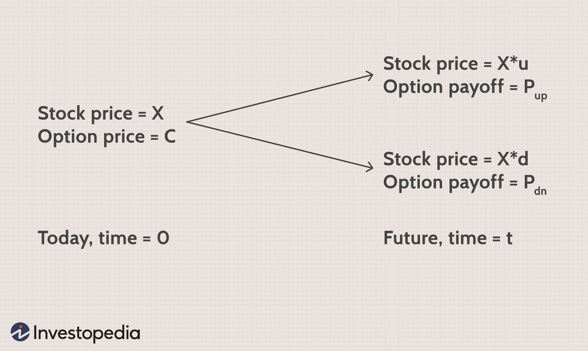

## Table of Contents

## What is the binomial options pricing model?

The binomial options pricing model is a way to figure out how much an option is worth. An option is like a bet on whether a stock's price will go up or down. In this model, we imagine that the stock price can only move in two ways at each step: it can go up or it can go down. We break the time until the option expires into smaller steps, and at each step, we calculate what the stock price could be if it goes up or down. By doing this over and over, we can work out all the possible paths the stock price might take and what the option would be worth at the end of each path.

Once we have all these possible outcomes, we work backwards from the end date to the start. At each step, we figure out the value of the option by looking at the two possible values it could have in the next step and choosing the one that's best for the option holder. We keep doing this until we get back to the start, and the value we end up with is our estimate of the option's price. This model is helpful because it's easier to understand and use than some other methods, and it can be adjusted to fit different situations by changing the number of steps or the size of the up and down movements.

## How does the binomial model differ from the Black-Scholes model?

The binomial model and the Black-Scholes model are two different ways to figure out how much an option is worth. The binomial model works by breaking down the time until the option expires into smaller steps. At each step, the stock price can go up or down, and we calculate what the option would be worth if it goes up or down. We keep doing this for all the steps until we reach the end, then we work backward to find the option's price at the start. It's like mapping out all the possible paths the stock price could take and choosing the best outcome for the option at each step.

On the other hand, the Black-Scholes model uses a math formula to calculate the option's price all at once, without breaking it into steps. It assumes that the stock price moves smoothly and continuously, following a normal distribution, which is like a bell curve. The Black-Scholes model needs inputs like the stock's current price, the option's strike price, the time until the option expires, the risk-free interest rate, and the stock's [volatility](/wiki/volatility-trading-strategies). It's a bit more complicated to use than the binomial model, but it's very popular because it gives a quick answer without needing to map out all the possible paths.

The key difference is that the binomial model is more flexible and easier to understand because it breaks the process into steps, while the Black-Scholes model is more of a one-shot calculation that assumes smooth stock price movements. The binomial model can be adjusted to fit different situations by changing the number of steps or the size of the price movements, making it useful for a wider range of options, including those with more complex features. Meanwhile, the Black-Scholes model is great for standard options but can be less accurate for options with unusual features.

## What are the basic assumptions of the binomial model?

The binomial model works by assuming that the price of a stock can only move in two ways at each step: it can go up or it can go down. This means that instead of the stock price changing smoothly, it jumps from one price to another in a series of steps. Each step represents a small amount of time, and at the end of each step, the stock price can either increase by a certain amount or decrease by a certain amount. The size of these up and down movements can be set based on how much the stock usually moves, which is called its volatility.

Another important assumption is that the movements of the stock price are independent of each other. This means that whether the stock price goes up or down at one step does not affect what happens at the next step. The model also assumes that there are no transaction costs or taxes when buying or selling the stock or the option, and that you can borrow and lend money at a risk-free interest rate. These assumptions make the model simpler to use and understand, but they might not perfectly match the real world, where things like transaction costs and the impact of one price movement on the next can matter.

## How do you construct a binomial tree for option pricing?

To build a binomial tree for option pricing, you start by dividing the time until the option expires into smaller steps. Imagine each step as a point in time where the stock price can either go up or go down. At the first step, you have the current stock price. Then, you decide how much the stock price can go up or down at each step. This depends on how much the stock usually moves, which is called its volatility. If the stock price goes up, you multiply the current price by a certain number, called the up factor. If it goes down, you multiply it by another number, called the down factor. You keep doing this for each step until you reach the end, which is when the option expires.

Once you have all the possible stock prices at the end, you figure out what the option would be worth at each of these final prices. If it's a call option, you take the stock price at the end and subtract the strike price, but only if the stock price is higher than the strike price. If it's a put option, you do the opposite: take the strike price and subtract the stock price, but only if the stock price is lower than the strike price. After you know the option's value at the end of each path, you work backward through the tree. At each step, you calculate the option's value by looking at the two possible values it could have in the next step and choosing the one that's best for the option holder. You keep doing this until you get back to the start, and the value you end up with is your estimate of the option's price.

## What is the significance of the risk-neutral probability in the binomial model?

The risk-neutral probability is a key part of the binomial model because it helps us figure out the value of an option without worrying about how risky the stock is. In the real world, people might want a higher return if they think a stock is risky. But in the binomial model, we pretend everyone is okay with any level of risk as long as they get the right average return. This makes it easier to calculate the option's price because we don't have to guess what people think about risk.

To use the risk-neutral probability, we first figure out what the stock price might be if it goes up or down at each step. Then, we use the risk-neutral probability to work out the expected value of the option at the next step. We do this by multiplying the value of the option if the stock goes up by the risk-neutral probability of it going up, and adding that to the value of the option if the stock goes down multiplied by the risk-neutral probability of it going down. By doing this at each step and working backward through the tree, we can find the option's price at the start. The risk-neutral probability makes the math simpler and helps us focus on the option's value without getting distracted by people's feelings about risk.

## How do you calculate option prices using backward induction in the binomial model?

In the binomial model, we use backward induction to figure out an option's price. We start by looking at the very end of the tree, where the option expires. At each end point, we calculate what the option would be worth depending on the stock price. If it's a call option, we take the stock price and subtract the strike price, but only if the stock price is higher than the strike price. If it's a put option, we do the opposite: take the strike price and subtract the stock price, but only if the stock price is lower than the strike price. Once we know the option's value at all the end points, we move one step back in time.

At each step, we look at the two possible values the option could have in the next step: one if the stock price goes up, and one if it goes down. We use the risk-neutral probability to find the expected value of the option at the current step. This means we multiply the value of the option if the stock goes up by the risk-neutral probability of it going up, and add that to the value of the option if the stock goes down multiplied by the risk-neutral probability of it going down. We then adjust this expected value to account for the time value of money by discounting it back to the current step using the risk-free interest rate. We keep doing this, moving backward through the tree step by step, until we get back to the start. The value we end up with at the beginning is our estimate of the option's price.

## What are the advantages of using the binomial model over other models?

The binomial model is easier to understand and use than some other models like the Black-Scholes model. It breaks down the time until the option expires into smaller steps, and at each step, the stock price can only go up or down. This makes it simpler to see how the option's value changes over time. You can also change the number of steps or the size of the up and down movements to fit different situations, which makes the model very flexible. This is helpful for pricing options that have unusual features or for teaching people how options work.

Another advantage of the binomial model is that it can handle more complex options better than the Black-Scholes model. For example, it can be used for options that can be exercised early, called American options, because it lets you check the option's value at each step. The Black-Scholes model can't do this as easily. Also, the binomial model can be adjusted to fit real-world situations better by changing how the stock price moves or by adding things like dividends. This makes it a powerful tool for figuring out the value of many different kinds of options.

## How can the binomial model be adjusted for dividends?

When a company pays dividends, it can affect the price of its stock and the value of options on that stock. In the binomial model, we can adjust for dividends by changing how the stock price moves at each step. If a dividend is paid during the time the option is active, we lower the stock price right after the dividend payment. This is because the stock price usually goes down by the amount of the dividend when it's paid out. So, if a dividend is coming up, we make the stock price go down by the dividend amount at the right step in our tree.

To do this, we need to know when the dividend will be paid and how much it will be. Let's say the dividend is paid halfway through the option's life. At that step, we would reduce the stock price by the dividend amount before calculating what the stock price could be if it goes up or down in the next step. This way, the model takes into account the impact of the dividend on the stock price and the option's value. By making these adjustments, the binomial model can give a more accurate estimate of the option's price when dividends are involved.

## What is the impact of increasing the number of time steps in the binomial model?

When you increase the number of time steps in the binomial model, you make the model more accurate. Think of it like drawing a picture with more detail. The more steps you have, the closer the model comes to showing how the stock price really moves. With more steps, the jumps in the stock price get smaller, and the model looks more like the smooth way the stock price moves in real life. This means the option price you get from the model is usually closer to what it would be in the real world.

However, using more steps also makes the model take longer to calculate. It's like doing more math homework. Each step adds more work because you have to figure out what the stock price could be at each step and then work backward to find the option's price. So, while more steps can give you a better answer, you have to decide if the extra time and effort are worth it. Sometimes, a smaller number of steps might be good enough, especially if you need a quick estimate.

## How do you incorporate American options into the binomial model?

American options are different from European options because they can be used, or "exercised," at any time before they expire, not just at the end. In the binomial model, we can handle American options by checking at each step if it's better to use the option right away or wait until later. At every step, we compare the value of exercising the option now with the expected value of keeping it and exercising it later. If exercising now gives a better value, we use that value instead of the expected future value.

To do this, we start at the end of the tree, just like with European options, and work backward. At each step, we calculate the expected value of the option if we keep it, using the risk-neutral probabilities and the risk-free interest rate. But before we move to the next step, we also figure out what the option would be worth if we exercised it right then. For a call option, this means taking the stock price at that step and subtracting the strike price. For a put option, it's the opposite: we take the strike price and subtract the stock price. If exercising the option now gives a higher value than holding onto it, we use that value instead. By doing this at every step, we make sure the model accounts for the possibility of early exercise, which is what makes American options special.

## What are the limitations and potential errors in the binomial model?

The binomial model is a useful way to figure out the value of an option, but it has some limitations. One big problem is that it assumes the stock price can only go up or down at each step. In real life, stock prices can change in many different ways, not just up or down. This means the model might not be perfect for every situation. Also, the model depends a lot on the choices you make, like how many steps to use and how big the up and down movements should be. If you pick the wrong numbers, your answer might be off. Another issue is that the model assumes there are no costs to buy or sell the stock or the option, and that you can borrow and lend money at a risk-free rate. These things aren't always true in the real world, so the model might not be as accurate as you'd like.

Another limitation is that the binomial model can be slow and hard to use if you want to be very accurate. The more steps you add to make the model better, the more calculations you have to do. This can take a lot of time and might not be worth it if you just need a quick estimate. Also, even though the model can handle American options, which can be used at any time before they expire, it might still miss some important details. For example, if people's feelings about risk change a lot over time, the model might not catch that. So, while the binomial model is a good tool, it's important to remember its limits and use it carefully.

## How can the binomial model be extended to price exotic options?

The binomial model can be extended to price exotic options by making some changes to how it works. Exotic options are more complicated than regular options because they have special rules or conditions. To handle these, you can add extra steps or rules to the binomial tree. For example, if you have a barrier option, which only works if the stock price hits a certain level, you can add a check at each step to see if the stock price has reached the barrier. If it has, you change how the option works from that point on. This way, the model can figure out the option's value while considering the special conditions.

Another way to use the binomial model for exotic options is to change how the stock price moves. Some exotic options depend on how much the stock price changes, so you might need to use different up and down movements at each step. For example, with an Asian option, which depends on the average stock price over time, you can keep track of the average price at each step and use that to figure out the option's value. By making these changes, the binomial model can handle a wide range of exotic options and give a good estimate of their value, even though they are more complicated than regular options.

## What is the Binomial Option Pricing Model?

The Binomial Option Pricing Model, developed by John Cox, Stephen Ross, and Mark Rubinstein in 1979, is a pivotal tool in financial mathematics used for valuing options. As a discrete-time model, it offers a structured and intuitive approach to option pricing, which contrasts with the continuous models like the Black-Scholes model. At its core, the Binomial Model relies on the representation of the possible future evolution of an asset’s price over time.

### Binomial Tree Structure

The model employs a binomial tree, a graphical representation where each node corresponds to a possible price of the underlying asset at a given point in time. Each node branches into two subsequent nodes, representing the potential upward or downward movement in the asset's price. Mathematically, if $S$ is the current price of the underlying asset, then, in a single time step:

$$
S^u = S \times u
$$
$$
S^d = S \times d
$$

Here, $u$ (up [factor](/wiki/factor-investing)) and $d$ (down factor) are multiplicative constants such that $u > 1$ and $d < 1$. These factors reflect the asset's volatility and are calculated based on the risk-neutral framework which assumes that investors are indifferent to risk when assessing expected returns.

### Constructing the Binomial Tree

To construct a binomial tree, one must define several parameters, including the asset price volatility ($\sigma$) and the time to expiration ($T$), which is divided into $N$ discrete intervals (steps). The length of each time step ($\Delta t$) is calculated as:

$$
\Delta t = \frac{T}{N}
$$

The up and down factors can be expressed using the volatility ($\sigma$) as follows:

$$
u = e^{\sigma \sqrt{\Delta t}}
$$
$$
d = e^{-\sigma \sqrt{\Delta t}}
$$

### Risk-neutral Probabilities

Central to the binomial model is the concept of risk-neutral valuation. Under this assumption, the expected return from the asset mirrors the risk-free rate ($r$). The risk-neutral probability ($p$) of an upward movement is defined as:

$$
p = \frac{e^{r \Delta t} - d}{u - d}
$$

This probability ensures [interest rate](/wiki/interest-rate-trading-strategies)-related adjustments in the average path of the asset price relative to the scenario of disregarding risk considerations.

### Pricing Options Using the Binomial Model

Option valuation occurs through backward induction from the end period of the binomial tree to the initial node. The value at each node depends on the values at the derivative nodes. For a call option, the intrinsic value is computed at each final node in the tree as:

$$
C(N, X) = \max(S(N) - X, 0)
$$

Here, $C(N, X)$ represents the call option’s value, $S(N)$ the underlying asset’s price, and $X$ the strike price. The option's value at an earlier node is:

$$
C(n, X) = e^{-r \Delta t} [p \times C(n+1, X)^u + (1-p) \times C(n+1, X)^d]
$$

By recursively applying this calculation through the tree, one determines the option’s value at its inception.

### Advantages

The binomial model’s discrete nature allows it to accommodate various conditions and flexibly handle American-style options, which can be exercised any time before expiration. By its construct, the model aids traders and analysts in simulating different market conditions and assessing potential option payoffs in a structured manner.

Overall, the Binomial Option Pricing Model stands out for its simplicity and adaptability, offering clear insights into market dynamics and asset pricing paths.

## How does the Binomial Model work: A step-by-step approach?

The Binomial Option Pricing Model is a discrete-time framework used to calculate the theoretical value of options. It involves modeling the potential future movements of the price of an underlying asset over a set number of time periods, known as steps, and it is particularly useful for valuing American-style options that can be exercised at any time before expiration. The methodology requires a series of precise calculations to build a binomial tree, each node representing a potential price evolution path. Here is a step-by-step guide to understanding how the model works:

### Setting Parameters

To begin using the Binomial Model, several key parameters must be defined:

1. **Spot Price (S0)**: The current price of the underlying asset.
2. **Strike Price (K)**: The price at which the option holder can buy (in the case of a call option) or sell (in the case of a put option) the underlying asset.
3. **Volatility (σ)**: A measure of the asset's price fluctuations. It is essential for determining potential price movements.
4. **Risk-Free Rate (r)**: The theoretical rate of return of an investment with zero risk, used to discount future payoffs.
5. **Time to Maturity (T)**: The period until the option expires.
6. **Number of Steps (N)**: The number of intervals into which the time to maturity is divided. More steps create a more precise model.

### Constructing the Binomial Tree

#### Step Size and Factors

To construct the binomial tree, calculate the length of each time interval as $\Delta t$ using:

$$
\Delta t = \frac{T}{N}
$$

Determine the up and down factors ($u$ and $d$) which represent the movement of the stock price:

$$
u = e^{\sigma \sqrt{\Delta t}}
$$
$$
d = \frac{1}{u} = e^{-\sigma \sqrt{\Delta t}}
$$

These factors simulate the potential increase or decrease of the asset’s price over each step in the tree.

### Risk-Neutral Probabilities

The concept of risk-neutral valuation involves using a probability measure ($p$) to ensure that the expected return of the asset is the risk-free rate:

$$
p = \frac{e^{r \Delta t} - d}{u - d}
$$

At each node in the tree, the expected option value can be computed by weighing the potential up and down movements with the risk-neutral probabilities, then discounting back to present value:

$$
\text{Option Value} = e^{-r \Delta t} \times (p \times \text{Option Value Up} + (1-p) \times \text{Option Value Down})
$$

### Recursive Calculation

Starting at the expiration nodes, where the option values are known based on the payoffs, calculate backward through the tree to determine the value at each preceding node. For a call option:

$$
\text{Payoff} = \max(S - K, 0)
$$

And, for a put option:

$$
\text{Payoff} = \max(K - S, 0)
$$

Where $S$ is the underlying asset’s price at that node.

### Python Implementation

Here's a simple Python implementation of the Binomial Option Pricing Model:

```python
import numpy as np

def binomial_option_pricing(S0, K, T, r, sigma, N, option_type='call'):
    dt = T / N
    u = np.exp(sigma * np.sqrt(dt))
    d = 1 / u
    p = (np.exp(r * dt) - d) / (u - d)

    # Initialize the asset price tree
    prices = np.zeros((N + 1, N + 1))
    prices[0, 0] = S0

    for i in range(1, N + 1):
        for j in range(i + 1):
            prices[j, i] = S0 * (u ** j) * (d ** (i - j))

    # Initialize the option value tree
    option_values = np.zeros_like(prices)

    # Option payoff at maturity
    if option_type == 'call':
        option_values[:, N] = np.maximum(0, prices[:, N] - K)
    elif option_type == 'put':
        option_values[:, N] = np.maximum(0, K - prices[:, N])

    # Backward induction to calculate option value at each node
    for i in range(N - 1, -1, -1):
        for j in range(i + 1):
            option_values[j, i] = np.exp(-r * dt) * (p * option_values[j + 1, i + 1] + (1 - p) * option_values[j, i + 1])

    return option_values[0, 0]

# Example usage
option_price = binomial_option_pricing(S0=100, K=100, T=1, r=0.05, sigma=0.2, N=100, option_type='call')
print(f"Option Price: {option_price}")
```

This code sets up a binomial tree, calculates option payoffs at maturity, and uses backward induction to determine the option's value at the starting node, which represents the theoretical option price.

## What are the differences between the Binomial and Black-Scholes Models?

The Binomial and Black-Scholes models are cornerstone methodologies for option pricing, each serving distinct yet overlapping purposes in financial markets. The Binomial model, developed by Cox, Ross, and Rubinstein in 1979, employs a discrete-time framework to value options by constructing a binomial tree to model possible future price paths of the underlying asset. This tree allows for recalibration at each node, making it particularly flexible for valuing American options, which can be exercised at any time before expiration. Its adaptability is valuable in scenarios where option conditions may change suddenly or where early exercise can have significant value implications.

Conversely, the Black-Scholes model, introduced by Fischer Black and Myron Scholes in 1973, provides a continuous-time framework that yields a closed-form solution for European options, which are exercisable only at maturity. Its formula:

$$
C = S_0 N(d_1) - X e^{-rt} N(d_2)
$$

where:

$$
d_1 = \frac{\ln(S_0 / X) + (r + \sigma^2/2) t}{\sigma \sqrt{t}}
$$

$$
d_2 = d_1 - \sigma \sqrt{t}
$$

provides computational efficiency, which is a significant advantage in markets requiring rapid pricing such as those employing high-frequency trading strategies. The formula assumes constant volatility and interest rates, along with log-normally distributed returns of the underlying asset, simplifying the computational process compared to the iterative nature of the binomial approach.

The choice between these models often hinges on the type of option and specific market conditions. For American options or when dealing with conditions that require flexibility, such as dividend payouts or path-dependent scenarios, the Binomial model provides a level of precision and adaptability that the Black-Scholes cannot. However, for European options in stable markets, the Black-Scholes model offers a more efficient and straightforward pricing mechanism, eliminating the need for complex tree structures.

In practice, many traders and financial institutions use a combination of both models, leveraging the strengths of each depending on the specific characteristics of the options being evaluated and the computational resources available. Both models have their place in modern finance, with ongoing developments and enhancements ensuring their relevance despite the emergence of more complex and computationally intensive models.

## References & Further Reading

[1]: Cox, J. C., Ross, S. A., & Rubinstein, M. (1979). ["Option Pricing: A Simplified Approach."](https://www.sciencedirect.com/science/article/pii/0304405X79900151) Journal of Financial Economics. This seminal paper introduced the binomial option pricing model, providing a structured methodology for estimating the value of options using a binomial tree.

[2]: Hull, J. C. (2020). ["Options, Futures, and Other Derivatives."](https://elibrary.pearson.de/book/99.150005/9781292410623) Pearson. This comprehensive text serves as a foundational resource on financial derivatives, including detailed discussions on option pricing models such as the binomial model and Black-Scholes model.

[3]: Black, F., & Scholes, M. (1973). ["The Pricing of Options and Corporate Liabilities."](https://www.cs.princeton.edu/courses/archive/fall09/cos323/papers/black_scholes73.pdf) Journal of Political Economy. This influential paper introduces the Black-Scholes model, offering insights into continuous-time option pricing.

[4]: Jansen, S. (2020). ["Machine Learning for Algorithmic Trading."](https://github.com/stefan-jansen/machine-learning-for-trading) Packt Publishing. A resource exploring the integration of machine learning techniques with algorithmic trading strategies.

[5]: Chan, E. P. (2009). ["Quantitative Trading: How to Build Your Own Algorithmic Trading Business."](https://github.com/ftvision/quant_trading_echan_book) Wiley. This book guides traders in establishing algorithmic trading systems, relevant for understanding applications of models like the binomial model in trading strategies.