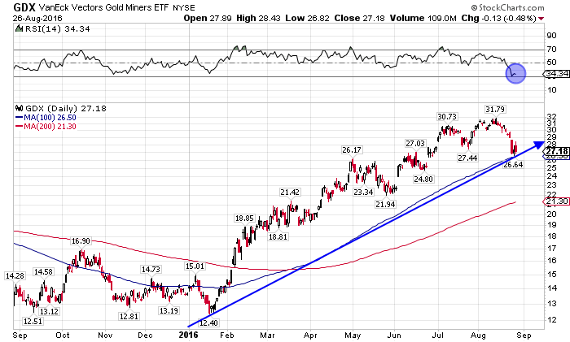

## Table of Contents

## What is the VanEck Vectors Gold Miners ETF?

The VanEck Vectors Gold Miners ETF is a type of investment fund that focuses on companies involved in gold mining. It is traded on stock exchanges, just like individual stocks, and it aims to give investors a way to invest in the gold mining industry without having to buy shares in individual gold mining companies. The ETF includes a variety of companies, from large, well-known gold miners to smaller ones, providing a broad exposure to the sector.

This ETF tracks the NYSE Arca Gold Miners Index, which means it tries to match the performance of this specific index. The index itself is made up of companies that are primarily involved in the mining of gold and silver. By investing in the VanEck Vectors Gold Miners ETF, investors can benefit from the potential growth of the gold mining industry as a whole, rather than betting on the success of just one or two companies. This can help spread out risk, making it a popular choice for those interested in gold but wanting a diversified approach.

## How does the VanEck Vectors Gold Miners ETF work?

The VanEck Vectors Gold Miners ETF works by pooling money from many investors to buy a collection of stocks in gold mining companies. This ETF follows the NYSE Arca Gold Miners Index, which means it tries to copy the performance of this index. The index includes a mix of big and small companies that mine gold and silver. When you buy shares of the ETF, you're essentially buying a small piece of all these companies at once. This makes it easier for you to invest in the gold mining industry without having to pick individual stocks.

The price of the [ETF](/wiki/etf-trading-strategies) goes up and down based on how well the gold mining companies in the index are doing. If the price of gold goes up, the profits of these companies might increase, which could make the ETF's value go up too. But if gold prices fall, the ETF's value might go down. The ETF is traded on stock exchanges, so you can buy and sell shares whenever the market is open. This gives you flexibility to adjust your investment as you see fit.

## What are the main holdings of the VanEck Vectors Gold Miners ETF?

The VanEck Vectors Gold Miners ETF has a lot of different companies in it, but some are bigger than others. The biggest company in the ETF is usually Newmont Corporation, which is a huge gold mining company. Another big one is Barrick Gold Corporation, which is also a very large gold miner. These two companies make up a big part of the ETF because they are so important in the gold mining world.

Besides Newmont and Barrick, there are other important companies like Franco-Nevada Corporation and Agnico Eagle Mines Limited. These companies are also big in the gold mining industry but not as big as Newmont and Barrick. The ETF also includes smaller companies, but the big ones have the most impact on how the ETF does overall. By having a mix of big and small companies, the ETF tries to give a good picture of the whole gold mining industry.

## What are the benefits of investing in the VanEck Vectors Gold Miners ETF?

Investing in the VanEck Vectors Gold Miners ETF can be a good choice for people who want to put their money into gold mining without [picking](/wiki/asset-class-picking) individual companies. This ETF includes a lot of different gold mining companies, so it spreads out the risk. If one company does badly, it won't hurt your whole investment as much because you own a piece of many companies. This makes it easier and safer to invest in the gold mining industry.

Another benefit is that the ETF follows the NYSE Arca Gold Miners Index, which means it tries to do as well as this index. This can be a good way to get the same returns as the whole gold mining industry. Plus, you can buy and sell shares of the ETF easily on the stock market, so you can change your investment whenever you want. This flexibility can be really helpful if you need to adjust your investments quickly.

## What are the risks associated with the VanEck Vectors Gold Miners ETF?

Investing in the VanEck Vectors Gold Miners ETF comes with some risks. One big risk is that the price of gold can go up and down a lot. If the price of gold drops, the profits of the gold mining companies in the ETF might go down too. This can make the value of the ETF go down. Also, the ETF includes many different companies, but if a lot of them do badly at the same time, it can hurt the whole ETF. This means you could lose money if the gold mining industry has a tough time.

Another risk is that the ETF might not do as well as the NYSE Arca Gold Miners Index it tries to follow. This can happen because of fees or other costs that come with running the ETF. These costs can eat into your returns. Also, since the ETF is traded on the stock market, its price can be affected by what other investors are doing. If a lot of people want to sell their shares at the same time, the price of the ETF might drop, even if the gold mining companies are doing okay.

## How has the VanEck Vectors Gold Miners ETF performed historically?

The VanEck Vectors Gold Miners ETF has had ups and downs over the years, just like the price of gold. When gold prices go up, the ETF usually does well because the gold mining companies make more money. For example, during times when people are worried about the economy, they often buy more gold, which can push up the price of gold and help the ETF. But when gold prices fall, the ETF can lose value. This happened during times when the economy was doing well and people were less interested in gold.

Over the long term, the ETF's performance can be a bit of a roller coaster. It might do really well for a few years and then have a few tough years. This is because the gold mining industry can be affected by a lot of things, like changes in the cost of mining, new discoveries of gold, and even what's happening in the world. So, if you're thinking about investing in this ETF, it's good to be ready for some ups and downs and to look at it as a long-term investment.

## How does the VanEck Vectors Gold Miners ETF compare to other gold-related ETFs?

The VanEck Vectors Gold Miners ETF is different from other gold-related ETFs because it focuses on companies that mine gold, not just on the price of gold itself. Other ETFs, like the SPDR Gold Shares ETF, invest directly in physical gold. This means that the VanEck ETF's performance depends on how well the gold mining companies are doing, not just on the price of gold. If the mining companies are making more money because they're finding more gold or the cost of mining goes down, the VanEck ETF might do better than an ETF that just holds gold.

On the other hand, ETFs like the iShares Gold Trust also focus on the price of gold, but they might have different fees or ways of tracking the price of gold. The VanEck ETF can be riskier because it's tied to the performance of the mining companies, which can be affected by things like strikes, environmental regulations, and the cost of mining. But it can also offer more potential for growth if the mining companies do well. So, if you're looking for a way to invest in the gold industry but want to spread your risk across many companies, the VanEck Vectors Gold Miners ETF might be a good choice.

## What factors influence the performance of the VanEck Vectors Gold Miners ETF?

The performance of the VanEck Vectors Gold Miners ETF is influenced by a lot of things. The most important [factor](/wiki/factor-investing) is the price of gold. When gold prices go up, the companies that mine gold usually make more money, which can make the ETF's value go up too. But if gold prices fall, the profits of these companies might go down, and this can hurt the ETF's performance. Another big factor is how well the individual gold mining companies in the ETF are doing. If they can find more gold or if it costs them less to mine it, they might do better, and this can help the ETF.

There are other things that can affect the ETF too. The costs of running the ETF, like management fees, can eat into the returns you get. Also, what's happening in the world can play a role. For example, if there's a lot of uncertainty or if people are worried about the economy, they might buy more gold, which can push up the price and help the ETF. On the other hand, if the economy is doing well, people might not be as interested in gold, and this can hurt the ETF's performance. So, a lot of different things can influence how the VanEck Vectors Gold Miners ETF does over time.

## How can one invest in the VanEck Vectors Gold Miners ETF?

Investing in the VanEck Vectors Gold Miners ETF is easy if you have a brokerage account. You can open an account with a broker like Charles Schwab, Fidelity, or any other that lets you trade ETFs. Once your account is set up, you can search for the ETF by its ticker symbol, which is "GDX." Then, you can place an order to buy shares of the ETF, just like you would buy a stock. You can choose how many shares you want to buy and decide if you want to buy them right away or set a price you're willing to pay.

After you buy the shares, you can keep them in your account and watch how they do over time. If you want to sell them later, you can do that through your brokerage account too. Just remember that the value of the ETF can go up and down, so it's a good idea to think about it as a long-term investment. Also, you might want to talk to a financial advisor to make sure this ETF fits with your overall investment plan.

## What are the fees and expenses associated with the VanEck Vectors Gold Miners ETF?

The VanEck Vectors Gold Miners ETF has fees and expenses that you need to know about. One of the main fees is the expense ratio, which is how much it costs to run the ETF each year. For the VanEck Vectors Gold Miners ETF, the expense ratio is about 0.51%. This means that for every $100 you invest, you'll pay around 51 cents each year to cover the costs of managing the ETF. This fee is taken out of the ETF's assets, so it can affect how much money you make over time.

There might be other costs too, like trading fees when you buy or sell shares of the ETF. These fees depend on which brokerage you use. Some brokers might charge you a fee every time you trade, while others might let you trade for free. It's a good idea to check with your broker to see what their fees are. Also, if you sell your shares of the ETF for a profit, you might have to pay taxes on that profit. So, it's important to think about all these costs when you're deciding if the VanEck Vectors Gold Miners ETF is right for you.

## How does the VanEck Vectors Gold Miners ETF fit into a diversified investment portfolio?

The VanEck Vectors Gold Miners ETF can be a good addition to a diversified investment portfolio because it gives you a way to invest in the gold mining industry without having to pick individual companies. This ETF includes a lot of different gold mining companies, so it spreads out the risk. If one company does badly, it won't hurt your whole investment as much because you own a piece of many companies. This can make your portfolio more balanced and less risky because you're not putting all your money into just one type of investment.

Adding the VanEck Vectors Gold Miners ETF to your portfolio can also help you take advantage of times when gold prices go up. When people are worried about the economy, they often buy more gold, which can push up the price of gold and help the ETF. But remember, the ETF's value can go down too if gold prices fall. So, it's a good idea to think of it as a long-term investment and to have other types of investments in your portfolio too, like stocks, bonds, and maybe even other ETFs that focus on different industries. This way, you can spread out your risk and have a better chance of doing well over time.

## What advanced strategies can be used with the VanEck Vectors Gold Miners ETF for expert investors?

Expert investors can use several advanced strategies with the VanEck Vectors Gold Miners ETF to try to make more money or manage risk better. One strategy is called "sector rotation," where investors move their money into different sectors of the market based on what's happening in the economy. If they think gold prices are going to go up because of economic uncertainty, they might put more money into the VanEck Vectors Gold Miners ETF. But if they think the economy is going to do well and gold prices might fall, they might take some money out of the ETF and put it into other sectors. This can help them take advantage of changes in the market and maybe make more money.

Another strategy is "hedging," where investors use the ETF to protect their other investments. For example, if an investor has a lot of money in stocks and they're worried about the stock market going down, they might buy some shares of the VanEck Vectors Gold Miners ETF. If the stock market does go down, the ETF might go up because people often buy more gold when they're worried about the economy. This can help balance out the losses in their stock investments. But hedging can be tricky, and it's important for investors to understand how it works and what the risks are before they try it.

## References & Further Reading

[1]: Gold, C. (2015). ["Algorithmic Trading: Winning Strategies and Their Rationale."](https://www.wiley.com/en-us/Algorithmic+Trading%3A+Winning+Strategies+and+Their+Rationale-p-9781118746912) Wiley.

[2]: ["The Handbook of Commodity Investing"](https://onlinelibrary.wiley.com/doi/book/10.1002/9781118267004) by Frank J. Fabozzi, Roland Fuss, and Dieter G. Kaiser

[3]: ["Advances in Financial Machine Learning"](https://www.amazon.com/Advances-Financial-Machine-Learning-Marcos/dp/1119482089) by Marcos Lopez de Prado

[4]: ["Machine Learning for Asset Managers"](https://github.com/emoen/Machine-Learning-for-Asset-Managers) by Marcos Lopez de Prado

[5]: ["Quantitative Trading: How to Build Your Own Algorithmic Trading Business"](https://github.com/LucindaYa/quant-resources/blob/master/Quantitative%20Trading%20How%20to%20Build%20Your%20Own%20Algorithmic%20Trading%20Business.pdf) by Ernest P. Chan