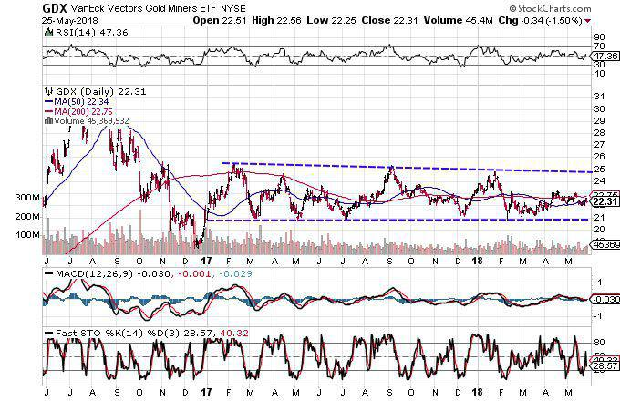

The VanEck Vectors Gold Miners ETF, commonly referred to as GDX, stands as a preeminent investment vehicle for those looking to gain exposure to the gold mining industry. Since its inception, GDX has been a favored option among investors due to its ability to combine the inherent liquidity of exchange-traded funds (ETFs) with the growth potential of gold mining equities.

ETFs are financial instruments that track an index, commodity, bonds, or a basket of assets, and they trade on stock exchanges similar to stocks. The liquidity of ETFs like GDX ensures that investors can enter and exit positions with minimal price disruption. This is crucial because liquidity directly impacts the ease with which an asset can be converted to cash. Thus, GDX offers investors quick access to the performance of leading gold mining companies without the need to invest directly in potentially volatile individual stocks.



GDX aggregates the stocks of major global gold mining firms, providing a diversified means to participate in the sector. This diversification can mitigate individual stock risk while enabling investors to capitalize on the robust growth potential of the gold mining industry. Historically, gold mining companies have demonstrated significant growth during upswings in the price of gold.

The article will assess the attractive benefits GDX presents, such as growth opportunities tied to gold price movements and operational efficiencies among mining companies. However, with potential rewards come inherent risks, and a comprehensive understanding of these is vital for prospective investors. Furthermore, we will analyze how algorithmic trading has emerged as a pivotal tool in efficiently managing investments in GDX. Through systematic data analysis and rapid trade execution, algorithms offer the potential to enhance returns and mitigate risks.

In essence, the exploration of GDX will encompass both its appealing features as an ETF and the broader implications of advanced trading strategies in optimizing investment outcomes.

## Table of Contents

## Understanding the Gold Miners ETF (GDX)

Launched in 2006, the VanEck Vectors Gold Miners ETF (GDX) is structured to replicate, as closely as possible before fees and expenses, the price and yield performance of the NYSE Arca Gold Miners Index. This index comprises of large global gold mining companies, offering investors exposure to the overall movement in the gold mining sector. By providing a diversified portfolio of stocks from various companies in the gold mining industry, GDX mitigates the risks associated with investing in individual stocks, while allowing investors to benefit from the broader industry trends.

As of the latest data, GDX holds over $12 billion in assets under management. This substantial asset base not only signifies investor confidence but also enhances the [liquidity](/wiki/liquidity-risk-premium) of the [ETF](/wiki/etf-trading-strategies), making it one of the most liquid gold miner ETFs. The liquidity of an ETF is crucial for investors as it impacts the ease with which shares can be bought or sold without affecting the ETF’s market price significantly.

The diversification advantage GDX offers is a key consideration for investors interested in the gold mining sector. By including a wide array of large-cap companies in its portfolio, GDX reduces the idiosyncratic risk — the risk that a particular company's problems will negatively affect the ETF’s value. Additionally, GDX is often seen as a proxy for gold prices due to the high correlation between the performance of gold mining stocks and the price of gold. 

Overall, the VanEck Vectors Gold Miners ETF provides investors with a straightforward and efficient method for investing in the collective performance of leading gold mining operations worldwide, leveraging its scale and liquidity as strategic advantages.

## Historical Performance and Market Conditions

The performance of the VanEck Vectors Gold Miners ETF (GDX) is influenced significantly by the price of gold and the operational efficiency of the constituent gold mining companies. Being an ETF that tracks the NYSE Arca Gold Miners Index, GDX inherently mirrors the [volatility](/wiki/volatility-trading-strategies) associated with gold prices. Historically, GDX has exhibited strong bullish returns during periods when gold prices rise. Gold, as a commodity, often serves as a hedge against inflation and currency devaluation, leading to increased investor interest during times of economic uncertainty. These characteristics normally amplify the returns on GDX.

Volatility, though, remains a recurring theme in GDX performance attributable to the inherent market nature of gold mining as well as broader economic conditions. Gold prices have a direct impact on the profitability of mining companies, which in turn affects the valuation of GDX. During times of rising gold prices, GDX tends to reap higher returns as the profit margins for mining companies typically expand. However, gold prices are highly sensitive to various global factors, including changes in interest rates, inflation trends, and geopolitical tensions.

Interest rates play a critical role in gold pricing and, consequently, the performance of GDX. Generally, gold is negatively correlated with interest rates; rising interest rates increase the opportunity cost of holding gold, which doesn't yield any income. Therefore, higher interest rates might result in a decrease in gold prices, impacting GDX adversely. Conversely, lower interest rates can bolster gold prices and contribute positively to GDX performance.

Inflation also exerts a significant influence on gold prices. As a traditional hedge against inflation, gold's attractiveness rises in inflationary periods, often leading to a price increase. This increase can positively impact GDX returns as gold mining companies experience heightened revenue potential.

Geopolitical tensions can inject further unpredictability into gold prices. Situations leading to political or economic instability often lead investors to turn to gold as a 'safe haven', potentially pushing prices upward. Consequently, the performance of GDX reflects these shifts, exhibiting a rise during periods of heightened geopolitical risks.

In summary, while the historical performance of GDX is bolstered by rising gold prices, it is prone to volatility driven by economic and geopolitical factors. Investors considering GDX need to be mindful of these dynamics, given their potential impact on both the gold market and the underlying mining stocks.

## Algorithmic Trading and Its Role in GDX

Algorithmic trading is a method that utilizes sophisticated algorithms to automate and execute trades at speeds and frequencies that exceed human capabilities. In the context of the VanEck Vectors Gold Miners ETF (GDX), [algorithmic trading](/wiki/algorithmic-trading) plays a crucial role in optimizing returns and managing risks. This is achieved by responding immediately to market movements and sniffing out trends that might not be apparent at first glance.

Algorithms are designed to analyze large datasets, including historical price data, trading volumes, and external market indicators, to make informed trading decisions. These algorithms can encompass a variety of strategies, such as [momentum](/wiki/momentum) trading, mean reversion, or [arbitrage](/wiki/arbitrage), each tailored to capitalize on specific market conditions.

One of the main benefits of algorithmic trading in GDX is its ability to manage risk. By rapidly entering and exiting positions based on predefined criteria, algorithmic trading aims to minimize exposure to adverse market movements. This is particularly important in the gold mining sector, known for its volatility due to fluctuating gold prices. Algorithms can be programmed to execute trades based on threshold triggers, ensuring that the exposure time to unfavorable market conditions is minimized.

Moreover, algorithmic trading enhances the efficiency of trading in GDX by reducing the impact of human emotions, such as fear and greed, on trading decisions. By adhering strictly to data-driven strategies, algorithms help maintain discipline in executing trades.

Consider an example where an algorithm uses a moving average crossover strategy to determine buy and sell signals for GDX. In Python, this might involve computing short-term and long-term moving averages from historical price data:

```python
import pandas as pd

# Sample data loading - assume 'data' is a Pandas DataFrame with 'Price' column
# data = pd.read_csv('gdx_prices.csv') # Example code for loading data

short_window = 40
long_window = 100

# Generate signals
signals = pd.DataFrame(index=data.index)
signals['price'] = data['Price']
signals['short_mavg'] = data['Price'].rolling(window=short_window, min_periods=1).mean()
signals['long_mavg'] = data['Price'].rolling(window=long_window, min_periods=1).mean()

# Create signals
signals['signal'] = 0.0
signals['signal'][short_window:] = np.where(signals['short_mavg'][short_window:] > signals['long_mavg'][short_window:], 1.0, 0.0)

# Generate trading orders
signals['positions'] = signals['signal'].diff()

```

This example demonstrates how such strategies can identify and execute positions based on quantified data, increasing the probability of success in trades involving GDX.

Furthermore, trading algorithms can incorporate [machine learning](/wiki/machine-learning) models to predict future movements of GDX by identifying patterns in data that are not directly visible to human traders. Techniques such as regression models, classification algorithms, or neural networks are employed to enhance the predictive capability of these algorithms.

In conclusion, algorithmic trading serves as a powerful tool for investors in GDX, offering an opportunity to enhance trading precision and efficiency. While it cannot guarantee profitability, its ability to analyze and act on market data swiftly can provide a significant edge in managing the complexities and volatilities of the gold mining sector.

## Risks and Considerations for Investors

Investing in the VanEck Vectors Gold Miners ETF (GDX) presents several risks inherent to the volatile and cyclical nature of commodity markets. One of the primary risks associated with GDX is its direct correlation with the price of gold. Given that gold prices can be highly volatile, influenced by factors such as geopolitical tensions, currency fluctuations, and macroeconomic indicators like interest rates and inflation, the value of GDX can experience significant fluctuations. This volatility means that during periods of falling gold prices, GDX may suffer substantial declines, potentially leading to significant losses for investors.

Moreover, the cyclical nature of gold mining stocks adds another layer of complexity. Gold mining companies are often subject to operational risks, including fluctuations in mining costs, regulatory changes, and environmental concerns. These factors can affect the profitability and stability of the companies within the ETF, thereby impacting GDX's performance. Investors must recognize that while GDX offers diversified exposure to the largest global gold mining companies, diversification does not eliminate the risks associated with the underlying commodity.

Another crucial consideration is the individual investor's risk tolerance and investment goals. GDX, by its nature, is more suitable for investors who can withstand potential market volatility and have a longer investment horizon. Those with low risk tolerance may find the short-term price swings and potential for commodity-driven downturns challenging to manage. It is advisable for investors to assess their overall portfolio strategy and determine how GDX aligns with their financial objectives and risk profile before committing capital.

In summary, while GDX can offer significant opportunities due to its exposure to the gold mining industry, it also requires careful consideration of the inherent risks. Investors should remain informed about market conditions, gold price trends, and developments within the gold mining sector to make well-informed investment decisions.

## Conclusion

The VanEck Vectors Gold Miners ETF (GDX) presents a promising investment opportunity for those interested in the gold mining sector. As it aggregates some of the largest global gold mining companies, it offers diversified exposure and significant liquidity. This makes GDX a viable option for investors aiming to benefit from the growth prospects of gold mining stocks.

To effectively manage investments in GDX, leveraging algorithmic trading strategies is advisable. These strategies enable rapid trade execution and continuous monitoring of market conditions, which helps in maximizing returns and minimizing risks. By automating the analysis of large volumes of market data, algorithmic trading can identify profitable patterns and forecast future movements of GDX, thereby offering a strategic advantage.

Furthermore, staying informed is crucial for sound investment decisions. Market trends, including changes in the global economy, interest rates, inflation, and geopolitical events, can significantly impact the price of gold and, subsequently, the performance of GDX. Therefore, investors should keep abreast of these economic indicators to make informed decisions.

In summary, while GDX offers potential for substantial returns, it requires strategic investment through informed decision-making and advanced trading techniques. Proper risk management via algorithmic trading and continuous monitoring of economic conditions can unlock GDX's full investment potential.

## References & Further Reading

[1]: Gold, C. (2015). ["Algorithmic Trading: Winning Strategies and Their Rationale."](https://www.wiley.com/en-us/Algorithmic+Trading%3A+Winning+Strategies+and+Their+Rationale-p-9781118746912) Wiley.

[2]: ["The Handbook of Commodity Investing"](https://onlinelibrary.wiley.com/doi/book/10.1002/9781118267004) by Frank J. Fabozzi, Roland Fuss, and Dieter G. Kaiser

[3]: ["Advances in Financial Machine Learning"](https://www.amazon.com/Advances-Financial-Machine-Learning-Marcos/dp/1119482089) by Marcos Lopez de Prado

[4]: ["Machine Learning for Asset Managers"](https://github.com/emoen/Machine-Learning-for-Asset-Managers) by Marcos Lopez de Prado

[5]: ["Quantitative Trading: How to Build Your Own Algorithmic Trading Business"](https://github.com/LucindaYa/quant-resources/blob/master/Quantitative%20Trading%20How%20to%20Build%20Your%20Own%20Algorithmic%20Trading%20Business.pdf) by Ernest P. Chan