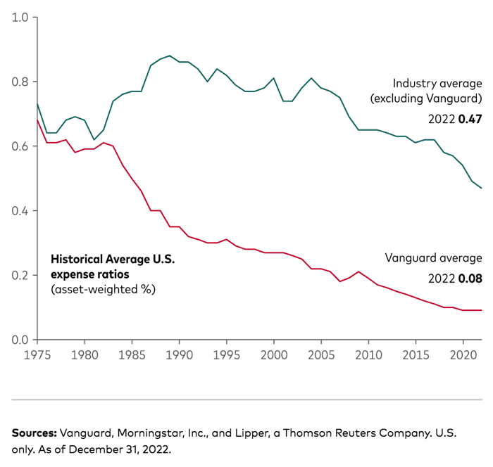

## Table of Contents

## What is the Vanguard Cash Reserves Federal Money Market Fund?

The Vanguard Cash Reserves Federal Money Market Fund is a type of investment fund where people can put their money. It is managed by Vanguard, a big company that helps people invest their money. This fund focuses on investing in safe, short-term things like government securities and other money market instruments. The goal is to keep the money safe and give a small amount of interest to the people who invest in it.

People often use this fund to keep their money safe while still earning a little bit of interest. It's a good choice for people who want to park their money somewhere safe and don't want to take big risks. The fund tries to keep the value of each share at $1, which makes it very stable. This makes it a popular choice for people who want to keep their money secure and accessible.

## Who can invest in the Vanguard Cash Reserves Federal Money Market Fund?

Anyone can invest in the Vanguard Cash Reserves Federal Money Market Fund as long as they have some money to put in. You don't need to be rich or a special kind of investor. You just need to open an account with Vanguard and follow their rules for investing.

This fund is good for people who want to keep their money safe and don't want to take big risks. It's a popular choice for people saving up for something or who want a place to put their money while they decide what to do with it. It's easy to get your money out when you need it, which makes it a good choice for many people.

## What are the main objectives of the Vanguard Cash Reserves Federal Money Market Fund?

The main goal of the Vanguard Cash Reserves Federal Money Market Fund is to keep the money safe. It does this by investing in very safe, short-term things like government securities and other money market instruments. The fund tries to keep the value of each share at $1, which means it's very stable and doesn't go up and down a lot. This makes it a good place for people to put their money if they want to keep it safe.

Another goal is to give a small amount of interest to the people who invest in it. While the interest might not be very high, it's better than keeping money in a regular bank account that doesn't give any interest. This makes the fund a good choice for people who want to earn a little bit of money on their savings without taking big risks.

## How does the Vanguard Cash Reserves Federal Money Market Fund work?

The Vanguard Cash Reserves Federal Money Market Fund works by taking the money that people invest and putting it into very safe, short-term things like government securities and other money market instruments. These are things that are considered very safe and don't lose value easily. The fund tries to keep the value of each share at $1, which means it's very stable. This makes it a good place for people to put their money if they want to keep it safe and don't want to take big risks.

The fund also tries to give a small amount of interest to the people who invest in it. This interest comes from the money the fund earns from the safe investments it makes. While the interest might not be very high, it's better than keeping money in a regular bank account that doesn't give any interest. This makes the fund a good choice for people who want to earn a little bit of money on their savings without taking big risks. It's easy to get your money out when you need it, which makes it a popular choice for people saving up for something or who want a place to put their money while they decide what to do with it.

## What are the benefits of investing in the Vanguard Cash Reserves Federal Money Market Fund?

One big benefit of investing in the Vanguard Cash Reserves Federal Money Market Fund is that it keeps your money safe. The fund puts your money into very safe things like government securities, which means your money is not likely to lose value. It also tries to keep the value of each share at $1, so you don't have to worry about big ups and downs. This makes it a good choice if you want to keep your money secure and don't want to take big risks.

Another benefit is that you can earn a little bit of interest on your money. Even though the interest might not be very high, it's better than keeping your money in a regular bank account that doesn't give any interest. This makes the fund a good place to put your money if you want to earn a little bit while keeping it safe. Plus, it's easy to get your money out when you need it, which makes it a good choice for people saving up for something or who want a place to put their money while they decide what to do with it.

## What are the risks associated with the Vanguard Cash Reserves Federal Money Market Fund?

The Vanguard Cash Reserves Federal Money Market Fund is very safe, but there are still some small risks. One risk is that the [interest rate](/wiki/interest-rate-trading-strategies) might go down. If the interest rate goes down, the fund might not earn as much money, and the interest you get might be less. Another small risk is that the fund might not be able to keep the value of each share at $1. This is very rare, but if it happens, you might lose a little bit of money.

Even though these risks are small, it's good to know about them. The fund tries to keep your money safe by investing in very safe things like government securities. But if something big happens in the economy, it could affect the fund a little bit. Overall, the risks are very low, which is why many people choose this fund to keep their money safe and earn a little bit of interest.

## How does the Vanguard Cash Reserves Federal Money Market Fund compare to other money market funds?

The Vanguard Cash Reserves Federal Money Market Fund is similar to other money market funds because it focuses on keeping your money safe and giving you a little bit of interest. Like other money market funds, it invests in very safe things like government securities and other short-term instruments. This makes it a good choice if you want to keep your money secure and don't want to take big risks. Many money market funds, including the Vanguard fund, try to keep the value of each share at $1, which means they are very stable.

However, the Vanguard Cash Reserves Federal Money Market Fund might have some differences from other money market funds. For example, the interest rate it offers might be a bit different from other funds. Some money market funds might offer a slightly higher or lower interest rate depending on what they invest in. Also, the fees you pay to invest in the Vanguard fund might be different from other funds. Vanguard is known for having low fees, which can be a big advantage. Overall, while the main goals are the same, the details like interest rates and fees can make the Vanguard fund a bit different from other money market funds.

## What is the historical performance of the Vanguard Cash Reserves Federal Money Market Fund?

The Vanguard Cash Reserves Federal Money Market Fund has a good history of keeping money safe and giving a little bit of interest. Over the years, it has been very stable, trying to keep the value of each share at $1. This means that people who put their money in the fund have not lost money. The fund has done a good job of investing in safe things like government securities, which helps keep the money safe.

The interest rates that the fund has given have changed over time, but they have always been better than keeping money in a regular bank account that doesn't give any interest. For example, in recent years, the fund has given interest rates that are a bit higher than what you might get from a regular savings account. This makes it a good choice for people who want to earn a little bit of money on their savings without taking big risks. Overall, the fund has a strong history of being safe and giving a small amount of interest.

## What fees and expenses are associated with the Vanguard Cash Reserves Federal Money Market Fund?

The Vanguard Cash Reserves Federal Money Market Fund has very low fees, which is one of its big advantages. The main fee you pay is called the expense ratio, and it's very small. For this fund, the expense ratio is usually around 0.10% per year. This means if you have $1,000 in the fund, you would pay about $1 in fees each year. This is much lower than many other money market funds, which can have higher fees.

There are no other big fees to worry about with this fund. You don't have to pay to buy or sell shares in the fund, which is good because it means you can put your money in and take it out without extra costs. The low fees make the Vanguard Cash Reserves Federal Money Market Fund a good choice for people who want to keep their money safe and don't want to lose a lot of it to fees.

## How can one invest in the Vanguard Cash Reserves Federal Money Market Fund?

To invest in the Vanguard Cash Reserves Federal Money Market Fund, you first need to open an account with Vanguard. You can do this by going to their website or calling them. Once you have an account, you can put money into the fund. You can do this by transferring money from your bank account or by sending a check. The minimum amount you need to start investing is usually $3,000, but this can change, so it's good to check with Vanguard.

After you have put money into the fund, you can keep track of it through your Vanguard account. You can see how much interest you are [earning](/wiki/earning-announcement) and how much money you have in the fund. If you need to take your money out, you can do that easily too. Just tell Vanguard you want to take out some money, and they will send it to your bank account. It's a simple way to keep your money safe and earn a little bit of interest.

## What are the tax implications of investing in the Vanguard Cash Reserves Federal Money Market Fund?

When you invest in the Vanguard Cash Reserves Federal Money Market Fund, you need to think about taxes. The interest you earn from the fund is usually taxed as regular income. This means you have to pay taxes on it every year, just like you would with money you earn from a job. The tax rate depends on how much money you make overall, so it could be different for everyone.

There are no special tax benefits for investing in this fund, unlike some other types of investments. But, if you invest through a tax-advantaged account like an IRA or a 401(k), the tax rules might be different. In those cases, you might not have to pay taxes on the interest right away, or you might get other tax benefits. It's a good idea to talk to a tax advisor to understand how investing in the fund will affect your taxes.

## What advanced strategies can be used with the Vanguard Cash Reserves Federal Money Market Fund for portfolio management?

One advanced strategy for using the Vanguard Cash Reserves Federal Money Market Fund in portfolio management is to use it as a safe place to park money while you wait for better investment opportunities. If you think the stock market or other investments might go down soon, you can move some of your money into the money market fund to keep it safe. Then, when you see a good time to invest again, you can move the money back into stocks or other investments. This way, you can protect your money from big losses and still be ready to take advantage of new opportunities.

Another strategy is to use the fund to balance your portfolio. If you have a lot of money in risky investments like stocks, you can put some money into the money market fund to make your overall portfolio less risky. This is called diversification. By having some money in safe investments like the money market fund, you can reduce the chance of losing a lot of money if the stock market goes down. This can help you sleep better at night knowing that part of your money is safe and earning a little bit of interest.

## References & Further Reading

[1]: Kacperczyk, M., & Schnabl, P. (2013). ["How Safe Are Money Market Funds?"](https://pages.stern.nyu.edu/~pschnabl/research/KacperczykSchnablFeb2013.pdf) The Review of Financial Studies, 26(10), 2607-2647.

[2]: ["Advances in Financial Machine Learning"](https://www.amazon.com/Advances-Financial-Machine-Learning-Marcos/dp/1119482089) by Marcos Lopez de Prado

[3]: Glasserman, P., & Mamaysky, H. (2019). ["Does Unusual News Forecast Market Stress?"](https://www.cambridge.org/core/journals/journal-of-financial-and-quantitative-analysis/article/abs/does-unusual-news-forecast-market-stress/8B880FAB1CA3036F6403DD353F380CC0) Journal of Financial and Quantitative Analysis, 54(2), 735-764.

[4]: Nagel, S. (2016). ["The Liquidity Crisis in Retrospect: Causes, Effects, and Policies"](https://www.nber.org/papers/w20265) Annual Review of Financial Economics, 8, 65-91. 

[5]: ["Algorithmic Trading: Winning Strategies and Their Rationale"](https://www.amazon.com/Algorithmic-Trading-Winning-Strategies-Rationale-ebook/dp/B00CY5HC0U) by Ernest P. Chan