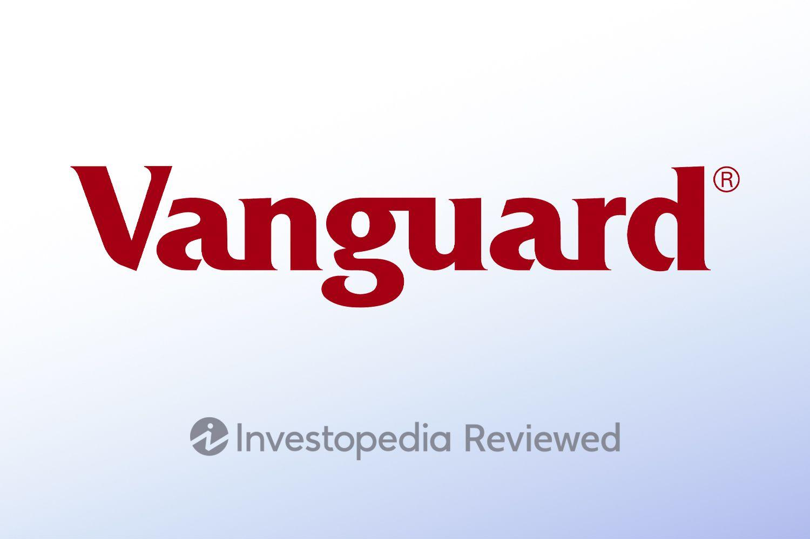

Vanguard Digital Advisor, part of the well-regarded Vanguard Group, is a digital advisory platform focused on offering a seamless, cost-effective investment management service. Known for its client-centric approach and a strong reputation in the investment community, Vanguard continues to be a leader in both traditional and digital investment services. With its emphasis on low-cost index investing, coupled with its robust portfolio management, Vanguard Digital Advisor aims to meet the diverse needs of investors in an increasingly digital world.

Algorithmic trading, or algo trading, is a pivotal development in financial advising. This technology-driven investment strategy involves using automated and pre-programmed trading instructions to execute orders at speeds and frequencies that human traders cannot achieve. These algorithms leverage mathematical models and statistical data to make trading decisions that optimize returns and manage risks effectively. In digital advisory services like Vanguard Digital Advisor, algo trading can significantly enhance portfolio performance by automating processes such as asset allocation, portfolio rebalancing, and tax-loss harvesting.

The purpose of this article is to provide a comprehensive review of Vanguard Digital Advisor for 2024, with particular emphasis on its algorithmic trading capabilities. The objective is to explore how Vanguard Digital Advisor utilizes technology to deliver superior investment experiences and outcomes, especially for those seeking a streamlined and efficient approach to managing their personal finances.

Selecting a reliable digital advisor is crucial for investors aiming to achieve specific financial objectives. An effective digital advisor incorporates both advanced technology and sound investment principles to cater to diverse investor needs and risk tolerances. Vanguard Digital Advisor, with its focus on cost-effectiveness and technological sophistication, offers an attractive proposition for individuals looking to enhance their investment portfolios through data-driven strategies.

Technology continues to revolutionize personal finance management, making financial services more accessible and tailored to individual needs. Automated platforms and digital advisors play an increasingly vital role, offering tools that empower investors with insights and strategies that were traditionally available only through professional financial advisors. This trend is set to continue, with digital solutions becoming integral to how investors approach financial planning and investment management in the future.

## Table of Contents

## Understanding Vanguard Digital Advisor

Vanguard Digital Advisor is a digital financial advisory service offered by Vanguard, one of the largest and most respected investment management companies in the world. This service leverages Vanguard's extensive expertise in investment strategies and portfolio management to provide a streamlined, user-friendly digital platform for individual investors seeking to achieve their financial goals.

### Detailed Description of Vanguard Digital Advisor

Vanguard Digital Advisor operates as a robo-advisor, an automated platform designed to manage an individual's investment portfolio. It utilizes algorithms and Vanguard's proprietary investment strategies to provide personalized financial plans tailored to a user's specific financial goals, risk tolerance, and investment timelines. The service manages portfolios by selecting diversified, low-cost exchange-traded funds (ETFs) to align with the user's objectives.

### Key Features and Offerings

Vanguard Digital Advisor offers several key features that distinguish it from other digital and traditional advisory services:

1. **Holistic Financial Planning**: Unlike many robo-advisors that focus solely on investment management, Vanguard Digital Advisor offers comprehensive financial planning tools that include retirement planning, savings goals, and debt management.

2. **Low Fees**: Vanguard is known for its low-cost investment options, and the Digital Advisor service is no exception. It charges significantly lower fees compared to many of its competitors, aligning with Vanguard's philosophy of reducing costs to enhance long-term investor returns.

3. **Customizable Portfolios**: Users can adjust their investment preferences to suit their personal situations. The platform dynamically rebalances portfolios to maintain the targeted asset allocation as market conditions change.

4. **Integration with Vanguard's Investment Strategies**: Vanguard's reputable investment strategies are fully integrated into the Digital Advisor platform. This entails employing Vanguard's time-tested approach to asset allocation and its extensive lineup of low-cost ETFs.

### User Experience

The onboarding process for Vanguard Digital Advisor is designed to be straightforward and efficient. New users are guided through a series of questions about their financial goals, risk tolerance, and current financial situation to create a personalized investment plan. The platform's interface is intuitive, offering easy navigation for both novice and experienced investors.

**Customer Service**: Vanguard provides robust support for Digital Advisor users, including educational resources and access to human advisors if needed. The platform emphasizes transparency, offering clear explanations of investment decisions and performance metrics.

### Integration with Vanguard's Investment Strategies

Vanguard Digital Advisor seamlessly integrates with the broader Vanguard ecosystem, leveraging its expansive experience in the investment industry. The advisor's algorithms are built upon Vanguard's strategic methodologies, focusing on diversification, low costs, and long-term value. This integration ensures that users benefit from Vanguard's well-researched and historically successful investment philosophies.

### Vanguard's Reputation and History in the Investment Industry

Vanguard's legacy in the investment industry is a cornerstone of its Digital Advisor service. Founded in 1975, Vanguard introduced the first index fund available to individual investors and has since become a leader in passive management and low-cost investing. Its commitment to acting in the best interests of investors has consistently bolstered its reputation. Vanguard's experience and integrity are reflected in the Digital Advisor, offering users confidence and trust in their automated investment journey.

In summary, Vanguard Digital Advisor provides an efficient, cost-effective, and trusted way for individuals to manage their investments. By combining advanced technology with Vanguard's solid investment principles, it offers a compelling option for those seeking reliable financial advice in a digital format.

 to Algorithmic Trading

Algorithmic trading refers to the use of computer programs and algorithms to execute financial market trades at speeds and frequencies beyond the capacity of human traders. These algorithms are designed to follow a set of predefined instructions for placing a trade to generate profits at a speed and frequency that would be impossible for a human trader. They take into account variables such as timing, price, and [volume](/wiki/volume-trading-strategy) to determine the best trading strategy.

Historically, [algorithmic trading](/wiki/algorithmic-trading) began in the 1970s with the introduction of electronic trading systems on stock exchanges. The New York Stock Exchange implemented its Designated Order Turnaround (DOT) system in 1976, which was one of the earliest forms of automated trading. Alongside advancements in technology and computing power, the 1980s and 1990s saw a significant evolution of algorithmic trading with the advent of complex mathematical models and electronic communication networks (ECNs). More recently, high-frequency trading ([HFT](/wiki/high-frequency-trading-strategies)), which exploits minuscule price discrepancies and often executes trades in milliseconds, has become a notable subset of algorithmic trading.

Algorithms play crucial roles in modern investment strategies by performing tasks such as market analysis, risk assessment, and trade execution automatically and efficiently. They are able to process an enormous amount of data across numerous markets simultaneously, allowing them to identify patterns and trends that might be missed by human traders. Furthermore, algorithmic trading systems can minimize human errors, reduce trading costs through optimal execution, and ensure that trades are aligned with strategic investment goals.

Human-driven investment decisions often rely on subjective analysis or instinct, and are prone to biases or emotional influences. Conversely, algorithm-driven investments are typically based on rigorous quantitative analysis and are deprived of emotional bias. Algorithms can operate on structured, predefined rules and conditions which ensure consistency and objectivity in trading decisions.

The implementation of algorithmic trading in digital advisory services provides several advantages. It enhances the precision and efficiency of transactions, reducing delays and minimizing the impact of human error. Algorithmic trading also allows for [backtesting](/wiki/backtesting) of strategies using historical data to improve future performance. Moreover, it enables the digital advisor to offer personalized investment strategies by tailoring algorithms to suit individual client profiles, preferences, and risk appetites, thus improving client satisfaction and outcomes.

Given these benefits, algorithmic trading has become an indispensable component of digital advisory services, reshaping the landscape of investing by integrating technology with traditional financial advisory practices to optimize portfolio management and execution.

## Vanguard Digital Advisor's Algo Trading Features

Vanguard Digital Advisor employs algorithmic trading to enhance the effectiveness and efficiency of investment decisions. By leveraging a range of sophisticated algorithms, Vanguard optimizes portfolio management and asset allocation, ensuring that clients' investments are aligned with their financial goals and risk tolerance.

The foundation of Vanguard's algorithmic trading approach lies in its highly developed mathematical models. These algorithms analyze vast datasets to identify trends and insights that inform portfolio adjustments. For example, by employing mean-variance optimization, Vanguard can craft portfolios that aim to minimize risk for a given level of expected return $(E[R])$. Mathematically, this can be expressed through the optimization problem:

$$
\min_w \frac{1}{2} w^T \Sigma w - \lambda w^T \mu
$$

where $w$ represents the vector of asset weights, $\Sigma$ is the covariance matrix of asset returns, and $\mu$ is the expected returns vector. This allows the algorithms to efficiently allocate assets in a way that balances risk and return.

Risk management and rebalancing strategies are automated through Vanguard's analytics-driven approach. The algorithms continuously monitor market conditions and portfolio performance, triggering rebalancing actions when necessary to maintain strategic asset allocations. This automation reduces human error and ensures discipline in response to market [volatility](/wiki/volatility-trading-strategies).

Users of Vanguard Digital Advisor gain significant potential benefits from the utilization of these algorithmic strategies. The primary advantage is the systematic and emotion-free decision-making that leads to consistent and optimized investment outcomes. Vanguard's technology also enables scalable solutions, which can efficiently manage large sets of accounts without a proportional increase in cost.

To ensure the security and reliability of its trading algorithms, Vanguard places a strong emphasis on cybersecurity and system integrity. Advanced encryption techniques and regular audits are employed to protect sensitive data and maintain an uninterrupted advisory service. The algorithms themselves are subjected to rigorous testing and validation processes, ensuring they perform as expected under various market scenarios.

Thus, Vanguard Digital Advisor's use of algorithmic trading not only optimizes investment decisions but also provides a secure, reliable, and cost-effective solution for investors seeking professional financial management.

## User Experience and Performance in 2024

Vanguard Digital Advisor has increasingly gained traction among investors seeking a balance between cutting-edge technology and traditional financial wisdom. In 2024, users have reported a generally positive experience with the platform, particularly highlighting its algo trading capabilities.

### User Experience

Vanguard Digital Advisor offers a seamless onboarding process, marked by intuitive navigation and a user-friendly interface. The platform guides new users through a series of well-designed steps, including goal setting, risk tolerance assessment, and initial account setup. The personalized dashboard allows users to track their investment progress and make adjustments as needed. Customer service remains robust, with both digital support through chatbots and human representatives available to address inquiries.

### Performance Metrics and User Testimonials

The performance of Vanguard Digital Advisor's algorithmic trading features garners generally favorable reviews from its users. The platform employs sophisticated algorithms that dynamically adjust portfolios in response to market changes, aligning with users' risk tolerances and financial goals. In 2024, user testimonials indicate satisfactory returns, with a number of users reporting consistent growth in their investment portfolios. A quantitative illustration of the performance can be demonstrated using metrics such as the Sharpe ratio, which measures return relative to risk. Users report a competitive Sharpe ratio when compared to market benchmarks, confirming that Vanguard's algorithms effectively manage risk.

### Comparative Analysis

When compared to other digital advisors, Vanguard Digital Advisor maintains a strong position in terms of performance and customer satisfaction. Its primary competitors include platforms like Betterment and Wealthfront, which also utilize algorithmic trading. However, Vanguard is noted for its heritage and robust backing by Vanguard Group, one of the most respected names in the investment industry. User surveys indicate that while some competitors may offer slightly lower fees, Vanguard's performance and brand trust often outweigh this consideration.

### Fees and Value Proposition

Vanguard's fee structure is competitive, especially when weighed against traditional financial advisory services. The Digital Advisor charges an annual advisory fee of 0.15% of the assets under management, which is significantly lower than the 1% typically charged by human advisors. This cost advantage, combined with Vanguard's well-regarded investment methodology, offers substantial value for money. The low-cost index funds and ETFs available through the platform further enhance its appeal by minimizing expense ratios.

### Real-World Examples and Case Studies

In the volatile markets of early 2024, Vanguard Digital Advisor demonstrated resilience through effective asset reallocation strategies. A notable case study involves investors who started 2023 with a conservative growth plan. Despite market turbulence, these users saw portfolio returns outperform the S&P 500 by employing a diversified mix of stocks and bonds, alongside strategic international exposure. These real-world outcomes underscore the platform's capability to adapt and thrive in varying economic conditions, reinforcing the trust investors have placed in Vanguard.

Overall, Vanguard Digital Advisor stands out in 2024 as a formidable contender within the digital advisory space. Its user-friendly experience, competitive performance outcomes, and strategic fee structure make it a meaningful option for investors seeking a digitally-driven approach to wealth management.

## Pros and Cons of Using Vanguard Digital Advisor

Vanguard Digital Advisor, known for integrating algorithmic trading into its advisory services, has several notable advantages. One primary benefit is its use of sophisticated algorithms for dynamic asset allocation and portfolio management. These algorithms are designed to optimize investment decisions by analyzing a vast array of data points, thereby potentially enhancing returns while minimizing risk. By automating processes such as rebalancing and tax-efficiency strategies, Vanguard Digital Advisor can provide cost-effective management that adapitates to market conditions promptly without the bias that might affect human judgement.

However, there are also drawbacks to consider. Although algorithm-driven services reduce the likelihood of emotional biases in investment decisions, they might lack the nuanced understanding of individual circumstances that a human advisor could provide. The standardization inherent in such services may not account for specific or unique financial situations, which could be a limitation for users with complex financial needs. Moreover, the success of algorithmic strategies depends heavily on the assumptions and models upon which they are based, which might not perform well under unexpected market circumstances not previously encountered by the model.

When compared to other digital advisors, Vanguard Digital Advisor holds a strong position due to Vanguard's established reputation and low-cost investment management style. The firm's emphasis on low fees is a remarkable advantage over many competitors. However, other advisors might offer more personalized services or additional financial products, which could be appealing for individuals seeking a more holistic financial plan beyond routine portfolio management.

In choosing a digital advisor, individuals must consider factors such as their financial objectives, risk tolerance, and the complexity of their financial situation. Vanguard Digital Advisor is well-suited for investors looking for a cost-effective, data-driven approach primarily focused on portfolio management and retirement planning.

Experts in the financial technology sector anticipate that Vanguard will continue to be a significant player in the digital advisory market, owing to its robust infrastructure and commitment to minimizing investment costs while integrating advanced technological solutions. The evolution of algorithmic strategies is expected to enhance further, and Vanguard is likely to maintain its focus on leveraging these advancements to improve its offerings. However, the growing number of fintech disruptors and advancements in personalized financial technology will require Vanguard to continuously innovate and adapt to maintain its competitive edge in the evolving landscape.

## Conclusion

Vanguard Digital Advisor stands as a notable player in the realm of digital financial services, particularly when considering its sophisticated algo trading capabilities. The article has explored various facets of Vanguard Digital Advisor, including its algorithm-driven approach to portfolio management and asset allocation, offering an automated, yet personalized, investment experience. Vanguard's reputation, built over decades, provides a level of trust and reliability that many investors find appealing in today's digital landscape.

In terms of effectiveness, Vanguard Digital Advisor provides a comprehensive investment strategy for 2024. It harnesses powerful algorithms to optimize investment decisions, manage risk through automated rebalancing, and ensure a diversified portfolio that aligns with individual goals. Such capabilities make it a compelling choice for investors seeking efficiency and performance while minimizing human biases and errors inherent in manual trading practices.

However, as with any financial tool, potential users should carefully evaluate their own investment goals, risk tolerance, and financial situation to ascertain whether Vanguard's offerings align with their needs. This evaluation is crucial as personal investment objectives vary widely, and what might work for one investor may not be suitable for another.

As the financial services industry continues to evolve, the role of technology and algorithmic solutions in managing personal finance will invariably expand. The trends indicate a growing reliance on digital advisory services, offering low-cost, scalable, and efficient investment management solutions. This transformation calls for investors to remain informed and adaptable, ensuring their strategies are in lockstep with technological advancements.

For those interested in delving deeper into Vanguard Digital Advisor, additional resources and professional financial advisors are invaluable. They can provide nuanced insights and further assistance, enhancing understanding and facilitating informed decision-making. Consequently, readers are encouraged to explore these avenues to fully leverage the capabilities of Vanguard Digital Advisor in their investment journeys.

## References & Further Reading

[1]: Chhabra, N. (2018). ["Algorithmic Trading & Quantitative Analysis Using Python"](https://www.harvard.com/book/9798632784986). 

[2]: Lopez de Prado, M. (2018). ["Advances in Financial Machine Learning."](https://www.amazon.com/Advances-Financial-Machine-Learning-Marcos/dp/1119482089) Wiley.

[3]: Aronson, D. (2006). ["Evidence-Based Technical Analysis: Applying the Scientific Method and Statistical Inference to Trading Signals."](https://www.amazon.com/Evidence-Based-Technical-Analysis-Scientific-Statistical/dp/0470008741) John Wiley & Sons.

[4]: Jansen, S. (2020). ["Machine Learning for Algorithmic Trading: Predictive models to extract signals from market and alternative data for systematic trading strategies with Python."](https://github.com/stefan-jansen/machine-learning-for-trading) Packt Publishing.

[5]: Chan, E. P. (2009). ["Quantitative Trading: How to Build Your Own Algorithmic Trading Business."](https://github.com/ftvision/quant_trading_echan_book) Wiley Trading.

[6]: Pardo, R. (2008). ["The Evaluation and Optimization of Trading Strategies."](https://www.amazon.com/Evaluation-Optimization-Trading-Strategies/dp/0470128011) John Wiley & Sons.