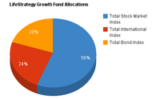

## Table of Contents

## What is the Vanguard LifeStrategy Growth Fund?

The Vanguard LifeStrategy Growth Fund is a type of investment fund that helps people grow their money over time. It is managed by Vanguard, a well-known company that offers many investment options. This specific fund is designed for people who want to invest mostly in stocks, which can grow a lot but can also be riskier. The fund mixes about 80% stocks and 20% bonds, which are generally safer investments. This mix aims to balance growth and safety.

This fund is great for people who don't want to pick individual stocks or bonds themselves. Instead, they can invest in this fund and let Vanguard's experts handle the choices. The fund spreads investments across many different companies and countries, which helps reduce risk. It's a good choice for someone looking for a simple way to invest for the long term, like saving for retirement.

## What are the top holdings of the Vanguard LifeStrategy Growth Fund?

The Vanguard LifeStrategy Growth Fund invests in other Vanguard funds, which in turn hold many different stocks and bonds. Some of the top holdings in the fund come from the Vanguard Total Stock Market Index Fund and the Vanguard Total International Stock Index Fund. These funds include big companies like Apple, Microsoft, and Amazon from the U.S., as well as big companies from other countries like Nestle and Toyota.

The fund also includes a smaller portion in bonds through the Vanguard Total Bond Market II Index Fund. This part of the fund holds a variety of U.S. government and corporate bonds. By spreading the money across many different stocks and bonds, the fund tries to lower the risk while still aiming for growth.

Overall, the top holdings of the Vanguard LifeStrategy Growth Fund are a mix of stocks and bonds from different parts of the world. This mix helps the fund to grow over time while also trying to keep things safe for the investors.

## How are the top holdings of the fund selected?

The top holdings of the Vanguard LifeStrategy Growth Fund are chosen by looking at other Vanguard funds it invests in. The main funds it uses are the Vanguard Total Stock Market Index Fund and the Vanguard Total International Stock Index Fund for stocks, and the Vanguard Total Bond Market II Index Fund for bonds. These funds are picked because they cover a wide range of stocks and bonds, which helps spread out the risk.

The stocks in the Total Stock Market Index Fund and the Total International Stock Index Fund are selected to match the overall market. This means they include big companies like Apple and Microsoft from the U.S., and big companies like Nestle and Toyota from other countries. The idea is to own a little bit of almost every company in the market, which helps the fund grow over time.

The bonds in the Total Bond Market II Index Fund are chosen to represent the U.S. bond market. This includes government bonds and corporate bonds. By including a mix of stocks and bonds from different places, the LifeStrategy Growth Fund tries to balance growth and safety for its investors.

## What percentage of the fund's assets are allocated to its top holdings?

The Vanguard LifeStrategy Growth Fund spreads its money across different Vanguard funds. About 80% of the fund's money goes into stocks, and the rest, about 20%, goes into bonds. The stock part is split between the Vanguard Total Stock Market Index Fund and the Vanguard Total International Stock Index Fund. The bond part comes from the Vanguard Total Bond Market II Index Fund.

The top holdings in the stock part come from the biggest companies in these funds. For example, in the U.S., companies like Apple and Microsoft are big parts of the Total Stock Market Index Fund. Internationally, companies like Nestle and Toyota are important in the Total International Stock Index Fund. The bond part includes a mix of U.S. government and corporate bonds. By spreading the money this way, the fund tries to grow while also keeping things safe for investors.

## How does the allocation to top holdings affect the fund's performance?

The way the Vanguard LifeStrategy Growth Fund puts its money into different stocks and bonds can really affect how well it does. About 80% of the fund goes into stocks, which can grow a lot but can also go down a lot. The rest, about 20%, goes into bonds, which are usually safer but don't grow as much. By having a lot in stocks, the fund tries to grow more over time, but it can also be riskier. The stocks come from big companies in the U.S. and around the world, which helps spread out the risk a bit.

The top holdings in the stock part, like Apple and Microsoft in the U.S., and Nestle and Toyota from other countries, can make a big difference. If these big companies do well, the fund can grow a lot. But if they don't do well, the fund might not grow as much or could even lose money. The bond part, which comes from the U.S. bond market, helps keep things safer. So, the mix of these top holdings and how they do can really shape how the whole fund performs over time.

## What is the historical performance of the top holdings in the fund?

The top holdings in the Vanguard LifeStrategy Growth Fund have done pretty well over time. The U.S. part of the fund, which includes big companies like Apple and Microsoft, has grown a lot in the past. These companies have been leaders in technology and other industries, which has helped the fund grow. The international part, with companies like Nestle and Toyota, has also done okay, but sometimes it doesn't grow as fast as the U.S. part. Overall, the mix of these top holdings has helped the fund grow over the years.

The bond part of the fund, which comes from the U.S. bond market, has been more stable. Bonds don't grow as much as stocks, but they help keep the fund safer. When the stock market goes down, the bond part can help balance things out. So, even though the top stock holdings can go up and down a lot, the bond part helps make the whole fund more steady over time.

## How do the top holdings contribute to the fund's overall risk profile?

The top holdings in the Vanguard LifeStrategy Growth Fund play a big role in how risky the fund is. About 80% of the fund is in stocks, which can go up and down a lot. The U.S. part includes big companies like Apple and Microsoft, which can grow a lot but can also lose value if the market goes down. The international part, with companies like Nestle and Toyota, adds some risk too, but it also helps spread out the risk because it's not all in one place. So, the top stock holdings make the fund riskier because they can change a lot in value.

The other 20% of the fund is in bonds, which are usually safer than stocks. The bonds come from the U.S. bond market and include government and corporate bonds. They don't grow as much as stocks, but they help keep the fund more stable. When the stock market goes down, the bond part can help balance things out and reduce the overall risk of the fund. So, while the top stock holdings add risk, the bond part helps make the whole fund less risky and more balanced.

## What sectors are most represented among the top holdings?

The top holdings in the Vanguard LifeStrategy Growth Fund come from many different sectors, but some are more common than others. In the U.S. part of the fund, which includes big companies like Apple and Microsoft, the technology sector is very important. These companies make things like computers, phones, and software, which can grow a lot but can also be risky. Other big sectors in the U.S. part include healthcare, with companies that make medicines and medical equipment, and finance, with banks and other financial services.

The international part of the fund, with companies like Nestle and Toyota, also covers many sectors. The consumer goods sector is big here, with companies that make food, drinks, and other things people use every day. The car industry is another important sector, with companies that make cars and car parts. By having top holdings in different sectors, the fund tries to spread out the risk and grow over time.

## How does the fund's exposure to top holdings compare to its benchmark?

The Vanguard LifeStrategy Growth Fund's exposure to its top holdings is a bit different from its benchmark, which is usually a mix of stock and bond market indexes. The fund puts about 80% of its money into stocks, with a big part of that in the U.S. and some in other countries. The top stock holdings, like Apple and Microsoft in the U.S., and Nestle and Toyota internationally, are chosen to match the overall market but can be a bit different from the exact mix in the benchmark. This means the fund might do better or worse than the benchmark depending on how these top companies do.

The other 20% of the fund goes into bonds, which are usually safer than stocks. The bonds come from the U.S. bond market and include government and corporate bonds. The fund's bond part tries to match the U.S. bond market index, but it might not be exactly the same. So, while the fund's overall mix of stocks and bonds is similar to its benchmark, the specific top holdings can make it a bit different. This can affect how the fund performs compared to the benchmark over time.

## What is the turnover rate of the top holdings in the fund?

The turnover rate of the top holdings in the Vanguard LifeStrategy Growth Fund is pretty low. This means the fund doesn't change its top stocks and bonds very often. The fund invests in other Vanguard funds, like the Total Stock Market Index Fund and the Total International Stock Index Fund for stocks, and the Total Bond Market II Index Fund for bonds. These funds are designed to match the overall market, so they don't need to buy and sell a lot of different stocks and bonds all the time.

Because the fund's top holdings come from these other funds, the turnover rate stays low. The stocks in the Total Stock Market Index Fund and the Total International Stock Index Fund are picked to represent the whole market, so they don't change much. The same goes for the bonds in the Total Bond Market II Index Fund. By keeping the turnover rate low, the fund tries to keep costs down and stay focused on long-term growth.

## How do changes in the top holdings impact the fund's strategy?

Changes in the top holdings of the Vanguard LifeStrategy Growth Fund can affect its overall strategy, but these changes are usually small and happen slowly. The fund invests in other Vanguard funds, like the Total Stock Market Index Fund and the Total International Stock Index Fund for stocks, and the Total Bond Market II Index Fund for bonds. These funds are designed to match the overall market, so the top holdings don't change a lot. When there are changes, they are usually because the market itself is changing, like when new companies grow big enough to be included in the index.

Even though the top holdings might change a bit, the fund's main strategy stays the same. The fund aims to grow over time by investing mostly in stocks, about 80%, and a smaller part in bonds, about 20%. This mix helps balance growth and safety. So, even if the specific top holdings shift a little, the fund keeps its focus on long-term growth and spreading out risk by investing in a wide range of stocks and bonds from different places.

## What advanced metrics should investors consider when analyzing the top holdings of the fund?

When looking at the top holdings of the Vanguard LifeStrategy Growth Fund, investors should pay attention to a few important numbers. One key metric is the Price-to-Earnings (P/E) ratio, which shows how much investors are willing to pay for a company's earnings. A high P/E ratio might mean the stock is expected to grow a lot, but it can also be riskier. Another useful number is the Beta, which tells you how much the stock moves compared to the overall market. A high Beta means the stock can go up or down a lot more than the market, adding more risk to the fund.

Investors should also look at the Dividend Yield, which shows how much money the company pays out to shareholders as a percentage of the stock price. A higher yield can mean more income for the fund, but it might also mean the company isn't growing as fast. Lastly, the Sharpe Ratio is a good way to see how well the fund's returns are compared to the risk it takes. A higher Sharpe Ratio means the fund is doing a good job of balancing growth and safety. By keeping an eye on these metrics, investors can get a better idea of how the top holdings might affect the fund's performance and risk.

## References & Further Reading

[1]: Poole, W. (2010). ["Vanguard and TIAA-CREF: Long-Term Success Through Smart Investing"](https://www.brokerage-review.com/broker-compare/tiaa-vs-vanguard.aspx) Federal Reserve Bank of St. Louis, The Regional Economist.

[2]: ["Common Sense on Mutual Funds: Fully Updated 10th Anniversary Edition"](https://www.amazon.com/Common-Sense-Mutual-Funds-Anniversary/dp/0470138130) by John C. Bogle

[3]: Aldridge, I. (2013). ["High-Frequency Trading: A Practical Guide to Algorithmic Strategies and Trading Systems"](https://onlinelibrary.wiley.com/doi/pdf/10.1002/9781119203803.fmatter) Wiley.

[4]: Treynor, J. L., & Mazuy, K. K. (1966). ["Can Mutual Funds Outguess the Market?"](https://www.semanticscholar.org/paper/Can-mutual-funds-outguess-the-market-Harvard-Review-Treynor-Mazuy/46f77dbcc3c07c1475640aa0a4ef4a957c026d99) Harvard Business Review.

[5]: ["The Little Book of Common Sense Investing: The Only Way to Guarantee Your Fair Share of Stock Market Returns"](https://www.amazon.com/Little-Book-Common-Sense-Investing/dp/1119404509) by John C. Bogle