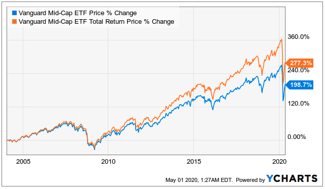

## Table of Contents

## What is the Vanguard Mid Cap Index Fund?

The Vanguard Mid Cap Index Fund is a type of investment fund that focuses on mid-sized companies. It's designed to give investors a way to own a piece of many mid-sized companies all at once, instead of buying each company's stock separately. This fund tries to match the performance of a specific index, which is a list of mid-sized companies. By doing this, it aims to give investors similar returns to the overall market for mid-sized companies.

This fund is popular because it's managed by Vanguard, a well-known company that often charges lower fees than other investment companies. Lower fees mean that more of the money you invest can stay in your pocket, instead of going to pay for managing the fund. The Vanguard Mid Cap Index Fund is a good choice for people who want to invest in mid-sized companies but don't want to spend a lot of time picking individual stocks or paying high fees.

## What are the main investment objectives of the Vanguard Mid Cap Index Fund?

The main goal of the Vanguard Mid Cap Index Fund is to give investors a way to earn returns that match the performance of mid-sized companies in the U.S. It does this by trying to copy the results of a specific index, called the CRSP US Mid Cap Index. This index includes a lot of mid-sized companies, so the fund buys stocks in these companies to match the index as closely as possible.

Another important objective is to keep costs low for investors. Vanguard is known for charging lower fees than many other investment companies. By keeping the fees low, more of the money you put into the fund can stay invested and work to grow over time, instead of being used to pay for managing the fund. This makes the Vanguard Mid Cap Index Fund a good choice for people looking for a simple and cost-effective way to invest in mid-sized companies.

## How does the Vanguard Mid Cap Index Fund track its benchmark?

The Vanguard Mid Cap Index Fund tracks its benchmark, the CRSP US Mid Cap Index, by buying stocks of the companies that are in the index. The fund tries to have the same mix of stocks as the index, so if a company makes up 2% of the index, the fund will try to have about 2% of its money in that company's stock. This way, the fund's performance should be very close to the performance of the index.

To make sure it stays on track, the fund is checked and adjusted regularly. If the companies in the index change, or if the size of the companies changes, the fund will buy or sell stocks to keep matching the index. This process helps the fund to keep its performance in line with the benchmark, giving investors a way to get returns that are similar to the overall market for mid-sized companies.

## What are the key benefits of investing in the Vanguard Mid Cap Index Fund?

One of the main benefits of investing in the Vanguard Mid Cap Index Fund is that it gives you a simple way to own a piece of many mid-sized companies all at once. Instead of [picking](/wiki/asset-class-picking) and buying stocks in each company yourself, you can invest in the fund and it will do the work for you. This can save you a lot of time and effort. Plus, by spreading your money across many companies, you're not putting all your eggs in one basket, which can help lower your risk.

Another big advantage is that the fund tries to match the performance of the CRSP US Mid Cap Index, which means you can get returns that are similar to the overall market for mid-sized companies. This can be a good way to grow your money over time. Also, Vanguard is known for keeping fees low, so more of your money stays invested and working for you, instead of going to pay for managing the fund. This can make a big difference in the long run, helping you keep more of your returns.

## What are the risks associated with the Vanguard Mid Cap Index Fund?

Investing in the Vanguard Mid Cap Index Fund comes with some risks. One big risk is that the value of the stocks in the fund can go up and down a lot. Mid-sized companies can be more unpredictable than big companies, so their stock prices might change more. If the market for mid-sized companies goes down, the value of your investment in the fund could go down too. This means you could lose money, especially if you need to sell your investment when the market is low.

Another risk is that the fund is focused only on mid-sized companies in the U.S. If something bad happens to these companies or the U.S. economy, it could hurt the fund's performance. Also, because the fund tries to match the performance of the CRSP US Mid Cap Index, it won't do better than the index. If the index doesn't do well, your investment won't do well either. So, it's important to think about these risks and make sure this kind of investment fits with your overall plan and how much risk you're okay with taking.

## How has the Vanguard Mid Cap Index Fund performed historically?

The Vanguard Mid Cap Index Fund has done pretty well over the years. If you look at the last 10 years, it has given investors an average return of about 9-10% each year. This means if you put $10,000 into the fund 10 years ago, it would be worth around $23,000 to $24,000 now. But remember, past performance doesn't tell you what will happen in the future. The stock market can be up and down, and the fund's returns can change a lot from year to year.

Looking at shorter periods, the fund's performance can be more bumpy. For example, in some years, it might go up by 20% or more, while in other years, it might go down by 10% or more. This shows that even though the fund has done well over the long term, it can still have big swings in the short term. So, it's a good idea to think about investing in this fund for the long haul, and be ready for some ups and downs along the way.

## What is the expense ratio of the Vanguard Mid Cap Index Fund and how does it compare to similar funds?

The expense ratio of the Vanguard Mid Cap Index Fund is very low, at about 0.04%. This means for every $10,000 you invest in the fund, you'll pay just $4 a year in fees. This low expense ratio is one of the reasons why the fund is popular with investors. It means more of your money stays invested and can grow over time, instead of going to pay for managing the fund.

Compared to similar funds, the Vanguard Mid Cap Index Fund's expense ratio is much lower. Many other mid-cap index funds charge expense ratios that are 0.10% or higher. For example, the iShares Core S&P Mid-Cap [ETF](/wiki/etf-trading-strategies) has an expense ratio of 0.07%, and the Schwab U.S. Mid-Cap ETF charges 0.04%. So, while the Vanguard fund's expense ratio is not the absolute lowest, it is still very competitive and helps keep more money in your pocket over time.

## How does the Vanguard Mid Cap Index Fund fit into a diversified investment portfolio?

The Vanguard Mid Cap Index Fund can be a great part of a diversified investment portfolio. It gives you a way to invest in mid-sized companies, which can help spread your money across different types of businesses. By including mid-sized companies, you're not just focusing on big companies or small ones. This can help lower your risk because if one part of the market does badly, the other parts might do better and balance things out.

Adding the Vanguard Mid Cap Index Fund to your portfolio also helps because it's easy to manage and has low fees. You don't have to spend a lot of time picking individual stocks or worrying about high costs eating into your returns. This makes it a simple and cost-effective way to get exposure to mid-sized companies. Over time, this can help your overall investment grow more, as more of your money stays invested and working for you.

## What are the tax implications of investing in the Vanguard Mid Cap Index Fund?

Investing in the Vanguard Mid Cap Index Fund can have tax implications that you should know about. When the fund sells stocks that have gone up in value, it might have to pay capital gains taxes. These taxes can then be passed on to you, the investor, as taxable distributions. If you hold the fund in a regular investment account, you'll need to report these distributions on your tax return and pay taxes on them. The amount of tax you pay will depend on how long the fund held the stocks before selling them and your own tax situation.

However, if you hold the Vanguard Mid Cap Index Fund in a tax-advantaged account like an IRA or 401(k), the tax implications can be different. In these types of accounts, you usually don't have to pay taxes on the fund's distributions until you take money out of the account. This can help your investment grow more over time because you're not losing money to taxes each year. It's a good idea to talk to a tax advisor to understand how investing in this fund will affect your taxes based on your specific situation.

## How can one invest in the Vanguard Mid Cap Index Fund?

To invest in the Vanguard Mid Cap Index Fund, you first need to open an account with Vanguard. You can do this online by going to their website and following the steps to set up a new account. Once your account is open, you can choose to invest in the Vanguard Mid Cap Index Fund. You'll need to decide how much money you want to put into the fund. You can do this by making a one-time investment or by setting up regular investments, like putting in money every month.

After you've invested, you can keep an eye on how your investment is doing through Vanguard's website or app. You can also add more money to your investment whenever you want or take some out if you need to. Remember, it's a good idea to think about your overall investment plan and how the Vanguard Mid Cap Index Fund fits into it. If you're not sure, talking to a financial advisor can help you make the best choices for your money.

## What are the criteria for the stocks included in the Vanguard Mid Cap Index Fund?

The Vanguard Mid Cap Index Fund includes stocks based on the CRSP US Mid Cap Index. This index picks companies that are in the middle size range, not too big and not too small. To be in the index, a company needs to be in the top 85% to 95% of all U.S. companies when you look at their total value, which is called market capitalization. This means the fund focuses on companies that are growing but are not as big as the giants in the stock market.

The fund also makes sure to keep the same mix of stocks as the index. If a company makes up 2% of the index, the fund will try to have about 2% of its money in that company's stock. The fund checks and adjusts its holdings regularly to match any changes in the index. This way, the fund can stay true to its goal of giving investors returns that are similar to the overall market for mid-sized companies.

## How does the Vanguard Mid Cap Index Fund manage its portfolio and rebalance its holdings?

The Vanguard Mid Cap Index Fund manages its portfolio by trying to match the CRSP US Mid Cap Index. This means the fund buys stocks of the companies that are in the index. If a company makes up 2% of the index, the fund will try to have about 2% of its money in that company's stock. This way, the fund's performance should be very close to the performance of the index. The fund keeps an eye on the index all the time to make sure it's doing a good job of matching it.

To keep the fund in line with the index, it needs to rebalance its holdings. Rebalancing means buying or selling stocks to make sure the fund still matches the index. If the companies in the index change, or if the size of the companies changes, the fund will buy or sell stocks to keep up. This happens regularly, so the fund can stay true to its goal of giving investors returns that are similar to the overall market for mid-sized companies.

## References & Further Reading

[1]: ["Mid-Cap Fund Advantages"](https://www.investopedia.com/terms/m/mid_cap_fund.asp) by Morningstar

[2]: Malkiel, B. G. (2019). ["A Random Walk Down Wall Street: The Time-Tested Strategy for Successful Investing"](https://yourknowledgedigest.org/wp-content/uploads/2020/04/a-random-walk-down-wall-street.pdf). W.W. Norton & Company.

[3]: ["The Little Book of Common Sense Investing"](https://www.amazon.com/Little-Book-Common-Sense-Investing/dp/1119404509) by John C. Bogle

[4]: Fabozzi, F. J., Focardi, S. M., & Kolm, P. N. (2011). ["Quantitative Equity Investing: Techniques and Strategies."](https://www.semanticscholar.org/paper/Quantitative-Equity-Investing%3A-Techniques-and-Fabozzi-Focardi/1c49a2a53919f7e65cb96f16691b8ff726fd3cd7) John Wiley & Sons.

[5]: ["An Introduction to Algorithmic Trading"](https://archive.org/details/introductiontoal0000lesh) by Investopedia