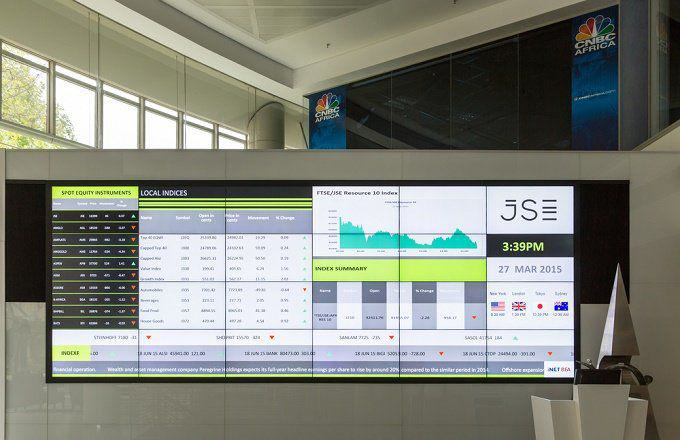

The world of investing offers a myriad of options, each with its own unique benefits. Among these, the Vanguard Mid Cap Index Fund stands out for those looking to invest in medium-sized companies. This fund provides an opportunity to diversify portfolios while leveraging the growth potential of mid-cap stocks, which are typically companies with market capitalizations between $2 billion and $10 billion. Mid-cap companies often represent a sweet spot in the investment landscape, offering more growth potential than large-cap stocks but with less risk than small-cap stocks.

The Vanguard Mid Cap Index Fund is designed to mimic the performance of a specific market index, offering a cost-effective way for investors to gain exposure to a broad cross-section of the mid-cap sector. Such funds typically have lower expense ratios compared to actively managed funds because they do not require the intense research and frequent trading activities that active management involves. This low-cost structure can contribute significantly to compounding returns over the long term.



In recent years, the advent of algorithmic trading has equipped investors with advanced tools to optimize fund performance. Algorithms can execute trades with precision and at high speeds, enabling funds to react swiftly to market changes. By analyzing large datasets and applying complex mathematical models, algorithmic trading can enhance investment outcomes by reducing costs and improving the timing of trades.

The combination of a well-strategized index fund like the Vanguard Mid Cap Index Fund and sophisticated trading algorithms can provide investors with a robust approach to achieving their investment goals. This article will cover the intricacies of the Vanguard Mid Cap Fund, exploring its strategy and performance benefits in the context of algorithmic trading advancements.

## Table of Contents

## Understanding the Vanguard Mid Cap Index Fund

The Vanguard Mid-Cap Index Fund aims to mirror the performance of the CRSP U.S. Mid-Cap Index, focusing on capturing the growth potential of medium-sized American companies. These firms, often referred to as mid-cap stocks, lie between large-cap and small-cap companies in market capitalization, offering a blend of stability and growth. The fund's strategy is designed to provide investors with a balanced profile that minimizes volatility while maximizing returns.

One of the key features of the Vanguard Mid-Cap Index Fund is its low expense ratio. Expense ratios are essentially fees expressed as a percentage of the total investment, incurred for managing the fund. A lower expense ratio implies that more of the investor's money is being allocated to the underlying assets rather than administrative costs, making it a cost-effective option over the long term. For example, if the fund has an expense ratio of 0.05%, an investor with $10,000 would pay $5 annually for management costs, which is considerably lower than the industry average.

Currently, the fund holds a well-diversified portfolio. It strongly emphasizes sectors like technology, consumer discretionary, and industrials, which are known for their dynamic growth potential. This vertical diversification helps the fund balance its exposure across different industries, reducing risk while capturing gains from sectors poised for expansion.

The management of the Vanguard Mid-Cap Index Fund is entrusted to experienced portfolio managers who employ a disciplined approach to stock selection. This involves rigorous analysis and strategic management aimed at replicating the index's performance as closely as possible. The managers ensure that the portfolio reflects the index by maintaining similar sector weightings and adjusting holdings based on index rebalancing.

Overall, the Vanguard Mid-Cap Index Fund presents a robust investment vehicle for those looking to leverage the growth potential of mid-cap stocks while enjoying the benefits of a well-managed, low-cost index fund.

## Performance Insights

Historically, the Vanguard Mid-Cap Index Fund has consistently delivered impressive returns, closely mirroring its benchmark, the CRSP U.S. Mid-Cap Index. Its performance across various time horizons illustrates its reliability as an investment vehicle. For instance, its year-to-date returns often reflect the dynamic nature of mid-cap stocks, which generally oscillate with broader market trends.

Key performance indicators for the fund include returns observed over three, five, and ten-year periods. These metrics provide a comprehensive view of the fund's resilience and growth potential:

1. **Three-Year Horizon**: Over this period, the fund has typically shown solid performance, often surpassing inflation rates and providing investors with real returns. The volatility inherent in mid-cap stocks is offset by their potential for higher capital appreciation compared to large-cap stocks.

2. **Five-Year Horizon**: The fund's performance over a five-year period presents a balanced view of growth and consistency. This medium-term horizon captures the benefits of market cycles, where mid-cap companies often excel due to their agility and potential for expansion.

3. **Ten-Year Horizon**: Long-term performance data illustrates the fund's ability to withstand market fluctuations and maintain a growth trajectory. Investors benefit from a strategy that capitalizes on the expansion phases of mid-cap firms, translating to compounded returns.

Despite market [volatility](/wiki/volatility-trading-strategies), the Vanguard Mid-Cap Index Fund has maintained a steady growth trajectory. This stability is attributed to a disciplined index strategy that focuses on diversification and sector exposure, with significant investments in technology, consumer discretionary, and industrials sectors. The fund's adept management and strategic allocation have played a crucial role in ensuring that it remains a robust investment option. Consequently, its historical performance reinforces its credibility, making it a compelling choice for investors aiming for balance between risk and growth potential.

## Portfolio Allocation and Top Holdings

The Vanguard Mid Cap Index Fund's asset allocation is heavily weighted towards equities, reflecting its primary investment in stocks. The fund allocates minimal resources to bonds and cash, maintaining a focus on growth-oriented securities. By concentrating on stocks, the fund aims to capitalize on the potential for substantial returns inherent in mid-cap companies.

The fund's diversified investment strategy places substantial emphasis on the technology and healthcare sectors. These sectors are known for their potential for innovation and growth, making them attractive to investors seeking opportunities to benefit from advancements in these fields. The technology sector, in particular, has seen transformative developments, while healthcare continues to expand due to factors like increasing health awareness and technological advancements in medical treatments.

Among the fund's top holdings are notable mid-cap companies such as Moderna, a biotechnology firm renowned for its innovative development of mRNA technology, and Twilio, a cloud communications platform provider. These companies have been significant contributors to the fund's overall performance due to their strategic positioning and robust business models. Moderna's role in vaccine development and Twilio's integration into various digital communication services underscore their influence and relevance in the market.

The Vanguard Mid Cap Index Fund's strategy centers on maintaining a dynamic and balanced portfolio, which involves continuous evaluation and adjustment to optimize growth returns from mid-cap stocks. This approach allows the fund to adapt to market fluctuations and seize emerging growth opportunities while distributing risk across a diversified set of holdings. This balanced dynamic is crucial for capturing the potential upside of mid-sized companies poised for expansion, thus providing substantial value to investors seeking growth through diversified mid-cap investments.

## The Role of Algorithmic Trading

Algorithmic trading has significantly enhanced fund management, including for the Vanguard Mid Cap Index Fund, by automating trading decisions and executing them with precision. This automation reduces human error and allows for more consistent, data-driven decisions that align with the fund's investment goals. 

For the Vanguard Mid Cap Index Fund, [algorithmic trading](/wiki/algorithmic-trading) can optimize trading strategies by utilizing complex mathematical models to identify investment opportunities and risks. These models often rely on advanced statistical methods like regression analysis and [machine learning](/wiki/machine-learning) to forecast market trends and price movements. For instance, algorithms can be designed to execute trades when a stock's price deviates from its expected value, calculated using historical data.

A Python snippet illustrating a simple moving average crossover strategy, a common algorithmic trading technique, is as follows:

```python
# Import necessary libraries
import pandas as pd
import numpy as np

# Fetch stock price data
data = pd.read_csv('stock_prices.csv')

# Calculate short-term and long-term moving averages
short_window = 40
long_window = 100

data['short_mavg'] = data['Close'].rolling(window=short_window, min_periods=1).mean()
data['long_mavg'] = data['Close'].rolling(window=long_window, min_periods=1).mean()

# Define trading signals
data['signal'] = 0.0
data['signal'][short_window:] = np.where(data['short_mavg'][short_window:] > data['long_mavg'][short_window:], 1.0, 0.0)   
data['positions'] = data['signal'].diff()

# Print first few rows of the data
print(data.head())
```

This code calculates short-term and long-term moving averages for a stock's closing prices. Trades are executed based on the crossover of these averages, automatically buying when the short-term moving average crosses above the long-term average, and selling when the opposite occurs.

High-speed execution, a hallmark of algorithmic trading, allows funds like the Vanguard Mid Cap Index Fund to capitalize on market inefficiencies faster than human traders. This speed enables executing a higher [volume](/wiki/volume-trading-strategy) of trades, improving [liquidity](/wiki/liquidity-risk-premium) and potentially enhancing returns while minimizing costs. By effectively timing trades, algorithms can reduce transaction costs and slippage, ultimately increasing net returns for investors.

Furthermore, algorithmic trading offers the flexibility to adjust to changing market conditions swiftly. Dynamic algorithms continuously analyze real-time data, allowing for rapid adjustments in trading strategies. For example, risk management algorithms can automatically adjust portfolio allocations in response to market volatility, maintaining the desired risk-return profile.

Overall, integrating algorithmic trading into fund management enhances the ability to navigate complex market environments, making it a valuable tool for optimizing the performance of the Vanguard Mid Cap Index Fund.

## Benefits of Investing in Mid Cap Funds

Mid-cap funds present a compelling investment opportunity by offering a combination of stability and growth potential, making them a suitable option for a broad range of investors. These funds often outperform large-cap counterparts due to their diverse positioning within industries poised for substantial growth. This characteristic allows them to provide lucrative investment opportunities as these industries expand and evolve.

A key advantage of mid-cap funds is their potential for higher returns compared to large-cap stocks. This potential stems from their access to emerging markets and innovative sectors, which are typically more agile and responsive to changes than established large-cap companies. As these mid-sized companies grow, they enhance the fund's performance, leading to attractive returns for investors seeking growth assets.

Moreover, mid-cap funds generally experience lower volatility compared to small-cap stocks. This reduced volatility is beneficial for investors who wish to avoid the heightened risk associated with smaller, less stable companies. As a result, mid-cap funds strike a balance between the higher risk and potential reward of small-cap stocks and the relative safety but lower growth potential of large-cap stocks.

The Vanguard Mid Cap Index Fund serves as an excellent vehicle for those aiming to diversify and enhance their investment portfolios. By focusing on medium-sized companies, this fund mitigates risk through diversification while capturing growth opportunities inherent to mid-cap stocks. Consequently, it serves as an optimal choice for investors aiming to achieve long-term growth through a structured and disciplined investment approach.

## Conclusion

Investing in mid-cap index funds like Vanguard's offers a balanced approach to growth and risk management. Mid-cap funds strike an optimal balance by harnessing the scalability of growing companies while mitigating some risks associated with smaller, less stable enterprises. This equilibrium presents an attractive proposition for investors seeking sustainable portfolio growth.

Algorithmic trading further enhances these investments by optimizing strategy execution and financial performance. By employing complex algorithms, these systems can perform high-frequency trading, evaluate vast datasets, and make rapid decisions that human traders cannot match. The use of algorithms can reduce trading costs through efficient buy/sell strategies, ensuring that the fund operates with a lean approach to transaction expenses.

The Vanguard Mid Cap Index Fund, known for its strong track record, benefits from its diversified portfolio that aligns with the CRSP U.S. Mid-Cap Index. This alignment means investors can have confidence in both the fund's strategic vision and disciplined management approach. The fund's past performance demonstrates resilience and growth potential, making it a compelling option for smart investors aiming to capitalize on mid-cap market dynamics.

For those seeking long-term growth, this fund, coupled with algorithmic trading, could unlock new avenues for wealth creation. The blend of disciplined index fund strategy with the adaptability and precision of algorithmic trading positions the fund as a forward-thinking investment choice in an ever-evolving financial landscape. Through this hybrid approach, investors can optimize returns while maintaining a robust risk management stance, paving the way for sustained financial success.

## References & Further Reading

[1]: ["Mid-Cap Fund Advantages"](https://www.investopedia.com/terms/m/mid_cap_fund.asp) by Morningstar

[2]: Malkiel, B. G. (2019). ["A Random Walk Down Wall Street: The Time-Tested Strategy for Successful Investing"](https://yourknowledgedigest.org/wp-content/uploads/2020/04/a-random-walk-down-wall-street.pdf). W.W. Norton & Company.

[3]: ["The Little Book of Common Sense Investing"](https://www.amazon.com/Little-Book-Common-Sense-Investing/dp/1119404509) by John C. Bogle

[4]: Fabozzi, F. J., Focardi, S. M., & Kolm, P. N. (2011). ["Quantitative Equity Investing: Techniques and Strategies."](https://www.semanticscholar.org/paper/Quantitative-Equity-Investing%3A-Techniques-and-Fabozzi-Focardi/1c49a2a53919f7e65cb96f16691b8ff726fd3cd7) John Wiley & Sons.

[5]: ["An Introduction to Algorithmic Trading"](https://archive.org/details/introductiontoal0000lesh) by Investopedia