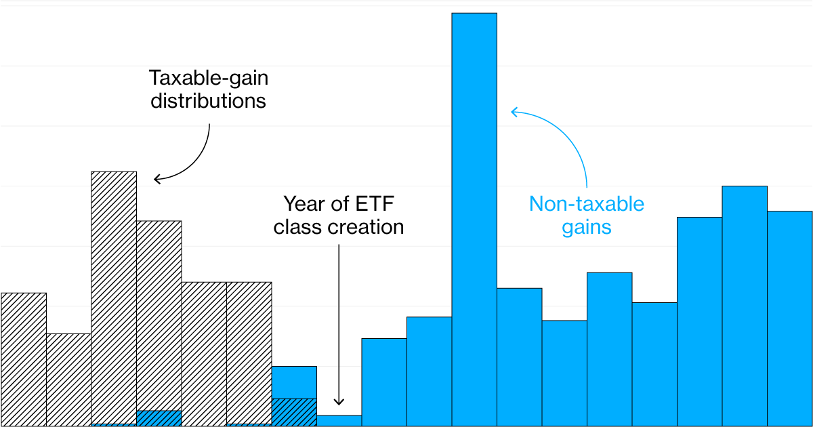

## Table of Contents

## What is Vanguard's Patented Tax Avoidance System?

Vanguard's Patented Tax Avoidance System is a way to help investors save money on taxes. It uses a special method to manage investments in a way that reduces the amount of taxes people have to pay. This system is unique because it is protected by a patent, which means no other company can use the exact same method.

The system works by carefully choosing which investments to buy and sell, and when to do it. This helps to lower the taxes on the money people make from their investments. By using this system, investors can keep more of their earnings instead of giving it to the government in taxes.

## How does Vanguard's system help mutual fund investors?

Vanguard's system helps mutual fund investors by reducing the taxes they have to pay on their investments. When you invest in mutual funds, you can earn money from them. But, you also have to pay taxes on that money. Vanguard's special system helps to lower those taxes. It does this by being smart about which investments to buy and sell, and when to do it. This way, investors can keep more of the money they earn.

This system is especially helpful for people who want to save money over a long time. By paying less in taxes each year, the money in their mutual funds can grow more. Over many years, this can make a big difference. It means that when it's time to use the money, like for retirement, there will be more of it. This is why Vanguard's system is a good choice for mutual fund investors who want to keep their taxes low and their savings high.

## What are the basic principles behind tax avoidance in mutual funds?

The basic idea behind tax avoidance in mutual funds is to make smart choices about buying and selling investments. When you sell an investment for more than you paid for it, you have to pay taxes on the profit. But if you can hold onto the investment for a long time, you might pay less tax. This is because long-term investments are often taxed at a lower rate than short-term ones. So, one principle is to try to keep investments for a longer time to reduce taxes.

Another principle is to be careful about when you sell investments. If you sell a lot of investments in one year, you might have to pay a lot of taxes. But if you spread out the selling over several years, you might pay less tax each year. This is called tax-loss harvesting. It means selling investments that have lost value to offset the taxes on the investments that have gained value. By doing this, you can lower the total amount of taxes you have to pay.

These principles help mutual fund investors keep more of their money. By being smart about when to buy and sell, and by holding onto investments for a long time, investors can reduce the taxes they have to pay. This means more money stays in their mutual funds, which can grow over time and help them reach their financial goals.

## Can you explain the specific patent details of Vanguard's system?

Vanguard's patented tax avoidance system is called "Tax-Managed Equity Fund." The patent number is US 6,473,737 B1. This system helps investors save money on taxes by being smart about buying and selling stocks. It works by choosing which stocks to buy and sell, and when to do it, in a way that lowers the taxes people have to pay. The system is special because it is protected by a patent, which means no other company can use the exact same method.

The system uses a method called "tax-managed investing." This means the fund managers look at the tax effects of every decision they make. They try to keep the taxes as low as possible by holding onto stocks for a long time and by selling stocks that have lost value to offset the taxes on stocks that have gained value. This way, investors can keep more of their money and let it grow over time. The patent was filed on November 13, 1998, and it was granted on October 29, 2002.

## How does Vanguard's system compare to other tax management strategies in the industry?

Vanguard's system, known as the Tax-Managed Equity Fund, is unique because it is protected by a patent. This means that no other company can use the exact same method. The system focuses on choosing which stocks to buy and sell, and when to do it, in a way that lowers the taxes investors have to pay. It uses a method called tax-managed investing, where fund managers look at the tax effects of every decision they make. They try to keep taxes low by holding onto stocks for a long time and by selling stocks that have lost value to offset the taxes on stocks that have gained value.

Other companies also have tax management strategies, but they might not be as effective or as focused on tax reduction as Vanguard's system. For example, some funds use tax-loss harvesting, which is similar to what Vanguard does, but they might not do it as often or as carefully. Other strategies might include investing in tax-efficient funds, like index funds or ETFs, which naturally have lower turnover and thus lower tax liabilities. However, these strategies do not have the same level of detailed tax management that Vanguard's patented system offers. Overall, Vanguard's system stands out because of its specific focus on minimizing taxes through careful stock selection and timing.

## What are the legal and ethical considerations of using Vanguard's tax avoidance system?

Using Vanguard's tax avoidance system is legal because it follows the rules set by the government about taxes. The system is designed to help investors pay less in taxes by being smart about buying and selling stocks. It uses a method that is allowed by law, and it is protected by a patent, which means it is a unique way to save on taxes. As long as investors follow the rules and report their earnings correctly, they are not breaking any laws by using this system.

However, there are ethical considerations to think about. Some people might feel that using a system to pay less in taxes is not fair to others who pay more. They might think it is wrong to use a special method to avoid taxes when everyone should pay their fair share. But others believe that if the government allows this kind of tax management, it is okay to use it to keep more of their own money. It's important for investors to think about these ethical issues and decide if using Vanguard's system fits with their own values and beliefs.

## How has Vanguard's system impacted the performance of their mutual funds?

Vanguard's tax avoidance system has helped their mutual funds perform better. By paying less in taxes, the funds can keep more money. This means the money in the funds can grow more over time. When investors see that they are keeping more of their earnings, they might be more likely to invest in Vanguard's funds. This can bring in more money for the funds, which can help them grow even more.

The system works by being smart about buying and selling stocks. It tries to keep taxes low by holding onto stocks for a long time and by selling stocks that have lost value to offset the taxes on stocks that have gained value. This careful management helps the funds save money on taxes, which can make a big difference in how well the funds do over many years. Overall, Vanguard's system has made their mutual funds more attractive to investors who want to save money on taxes and see their investments grow.

## What are the potential risks and limitations of using Vanguard's tax avoidance system?

Using Vanguard's tax avoidance system can have some risks. One risk is that the system might not work as well in all situations. The stock market can change a lot, and what works to save on taxes one year might not work the next. If the market goes down, the system might not be able to save as much on taxes. Also, the system is based on a patent, and if the patent runs out or gets challenged, Vanguard might not be able to use it anymore. This could mean the funds might not be as good at saving on taxes.

Another limitation is that the system might not be right for everyone. Some people might not like the idea of using a special method to avoid taxes. They might think it's not fair to others who pay more in taxes. Also, the system might not be the best choice for people who want to buy and sell stocks a lot. It works best for people who want to hold onto their investments for a long time. So, it's important for investors to think about these things and decide if the system fits with their own goals and beliefs.

## How can individual investors access and benefit from Vanguard's tax avoidance system?

Individual investors can access Vanguard's tax avoidance system by investing in Vanguard's Tax-Managed Equity Funds. These funds are designed to help investors save money on taxes by being smart about buying and selling stocks. To start, investors can open an account with Vanguard and choose one of their tax-managed funds. They can then put money into the fund, and the fund managers will use the special system to try to keep taxes low.

By using Vanguard's system, individual investors can keep more of their earnings. This means the money in their investments can grow more over time. For example, if an investor saves on taxes each year, the money they save can stay in the fund and earn more money. Over many years, this can make a big difference. It can help investors reach their financial goals, like saving for retirement, by having more money in their funds.

## What are the technical mechanisms that enable Vanguard's tax avoidance strategy?

Vanguard's tax avoidance strategy uses a special way of [picking](/wiki/asset-class-picking) and selling stocks to keep taxes low. The main idea is to hold onto stocks for a long time. When you sell a stock after owning it for more than a year, you pay less tax on the profit than if you sell it in less than a year. So, the fund managers try to keep stocks in the fund for a long time. This helps investors pay less in taxes and keep more of their money.

Another important part of the strategy is called tax-loss harvesting. This means selling stocks that have lost value to help lower the taxes on stocks that have gained value. If a stock goes down in price, the fund managers might sell it to use the loss to offset the taxes on other stocks that have gone up. By doing this, they can reduce the total amount of taxes the fund has to pay. This careful management helps the fund save money on taxes, which can make a big difference over time.

## How does Vanguard's system adapt to changes in tax laws and regulations?

Vanguard's system is designed to be flexible so it can adapt to changes in tax laws and regulations. The fund managers keep a close eye on any new tax rules that come out. If the rules change, they adjust their strategy to make sure the fund still saves as much on taxes as possible. This means they might change which stocks they buy and sell, or when they do it, to fit the new rules.

Even though the system is based on a patent, the fund managers can still make changes to how they use it. They use their knowledge and tools to find the best ways to keep taxes low, no matter what the new rules are. This helps the fund keep working well for investors, even when tax laws change.

## What future developments can we expect in Vanguard's tax avoidance strategies?

In the future, Vanguard might keep improving their tax avoidance strategies to make them even better. They could use new technology, like computers and special programs, to find even smarter ways to buy and sell stocks. This could help them save even more on taxes for investors. They might also look at new ways to use tax-loss harvesting, which means selling stocks that have lost value to help lower taxes on stocks that have gained value. By doing this, they can keep finding ways to help investors keep more of their money.

Another thing Vanguard might do is work on making their strategies fit better with new tax laws. As the government changes the rules about taxes, Vanguard will need to change their strategies to keep saving money for investors. They might also start offering new kinds of funds that use different ways to avoid taxes. This way, investors can choose the fund that fits best with their own goals and how much risk they want to take. By keeping up with changes and using new ideas, Vanguard can keep helping investors save on taxes and grow their money over time.

## References & Further Reading

[1]: ["Tax-Efficient Investing: A Guide for Investors"](https://www.investopedia.com/articles/stocks/11/intro-tax-efficient-investing.asp) - Investopedia

[2]: ["The Investment Strategies of Mutual Funds"](https://www.forbes.com/advisor/investing/how-to-invest-in-mutual-funds/) by Peter N. Farrell and Eugene F. Fama - CFA Institute Research Foundation

[3]: ["Exchange-Traded Funds and the New Dynamics of Investing"](https://www.amazon.com/Exchange-Traded-Investing-Financial-Management-Association/dp/0190279397) by Ananth N. Madhavan - CFA Institute Research Foundation

[4]: ["Algorithmic Trading: A Brief Overview"](https://en.wikipedia.org/wiki/Algorithmic_trading) - Commodity Futures Trading Commission

[5]: ["Mutual Fund Taxation: Theory and Practice"](https://www.financestrategists.com/wealth-management/investments/mutual-fund/mutual-fund-taxation/) by Jeffrey K. MacKie-Mason, Roger H. Gordon, and Joel Slemrod - SSRN

[6]: David L. Donoho and Mark R. Hines, ["Data Science & Algorithmic Trading"](https://data-enhanced.com/2021/11/20/greater-data-science-gds/) - Communications of the ACM

[7]: ["Tax Optimization Strategies in Mutual Funds"](https://jasonfintips.com/tax-planning-optimization-blog/how-to-choose-tax-efficient-mutual-funds-and-etfs-for-your-portfolio/) by Markus Glaser and Martin Weber - SSRN