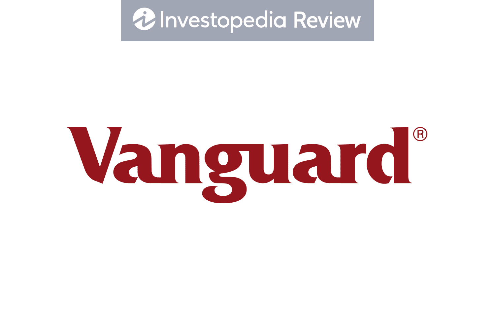

## Table of Contents

## What is Vanguard Personal Advisor Services?

Vanguard Personal Advisor Services is a service that helps people manage their money. It combines the use of technology with advice from real financial advisors. People can use this service to get help with their investments, plan for retirement, and reach their financial goals. The service is available online and through a mobile app, making it easy for people to access whenever they need it.

When someone signs up for Vanguard Personal Advisor Services, they get a personalized plan based on their financial situation and goals. A team of advisors works with them to make sure their investments are doing well and to adjust the plan if needed. The service also keeps an eye on the market and makes changes to the investment strategy to help protect and grow the money. This way, people can feel confident that their finances are being taken care of by experts.

## How does Vanguard Personal Advisor Services work?

Vanguard Personal Advisor Services helps people manage their money by mixing technology with advice from real financial advisors. When someone starts using the service, they answer questions about their money and what they want to achieve. The service then creates a special plan just for them. This plan tells them where to put their money to reach their goals, like saving for retirement or buying a house. The plan is made to fit their needs and can be changed if their situation changes.

After the plan is made, a team of advisors keeps an eye on it. They watch how the investments are doing and make changes if needed to help the money grow. The service also looks at what's happening in the market and adjusts the plan to keep the money safe. People can check their plan and talk to their advisors anytime using a computer or a phone app. This way, they always know what's happening with their money and can feel sure that experts are helping them.

## What are the fees associated with Vanguard Personal Advisor Services?

The fees for Vanguard Personal Advisor Services are simple and based on how much money you have invested with them. If you have less than $5 million, you pay 0.30% of your total account balance each year. This means for every $10,000 you have invested, you pay $30 a year. If you have $5 million or more, the fee goes down to 0.05% of your total account balance. So, for every $10,000 at this level, you only pay $5 a year.

These fees are taken out of your account automatically, so you don't have to do anything. The fee covers all the advice and help you get from the service, including your personal plan and any changes made by the advisors. It's a good idea to think about these fees when deciding if Vanguard Personal Advisor Services is right for you.

## What types of investment accounts can be managed by Vanguard Personal Advisor Services?

Vanguard Personal Advisor Services can manage different types of investment accounts to help you reach your financial goals. You can use it for your personal retirement accounts like a Traditional IRA or a Roth IRA. These accounts help you save for retirement with special tax benefits. If you have money from a job in a 401(k) or 403(b) plan, you can also move it into an IRA and let Vanguard Personal Advisor Services manage it.

The service also works with taxable accounts, which are regular investment accounts where you can put money in and take it out whenever you want. These are good for saving for things like a house or a big trip. If you have a joint account with someone else, like a spouse, Vanguard Personal Advisor Services can manage that too. This way, you can get help with all your different accounts in one place.

## What is the minimum investment required to use Vanguard Personal Advisor Services?

To start using Vanguard Personal Advisor Services, you need at least $50,000 to invest. This amount is the minimum they need to create a personal plan for you and help manage your money.

Once you have at least $50,000, you can open different types of accounts with them, like retirement accounts or regular investment accounts. The service will then work with you to make a plan that fits your goals and keeps an eye on your investments to help them grow.

## How does Vanguard Personal Advisor Services compare to other robo-advisors?

Vanguard Personal Advisor Services stands out from other robo-advisors because it combines technology with real human advisors. While many robo-advisors rely solely on algorithms to manage your money, Vanguard gives you access to a team of financial advisors who can provide personalized advice. This means you get the convenience of managing your investments online or through a mobile app, but with the added benefit of talking to a real person whenever you need to. The service also creates a custom plan based on your financial goals and situation, and it keeps an eye on the market to make adjustments as needed.

Compared to other robo-advisors, Vanguard Personal Advisor Services may have a higher minimum investment requirement of $50,000, but it offers a lower fee structure for larger accounts. For example, if you have less than $5 million, you pay 0.30% of your total account balance each year, which is competitive with other services. However, if you have $5 million or more, the fee drops to just 0.05%, making it very cost-effective for high-net-worth individuals. This mix of human advice, technology, and competitive fees makes Vanguard Personal Advisor Services a strong choice for people looking for a more hands-on approach to managing their investments.

## What are the benefits of using Vanguard Personal Advisor Services?

Vanguard Personal Advisor Services offers many benefits for people who want help with their money. One big benefit is that it gives you a personal plan made just for you. When you sign up, you answer questions about your money and what you want to achieve. Then, the service makes a plan that fits your needs. This plan tells you where to put your money to reach your goals, like saving for retirement or buying a house. Plus, a team of real advisors looks at your plan and makes changes if needed to help your money grow.

Another benefit is that Vanguard Personal Advisor Services mixes technology with human advice. You can use their website or mobile app to see your plan and talk to your advisors anytime. This makes it easy to keep track of your money and feel confident that experts are helping you. The service also watches the market and adjusts your investments to keep your money safe and growing. While there is a fee, it's low compared to other services, especially if you have a lot of money invested. So, you get the best of both worlds: the convenience of technology and the personal touch of human advisors.

## Can you customize your investment strategy with Vanguard Personal Advisor Services?

Yes, you can customize your investment strategy with Vanguard Personal Advisor Services. When you start using the service, you answer questions about your money and what you want to achieve. Based on your answers, the service creates a plan that fits your needs. If you have special goals or want to focus on certain types of investments, you can tell your advisors, and they will work with you to adjust the plan. This way, your investments match what you want.

The advisors at Vanguard keep an eye on your investments and the market. If something changes, like your goals or the market, they can make adjustments to your plan. This helps your money stay on track and grow. You can talk to your advisors anytime using their website or mobile app, so it's easy to make changes if you need to. This makes Vanguard Personal Advisor Services a good choice if you want a plan that's made just for you and can change as your life does.

## How does Vanguard Personal Advisor Services handle tax strategies?

Vanguard Personal Advisor Services helps you with your taxes by using smart strategies to save you money. They look at your whole financial picture and use things like tax-loss harvesting to help lower your taxes. This means they sell investments that have lost value to offset the taxes you owe on gains from other investments. They also keep an eye on how your investments are doing and make changes to keep your taxes as low as possible.

The service also thinks about where to put your money to save on taxes. For example, they might suggest putting certain investments in tax-advantaged accounts like an IRA to help you keep more of your money. They work with you to make sure your plan fits your tax situation and goals. This way, you can feel confident that Vanguard is helping you save on taxes while growing your money.

## What kind of customer support does Vanguard Personal Advisor Services offer?

Vanguard Personal Advisor Services offers great customer support. You can talk to a real person anytime you need help with your money. They have a team of financial advisors who are there to answer your questions and make changes to your plan if needed. You can reach them by phone, email, or even through the Vanguard website or mobile app. This makes it easy to get the help you need whenever you want it.

The advisors at Vanguard are friendly and know a lot about money. They can help you with your investments, retirement planning, and reaching your financial goals. If you're not sure about something or want to change your plan, they'll work with you to make sure everything is just right. This personal touch, along with the easy-to-use technology, makes Vanguard Personal Advisor Services a great choice for people who want good customer support.

## How has Vanguard Personal Advisor Services performed historically?

Vanguard Personal Advisor Services has done well over time. It uses a mix of technology and real advisors to help people with their money. This has helped many people reach their financial goals. The service looks at the market and makes smart choices to help your money grow. Because Vanguard is a big and trusted company, many people feel safe using their service.

The performance of Vanguard Personal Advisor Services can be seen in how well their investment plans have done. They focus on keeping fees low and using a smart mix of investments. This has led to good results for many people. While past performance doesn't guarantee future results, many people have been happy with how their money has grown with Vanguard's help.

## What advanced features does Vanguard Personal Advisor Services offer for expert investors?

Vanguard Personal Advisor Services offers some cool tools for people who know a lot about investing. If you're an expert investor, you can dive into detailed reports about how your investments are doing. These reports show you things like how much risk you're taking and how your money is spread out across different investments. You can also use advanced tools to see how different choices might affect your money in the future. This helps you make smart decisions based on what you know and what you want to achieve.

Another great thing for expert investors is that you can talk to Vanguard's advisors about more complicated investment ideas. If you have special goals or want to try different strategies, the advisors can help you plan and adjust your investments. They can also give you advice on things like tax strategies and how to make the most of your money. With Vanguard Personal Advisor Services, you get the help of experts along with the power to control your investments in a way that fits your skills and goals.

## What investment services are offered by Vanguard?

Vanguard Personal Advisor Services (VPAS) provides a comprehensive suite of investment services tailored to meet the diverse needs of individual investors. These services leverage both strategic portfolio management and personalized investment strategies, underpinned by Vanguard’s commitment to low costs and diversified portfolios.

### Types of Investment Portfolios and Strategic Goals

Vanguard offers a range of investment portfolios designed with specific strategic goals in mind, such as risk tolerance, time horizon, and investment objectives. The primary types include:

- **Conservative Portfolios**: Aimed at minimizing risk, these portfolios generally have a higher allocation towards bonds and fixed-income securities. They are suitable for investors with a low risk tolerance or those nearing retirement.

- **Balanced Portfolios**: Combining stocks and bonds, these portfolios seek to provide moderate growth while mitigating some risks. They are ideal for investors with a medium risk tolerance looking for a balanced approach.

- **Aggressive Portfolios**: Focused on maximizing growth, these portfolios are predominantly weighted towards equities. They are suitable for investors with a higher risk tolerance, often with longer time horizons.

Each portfolio type is crafted to align with Vanguard’s strategic goals, balancing risk and return in accordance with the client’s financial objectives.

### Ensuring Portfolio Diversification

Vanguard employs strategic asset allocation to ensure robust portfolio diversification. This includes a mix of domestic and international equities, fixed-income securities, and, occasionally, alternative investments. The aim is to reduce unsystematic risk by spreading investments across various asset classes and market sectors. Vanguard's strategies often implement the Modern Portfolio Theory (MPT), which posits that diversification can enhance returns while minimizing risk.

Mathematically, this is represented as:

$$
\sigma^2_p = \sum w_i^2 \cdot \sigma_i^2 + \sum \sum w_i \cdot w_j \cdot \sigma_i \cdot \sigma_j \cdot \rho_{ij}
$$

where $\sigma^2_p$ is the portfolio variance, $w$ is the asset weight, $\sigma$ is the asset standard deviation, and $\rho_{ij}$ is the correlation between assets $i$ and $j$.

### Personalizing Investment Strategies

Vanguard's personalized investment strategies involve tailored financial planning based on comprehensive client profiling. This includes assessing the client's financial situation, risk tolerance, and investment objectives. Advisors employ advanced tools to create a personalized financial roadmap that aligns with the client's long-term goals. The process involves continuous monitoring and rebalancing of portfolios to adapt to market changes and life events, ensuring investment strategies remain aligned with personal objectives.

### Impact of Low-Cost Structure on Investment Returns

Vanguard's renowned low-cost structure significantly impacts investment returns by minimizing fees and expenses. The company adheres to a mutual ownership structure, passing cost savings directly to investors in the form of lower expense ratios. This cost efficiency is crucial as it enhances net returns for investors. Over time, the reduction of fees can compound to a substantial increase in overall investment returns.

Additionally, Vanguard’s index fund offerings, central to many VPAS portfolios, exhibit some of the lowest expense ratios in the industry, contributing to their competitive performance. A simple Python simulation can demonstrate the impact of expense ratios on investment growth:

```python
import numpy as np

# Variables
initial_investment = 10000
annual_return = 0.07
vanguard_expense_ratio = 0.0012
competitor_expense_ratio = 0.01
years = 30

# Calculate final investment value with Vanguard
vanguard_final_value = initial_investment * (1 + annual_return - vanguard_expense_ratio) ** years

# Calculate final investment value with a competitor
competitor_final_value = initial_investment * (1 + annual_return - competitor_expense_ratio) ** years

# Output results
print(f"Final investment value with Vanguard: ${vanguard_final_value:.2f}")
print(f"Final investment value with competitor: ${competitor_final_value:.2f}")
```

Vanguard’s model demonstrates that investing under a low-cost structure not only enhances investment outcomes but also fortifies the client's financial growth over the long term.

## References & Further Reading

[1]: Bergstra, J., Bardenet, R., Bengio, Y., & Kégl, B. (2011). ["Algorithms for Hyper-Parameter Optimization."](https://papers.nips.cc/paper/4443-algorithms-for-hyper-parameter-optimization) Advances in Neural Information Processing Systems 24.

[2]: ["Advances in Financial Machine Learning"](https://www.amazon.com/Advances-Financial-Machine-Learning-Marcos/dp/1119482089) by Marcos Lopez de Prado

[3]: ["Evidence-Based Technical Analysis: Applying the Scientific Method and Statistical Inference to Trading Signals"](https://www.amazon.com/Evidence-Based-Technical-Analysis-Scientific-Statistical/dp/0470008741) by David Aronson

[4]: ["Machine Learning for Algorithmic Trading"](https://github.com/stefan-jansen/machine-learning-for-trading) by Stefan Jansen

[5]: ["Quantitative Trading: How to Build Your Own Algorithmic Trading Business"](https://www.amazon.com/Quantitative-Trading-Build-Algorithmic-Business/dp/1119800064) by Ernest P. Chan