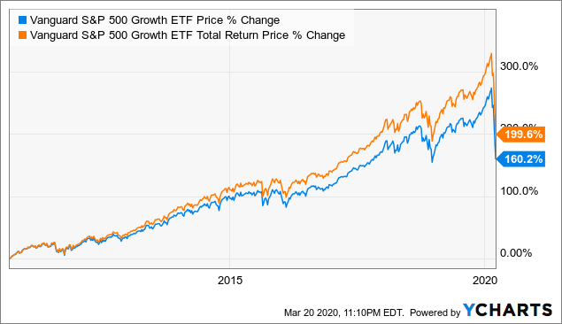

## Table of Contents

## What is the Vanguard S&P 500 ETF?

The Vanguard S&P 500 ETF is a type of investment fund that tracks the performance of the S&P 500 index. The S&P 500 is a collection of 500 large companies in the United States, and it is often used as a benchmark to see how well the stock market is doing. When you invest in the Vanguard S&P 500 ETF, you are essentially buying a small piece of each of these 500 companies. This makes it an easy way to invest in the overall U.S. stock market without having to pick individual stocks.

One of the main benefits of the Vanguard S&P 500 ETF is that it has very low fees. This means more of your money goes towards your investment instead of paying for the management of the fund. It is also a popular choice for people who want a simple and diversified investment because it spreads the risk across many different companies. Over time, the S&P 500 has shown good growth, making the Vanguard S&P 500 ETF a common choice for long-term investors looking to build wealth steadily.

## How does the Vanguard S&P 500 ETF work?

The Vanguard S&P 500 ETF works by following the performance of the S&P 500 index. This index includes 500 big companies in the U.S., and the ETF tries to match how well these companies do as a group. When you buy shares of the Vanguard S&P 500 ETF, you're getting a little bit of each of these 500 companies all at once. This makes it easy to invest in the whole U.S. stock market without having to choose which companies to buy.

The [ETF](/wiki/etf-trading-strategies) is managed to keep costs low, which means you pay less in fees. This is good because it means more of your money stays invested and can grow over time. The Vanguard S&P 500 ETF is popular because it's simple and spreads out your risk. Instead of betting on one company, you're betting on the overall market, which tends to go up over the long run. This makes it a good choice for people who want to invest for the future without a lot of fuss.

## What are the benefits of investing in the Vanguard S&P 500 ETF?

One big benefit of investing in the Vanguard S&P 500 ETF is that it's very simple. Instead of [picking](/wiki/asset-class-picking) individual stocks, you get to own a small piece of 500 big companies all at once. This means you don't have to spend a lot of time researching which stocks to buy. It's a good choice for people who want to invest in the stock market but don't want to be stock market experts.

Another benefit is that the Vanguard S&P 500 ETF has low fees. This means more of your money stays in your investment instead of going to pay for managing the fund. Over time, these low fees can make a big difference because they let your money grow more. Also, because the ETF follows the S&P 500, it's a good way to spread out your risk. If one company in the index does badly, it won't hurt your investment as much because you own a piece of many different companies.

## What are the risks associated with the Vanguard S&P 500 ETF?

Investing in the Vanguard S&P 500 ETF, like any investment, comes with some risks. One risk is that the stock market can go down. Even though the S&P 500 has generally gone up over the long run, it can still have bad years or even bad periods that last a few years. If you need to take your money out during a time when the market is down, you could lose money.

Another risk is that the S&P 500 is made up of big companies, and if something bad happens to a lot of these big companies at the same time, it could hurt the whole index. For example, if there's a big economic problem or a new law that affects many of these companies, it could bring down the value of the ETF. Also, while the fees are low, they're not zero, so over a very long time, those fees can add up and eat into your returns.

## How does the Vanguard S&P 500 ETF compare to other S&P 500 ETFs?

The Vanguard S&P 500 ETF is one of many ETFs that track the S&P 500 index, but it stands out because of its low fees. Compared to other S&P 500 ETFs like the SPDR S&P 500 ETF Trust (SPY) and the iShares Core S&P 500 ETF (IVV), Vanguard's expense ratio is usually the lowest. This means more of your money stays invested and can grow over time. For example, if you invest $10,000, the difference in fees between these ETFs can add up to a lot of money over 20 or 30 years.

Another way the Vanguard S&P 500 ETF compares to others is in terms of size and trading [volume](/wiki/volume-trading-strategy). The SPY, for instance, is much larger and trades more often, which can be good if you want to buy or sell shares quickly. However, the Vanguard S&P 500 ETF is still very popular and has a good amount of trading volume, so it's easy to buy and sell. Both Vanguard and iShares offer similar exposure to the S&P 500, so the main thing to think about when choosing between them is the fees and how easy it is to trade the ETF you pick.

## What is the expense ratio of the Vanguard S&P 500 ETF?

The expense ratio of the Vanguard S&P 500 ETF is very low. It is currently 0.03%. This means for every $10,000 you have invested, you only pay $3 a year in fees. This is one of the reasons why the Vanguard S&P 500 ETF is so popular. Low fees mean more of your money stays in your investment and can grow over time.

When you compare the Vanguard S&P 500 ETF to other S&P 500 ETFs, its low expense ratio really stands out. For example, the SPDR S&P 500 ETF Trust (SPY) has an expense ratio of 0.09%, and the iShares Core S&P 500 ETF (IVV) has an expense ratio of 0.03%. Over many years, paying less in fees can make a big difference in how much your investment grows. So, if you're looking for a simple way to invest in the S&P 500 with low costs, the Vanguard S&P 500 ETF is a great choice.

## How has the Vanguard S&P 500 ETF performed historically?

The Vanguard S&P 500 ETF has done really well over the long run. Since it started in 2010, it has followed the S&P 500 index closely. The S&P 500 has gone up a lot over the years, and so has the Vanguard S&P 500 ETF. For example, if you put $10,000 into the ETF in 2010, it would be worth a lot more today. But remember, the stock market can go up and down, so there were times when the ETF went down too. Overall, though, it has been a good investment for people who held onto it for a long time.

There have been some ups and downs along the way. In 2020, when the world was dealing with the COVID-19 pandemic, the ETF dropped a lot at first but then came back strong. The same thing happened during other big events, like the financial crisis in 2008, even though the ETF started after that. The important thing is that over many years, the Vanguard S&P 500 ETF has shown that it can grow a lot. This makes it a good choice for people who want to invest for the future and can handle the ups and downs of the stock market.

## What are the tax implications of investing in the Vanguard S&P 500 ETF?

When you invest in the Vanguard S&P 500 ETF, you need to think about taxes. If you hold the ETF in a regular investment account, you'll have to pay taxes on any money you make from it. This includes dividends, which are payments the ETF makes from the profits of the companies it owns, and capital gains, which is the money you make when you sell the ETF for more than you paid for it. The tax rate on dividends and long-term capital gains can be lower than your regular income tax rate, but it still means you'll owe some money to the government.

If you hold the Vanguard S&P 500 ETF in a tax-advantaged account like an IRA or a 401(k), the tax rules are different. In these accounts, you don't have to pay taxes on dividends or capital gains right away. Instead, you might pay taxes when you take money out of the account, depending on the type of account. This can be a good way to save on taxes and let your investment grow more over time. So, where you hold your Vanguard S&P 500 ETF can make a big difference in how much you pay in taxes.

## How can one invest in the Vanguard S&P 500 ETF?

To invest in the Vanguard S&P 500 ETF, you first need to open a brokerage account. A brokerage account is like a special bank account where you can buy and sell investments. You can open one online with a company like Vanguard, Fidelity, or Charles Schwab. Once your account is set up, you can search for the Vanguard S&P 500 ETF, which is usually listed under the ticker symbol "VOO." Then, you can decide how much money you want to invest and place an order to buy the ETF. It's pretty simple and can be done from your computer or phone.

After you've bought the Vanguard S&P 500 ETF, you can choose to keep your money in it for a long time or sell it whenever you want. If you're investing for the future, many people find it helpful to set up automatic investments. This means you can have money taken out of your bank account every month and put into the ETF without having to remember to do it yourself. This way, you can slowly build up your investment over time. Just remember, the stock market can go up and down, so it's a good idea to think about your investment as something you'll hold onto for many years.

## What is the dividend yield of the Vanguard S&P 500 ETF?

The dividend yield of the Vanguard S&P 500 ETF changes over time because it depends on how much money the companies in the S&P 500 are making and paying out to investors. As of the latest data, the dividend yield is around 1.5%. This means if you invest $10,000 in the ETF, you could get about $150 in dividends each year. But remember, this number can go up or down based on how well the companies in the S&P 500 are doing.

Dividends are payments that the ETF makes from the profits of the companies it owns. The Vanguard S&P 500 ETF pays out these dividends to its investors every three months. If you're thinking about investing for income, knowing the dividend yield can help you figure out how much money you might get back from your investment each year. Just keep in mind that while dividends can give you some extra money, the main way the ETF grows is by the value of the stocks in the S&P 500 going up over time.

## How does the Vanguard S&P 500 ETF track the S&P 500 index?

The Vanguard S&P 500 ETF tracks the S&P 500 index by holding a basket of stocks that match the companies in the index. This means the ETF owns a little bit of each of the 500 big companies that make up the S&P 500. The goal is to make sure the ETF's performance is as close as possible to the performance of the S&P 500 itself. To do this, the ETF's managers buy and sell stocks to keep the ETF's holdings in line with any changes in the S&P 500, like when a company is added or removed from the index.

This tracking method is called "full replication," which means the ETF tries to own all the same stocks as the S&P 500 in the same amounts. By doing this, the Vanguard S&P 500 ETF can closely follow the ups and downs of the S&P 500. It's a simple way to invest in the overall U.S. stock market without having to pick individual stocks yourself. Over time, this approach has helped the ETF perform very similarly to the S&P 500, making it a popular choice for investors looking for a low-cost way to invest in the market.

## What are the considerations for long-term investment in the Vanguard S&P 500 ETF?

When thinking about investing in the Vanguard S&P 500 ETF for the long term, it's important to remember that the stock market can go up and down. Even though the S&P 500 has done well over many years, there will be times when it goes down. If you're planning to keep your money in the ETF for a long time, like 10 or 20 years, you need to be ready for these ups and downs. It's a good idea to only invest money that you won't need right away, so you can wait out any bad times and let your investment grow over the years.

Another thing to think about is how the Vanguard S&P 500 ETF fits into your overall plan for your money. Because it follows the S&P 500, it's a good way to spread out your risk by owning a little bit of many big companies. But it's still just one part of the stock market. You might want to think about other investments too, like bonds or international stocks, to make sure your money is spread out even more. Also, the low fees of the Vanguard S&P 500 ETF can help your money grow more over time, so it's a good choice if you're looking for a simple and low-cost way to invest in the U.S. stock market for the long run.

## What are the risk considerations and dividend profiles?

While the Vanguard S&P 500 ETF (VOO) provides investors with market-average returns that reflect the performance of the S&P 500 index, it remains subject to the inherent risks associated with the broader market. Economic recessions, inflation fluctuations, and geopolitical tensions can significantly impact the performance of VOO. For instance, during economic downturns, the value of the stocks within the ETF may decline, thus affecting the overall returns for investors. Similarly, geopolitical events such as trade wars or conflicts can lead to market [volatility](/wiki/volatility-trading-strategies), influencing investor sentiment and, consequently, the trading patterns and valuations of the underlying assets.

VOO's resilience in unpredictable market conditions highlights the importance of understanding risk exposure. For instance, the systematic risks, which cannot be diversified away, are captured by the beta coefficient. The beta of VOO, typically close to 1, indicates that it tends to move in tandem with the market. Investors must, therefore, consider their risk tolerance levels and investment timeframes when allocating capital to VOO, ensuring their strategies align with their overall financial goals.

On the dividend front, the Vanguard S&P 500 ETF provides quarterly dividend payments. These dividends are generally lower than those offered by funds focused exclusively on income generation, yet they play a crucial role in enhancing total returns over the long term. The formula for the dividend yield is:

$$
\text{Dividend Yield} = \left( \frac{\text{Annual Dividends per Share}}{\text{Price per Share}} \right) \times 100
$$

Investors should analyze how these dividends fit into their overall income strategy, balancing the growth potential of reinvesting dividends with the immediate benefit of cash payouts. Understanding the dividend profile assists in ensuring that expected income aligns with financial needs, whether reinvested to capitalize on compounding growth or withdrawn as a source of income. Comprehensive analyses of historical dividend payments and yield trends will enable investors to make sound decisions regarding the incorporation of VOO into diversified portfolios.

## References & Further Reading

[1]: Bergstra, J., Bardenet, R., Bengio, Y., & Kégl, B. (2011). ["Algorithms for Hyper-Parameter Optimization."](https://papers.nips.cc/paper/4443-algorithms-for-hyper-parameter-optimization) Advances in Neural Information Processing Systems 24.

[2]: ["Advances in Financial Machine Learning"](https://www.amazon.com/Advances-Financial-Machine-Learning-Marcos/dp/1119482089) by Marcos Lopez de Prado

[3]: ["Evidence-Based Technical Analysis: Applying the Scientific Method and Statistical Inference to Trading Signals"](https://www.amazon.com/Evidence-Based-Technical-Analysis-Scientific-Statistical/dp/0470008741) by David Aronson

[4]: ["Machine Learning for Algorithmic Trading"](https://github.com/stefan-jansen/machine-learning-for-trading) by Stefan Jansen

[5]: ["Quantitative Trading: How to Build Your Own Algorithmic Trading Business"](https://www.amazon.com/Quantitative-Trading-Build-Algorithmic-Business/dp/1119800064) by Ernest P. Chan