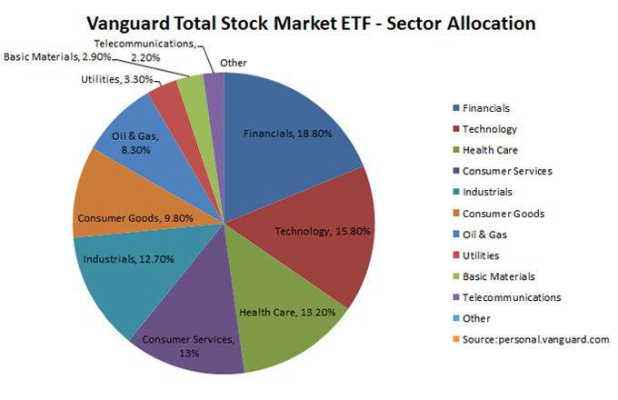

The stock market is a cornerstone of the global financial system, providing a platform for companies to raise capital and for investors to build wealth. By enabling the buying and selling of securities, such as stocks and bonds, the stock market facilitates the efficient allocation of resources, helping economies grow and evolve. For individual investors, the stock market represents a significant avenue for wealth-building, offering opportunities to benefit from company growth and to achieve financial goals through strategically diversified portfolios.

Exchange-Traded Funds (ETFs) have become a popular investment vehicle within stock market portfolios. An ETF is a type of investment fund that holds a collection of assets such as stocks, bonds, commodities, or a mix of investment types. ETFs are traded on major stock exchanges and offer investors a way to gain exposure to a diversified pool of assets with the flexibility of trading throughout the day like a stock. They are often praised for their low costs, tax efficiency, and ease of access compared to mutual funds.



Vanguard ETFs are among the most renowned in the industry, widely regarded for their cost-effectiveness and the company's commitment to delivering value to investors. Founded by John C. Bogle, Vanguard set out to democratize investing by offering low-cost, diversified investment alternatives. Vanguard ETFs span a wide spectrum, including sector-specific, total market, bond, and international funds, accommodating a variety of investment strategies and goals.

Parallel to the innovation of ETFs, algorithmic trading has increasingly influenced the stock market, signifying a shift toward automation and data-driven decision-making. Algorithmic trading uses computer algorithms to execute trades, often based on predefined criteria such as timing, price, or volume. This trading method offers advantages like speed, precision, and the ability to manage complex trades with minimal human intervention, thus becoming an integral tool for institutional and individual investors alike.

The purpose of this article is to explore the intersection of Vanguard ETFs and algorithmic trading. By examining how algorithms can optimize investment strategies involving Vanguard ETFs, this discussion aims to shed light on the benefits and challenges of algorithmic trading in this context, providing insights for investors seeking to leverage these tools effectively. As the financial landscape evolves with technological advancements, understanding these dynamics becomes crucial for informed decision-making in investment portfolios.

## Table of Contents

## Understanding Vanguard ETFs

Exchange-Traded Funds (ETFs) are investment funds traded on stock exchanges, resembling stocks. They hold assets such as stocks, commodities, or bonds and generally operate with an arbitrage mechanism designed to keep trading close to its net asset value, though deviations can occasionally occur. One of the primary benefits of ETFs over mutual funds is their cost efficiency. While traditional mutual funds often require higher management fees due to active management, ETFs typically have lower expense ratios as they are usually passively managed, tracking a specific index.

Vanguard, founded by John C. Bogle in 1975, has established itself as a leading global investment management company. It is renowned for revolutionizing the investment space with a focus on low-cost, passive management strategies. Vanguard has a significant presence in the [ETF](/wiki/etf-trading-strategies) market, offering some of the most popular ETFs by assets under management.

The diversity of Vanguard ETFs caters to a broad spectrum of investment goals. Vanguard provides sector-specific ETFs, which allow investors to concentrate on industries such as technology or healthcare. Total market ETFs are also available, giving exposure to almost all publicly traded companies in the U.S. market. International ETFs broaden this exposure to global markets, offering securities from various regions outside the U.S. Bond ETFs serve those interested in fixed income, providing options from government to corporate bonds.

Investing in Vanguard ETFs comes with several advantages. Their cost-effectiveness remains a critical [factor](/wiki/factor-investing), thanks to low expense ratios stemming from Vanguard’s shareholder-owned structure where profits are returned to investors as lower costs. The diversity offered by Vanguard ensures that investors can achieve portfolio diversification across different sectors and geographies, minimizing unsystematic risks. Vanguard's reputation for reliability and trustworthiness further attracts investors, providing assurance in terms of stability and ethical management.

In summary, Vanguard ETFs provide an efficient, diverse, and cost-effective means of investment, making them an appealing choice for both novice and experienced investors seeking to build a robust portfolio.

 to Algorithmic Trading

Algorithmic trading, also known as algo trading, refers to the use of computer algorithms to automate trading strategies in the financial markets. These algorithms allow for the execution of orders at speeds and frequencies uncontrollable by human traders. The concept of [algorithmic trading](/wiki/algorithmic-trading) emerged in the 1970s with the rise of electronic markets, but it gained significant traction in the late 20th and early 21st centuries due to advancements in technology and data analysis.

Algorithms used in trading typically rely on predefined rules and data patterns to make decisions. Different types of algorithms serve various purposes in the trading landscape:

1. **Trend-Following Algorithms**: These identify and trade in the direction of ongoing market trends. By analyzing historical price data and identifying patterns, such algorithms aim to profit from market momentum. Common indicators include moving averages and breakout signals.

2. **Mean Reversion Algorithms**: Based on the statistical theory that asset prices and returns eventually move back toward their long-term mean, mean reversion strategies buy at low prices with the expectation that they will revert to the mean and vice-versa. These algorithms are often used in pairs trading.

3. **Market Making Algorithms**: These facilitate liquidity by continuously quoting buy and sell prices. Market makers earn the spread between the buying and selling price, and their presence ensures tighter spreads and improved market efficiency.

The advantages of algorithmic trading are notable. Speed is a critical factor, as algorithms can execute orders within milliseconds, taking advantage of fleeting market opportunities. Accuracy is another significant benefit; algorithms follow precise, pre-determined criteria, eliminating human errors in order execution. Furthermore, algorithmic trading removes emotional decision-making, which can often lead to suboptimal trading choices.

However, algorithmic trading is not without challenges and risks. One prominent risk is overfitting, where an algorithm is excessively tailored to historical data, reducing its efficacy in future, unseen data. There is also a dependency on technology; any system glitches or connectivity issues can severely impact trading performance. Furthermore, algorithms may not effectively respond to unexpected market conditions or black swan events, leading to substantial financial losses.

As such, while algorithmic trading provides significant advantages, it requires careful consideration of strategy design, risk management, and technological infrastructure to optimize performance and mitigate potential downsides.

## The Role of Algorithms in Trading Vanguard ETFs

Algorithmic trading, the use of computer algorithms to automate trading decisions, is significantly transforming the way ETFs, particularly Vanguard ETFs, are traded. This approach is characterized by the rapid execution of trades based on pre-defined criteria, allowing for efficient management of investment portfolios and precise implementation of trading strategies.

### Application of Algorithmic Trading to ETFs

Algorithmic trading applies to ETFs by leveraging their [liquidity](/wiki/liquidity-risk-premium) and transparency. For Vanguard ETFs, which are known for their diversity and cost-effectiveness, algorithms help in buying or selling large volumes without exerting a significant impact on the market prices. The primary goal here is not only to achieve better price execution but also to reduce the potential market impact.

### Strategies for Trading Vanguard ETFs

Several strategies are employed by algorithms to trade Vanguard ETFs effectively:

1. **Market Making:** Algorithms perform the role of a market maker by placing both buy and sell orders at quoted prices. They profit from the bid-ask spread, simultaneously increasing liquidity in the ETF market. For Vanguard ETFs, this ensures tighter spreads and reduces costs for all investors.

2. **Arbitrage:** This strategy exploits price discrepancies between the ETF and its underlying assets. Algorithms continuously monitor these prices and execute trades to capitalize on any differences, thereby naturally aligning the market prices.

3. **Statistical Arbitrage and Mean Reversion:** These strategies use statistical methods and historical price data to predict future price movements. When Vanguard ETFs deviate from historical performance parameters, algorithms execute trades anticipating a return to the mean.

4. **Momentum and Trend Following:** Algorithms detect trends and momentum in the prices of Vanguard ETFs and execute trades based on identified patterns, typically holding positions until the trend ceases.

### Optimization of Exposure, Liquidity, and Costs

Algorithms play a crucial role in optimizing exposure, liquidity, and minimizing costs in the trading of Vanguard ETFs. By executing trades at optimal times and prices, algorithms ensure maximum exposure to desired market segments while minimizing the trading costs. They dynamically adjust positions in real-time, reacting to market fluctuations and ensuring that the ETF trading is aligned with the overall market movements.

#### Impact on Market Volatility and Liquidity

Algorithmic trading impacts market [volatility](/wiki/volatility-trading-strategies) and liquidity. While it generally improves market liquidity by enabling faster and efficient trading, it can also contribute to increased volatility. High-frequency trading, a subset of algorithmic trading, can lead to significant price swings due to the rapid execution of numerous trades. In the context of Vanguard ETFs, the impact is mitigated by the sheer diversity and size of these funds, which act as a buffer against excessive volatility.

### Conclusion

Algorithmic trading is indispensable in today's financial markets, particularly for instruments like Vanguard ETFs, due to its ability to provide liquidity, optimize trading strategies, and minimize transaction costs. As technology progresses and algorithmic strategies become more advanced, the efficient trading of ETFs will likely only improve, offering investors better tools to meet their investment goals.

## Benefits and Risks of Algo Trading in Vanguard ETFs

Algorithmic trading, commonly known for its speed and accuracy, offers several advantages when utilized with Vanguard ETFs. One of the core benefits is efficiency. Algorithms can process vast amounts of data and execute trades within milliseconds, enabling investors to capitalize on short-lived market opportunities that might be invisible to manual traders. This precision is achieved through pre-set rules and parameters that diminish human error, often leading to more consistent and reliable trading outcomes.

Another significant advantage is the enhanced identification of opportunities. Algorithms can continuously scan and analyze historical and real-time data, spotting patterns and trends that humans might overlook. This capability is particularly beneficial in the volatile environment of ETF trading, including Vanguard's diversified offerings, where quick decision-making can significantly affect returns.

However, algorithmic trading is not without risks. One potential risk is overfitting, which occurs when an algorithm is too closely tailored to historical data and performs poorly in real-world scenarios. Overfitting can cause substantial financial losses if the market conditions deviate from the trends observed during the model's training phase.

Dependency on technology is another risk factor. Algorithms rely on complex infrastructure and real-time connectivity; any technological failure, whether from server malfunctions or connectivity issues, can result in missed trades or incorrect executions. Furthermore, unexpected market behaviors, such as sudden price movements or flash crashes, also pose significant challenges. In highly automated environments, these incidents can be exacerbated as multiple algorithms react simultaneously, increasing volatility.

To mitigate these risks, investors can adopt several strategies. Regular [backtesting](/wiki/backtesting) and simulation across different market conditions can help in identifying a model's weaknesses and adaptability. Additionally, implementing safeguards such as stop-loss orders can prevent excessive losses during unforeseen market shifts. Ensuring redundancy and robustness in technological setups can minimize the impact of potential failures. Finally, continuous monitoring and manual oversight remain crucial to adapt to the ever-evolving market dynamics and ensure the algorithm's performance aligns with the investor's financial objectives.

## Examples and Case Studies

Algorithmic trading with Vanguard ETFs has witnessed several success stories, reflecting the growing efficiency and adaptability of algorithm-driven strategies in diverse market conditions. One notable example involves a quantitative [hedge fund](/wiki/hedge-fund-trading-strategies) that integrated algorithmic trading systems focused on liquidity dynamics and cost minimization. By employing latency [arbitrage](/wiki/arbitrage) algorithms, the fund was able to achieve substantial returns during periods of heightened market volatility. These algorithms capitalized on short-term price discrepancies of Vanguard ETFs between different trading venues, executing high-frequency trades that leveraged the marginal price differentials.

A successful strategy employed by individual investors revolves around [momentum](/wiki/momentum)-based algorithms, particularly during bullish market trends. By analyzing historical price data and [volume](/wiki/volume-trading-strategy) metrics of sector-specific Vanguard ETFs, algorithms were programmed to signal buy alerts when positive momentum thresholds were met, enhancing the opportunity for gains. This approach effectively utilized technical analysis indicators such as moving averages and the Relative Strength Index (RSI) to ascertain optimal entry and [exit](/wiki/exit-strategy) points.

Lessons from mishaps in algorithmic trading with Vanguard ETFs also provide valuable insights. One prominent failure involved an over-reliance on historical data, leading to significant losses during market downturns. An algorithm programmed to execute trades based on historical volatility patterns failed to account for black swan events, resulting in substantial position drawdowns. This highlights the critical need for integrating robust risk management protocols and stress testing frameworks to account for unforeseen market conditions.

Another lesson emerged from the failure to incorporate comprehensive backtesting techniques. A strategy designed to trade international Vanguard ETFs ignored the impact of currency fluctuations, leading to adverse outcomes when exchange rates shifted unfavorably. This underscores the importance of considering macroeconomic factors and correlation analysis in the development of algorithmic trading models.

Despite these challenges, algorithmic trading in Vanguard ETFs continues to evolve. The integration of [machine learning](/wiki/machine-learning) techniques, enabling adaptive algorithms that learn from market environment changes, is shaping the future of these strategies. In conclusion, while algorithmic trading presents both opportunities and risks, a balanced approach emphasizing adaptability and data-driven insights can enhance the potential for success in trading Vanguard ETFs.

## Future Trends in ETF Algorithmic Trading

The integration of algorithmic trading in the ETF market is poised for significant advancements driven by emerging technologies and evolving market conditions. Here, we explore the key trends anticipated in the future landscape of algorithmic trading of ETFs, specifically focusing on the role of [artificial intelligence](/wiki/ai-artificial-intelligence), potential regulatory shifts, and the trajectory for Vanguard ETFs within this framework.

### Artificial Intelligence and Machine Learning

Artificial intelligence (AI) and machine learning (ML) continue to revolutionize algorithmic trading by enhancing the capacity for processing vast data sets rapidly and accurately. These technologies enable sophisticated pattern recognition and predictive analytics, providing a competitive edge in decision-making and strategy development. A primary benefit of using AI and ML is the ability to refine algorithms through techniques such as [reinforcement learning](/wiki/reinforcement-learning) and moving from static rule-based systems to dynamic models that learn and improve over time. This evolution allows AI-driven algorithms to adapt to changing market conditions, improving the precision and success of trading strategies.

The implementation of neural networks in AI models has contributed to significant enhancements in predictive accuracy, allowing traders to anticipate market trends with greater reliability. For example, algorithms can be trained to recognize and react to subtle market shifts that are not apparent through traditional analysis, thereby offering enhanced resilience against market volatility.

```python
from sklearn.neural_network import MLPRegressor
import numpy as np

# Example of a simple neural network model for predicting ETF price movements
X = np.array([[0.1, 0.2], [0.2, 0.3], [0.3, 0.4]])  # Feature inputs (e.g., historical prices, volumes)
y = np.array([1.0, 1.1, 1.2])  # Target output (e.g., future price)

model = MLPRegressor(hidden_layer_sizes=(50,), max_iter=1000)
model.fit(X, y)
predicted_price = model.predict(np.array([[0.4, 0.5]]))  # Predict future price
```

### Regulatory Changes

The intensification of algorithmic trading activity has prompted regulatory bodies to consider new frameworks to ensure fair and orderly markets. Regulators are increasingly focused on the potential systemic risks posed by highly automated trading systems, which can exacerbate volatility and contribute to unfair market practices. As a result, regulatory measures may include enhanced transparency requirements, stress testing of algorithms, and limits on the speed and frequency of trades. These changes aim to mitigate risk and promote stability.

One potential regulatory development is the imposition of a "kill switch" mechanism, allowing regulators or exchanges to halt trading operations if algorithms behave erratically. Additionally, rules requiring detailed documentation of algorithmic strategies and compliance protocols are expected to be enforced more rigorously.

### Future Outlook for Vanguard ETFs

Within this evolving framework, Vanguard ETFs are expected to maintain their appeal among algorithmic traders due to their broad market reach, liquidity, and variety of available funds. The firm's commitment to cost-effective investment options aligns well with the goals of algorithmic traders who seek to minimize costs while optimizing returns. Vanguard's extensive range of ETFs, including total market and sector-specific options, offers versatile opportunities for constructing diversified algorithmic trading strategies.

As algorithmic trading becomes more sophisticated, investors may increasingly rely on Vanguard ETFs for bespoke strategies that optimize portfolio performance. The growing sophistication in ETF-related algorithms will likely drive further interest and innovation in trading strategies tailored to capitalize on specific market conditions and trends.

In summary, the future of ETF algorithmic trading is characterized by rapid technological advancements and potential regulatory reforms aimed at enhancing market integrity. Vanguard ETFs are positioned to benefit from these developments, fostering a dynamic environment where algorithmic trading continues to thrive and evolve.

## Conclusion

Algorithmic trading with Vanguard ETFs offers a unique intersection of technology and investment strategy, presenting numerous benefits and some risks. This integration allows investors to leverage sophisticated algorithms for tasks such as trade execution and market timing, enhancing efficiency and precision. Through the use of these algorithms, investors can capitalize on real-time opportunities, minimize transactional costs, and systematically manage investment risks inherent in the dynamic environment of the stock market.

Balancing the benefits of algorithmic trading with its risks necessitates careful consideration. Key advantages include the improved speed of trade execution and the elimination of human emotion from trading decisions, which can significantly enhance portfolio performance. However, it is essential to remain vigilant about the potential pitfalls such as overfitting, reliance on technology, and unforeseen market phenomena that can lead to substantial financial losses. Awareness and mitigation of these risks are crucial for maintaining the integrity and efficacy of algorithm-based strategies.

Investors are encouraged to remain informed and critically assess their approaches in adopting algorithmic trading with Vanguard ETFs. Education and a thorough understanding of algorithm functions and market conditions are paramount in responsibly integrating these strategies. By doing so, investors can optimize their portfolios to adapt to the rapidly evolving landscape of automated trading.

In conclusion, exploring Vanguard ETFs as part of a comprehensive investment plan can be advantageous, particularly within the context of increased automation. By strategically incorporating algorithmic trading, investors can enhance their market positioning and potential returns. As the landscape continues to evolve, staying abreast of technological advancements and regulatory developments will be vital for achieving long-term investment success.

## References & Further Reading

[1]: Bergstra, J., Bardenet, R., Bengio, Y., & Kégl, B. (2011). ["Algorithms for Hyper-Parameter Optimization."](https://papers.nips.cc/paper/4443-algorithms-for-hyper-parameter-optimization) Advances in Neural Information Processing Systems 24.

[2]: ["Advances in Financial Machine Learning"](https://www.amazon.com/Advances-Financial-Machine-Learning-Marcos/dp/1119482089) by Marcos Lopez de Prado

[3]: ["Evidence-Based Technical Analysis: Applying the Scientific Method and Statistical Inference to Trading Signals"](https://www.amazon.com/Evidence-Based-Technical-Analysis-Scientific-Statistical/dp/0470008741) by David Aronson

[4]: ["Machine Learning for Algorithmic Trading"](https://github.com/stefan-jansen/machine-learning-for-trading) by Stefan Jansen

[5]: ["Quantitative Trading: How to Build Your Own Algorithmic Trading Business"](https://www.amazon.com/Quantitative-Trading-Build-Algorithmic-Business/dp/1119800064) by Ernest P. Chan