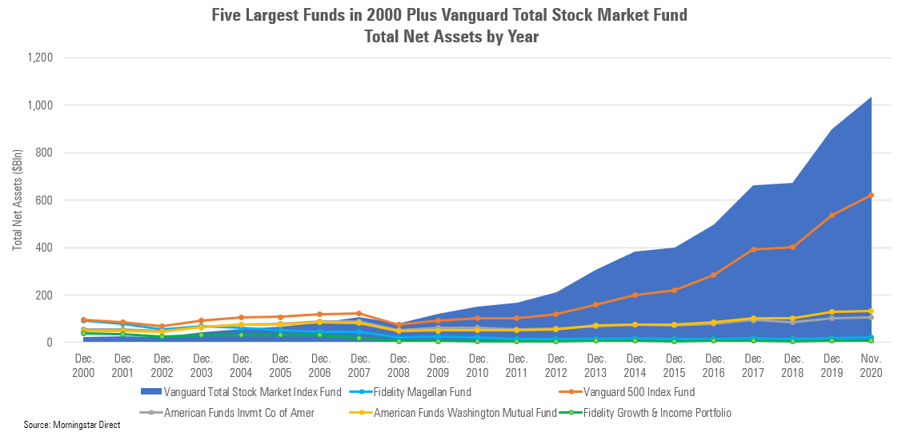

## Table of Contents

## What is the Vanguard Total Stock Market ETF?

The Vanguard Total Stock Market ETF is a type of investment fund that lets you own a small piece of almost every stock in the U.S. market. It's like buying a tiny share in thousands of companies all at once. This ETF is managed by Vanguard, a big company known for low-cost investing options. By investing in this fund, you get a broad and diverse exposure to the U.S. stock market, which can help spread out your risk.

This ETF is popular because it's easy to use and usually has low fees. Instead of picking individual stocks, which can be risky and time-consuming, you can invest in this one fund and get a piece of the whole market. It's a good choice for people who want to grow their money over the long term without having to watch the market every day. The fund's performance tracks the overall U.S. stock market, so when the market goes up, your investment tends to go up too, and vice versa.

## How does the Vanguard Total Stock Market ETF work?

The Vanguard Total Stock Market ETF works by pooling money from many investors to buy a wide range of stocks. It aims to match the performance of the entire U.S. stock market. This means it includes stocks from big companies, small companies, and everything in between. When you buy shares of this ETF, you're essentially buying a tiny piece of all those companies. The fund is managed to keep costs low, so more of your money stays invested and working for you.

The ETF is traded on the stock exchange, just like individual stocks. This means you can buy and sell shares throughout the trading day at the current market price. The price of the ETF goes up and down based on the value of the stocks it holds. Over time, as the U.S. stock market grows, the value of your investment in the ETF is likely to grow too. It's a simple way to invest in the market without having to pick individual stocks, making it a popular choice for people looking to build wealth over the long term.

## What are the benefits of investing in the Vanguard Total Stock Market ETF?

Investing in the Vanguard Total Stock Market ETF has many benefits. One big benefit is that it gives you a lot of variety. Instead of putting all your money into one or a few stocks, you get a piece of almost every stock in the U.S. This helps spread out your risk. If one company does badly, it won't hurt your whole investment because you own so many different stocks.

Another benefit is that it's easy and usually costs less. You don't need to spend a lot of time picking which stocks to buy. You just buy shares of the ETF, and it does the work for you. Plus, Vanguard keeps the fees low, so more of your money stays invested and can grow over time. This makes it a good choice for people who want to invest without a lot of hassle or high costs.

## What are the risks associated with the Vanguard Total Stock Market ETF?

One risk of investing in the Vanguard Total Stock Market ETF is that the whole U.S. stock market can go down. If the market has a bad year, your investment will likely lose value too. This means you could lose money, especially if you need to sell your shares during a downturn. It's important to be ready for ups and downs and not to panic if the market drops.

Another risk is that even though the ETF is very diverse, it's still focused only on the U.S. market. If the U.S. economy does badly, your investment might suffer more than if you had some money in other countries. Also, while the fees are low, they're not zero. Over many years, these fees can add up and eat into your returns. It's good to think about these risks and maybe mix your investments with other types of funds or assets to balance things out.

## How does the Vanguard Total Stock Market ETF compare to other index funds?

The Vanguard Total Stock Market ETF is a lot like other index funds because it tries to match the performance of a big group of stocks. But it's special because it covers almost every stock in the U.S. market. This makes it very diverse. Other index funds might focus on just big companies or a certain part of the market, like technology or health care. The Vanguard Total Stock Market ETF gives you a piece of all these different parts, which can help spread out your risk.

Another way it's different is that it usually has very low fees. Vanguard is known for keeping costs down, so more of your money stays invested. Some other index funds might have higher fees, which can add up over time and eat into your returns. But like all index funds, the Vanguard Total Stock Market ETF goes up and down with the market. So, if the U.S. stock market does well, your investment will likely do well too. But if the market goes down, your investment will go down with it.

## What is the expense ratio of the Vanguard Total Stock Market ETF?

The expense ratio of the Vanguard Total Stock Market ETF is very low. It's currently at 0.03%. This means for every $10,000 you invest, you'll pay just $3 in fees each year. This low cost is one reason why many people like this ETF. It lets more of your money stay invested and grow over time.

Compared to many other funds, this expense ratio is really small. Some other index funds might charge 0.10% or even more. Over many years, these small differences in fees can add up. So, choosing a fund with a low expense ratio like the Vanguard Total Stock Market ETF can help you keep more of your returns.

## How has the Vanguard Total Stock Market ETF performed historically?

The Vanguard Total Stock Market ETF has done well over the long term. Since it started in 2001, it has grown a lot. If you had put $10,000 into it back then, it would be worth a lot more now. The ETF tries to match the performance of the whole U.S. stock market, so when the market goes up, the ETF goes up too. Over many years, the U.S. stock market has usually gone up, which means the ETF has too. But it's not always a smooth ride. There have been times when the market went down, and the ETF lost value. But if you held on and didn't sell during those times, your investment would have likely recovered and kept growing.

Looking at shorter periods, like the last 5 or 10 years, the ETF has also done well. It has had some ups and downs, but overall, it has grown. For example, in the last 10 years, it has given investors good returns. But remember, past performance doesn't tell you what will happen in the future. The stock market can be unpredictable, and there's always a chance it could go down. That's why it's important to think about how long you plan to keep your money invested. If you're in it for the long haul, the Vanguard Total Stock Market ETF has shown it can be a good choice.

## What is the composition of the Vanguard Total Stock Market ETF?

The Vanguard Total Stock Market ETF is made up of a lot of different stocks from the U.S. It includes stocks from big companies, small companies, and everything in between. This means you get a piece of almost every stock in the U.S. market when you invest in this ETF. The biggest part of the ETF is made up of stocks from really big companies, like those in the S&P 500. But it also has stocks from smaller companies, which helps spread out your risk.

The ETF is designed to match the performance of the whole U.S. stock market. It does this by following something called the CRSP US Total Market Index. This index includes thousands of stocks, so the ETF is very diverse. By investing in this ETF, you're not just betting on one type of company or one part of the market. You're getting a little bit of everything, which can help your investment grow over time while also keeping your risk lower than if you picked just a few stocks.

## How can one invest in the Vanguard Total Stock Market ETF?

Investing in the Vanguard Total Stock Market ETF is easy. You can buy shares of the ETF through a brokerage account. Many big brokers like Vanguard, Fidelity, and Charles Schwab let you buy and sell shares of this ETF. You just need to open an account with one of these brokers, put some money in it, and then you can buy the ETF. You can choose how many shares you want to buy, and you can do it all online.

Once you have the ETF in your account, you can keep it for as long as you want. You can also sell your shares whenever you need to. The price of the ETF changes throughout the day, just like a stock, so you can buy and sell at any time the market is open. If you want to add more money to your investment over time, you can buy more shares whenever you want. It's a simple way to invest in the whole U.S. stock market without having to pick individual stocks.

## What are the tax implications of investing in the Vanguard Total Stock Market ETF?

When you invest in the Vanguard Total Stock Market ETF, you need to think about taxes. If you hold the ETF for more than a year before selling, any profit you make is called a long-term capital gain. The tax on this is usually lower than if you sell it in less than a year, which is called a short-term capital gain. Short-term gains are taxed at your regular income tax rate, which can be higher. So, if you can, it's often better to hold onto your investment for at least a year to get the lower tax rate.

The ETF also pays out dividends, which are payments from the companies in the fund. These dividends can be taxed too. There are two types of dividends: qualified and non-qualified. Qualified dividends are taxed at the lower long-term capital gains rate, while non-qualified dividends are taxed at your regular income tax rate. The ETF might also pass along capital gains from selling stocks inside the fund, and you'll have to pay taxes on those too. It's a good idea to talk to a tax advisor to understand how these taxes might affect your investment and to plan the best way to manage them.

## How does the Vanguard Total Stock Market ETF fit into a diversified investment portfolio?

The Vanguard Total Stock Market ETF is a great way to add diversity to your investment portfolio. It gives you a piece of almost every stock in the U.S. market, from big companies to small ones. This means you're not putting all your money into just one type of stock or one part of the market. By spreading your investment across so many different stocks, you can lower your risk. If one company or sector does badly, it won't hurt your whole investment as much because you own so many different stocks.

You can use the Vanguard Total Stock Market ETF as a core part of your portfolio. It's a good base because it covers the whole U.S. stock market. But to make your portfolio even more diverse, you might want to add other types of investments too. For example, you could invest in international stocks, bonds, or real estate. This way, if the U.S. stock market has a bad year, your other investments might help balance things out. The ETF's low cost also makes it a smart choice for building a long-term investment plan without spending a lot on fees.

## What advanced strategies can be used with the Vanguard Total Stock Market ETF?

One advanced strategy you can use with the Vanguard Total Stock Market ETF is called dollar-cost averaging. This means you put a set amount of money into the ETF at regular times, like every month. By doing this, you buy more shares when the price is low and fewer shares when the price is high. Over time, this can help you pay a lower average price for your shares. It's a good way to smooth out the ups and downs of the market and build your investment slowly.

Another strategy is to use the ETF as part of a tax-loss harvesting plan. This means you sell some of your ETF shares at a loss to lower your taxes. You can then buy back the same ETF or a similar one after 30 days to avoid a rule called the wash-sale rule. This can help you save on taxes while keeping your investment in the market. It's a bit tricky, so it's a good idea to talk to a tax advisor to make sure you do it right.

You can also use the Vanguard Total Stock Market ETF in a strategy called asset allocation. This means you decide how much of your money to put into different types of investments, like stocks, bonds, and real estate. The ETF can be a big part of your stock allocation because it covers the whole U.S. market. By adjusting how much you have in the ETF compared to other investments, you can balance your risk and returns to fit your goals. This can help you build a strong, diverse portfolio that grows over time.

## References & Further Reading

[1]: Bergstra, J., Bardenet, R., Bengio, Y., & Kégl, B. (2011). ["Algorithms for Hyper-Parameter Optimization."](https://papers.nips.cc/paper/4443-algorithms-for-hyper-parameter-optimization) Advances in Neural Information Processing Systems 24.

[2]: ["Advances in Financial Machine Learning"](https://www.amazon.com/Advances-Financial-Machine-Learning-Marcos/dp/1119482089) by Marcos Lopez de Prado

[3]: ["Evidence-Based Technical Analysis: Applying the Scientific Method and Statistical Inference to Trading Signals"](https://www.amazon.com/Evidence-Based-Technical-Analysis-Scientific-Statistical/dp/0470008741) by David Aronson

[4]: ["Machine Learning for Algorithmic Trading"](https://github.com/stefan-jansen/machine-learning-for-trading) by Stefan Jansen

[5]: ["Quantitative Trading: How to Build Your Own Algorithmic Trading Business"](https://www.amazon.com/Quantitative-Trading-Build-Algorithmic-Business/dp/1119800064) by Ernest P. Chan