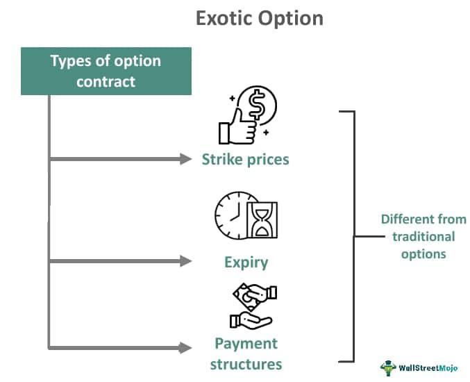

Financial derivatives, particularly options, are integral components of modern financial markets, serving as vital instruments for hedging, speculation, and risk management. These derivatives derive their value from underlying assets such as stocks, commodities, or currencies. Vanilla options, a fundamental type of options contract, provide traders a straightforward entry into this complex environment. They grant the holder the right, but not the obligation, to buy or sell the underlying asset at a predetermined price before a specified expiration date. The simplicity of vanilla options makes them accessible to a wide range of investors, including those new to options trading.

Algorithmic trading, another transformative innovation in financial markets, involves the use of algorithms to automate trading decisions based on predefined parameters like price, timing, and volume. This approach has significantly revolutionized options trading by enabling the rapid execution of trades with high precision and reduced human error. The application of algorithmic trading to vanilla options can lead to enhanced efficiencies in trade execution, reduced transaction costs, and improved risk management.



This article discusses the integration of vanilla options with algorithmic trading, focusing on how the two can complement each other to optimize trading strategies and outcomes. By combining the simplicity and flexibility of vanilla options with the advanced decision-making capabilities of algorithmic trading, investors can effectively navigate the financial markets to achieve their investment objectives.

## Table of Contents

## Understanding Financial Derivatives and Vanilla Options

Financial derivatives are contracts that derive their value from the performance of an underlying asset, which can include stocks, commodities, currencies, interest rates, or market indices. These instruments are pivotal in financial markets as they allow participants to hedge against risk, obtain leverage, or speculate on future price movements. By providing a mechanism to transfer risk, derivatives contribute to market efficiency and liquidity.

Vanilla options represent the simplest and most fundamental type of options contracts. An option grants the holder the right, though not the obligation, to buy or sell an underlying asset at a predetermined price, known as the strike price, before or on a specific expiration date. This asymmetry allows the option holder to benefit from favorable price movements while limiting potential losses to the premium paid for the option itself. 

There are two main types of vanilla options: call options and put options. A call option confers the right to purchase the underlying asset at the strike price, providing potential profit if the asset's market price exceeds this level before expiration. Conversely, a put option gives the holder the right to sell the underlying asset at the strike price, which is advantageous if the market price falls below this threshold.

Investors utilize vanilla options to hedge and speculate on asset price movements. Hedging involves using options to protect against adverse price changes, thereby managing risk. For example, an investor holding stocks might purchase put options to guard against potential declines in the stock's value. On the other hand, speculation involves taking positions based on anticipated price changes, aiming to profit from these movements. A trader expecting a stock price increase might buy call options to gain exposure to the upside potential.

In summary, vanilla options are integral financial derivatives that offer flexibility in trading strategies. By understanding their basic mechanics and potential applications, investors can better navigate the complexities of financial markets.

## Basics of Algorithmic Trading

Algorithmic trading, also referred to as algo trading, leverages computer programs to execute financial transactions at electronic speeds and places trades based on pre-established criteria like price, timing, and trading [volume](/wiki/volume-trading-strategy). This method primarily utilizes simple to complex algorithms to automate trading processes, thereby reducing human intervention and errors that could arise from manual trading. 

The core of [algorithmic trading](/wiki/algorithmic-trading) lies in its ability to deploy multiple and simultaneous trades with remarkable speed and accuracy. The capability to assess vast amounts of trading data and execute trades in fractions of a second offers a significant advantage over traditional trading methods. Additionally, algorithmic trading is employed widely due to its potential to minimize manual errors, substantially increase trading efficiency, and exploit market opportunities that may arise from short-lived stock mispricings or market imbalances.

One of the primary strategies adopted in algorithmic trading includes [arbitrage](/wiki/arbitrage), which seeks to capitalize on price differentials for the same asset across different markets. Market-making algorithms are also popular; they aim to provide [liquidity](/wiki/liquidity-risk-premium) to the market by quoting buy and sell prices. Furthermore, [momentum](/wiki/momentum)-based strategies, which rely on identifying trending markets and executing trades in the direction of these trends, are frequently utilized.

To illustrate how algorithmic trading might be coded, here is a simplified Python script that demonstrates a basic strategy based on moving averages—one of the popular indicators used in momentum strategies:

```python
import pandas as pd

def moving_average_strategy(data, short_window, long_window):
    """
    Implements a basic moving average crossover strategy.

    Parameters:
    data: DataFrame with 'Close' price.
    short_window: The number of periods for the short moving average.
    long_window: The number of periods for the long moving average.

    Returns:
    signals: DataFrame containing the signals to 'buy' or 'sell'.
    """
    signals = pd.DataFrame(index=data.index)
    signals['price'] = data['Close']
    signals['short_mavg'] = data['Close'].rolling(window=short_window, min_periods=1, center=False).mean()
    signals['long_mavg'] = data['Close'].rolling(window=long_window, min_periods=1, center=False).mean()
    signals['signal'] = 0.0
    signals['signal'][short_window:] = np.where(signals['short_mavg'][short_window:] > signals['long_mavg'][short_window:], 1.0, 0.0)   
    signals['positions'] = signals['signal'].diff()

    return signals

# Example usage
# historical_data = pd.read_csv('historical_prices.csv', index_col='Date', parse_dates=True)
# signals = moving_average_strategy(historical_data, short_window=40, long_window=100)
# print(signals)
```

In this pseudo-trading system, a crossover strategy is implemented, where a buy signal (1) is generated if a short-term moving average exceeds a long-term moving average, and a sell signal is triggered if the short-term moving average drops below the long-term moving average. 

In summary, algorithmic trading revolutionizes the trading process by employing mathematical models and automated trading signals. This evolution permits traders to focus more on developing strategies rather than the execution process itself, thereby altering the landscape of financial trading with innovation and efficiency.

## Algorithmic Trading in Vanilla Options

Algorithmic trading strategies, also known as algo trading, are increasingly being utilized in vanilla options trading to enhance trading efficiency and profitability. These strategies rely on predefined rules programmed into algorithms, enabling traders to automate the analysis of option pricing models and execute trades based on sophisticated mathematical computations.

In vanilla options trading, the use of algorithms facilitates real-time decision-making by rapidly analyzing vast amounts of data and identifying potential trading opportunities. For instance, algorithms can incorporate the Black-Scholes model, a widely used method for option pricing, to determine theoretical values. This allows traders to exploit price discrepancies between the theoretical value and the market price. The Black-Scholes formula for a call option is given by:

$$
C = S_0 N(d_1) - X e^{-rT} N(d_2)
$$

where

$$
d_1 = \frac{\ln\left(\frac{S_0}{X}\right) + \left(r + \frac{\sigma^2}{2}\right)T}{\sigma \sqrt{T}}
$$

$$
d_2 = d_1 - \sigma \sqrt{T}
$$

Here, $C$ is the call option price, $S_0$ is the current stock price, $X$ is the strike price, $r$ is the risk-free [interest rate](/wiki/interest-rate-trading-strategies), $T$ is the time to expiration, $\sigma$ is the [volatility](/wiki/volatility-trading-strategies) of the stock, and $N$ is the cumulative distribution function of the standard normal distribution.

Common algorithmic strategies in options trading include:

1. **Arbitrage Strategies**: These strategies exploit the price discrepancies between different markets or financial instruments. For instance, a trader might identify a mispricing between options and the underlying asset or between options on different exchanges and execute trades to capture risk-free profit.

2. **Market-Making Strategies**: Algorithms are employed to provide liquidity by continuously quoting both buy and sell prices for options. Market makers earn profits from the bid-ask spread while maintaining a balanced portfolio to hedge against market volatility.

3. **Momentum-Based Strategies**: These involve algorithms detecting and capitalizing on trends in option prices. By analyzing historical data and current market conditions, the algorithm can predict price movements and execute trades accordingly to profit from these trends.

Python and other programming languages offer powerful libraries and tools—such as NumPy for numerical computations and pandas for data manipulation—that facilitate the development and [backtesting](/wiki/backtesting) of these algorithmic strategies. Traders can leverage these to refine and optimize their strategies, ensuring that they remain effective in varying market environments.

Here's an example of a simple Python script for backtesting a momentum strategy using moving averages:

```python
import pandas as pd
import numpy as np

# Load historical option data
data = pd.read_csv('option_data.csv')
data['MovingAverage'] = data['Price'].rolling(window=50).mean()

# Define trading strategy
buy_signals = data[data['Price'] > data['MovingAverage']]
sell_signals = data[data['Price'] < data['MovingAverage']]

# Calculate profitability
profit = sell_signals['Price'].sum() - buy_signals['Price'].sum()
print(f"Profit from strategy: {profit}")
```

Such strategies underline the power of algorithmic trading in vanilla options by enabling more precise and efficient execution of trades, ultimately aiming to increase profitability while managing risk.

## Benefits and Risks of Algo Trading with Vanilla Options

Algorithmic trading in vanilla options offers significant benefits, primarily through improved trade execution speed, reduced transaction costs, and enhanced risk management. Algorithms can process trading signals and execute orders faster than any human trader, often in milliseconds, thereby capturing favorable price movements that manual trading might miss. This speed advantage is especially beneficial in volatile markets, where timely execution can make a substantial difference in profitability.

Transaction costs can be minimized using algorithmic strategies by optimizing order placement and execution. Algorithms can be programmed to place trades in smaller increments, reducing the market impact and slippage. Furthermore, executing trades at optimal times based on comprehensive market data analysis can lead to cost savings.

Enhanced risk management is another critical benefit. Algorithmic trading systems can be designed to monitor various risk metrics continuously and execute risk mitigation strategies automatically when certain thresholds are reached. This feature helps in maintaining a balanced risk-return profile.

Algorithmic trading allows for backtesting, an essential process for refining trading strategies. By simulating trading strategies on historical data, traders can evaluate the potential effectiveness and make necessary adjustments before deploying them in live markets. This approach is crucial for developing robust trading models that can withstand diverse market conditions.

Despite these benefits, algorithmic trading in vanilla options carries inherent risks. Technical failures, such as system outages or software bugs, can disrupt trading operations, potentially leading to significant financial losses. Moreover, algorithms might not adapt well to sudden market shifts unless explicitly programmed to handle such scenarios.

Market volatility poses another risk. While algorithms are designed to capitalize on price movements, extreme volatility can lead to unintended trading behavior and substantial losses. Additionally, over-optimization of trading strategies, commonly known as "curve fitting," can create models that perform well in backtests but fail in real-world trading due to their inability to generalize beyond historical data.

In summary, while algorithmic trading provides various advantages in vanilla options trading, including speed, cost efficiency, and sophisticated risk management, traders must remain cautious of risks such as technical issues, market volatility, and strategy over-optimization. Balancing these elements is essential for successful algo trading in this domain.

## Getting Started with Vanilla Options and Algo Trading

To begin trading vanilla options using algorithms, traders should first familiarize themselves with the key components of option pricing and fundamental trading strategies. A fundamental understanding of concepts such as the Black-Scholes model, which calculates the theoretical price of options, is necessary. The Black-Scholes formula provides a framework to determine the fair price of an option based on variables such as the underlying asset price ($S$), the strike price ($K$), time to expiration ($T$), risk-free interest rate ($r$), and the volatility of the asset ($\sigma$):

$$
C(S, T) = S N(d_1) - K e^{-rT} N(d_2)
$$

where:

$$
d_1 = \frac{\ln(\frac{S}{K}) + (r + \frac{\sigma^2}{2})T}{\sigma \sqrt{T}}
$$

$$
d_2 = d_1 - \sigma \sqrt{T}
$$

This model serves as a fundamental tool for option traders, enabling them to understand how the option price may change based on shifts in the underlying variables.

In addition to understanding option pricing, traders should master basic trading strategies such as covered calls, protective puts, and straddle strategies. These strategies set the groundwork for more sophisticated algorithmic trading.

Selecting a reliable trading platform is crucial for effective algorithmic trading. The platform should support robust backtesting capabilities and offer comprehensive data feeds for accurate strategy evaluation. Popular platforms include MetaTrader 5, [Interactive Brokers](/wiki/interactive-brokers-api), and Thinkorswim, among others. These platforms typically support algorithmic trading through various programming languages, with Python being one of the most preferred due to its simplicity and extensive libraries for financial analysis.

Here is a basic Python example using the `yfinance` library to fetch historical data for backtesting a simple moving average crossover strategy:

```python
import yfinance as yf  # For more datasets, visit: https://paperswithbacktest.com/datasets
import pandas as pd

# Fetch historical data
data = yf.download("AAPL", start="2020-01-01", end="2023-01-01")

# Calculate moving averages
data['SMA_20'] = data['Close'].rolling(window=20).mean()
data['SMA_50'] = data['Close'].rolling(window=50).mean()

# Define a simple trading strategy based on moving averages
data['Signal'] = 0
data.loc[data['SMA_20'] > data['SMA_50'], 'Signal'] = 1
data.loc[data['SMA_20'] < data['SMA_50'], 'Signal'] = -1

print(data.tail())
```

Continuous learning and strategy optimization are essential for success in algo trading with options. Traders should regularly backtest and refine their strategies against historical data to ensure they are robust and adapt to changing market conditions. Additionally, they should stay informed about advancements in algorithmic trading technologies and methodologies, as well as regulatory changes that could impact trading practices.

In conclusion, combining a deep understanding of vanilla options' core principles with the precision of algorithmic trading can significantly enhance trading outcomes. Continuous development and adaptation are key to navigating the dynamic landscape of financial markets effectively.

## Conclusion

Vanilla options serve as fundamental instruments in financial markets, offering flexibility for both hedging and speculative endeavors. These options, by providing a simple yet effective mechanism to manage risk, allow market participants to hedge against potential adverse price movements or capitalize on prospective trends. With the advent of algorithmic trading, the capabilities of vanilla options are significantly augmented. Algorithms can automate and expedite the decision-making processes, thereby enhancing the efficiency and precision of option trades.

Algorithmic trading systems leverage complex mathematical models to analyze options pricing and market data at high speed, enabling traders to execute strategies with increased effectiveness. By automating these tasks, traders can exploit short-lived market opportunities that are often missed by manual trading. For instance, price discrepancies among markets can be quickly identified and acted upon, facilitating arbitrage strategies that could otherwise be impractical.

However, the adoption of algorithmic trading in vanilla options necessitates a thorough understanding of the associated risks. Technical failures such as software glitches, hardware malfunctions, or network issues can result in significant trading losses. Moreover, markets are inherently volatile, and algorithmic strategies that perform optimally under specific conditions might not adapt well during periods of unexpected market behavior. Continuous monitoring and adjustment of these algorithms are required to mitigate such risks effectively.

Furthermore, strategy over-optimization, where a trading model is finely tuned to perform exceptionally well on historical data, may not guarantee future success, as it might not account for evolving market conditions. Traders and investors need to remain watchful, ensuring their strategies are robust and adaptable to the dynamic nature of financial markets.

In summary, integrating algorithmic trading with vanilla options harnesses the full potential of these financial instruments, enabling more intelligent and efficient trading. Nonetheless, due diligence, continuous learning, and strategy refinement are imperative to successfully navigate the complexities and uncertainties inherent in modern financial markets.

## References & Further Reading

[1]: Black, F., & Scholes, M. (1973). ["The Pricing of Options and Corporate Liabilities."](https://www.cs.princeton.edu/courses/archive/fall09/cos323/papers/black_scholes73.pdf) The Journal of Political Economy, 81(3), 637-654.

[2]: Hull, J.C. (2018). ["Options, Futures, and Other Derivatives"](https://www.semanticscholar.org/paper/Options%2C-Futures%2C-and-Other-Derivatives-Hull/89bdee500c8623864fc9eb7a471546aa713acc44). Pearson.

[3]: Narang, R. K. (2012). ["Inside the Black Box: A Simple Guide to Quantitative and High Frequency Trading"](https://onlinelibrary.wiley.com/doi/book/10.1002/9781118662717). Wiley.

[4]: Aldridge, I. (2013). ["High-Frequency Trading: A Practical Guide to Algorithmic Strategies and Trading Systems"](https://www.amazon.com/High-Frequency-Trading-Practical-Algorithmic-Strategies/dp/1118343506). Wiley.

[5]: Shreve, S. E. (2004). ["Stochastic Calculus for Finance II: Continuous-Time Models"](https://link.springer.com/book/9780387401010). Springer.