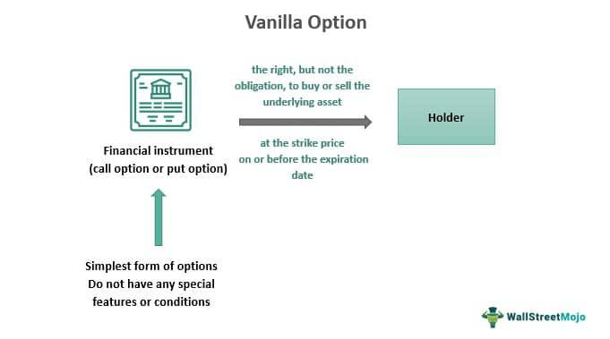

Understanding the competitive landscape of business strategies is essential to any informed investor or business manager. In both business and trading, the concept of a 'vanilla strategy' embodies straightforward and simplistic approaches that eschew complexity for clarity and manageability. This article will explore how vanilla strategies operate across the domains of business, market analysis, and algorithmic trading, highlighting their effectiveness and limitations within various market contexts.

Vanilla strategies serve as a foundation for many business and trading models, offering a reliable starting point that favors simplicity over elaboration. By focusing on essential elements, these strategies provide a clearer picture of operational and financial landscapes. The role of vanilla strategies is significant in markets characterized by rapid changes and uncertainty. They minimize complexity and facilitate clearer assessments of market conditions, making them particularly attractive for small to medium enterprises and individual traders.



However, while vanilla strategies offer several benefits, they also have limitations. These strategies might not leverage advanced analytics or sophisticated data-driven decision-making processes that potentially yield higher returns or provide greater competitive advantages. Despite this, their consistency and stability often emerge as key virtues in conditions where more intricate strategies may falter. This article aims to provide a comprehensive understanding of vanilla strategies and demonstrate how they can be both effective and limited, adapting to the nuanced demands of varied market conditions.

## Table of Contents

## What is a Vanilla Strategy?

A vanilla strategy is often characterized by its simplicity and lack of complex modifications, serving as a straightforward approach in both business and financial contexts. In business, a vanilla strategy typically comprises basic strategies that eschew intricate refinements or modifications. This kind of strategy focuses on the essentials without delving into multifaceted or customized options.

In financial settings, a vanilla strategy may refer to standard investment options, such as index trading. This approach involves investing in a representative basket of securities within a given market index, like the S&P 500, providing broad market exposure with relatively low management complexities. The primary goal is to replicate the performance of the index, benefiting from diversification and reduced costs associated with passive investing.

The term "vanilla" underscores the strategy's fundamental, unembellished nature. It implies an approach that prioritizes clarity and ease of comprehension, making it accessible to a wide range of investors and business practitioners. While these strategies may not capture the nuanced benefits of more specialized tactics, they offer a dependable foundation that appeals to those seeking stability and a reduced risk profile in their pursuits. 

Overall, vanilla strategies prioritize straightforwardness and reliability, making them particularly appealing in uncertain or volatile environments where complexity could introduce additional risks.

## Business Strategy and Vanilla Approaches

The core of a business strategy typically involves leveraging competitive advantages to sustain and enhance an organization's market position. Vanilla strategies in business, characterized by their simplicity and straightforwardness, often focus on widely understood concepts such as cost leadership and product specialization. These strategies eschew complexity in favor of clarity and operational ease, which can be integral in environments where resources are limited or rapid execution is necessary.

Cost leadership, a fundamental vanilla strategy, involves a company aiming to become the lowest-cost producer in its industry. This can be achieved through economies of scale, efficient production processes, or access to raw materials at a lower cost than competitors. By being the cost leader, a company can maintain higher profit margins while still offering competitive prices. The simplicity of this strategy lies in its direct focus on cost reduction and efficiency improvements, without the need for complex market maneuvers or high-risk investments.

Product specialization is another straightforward strategy often employed by businesses to gain a competitive edge. This involves focusing resources on a narrow range of products, allowing the company to concentrate on perfecting its offering and potentially achieving differentiation through quality or innovation. This focus can result in enhanced brand recognition and customer loyalty, as the company becomes known for its expertise and superior products in the specific area it specializes in.

These vanilla strategies, by minimizing risk and operational complexity, offer benefits such as streamlined operations and a clearer strategic direction. For instance, the reduced complexity often translates into lower costs and fewer organizational hurdles, which can be particularly advantageous for small to medium-sized enterprises (SMEs) operating with constrained resources. Furthermore, by focusing on fundamental strategies such as cost leadership or specialization, companies can maintain stability amidst fluctuating market conditions, as their business models are not heavily reliant on volatile factors or assumptions.

In practice, the effectiveness of a vanilla strategy is often contingent on the external business environment and the internal capabilities of the company. It is crucial for businesses to continuously monitor market trends and internal performance metrics to ensure that their chosen strategy aligns with current conditions and supports long-term objectives. When implemented judiciously, vanilla strategies can serve as the backbone of a company's strategic framework, providing a solid foundation for growth and sustainability.

## Market Analysis and Vanilla Strategy

Market analysis using a vanilla strategy emphasizes fundamental aspects such as supply, demand, competition, and market share. This straightforward approach avoids the complexities of advanced analytics, making it particularly accessible to small and medium enterprises (SMEs) that may lack the resources for more sophisticated analytical tools.

By focusing on supply and demand, firms can evaluate the availability of their products in relation to consumer needs. This involves assessing factors like production levels, which can be calculated with basic equations such as:

$$
\text{Surplus/Deficit} = \text{Total Supply} - \text{Total Demand}
$$

Such evaluations help businesses decide whether to increase production or adjust pricing strategies. Understanding competitor actions and market share is equally crucial. A vanilla strategy might involve simple SWOT analysis (Strengths, Weaknesses, Opportunities, Threats) to identify how a business stands relative to its competitors. This can be performed using a basic matrix to outline internal and external factors affecting the business.

The market share percentage is computed with the formula:

$$
\text{Market Share} = \left( \frac{\text{Company's Sales}}{\text{Total Market Sales}} \right) \times 100
$$

This basic metric enables SMEs to measure their relative position in the market without requiring in-depth data analysis or predictive modeling.

Another benefit of a vanilla strategy in market analysis is resource efficiency. SMEs can allocate their time and financial resources toward strategic decision-making rather than complex data processing. For instance, using software tools like Excel or Google Sheets, businesses can set up simple dashboards to track basic metrics over time, with Python scripts enhancing automation. Here’s a simple Python snippet that can be used to calculate market share:

```python
def calculate_market_share(company_sales, total_market_sales):
    return (company_sales / total_market_sales) * 100

# Example usage
company_sales = 120000
total_market_sales = 1000000
market_share = calculate_market_share(company_sales, total_market_sales)
print(f"Market Share: {market_share}%")
```

The straightforward nature of vanilla market analysis provides clear insights into business operations, facilitating agile responses to market changes. By leveraging these simple techniques, businesses can maintain focus on core objectives and strategies without being burdened by the intricacies of more advanced analytical methodologies.

## Algorithmic Trading Using Vanilla Strategies

Algorithmic trading using vanilla strategies generally involves the utilization of straightforward methods and standard financial instruments, such as stocks or bonds, for automated trade execution. These systems inherently rely on basic technical indicators to make trading decisions, rather than complex, predictive models or advanced [machine learning](/wiki/machine-learning) algorithms.

One common method within vanilla [algorithmic trading](/wiki/algorithmic-trading) is the implementation of moving averages. Moving averages help smooth out price data by creating a constantly updated average price, providing a simple yet effective way to identify trends. The most basic form is the simple moving average (SMA), calculated as:

$$
\text{SMA} = \frac{P_1 + P_2 + \ldots + P_n}{n}
$$

where $P_1, P_2, \ldots, P_n$ are closing prices over a specified period $n$. Traders often use the SMA to assess whether a security's price will continue its current trajectory.

Another elementary indicator used is the Relative Strength Index (RSI), which measures the velocity and change of price movements. The RSI is calculated as:

$$
\text{RSI} = 100 - \frac{100}{1 + \frac{\text{average gain}}{\text{average loss}}}
$$

In vanilla strategies, an RSI value above 70 may indicate that a security is overbought, while a value below 30 suggests it might be oversold.

Vanilla algorithmic trading focuses on leveraging these basic indicators to execute trades automatically, based on predefined rules. The primary advantage of such a simplified approach is its robustness and reliability, especially in volatile markets where intricate models might fail due to overfitting or unforeseen market variables.

These algorithms avoid extensive computational requirements and are more accessible for traders with limited resources or those who prefer understandable, transparent systems. Nonetheless, this simplicity comes with limitations, as vanilla strategies may not fully capture intricate market dynamics or provide significant competitive edge against more sophisticated algorithms. In essence, while they prioritize reliability and ease of use, they may lag in identifying emerging market patterns that complex strategies could exploit.

## Advantages and Limitations

Vanilla strategies are characterized by their simplicity, cost-effectiveness, and ease of understanding, making them attractive to a wide range of investors and businesses. The straightforward nature of these strategies makes them particularly useful for maintaining stability in volatile markets where more complex models might fail. For example, during periods of market turbulence, the focus on basic financial instruments and uncomplicated mechanisms can help prevent overleveraging and speculative risks, thereby supporting consistent performance.

Despite these advantages, vanilla strategies can have limitations, primarily their potential to miss out on profit opportunities that more sophisticated strategies could identify. Advanced strategies often employ complex data analytics, machine learning, and algorithmic models to capitalize on market inefficiencies and emerging trends, allowing for higher returns on investment. In contrast, vanilla strategies might be less equipped to respond dynamically to rapid market changes, reducing their potential profitability.

Moreover, the simplicity of vanilla strategies can lead to lower competitive differentiation over time. Businesses and investors using these strategies might find themselves at a disadvantage if competitors employ more innovative approaches tailored to capture niche market segments or unique investment opportunities. In essence, while offering a stable and less risky path, vanilla strategies could result in lower overall growth and returns in highly competitive environments.

In conclusion, while vanilla strategies offer an excellent foundation for stability and ease of understanding, it is essential to be aware of their limitations. Balancing these strategies with a level of innovation and adaptability might be necessary to capture more significant opportunities and sustain a competitive edge.

## Case Study: Vanilla Strategy in Retirement Planning

Retirement planning often embodies a vanilla strategy due to its emphasis on simplicity and long-term stability. At its core, this approach prioritizes diversification across traditional financial instruments such as stocks and bonds. By allocating resources into these asset classes, investors aim for steady growth and consistent income generation, primarily via index funds, which replicate the performance of a market index like the S&P 500.

Index funds serve as a fundamental component of this strategy owing to their cost-effectiveness and passive management style. They offer investors exposure to a broad array of securities, minimizing unsystematic risk through diversification. The appeal of index funds, and a vanilla strategy more broadly, lies in their ability to deliver market-average returns with lower expense ratios compared to actively managed funds. This low-cost structure is important in long-term retirement planning, as it helps preserve capital by reducing the erosion of returns through fees.

Historical data supports the effectiveness of this strategy. For example, over long periods, equity markets have shown a tendency to appreciate, making diversified stock holdings a viable choice for growth. Meanwhile, bonds provide a stabilizing influence on a portfolio, offering fixed interest payments that cushion against market [volatility](/wiki/volatility-trading-strategies). The combination of these two asset classes helps balance the dual objectives of capital preservation and growth.

Despite the simplicity of a vanilla retirement strategy, many individuals successfully accumulate substantial wealth over time. The key driver behind this success is the power of compounding, which magnifies returns over extended periods. By consistently reinvesting dividends and interest payments, account balances can grow exponentially, even if annual returns remain modest. For instance, a hypothetical $10,000 investment [earning](/wiki/earning-announcement) an average annual return of 7% compounded over 30 years would grow to approximately $76,122, illustrating the long-term benefits of this approach.

While vanilla strategies may lack the allure of complex investment schemes, they provide a straightforward and reliable foundation for retirement planning. Their simplicity ensures ease of understanding and implementation, making them particularly attractive to novice investors or those with a low tolerance for risk. As such, they remain a popular choice among individuals seeking steady accumulation of wealth while minimizing exposure to the uncertainties inherent in more aggressive investment strategies.

## Conclusion

Vanilla strategies offer a balanced approach to managing business operations and financial investments. By focusing on simplicity and fundamental principles, these strategies provide a consistent framework for performance across various market environments. For businesses and traders seeking stability, the straightforward nature of vanilla strategies simplifies decision-making processes, reduces operational complexities, and minimizes risk exposure.

Incorporating vanilla strategies can benefit traders and businesses significantly. For instance, relying on basic investment options such as index funds or adopting elementary business approaches like cost leadership helps maintain financial and operational predictability. This predictability is crucial, especially during volatile periods when more complex strategies might falter.

While vanilla strategies may lack the innovation and aggressive growth potential found in more sophisticated approaches, they serve as a robust base for steady long-term performance. This foundation can be crucial for businesses and investors with a lower risk tolerance, who value consistent, albeit modest, returns over speculative gains. Thus, despite their inherent simplicity, vanilla strategies play a vital role by maintaining foundational reliability amidst fluctuating market dynamics.

## References & Further Reading

[1]: Béchade, P. (2014). ["Algorithmic Trading: Winning Strategies and Their Rationale"](https://www.wiley.com/en-us/Algorithmic+Trading%3A+Winning+Strategies+and+Their+Rationale-p-9781118460146) by Ernest P. Chan.

[2]: ["A Random Walk Down Wall Street: The Time-Tested Strategy for Successful Investing"](https://www.amazon.com/Random-Walk-Down-Wall-Street/dp/0393358380) by Burton G. Malkiel.

[3]: Sharpe, W. F. (1966). ["Mutual Fund Performance"](https://www.jstor.org/stable/2351741). The Journal of Business, 39(1).

[4]: Ellis, C. D. (2016). ["The Index Revolution: Why Investors Should Join It Now"](https://archive.org/details/indexrevolutionw0000elli).

[5]: Fabozzi, F. J., & Grant, J. L. (2016). ["Equity Portfolio Management"](https://archive.org/details/equityportfoliom00fran) by Frank J. Fabozzi and Harry M. Markowitz.