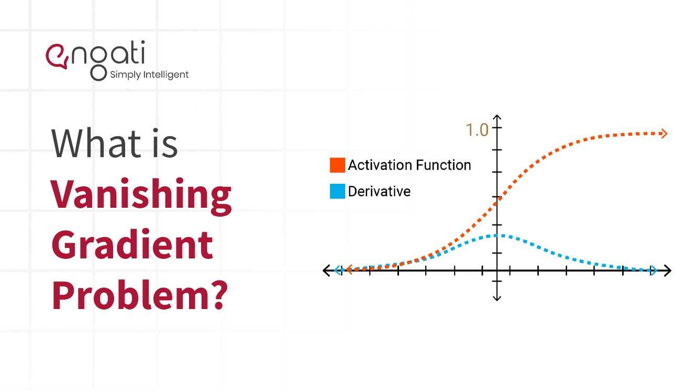

## Table of Contents

## What is the Vanishing Gradient Problem in machine learning?

The Vanishing Gradient Problem is a challenge that happens when training deep neural networks. It occurs when the gradients, which are used to update the network's weights during training, become very small as they are backpropagated through the layers. This makes it hard for the network to learn and update the weights of the earlier layers, because the updates become too small to make a significant difference. As a result, the training process can slow down or stop completely, and the model may not perform well.

To understand why this happens, think about how gradients are calculated in backpropagation. The gradient of a layer depends on the gradients of the layers that come after it. If a layer uses an activation function like the sigmoid, where the derivative can be very small for large inputs, the gradients can get smaller and smaller as they move backwards through the network. This is especially a problem in very deep networks, where there are many layers for the gradients to pass through. Solutions to this problem include using different activation functions, like ReLU, or using techniques like batch normalization or skip connections to help the gradients flow better through the network.

## How does the Vanishing Gradient Problem affect neural networks?

The Vanishing Gradient Problem makes it hard for deep neural networks to learn properly. When we train a neural network, we use something called backpropagation to update the weights of the network. This process involves calculating gradients, which tell us how much to change each weight. The problem happens when these gradients get smaller and smaller as they move backwards through the layers of the network. When the gradients become too small, the weights in the earlier layers don't get updated much, which means those layers don't learn well. This can make the whole network perform poorly because the early layers are important for understanding the basic patterns in the data.

One reason the gradients can vanish is because of the activation functions we use in the network. For example, the sigmoid function, which is often used in neural networks, has a derivative that can be very small for large inputs. When we multiply these small derivatives together over many layers, the gradient can quickly become tiny. This is especially a problem in very deep networks with many layers. To fix this, we can use different activation functions like ReLU, which don't have this problem, or use techniques like batch normalization or skip connections to help the gradients flow better through the network. These solutions help make sure that all parts of the network can learn effectively, even in very deep networks.

## What are the typical symptoms of the Vanishing Gradient Problem?

The Vanishing Gradient Problem can be spotted when a neural network struggles to learn and improve, especially in its deeper layers. You might notice that the training process slows down a lot, and the model's performance doesn't get better even after many training rounds. This happens because the gradients, which are used to update the weights in the network, become very small as they move through the layers. When the gradients are too small, the weights in the early layers don't change much, so those layers don't learn well.

This problem often shows up in very deep neural networks, where there are many layers for the gradients to pass through. If you're using activation functions like the sigmoid, which can have very small derivatives for large inputs, the gradients can shrink even more. For example, the derivative of the sigmoid function is $$ \sigma'(x) = \sigma(x)(1 - \sigma(x)) $$, and for large values of x, this can be very close to zero. This means that when you multiply these small derivatives together over many layers, the gradient can become tiny. To fix this, you might want to use different activation functions like ReLU, or use techniques like batch normalization or skip connections to help the gradients flow better through the network.

## Which types of neural networks are most susceptible to the Vanishing Gradient Problem?

Deep neural networks with many layers are the most likely to have the Vanishing Gradient Problem. This is because the gradients, which are used to update the weights during training, can get smaller and smaller as they move through the layers. When the gradients become too small, the weights in the early layers don't change much, so those layers don't learn well. This can make the whole network perform poorly because the early layers are important for understanding the basic patterns in the data.

Recurrent Neural Networks (RNNs) are also very susceptible to this problem. In RNNs, the same weights are used for each time step, and the gradients need to be backpropagated through time. This can make the gradients even smaller over many time steps, which is known as the long-term dependency problem. To help with this, people often use special types of RNNs like Long Short-Term Memory (LSTM) or Gated Recurrent Unit (GRU) networks, which are designed to keep the gradients from vanishing over long sequences.

## What causes the Vanishing Gradient Problem?

The Vanishing Gradient Problem happens when the gradients used to update the weights in a neural network become very small as they move backwards through the layers. This makes it hard for the network to learn, especially in the early layers, because the updates to the weights become too small to make a big difference. When this happens, the training process can slow down a lot, and the model might not get better even after many rounds of training.

One reason the gradients can vanish is because of the activation functions used in the network. For example, the sigmoid function, which is often used in neural networks, has a derivative that can be very small for large inputs. The derivative of the sigmoid function is $$ \sigma'(x) = \sigma(x)(1 - \sigma(x)) $$, and for large values of x, this can be very close to zero. When you multiply these small derivatives together over many layers, the gradient can quickly become tiny. This is especially a problem in very deep networks with many layers, where there are many layers for the gradients to pass through.

## How can the use of activation functions contribute to or mitigate the Vanishing Gradient Problem?

Activation functions play a big role in whether a neural network will have the Vanishing Gradient Problem. Some activation functions, like the sigmoid function, can make the gradients very small. The sigmoid function squashes its input into a range between 0 and 1, and its derivative, $$ \sigma'(x) = \sigma(x)(1 - \sigma(x)) $$, can be very close to zero for large inputs. When you multiply these small derivatives together over many layers, the gradients can quickly become tiny. This means the weights in the early layers don't change much, and the network struggles to learn.

On the other hand, some activation functions can help prevent the Vanishing Gradient Problem. The ReLU (Rectified Linear Unit) function, for example, doesn't have this problem. ReLU outputs the input directly if it's positive, and zero if it's negative. Its derivative is 1 for positive inputs and 0 for negative inputs, which means the gradients don't get smaller as they move through the network. By using ReLU or similar functions like Leaky ReLU, neural networks can learn better, especially in deep networks where the Vanishing Gradient Problem is more likely to happen.

## What are some common techniques used to address the Vanishing Gradient Problem?

One common way to tackle the Vanishing Gradient Problem is by using different activation functions. The sigmoid function, which squashes its input into a range between 0 and 1, can make gradients very small because its derivative, $$ \sigma'(x) = \sigma(x)(1 - \sigma(x)) $$, can be close to zero for large inputs. Instead of using sigmoid, people often use ReLU (Rectified Linear Unit) because its derivative is either 1 or 0, which helps keep the gradients from getting too small. Other functions like Leaky ReLU and ELU also help in similar ways by not letting the gradients vanish.

Another technique is to use something called batch normalization. This method normalizes the inputs to each layer, which helps keep the gradients from getting too small or too big. By making the inputs to each layer have a mean of zero and a standard deviation of one, batch normalization makes sure the network can learn well even in deep layers. It's like giving each layer a fresh start, which can help the whole network train better and faster.

Skip connections, used in architectures like ResNet, are another way to fight the Vanishing Gradient Problem. Skip connections let the gradients flow directly from later layers to earlier layers, which helps keep the gradients from getting too small. By adding these shortcuts, the network can learn better because the gradients can reach the early layers more easily. This is especially useful in very deep networks where the Vanishing Gradient Problem is more likely to happen.

## How does the choice of weight initialization impact the Vanishing Gradient Problem?

The way you start off the weights in a neural network can make a big difference in whether you run into the Vanishing Gradient Problem. If you start with weights that are too small, the inputs to the activation functions will be small too. This can make the gradients even smaller, especially if you're using activation functions like the sigmoid, where the derivative $$ \sigma'(x) = \sigma(x)(1 - \sigma(x)) $$ can be very close to zero for small inputs. So, starting with small weights can make the gradients vanish more quickly as they move through the layers.

To help with this, people often use special ways to set the starting weights. One popular method is called Xavier/Glorot initialization, which sets the weights based on the size of the layers. This helps make sure the inputs to the activation functions are just right, so the gradients don't get too small or too big. Another method is He initialization, which is good for networks that use ReLU activation functions. By starting with weights that are set up well, you can help the network learn better and avoid the Vanishing Gradient Problem.

## What role do recurrent neural networks (RNNs) play in the context of the Vanishing Gradient Problem?

Recurrent Neural Networks (RNNs) are especially prone to the Vanishing Gradient Problem because they use the same weights for each time step and need to backpropagate gradients through time. In RNNs, the gradients can get smaller and smaller over many time steps, which makes it hard for the network to learn long-term dependencies. This is known as the long-term dependency problem. For example, if an RNN is trying to remember something from far back in a sequence, the gradients might become too small to update the weights effectively, and the network might forget important information.

To help with this, people often use special types of RNNs like Long Short-Term Memory (LSTM) or Gated Recurrent Unit (GRU) networks. These architectures are designed to keep the gradients from vanishing over long sequences. LSTMs and GRUs use special gates that control how information flows through the network, which helps the gradients stay strong even over many time steps. By using these advanced RNNs, you can train the network to remember and use information from earlier in the sequence, which can make the model perform better on tasks that need to understand long-term patterns.

## How have Long Short-Term Memory (LSTM) units and Gated Recurrent Units (GRUs) been developed to combat the Vanishing Gradient Problem?

Long Short-Term Memory (LSTM) units and Gated Recurrent Units (GRUs) were created to solve the Vanishing Gradient Problem in recurrent neural networks (RNNs). RNNs can struggle to remember things from far back in a sequence because the gradients used to update the weights can get very small over time. This makes it hard for the network to learn and use information from earlier steps. LSTMs and GRUs fix this by using special parts called gates. These gates control how information flows through the network, helping to keep the gradients strong even over many time steps. This way, the network can remember and use information from earlier in the sequence, which makes it better at understanding long-term patterns.

In an LSTM, there are three main gates: the input gate, the forget gate, and the output gate. The forget gate decides what information to throw away from the cell state, the input gate decides what new information to add, and the output gate decides what to output based on the cell state. These gates help the LSTM keep important information over long sequences. GRUs are a simpler version of LSTMs. They have two gates: the update gate and the reset gate. The update gate decides how much of the past information to keep, and the reset gate decides how much of the past information to forget. By using these gates, GRUs can also handle the Vanishing Gradient Problem and are often easier to train than LSTMs. Both types of units help RNNs learn better and remember more over time.

## Can you explain the concept of exploding gradients and how it relates to the Vanishing Gradient Problem?

The Vanishing Gradient Problem and the Exploding Gradient Problem are two sides of the same coin when it comes to training neural networks, especially deep ones. The Vanishing Gradient Problem happens when the gradients, which are used to update the weights in the network, become very small as they move backwards through the layers. This makes it hard for the network to learn, especially in the early layers, because the updates to the weights become too small to make a big difference. The sigmoid function, for example, can make the gradients very small because its derivative, $$ \sigma'(x) = \sigma(x)(1 - \sigma(x)) $$, can be close to zero for large inputs. When you multiply these small derivatives together over many layers, the gradients can quickly become tiny.

On the other hand, the Exploding Gradient Problem is when the gradients get too big instead of too small. This can make the weights change too much, causing the network to become unstable and hard to train. Just like with vanishing gradients, this problem is more likely to happen in deep networks where the gradients have to go through many layers. To fix the Exploding Gradient Problem, people often use a technique called gradient clipping, which limits how big the gradients can get. By using this and other methods like choosing the right activation functions and initialization techniques, you can help the network learn better and avoid both the Vanishing and Exploding Gradient Problems.

## What advanced research is being conducted to further solve the Vanishing Gradient Problem in deep learning?

Researchers are always looking for new ways to solve the Vanishing Gradient Problem in deep learning. One approach is to use better initialization methods. For example, some scientists are working on new ways to set the starting weights in a network to help keep the gradients from getting too small or too big. Another idea is to use something called adaptive learning rates, which change how fast the network learns based on what's happening during training. This can help the network learn more smoothly and avoid problems like vanishing gradients.

Another area of research involves creating new types of neural network architectures. Some researchers are working on networks that have special connections, like the skip connections in ResNet, to help the gradients flow better through the layers. Others are looking at different ways to organize the layers in a network, like using hierarchical structures that can learn better over many layers. By trying out these new ideas, scientists hope to make deep learning models that can learn more effectively and avoid the Vanishing Gradient Problem.