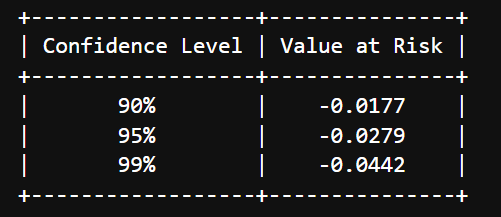

Financial markets are characterized by swift movements. Understanding and quantifying potential losses is imperative. Enter Value at Risk (VaR) – a statistical measure designed to predict the maximum potential loss an investment portfolio might face for a given confidence interval under normal market conditions.

VaR has rapidly become an essential tool in the toolkit of financial analysts, portfolio managers, and risk management professionals globally. Its importance cannot be overstated in today's intricate financial landscape. Its adoption has been driven by its ability to translate complex risk assessments into a single, easily interpretable number. In essence, VaR answers the pressing question every investor seeks to understand: "How much can I lose in the worst-case scenario?"



While there are various methods and tools to compute VaR, Python has emerged as one of the most powerful and flexible languages for this task. With its extensive libraries and user-friendly syntax, Python simplifies the complex calculations required for VaR, making it accessible to both novice and expert users.

In this guide, we will deep dive deep into the world of VaR, exploring its nuances, calculation methods, and real-world applications, all through the lens of Python.

## Table of Contents

## Understanding Value at Risk (VaR)

Value at Risk (VaR) is a risk management tool widely used in the finance industry to measure the potential loss in value of a risky financial portfolio over a specific time period for a given confidence interval. Formally, if we say the VaR of a portfolio over one day is $1 million at the 95% confidence level, it means there is a 5% chance that the portfolio will fall in value by more than $1 million over a one-day period if there is no trading.

VaR’s relevance in portfolio management is undeniable. It provides a quantified estimate of worst-case scenario losses. For instance, portfolio managers use VaR to assess how much capital they may need at risk to cover potential losses, determine trading strategies, and set risk limits. Regulatory bodies also utilize VaR measurements to determine the capital reserves a financial institution requires, ensuring the stability of financial systems.

However, the essence of VaR often prompts the question: How bad can it really get? The interpretation is essential here. While VaR gives a maximum potential loss for a given confidence interval, it doesn't provide any insight into losses exceeding this value. So, in the example mentioned earlier, there's a 5% chance that losses could exceed $1 million, but VaR doesn't quantify by how much. That's where techniques like **Conditional VaR** (or Expected Shortfall) come in, aiming to measure the risk of tail events more accurately.

It's also worth noting that VaR is fundamentally a 'point estimate'. It gives one number to summarize potential future losses, and while this simplicity is one of its strengths, it's also a limitation. Real-world events, especially in finance, are often more complex than a single number can represent. This underlines the importance of using VaR alongside other risk metrics and not treating it as the ultimate answer to risk assessment questions.

For further exploration on this topic, Jorion's "Value at Risk: The New Benchmark for Managing Financial Risk" is an excellent resource that investigates deeper into the concepts and methodologies of VaR[1].

### Pros of using VaR

Value at Risk (VaR) has secured its place as a cornerstone of risk measurement in finance, and there are several compelling reasons for its widespread adoption.

**Easy Comprehension of Results**: One of the primary attractions of VaR is its straightforwardness. Unlike some risk measures that might be abstract or challenging to interpret, VaR provides a direct monetary value, indicating the worst expected loss for a given confidence level over a specified time horizon. This clarity allows both financial experts and stakeholders without a deep financial background to grasp the potential risk of a portfolio at a glance.

**Applicability Across Diverse Asset Types**: VaR is versatile. Whether dealing with equities, bonds, derivatives, or a mixed portfolio containing multiple asset classes, VaR can be applied to measure the risk. Its adaptability is evident in its pervasive use across hedge funds, banks, asset managers, and even in non-financial corporations for risk assessment of their financial exposures.

**Universal Recognition and Usage**: Since its introduction, VaR has not only been a favorite among financial practitioners but also has been recognized by regulatory bodies globally. Many regulators require financial institutions to report VaR figures for certain types of exposures[2]. Its universal recognition stems from a combination of its simplicity, effectiveness in capturing potential losses, and the industry's confidence in the measure, making it an indispensable tool in modern risk management.

### Cons and Limitations of VaR

While Value at Risk (VaR) boasts widespread acceptance in financial risk management, it's crucial for practitioners to recognize its potential pitfalls and limitations.

**Difficulty in Calculation for Diverse Portfolios**: Calculating VaR for a portfolio that contains a mix of asset types—equities, bonds, derivatives, commodities, and more—can become intricate. The interactions between these asset types, especially in times of market stress, can introduce non-linear risks that simple VaR models might overlook. As the complexity of the portfolio grows, so does the computational burden, which might require more sophisticated models and techniques[1].

**Potential for Varying Results Depending on Calculation Methods**: VaR isn't a one-size-fits-all calculation. Different methodologies (e.g., Historical Simulation, Variance-Covariance, or Monte Carlo) can yield different VaR figures for the same portfolio. Factors like the chosen confidence level, time horizon, [and the data](https://paperswithbacktest.com/datasets) sample can all influence the result. This variance between methodologies can sometimes lead to confusion or a false sense of security[3].

**Inherent Assumptions and Their Implications**: Many VaR models operate under certain assumptions, most notably the assumption that asset returns are normally distributed. However, financial markets often exhibit fat tails—events that are statistically unlikely under a normal distribution but occur more frequently in reality. As a result, traditional VaR models might underestimate the risk of extreme market moves. Moreover, VaR provides a point estimate and doesn't inform about the expected loss beyond the VaR threshold.

These limitations do not diminish VaR's value but rather emphasize the importance of understanding its constraints and combining it with other risk measures when making financial decisions.

For a deeper dive into the challenges and nuances of VaR, "Risk Metrics: Technical Document" by J.P. Morgan provides invaluable insights[4].

## Delving Deep into VaR Calculation Methods

### Variance-Covariance Method

The Variance-Covariance approach is one of the most commonly used methods to estimate Value at Risk (VaR). Rooted in the assumptions of modern portfolio theory, it's built on the premise that asset returns are normally distributed and that the relationships between assets, as captured by covariances, remain stable over time[5].

**Conceptual Understanding:**

At its core, the Variance-Covariance method calculates VaR by assessing the [volatility](/wiki/volatility-trading-strategies) of a portfolio. It relies on two primary statistical measures: the average return (mean) and the standard deviation (volatility) of that return. For a single asset, the VaR is typically estimated by finding the z-value corresponding to a specified confidence level in a standard normal distribution and then applying it to the asset's mean return and standard deviation.

For portfolios with multiple assets, the method becomes slightly more intricate as it also considers the covariance between assets, which measures how two assets’ returns move in relation to each other.

**Python Implementation:**

Let's demonstrate the Variance-Covariance method with a simple Python implementation for a single asset:

```python
import numpy as np
from scipy.stats import norm

## Sample data: past returns of an asset
returns = np.array([...])

## Confidence level: e.g., 95%
alpha = 0.05

## Calculate mean and standard deviation of returns
mean_return = np.mean(returns)
std_return = np.std(returns)

## Calculate VaR
var_95 = mean_return - norm.ppf(1-alpha) * std_return
print(f"95% VaR: {var_95:.2f}")
```

**Use Case: Demonstrating VaR Calculation for a Sample Portfolio:**

For a two-asset portfolio, the VaR is influenced by the weights of assets, their individual volatilities, and the correlation between them. Here's a basic example:

```python
## Sample data: past returns of two assets
returns_asset1 = np.array([...])
returns_asset2 = np.array([...])

## Weights of assets in the portfolio
w1, w2 = 0.6, 0.4

## Calculate means and standard deviations
mean1, mean2 = np.mean(returns_asset1), np.mean(returns_asset2)
std1, std2 = np.std(returns_asset1), np.std(returns_asset2)

## Calculate portfolio mean and standard deviation
portfolio_mean = w1 * mean1 + w2 * mean2
portfolio_var = w1**2 * std1**2 + w2**2 * std2**2 + 2 * w1 * w2 * np.cov(returns_asset1, returns_asset2)[0][1]
portfolio_std = np.sqrt(portfolio_var)

## Calculate portfolio VaR
portfolio_var_95 = portfolio_mean - norm.ppf(1-alpha) * portfolio_std
print(f"95% Portfolio VaR: {portfolio_var_95:.2f}")
```

This approach can be extended to portfolios with more assets, but it's vital to consider the covariance matrix's size and complexity as the number of assets grows.

In practice, financial institutions often employ the Variance-Covariance method due to its mathematical elegance and relative simplicity, [especially when historical data might not be extensive or reliable](https://blog.paperswithbacktest.com/p/how-to-collect-data-for-[backtesting](/wiki/backtesting)).

### Historical Simulation Method

Historical Simulation is a non-parametric approach to estimate Value at Risk (VaR), relying on actual historical return data without making assumptions about return distributions. By using actual market data, it accounts for extreme market events and non-linear relationships among assets.

**Basics and Advantages:**

1. **Simplicity**: One of the most straightforward methods to understand and implement, it involves reordering historical returns and picking a value corresponding to the desired confidence level.
2. **No Distribution Assumption**: Unlike the Variance-Covariance method, which assumes returns follow a normal distribution, Historical Simulation makes no such assumptions. This can lead to more accurate VaR estimates, especially during market upheavals.
3. **Incorporates Market Events**: Captures actual market events, allowing for "real-world" shock scenarios to be included in the analysis.

**Python Implementation:**

Given a series of historical returns and a desired confidence level, the Historical Simulation method involves the following steps:

```python
import numpy as np

## Sample data: past returns of an asset
returns = np.array([...])

## Desired confidence level, e.g., 95%
alpha = 0.05

## Sort the returns
sorted_returns = np.sort(returns)

## Determine the index corresponding to the (1-alpha) quantile
index = int((len(sorted_returns) - 1) * alpha)

## Extract the VaR from the sorted returns
var_95 = -sorted_returns[index]
print(f"95% VaR: {var_95:.2f}")
```

**Real-world Application: Calculating VaR for a Real Stock or Portfolio:**

To illustrate this, let's consider the historical daily returns of Apple Inc. over the past year. Assuming you have collected this data and stored it in a Python list:

```python
## Sample data: past returns of Apple Inc.
apple_returns = np.array([...])

sorted_apple_returns = np.sort(apple_returns)
index_apple = int((len(sorted_apple_returns) - 1) * alpha)
var_95_apple = -sorted_apple_returns[index_apple]
print(f"95% VaR for Apple Inc.: {var_95_apple:.2f}")
```

By observing the 95% VaR for Apple Inc., we can determine the maximum expected loss for a given day, at a 95% confidence level, based on historical data. It's worth noting that while Historical Simulation provides a direct way to assess VaR, it's also sensitive to the length and relevance of the historical data used[6].

### Parametric and Semi-Parametric VaR

Parametric and Semi-Parametric VaR methods are advanced methodologies that enhance VaR estimation by accounting for the intricacies of financial data distribution. While Parametric VaR assumes a specific distribution for returns, such as the normal distribution, Semi-Parametric VaR leverages both parametric and non-parametric techniques to capture tail risks[1].

**Introduction to These Advanced VaR Methodologies:**

- **Parametric VaR**: Also known as Analytical VaR, this method assumes that asset returns follow a specific distribution. The most common assumption is the normal distribution, but other distributions like Student's t can be employed to account for fat tails often observed in financial returns.
- **Semi-Parametric VaR**: This method combines elements of both parametric and non-parametric VaR. It might employ a parametric approach to model the center of the distribution while using non-parametric methods to capture the tails[7]. This duality can offer a more refined VaR estimate, especially in complex markets.

**Distinctive Features and When to Use Them:**

1. **Flexibility**: Parametric VaR allows for the [modeling of returns](https://paperswithbacktest.com/course) using various distributions, adapting to the peculiarities of different financial datasets.
2. **Tail Estimation**: Semi-Parametric VaR, with its hybrid nature, provides a more accurate estimate of tail risks which are vital in capturing extreme market events.
3. **Use Case Determination**: If asset returns seem to adhere to known distributions, like the normal or Student's t-distribution, then Parametric VaR is suitable. For more complex datasets, where tail risks are crucial, a Semi-Parametric approach might be more apt.

**Python Code Breakdown and Usage Examples:**

1. **Parametric VaR using Normal Distribution**:
    
    Here's how you can compute Parametric VaR assuming returns follow a normal distribution:
    
    ```python
    import numpy as np
    from scipy.stats import norm
    
    # Sample data: past returns of an asset
    returns = np.array([...])
    
    mean_return = np.mean(returns)
    std_dev_return = np.std(returns)
    
    # Compute VaR at 95% confidence level
    alpha = 0.05
    var_95 = mean_return - norm.ppf(1-alpha) * std_dev_return
    print(f"95% VaR (Parametric): {var_95:.2f}")
    ```
    
2. **Semi-Parametric VaR**:
    
    A simple example involves combining Parametric VaR for central data and Historical Simulation for tail risks:
    
    ```python
    sorted_returns = np.sort(returns)
    
    # Use Parametric VaR for the center (e.g., up to 90% quantile)
    center_var = mean_return - norm.ppf(0.9) * std_dev_return
    
    # Use Historical Simulation for the tails (e.g., last 10%)
    tail_var = -sorted_returns[int(len(sorted_returns) * 0.9)]
    
    semi_parametric_var_95 = (center_var if alpha > 0.1 else tail_var)
    print(f"95% VaR (Semi-Parametric): {semi_parametric_var_95:.2f}")
    ```
    

While this is a basic illustration, more sophisticated methods can be used to determine the merging point between the parametric and non-parametric portions.

## Advanced VaR Techniques and Considerations

### Monte Carlo Simulation in VaR

Monte Carlo Simulation (MCS) is a computational method that allows risk analysts to model the probability of different outcomes in a process that cannot be easily predicted due to the intervention of random variables[8]. MCS is highly versatile and is used in various fields, from physics to finance, and of [course](/wiki/best-algorithmic-trading-courses), in the estimation of Value at Risk.

When applied to VaR estimation, Monte Carlo methods involve generating a large number of random price paths for financial instruments and then determining an instrument's maximum potential loss over the desired holding period at a given confidence level. It does this by repeatedly drawing random samples from the distribution of returns.

**Benefits**:

1. **Flexibility**: MCS does not assume a particular distribution for asset returns, making it adaptable to different financial scenarios.
2. **Complex Instruments**: It's especially useful for complex derivatives or instruments for which the return distribution is difficult to ascertain from historical data alone.
3. **Multifactor Models**: Monte Carlo can handle multifactor models, where multiple variables might influence the outcome.

**Limitations**:

1. **Computational Intensity**: Requiring a large number of simulated price paths, MCS can be computationally expensive.
2. **Model Risk**: The accuracy of VaR estimates using MCS is heavily reliant on the model's assumptions for price behavior and return distribution.
3. **Data Hungry**: Requires a substantial amount of data for accurate simulations.

**Python Implementation with Tutorial-Style Walkthrough**:

Let's demonstrate a basic Monte Carlo Simulation to estimate VaR for a hypothetical stock. The stock has an expected daily return of 1% and a daily volatility of 2%.

```python
import numpy as np

## Set seed for reproducibility
np.random.seed(42)

## Define parameters
num_simulations = 10000  # Number of simulations
days = 1  # One day VaR
mean_daily_return = 0.01
daily_volatility = 0.02
initial_price = 100  # Hypothetical stock price

## Monte Carlo simulation
simulated_paths = np.zeros(num_simulations)

for i in range(num_simulations):
    daily_return = np.random.normal(mean_daily_return, daily_volatility)
    simulated_price = initial_price * (1 + daily_return)
    simulated_paths[i] = (initial_price - simulated_price) / initial_price

## Calculate VaR at 95% confidence level
var_95 = np.percentile(simulated_paths, 5)
print(f"95% VaR (Monte Carlo): {-var_95*initial_price:.2f}")
```

In this example, we simulate the price paths of our hypothetical stock 10,000 times using a normal distribution. We then determine the 5th percentile of the losses, representing the 1-day 95% VaR.

Keep in mind, this is a simple illustration. In practice, MCS for VaR would likely involve more [factor](/wiki/factor-investing)s, especially for multifactor models or complex financial instruments.

### VaR for Multi-Asset Portfolios

Computing Value at Risk (VaR) for multi-asset portfolios poses unique challenges, mainly because assets in a portfolio don't operate in isolation. Their returns are correlated, and these correlations play a pivotal role in determining the portfolio's overall risk.

**Challenges in Computing VaR for Diverse Portfolios**:

1. **Correlation Dynamics**: Asset returns in a portfolio can be correlated positively, negatively, or be independent. These correlations can change over time, especially during market turmoil, which affects the VaR.
2. **Data Granularity**: Accurate VaR computation requires fine-grained data, especially when dealing with diverse assets. Different assets might have data available at different frequencies or timeframes.
3. **Complexity in Aggregation**: As portfolios become more diverse, incorporating derivatives or alternative investments, aggregating their risks accurately for VaR calculation becomes complex.

**Strategies and Methods to Overcome Challenges**:

1. **Time-varying Correlations**: Employing models that allow for changing correlations, such as the Dynamic Conditional Correlation (DCC) model, can be beneficial.
2. **Use of Copulas**: Copulas allow for the modeling of joint distribution of returns, which can be employed to capture the dependency structure in a portfolio.
3. **Factor Models**: By reducing a large set of assets to a few common factors, factor models can simplify the VaR calculation process.

### Backtesting VaR Models

[Backtesting is](https://blog.paperswithbacktest.com/p/backtesting-a-trading-strategy-on) the process of testing a model's predictions on historical data, [a crucial step in validating any financial model](https://blog.paperswithbacktest.com/p/backtesting-a-trading-strategy-on), especially VaR. If a VaR model is accurate, the number of times losses exceed the VaR estimate should align with the confidence level. For instance, for a 95% VaR, we would expect only 5% of the returns to breach this threshold.

**Importance of Backtesting in Validating VaR Estimates**:

- **Validation of Model Assumptions**: Backtesting exposes underlying assumptions, ensuring they align with real-world observations.
- **Model Comparisons**: By backtesting multiple VaR models on the same dataset, one can gauge which model performs better.
- **Regulatory Requirements**: Regulatory bodies in many jurisdictions require financial institutions to backtest their risk models.

**Methods for Backtesting and Their Significance**:

1. **Unconditional Coverage Test**: This tests the accuracy of the VaR breaches. The actual number of breaches is compared with the expected number.
2. **Conditional Coverage Test**: This test focuses not only on the number of breaches but also on the clustering of breaches.
3. **Tuffery's Test**: A graphical approach where VaR is plotted against actual returns. VaR breaches can be visually identified.

**Python Code to Run Backtests and Interpret Results**:

Assuming we have a pandas dataframe `df` with columns 'Returns' and 'VaR_95', a simple backtest can be executed as:

```python
import pandas as pd

## Sample data: Replace with actual returns and VaR estimates
data = {
    'Returns': [-0.02, -0.015, 0.03, -0.04, 0.01],
    'VaR_95': [-0.03, -0.025, -0.025, -0.03, -0.03]
}
df = pd.DataFrame(data)

## Count the number of VaR breaches
breaches = df[df['Returns'] < df['VaR_95']]
num_breaches = len(breaches)

## Calculate expected breaches for a 95% VaR
expected_breaches = len(df) * 0.05

print(f"Number of VaR breaches: {num_breaches}")
print(f"Expected number of breaches: {expected_breaches}")
```

This simple code gives a first-hand understanding of the model's performance. However, more sophisticated statistical tests would be required for a rigorous evaluation. One such test, the unconditional coverage test, is implemented in the `arch` package in Python.

## Comparing VaR Across Platforms

Value at Risk calculations can be performed on various platforms, and the choice of platform often depends on the user's requirements, familiarity, and the complexity of the underlying assets. One of the most popular platforms, apart from Python, for conducting VaR calculations is Excel.

**Overview of VaR Calculation in Excel**:

Excel is widely adopted in the finance world due to its ease of use and familiarity. VaR calculations in Excel typically involve the use of in-built statistical functions or add-ins like the Analysis ToolPak[9]. Users can apply historical data to calculate VaR through:

1. **Variance-Covariance method**: Using functions like `STDEV.P` and `NORM.INV`.
2. **Historical Simulation method**: By sorting historical data and picking the relevant percentile.
3. **Monte Carlo Simulation**: Although more complex, it's feasible with Excel's random number generation and the use of VBA for iterations.

**Benefits of Using Python Over Other Platforms for VaR Calculations**:

1. **Scalability**: Python is inherently designed for handling large datasets, making it efficient for large-scale and complex financial models.
2. **Libraries and Modules**: Python boasts a plethora of specialized libraries like `numpy`, `pandas`, and `scipy` that streamline financial calculations and modeling.
3. **Flexibility**: While Excel might require the addition of external tools or plugins (like Solver or VBA scripting) for advanced computations, Python offers the inherent ability to integrate with other services or perform complex algorithms without additional overhead.
4. **Reproducibility and Automation**: Python scripts can be executed automatically, facilitating scheduled risk reporting, while Excel workflows might require more manual intervention.
5. **Integration with Databases and APIs**: Python effortlessly integrates with databases and can fetch real-time data from APIs, ensuring the most updated data is always used for VaR calculations.
6. **Collaboration and Version Control**: Python scripts can be managed with tools like Git, making collaborative work and version control straightforward.

## Integrating VaR in Modern Portfolio Theory

Modern Portfolio Theory (MPT) propounds the idea of optimizing a portfolio not just based on expected returns but also considering the risks associated with those returns. In this framework, Value at Risk (VaR) becomes instrumental, serving as a quantitative risk measure that can help optimize portfolios for maximum returns at a given level of risk, or conversely, minimize risk for a desired level of return.

**VaR's Role in Portfolio Optimization and Asset Allocation**:

1. **Risk Quantification**: VaR provides a clear, quantifiable estimate of the worst expected loss over a specific horizon, under normal market conditions. This estimate can be directly incorporated into MPT's objective functions when selecting the optimal mix of assets.
2. **Asset Allocation**: Asset allocation decisions involve determining the proportion of funds to invest in various asset classes like stocks, bonds, or commodities. VaR allows investors to gauge the risk contribution of individual assets or asset classes to the portfolio, thus enabling more informed allocation decisions.
3. **Risk-Adjusted Performance Metrics**: Incorporating VaR into metrics such as the Sharpe ratio or the Sortino ratio can provide a more nuanced understanding of the risk-return trade-off. For instance, a portfolio that seeks to maximize the Sharpe ratio while staying below a specified VaR threshold would be seeking the best return per unit of total risk, but without exceeding an acceptable loss threshold.

**Python for Portfolio Management Using VaR**:

Python's rich ecosystem offers a suite of tools that make it conducive for integrating VaR into portfolio optimization tasks. Specifically, the `scipy` library, with its optimization module, is adept at this task.

Here's a simplified approach to incorporate VaR in portfolio optimization using `scipy`:

```python
import numpy as np
from scipy.optimize import minimize

## Define portfolio returns and covariance matrix
returns = np.array([...])
cov_matrix = np.array([...])

## VaR parameters
alpha = 0.05  # 95% confidence level
initial_weights = np.array([...])

## Objective function: Minimize negative Sharpe Ratio (for maximization)
def objective(weights):
    portfolio_return = np.dot(weights, returns)
    portfolio_std = np.sqrt(np.dot(weights.T, np.dot(cov_matrix, weights)))
    return -portfolio_return / portfolio_std

## Constraint for VaR
def VaR_constraint(weights):
    portfolio_return = np.dot(weights, returns)
    portfolio_std = np.sqrt(np.dot(weights.T, np.dot(cov_matrix, weights)))
    VaR = -portfolio_return + alpha * portfolio_std
    return VaR_threshold - VaR  # VaR should be below a specified threshold

constraints = ({'type': 'eq', 'fun': lambda weights: np.sum(weights) - 1},
               {'type': 'ineq', 'fun': VaR_constraint})

optimized = minimize(objective, initial_weights, constraints=constraints)
optimal_weights = optimized.x
```

By integrating VaR in portfolio optimization algorithms, investors can make more nuanced and risk-informed decisions, which aligns with the core tenets of Modern Portfolio Theory.

## VaR in the Real World: Use Cases and Stories

Value at Risk (VaR) isn't just a theoretical construct; it has real-world implications, and its utility (or sometimes, miscalculations) have been underscored in several significant financial events.

**J.P. Morgan and RiskMetrics**:

One of the most cited early successes of VaR is its implementation by J.P. Morgan in the early 1990s. Recognizing the need for a comprehensive risk management system, the bank developed a proprietary system called RiskMetrics, which used VaR as a central measure. In a pioneering move in 1994, J.P. Morgan released the RiskMetrics methodology to the public, thereby standardizing VaR as an industry-wide risk metric. This initiative not only promoted transparency but also solidified VaR's position as a cornerstone of modern financial risk management.

**The Long-Term Capital Management (LTCM) Crisis**:

Conversely, the LTCM crisis in 1998 served as a cautionary tale about the limitations of VaR. LTCM, a major [hedge fund](/wiki/hedge-fund-trading-strategies) managed by two Nobel laureates, had built complex models, heavily relying on VaR, to manage its portfolio risks. However, during the Russian financial crisis, the actual losses exceeded the predicted VaR by significant magnitudes, leading to a bailout to prevent a broader financial meltdown[10]. This event underscored the importance of understanding VaR's assumptions and its limitations, particularly during extreme market events.

**The 2008 Financial Crisis**:

The global financial crisis of 2008 brought VaR back into the limelight. Many institutions reported that their losses during the crisis far exceeded their VaR estimates. Critics argued that an over-reliance on VaR, without considering its underlying assumptions and the potential for "black swan" events, played a role in the crisis[11]. However, others defended VaR, asserting that its misuse or misinterpretation was the problem, not the metric itself.

## The Evolution of VaR Post Financial Crises

Following these significant financial events, there was a collective realization that while VaR was useful, it wasn't infallible. The aftermath of these crises witnessed an evolution in the application and interpretation of VaR:

- **Stressed VaR**: Regulatory bodies, recognizing the limitations of VaR during extreme market events, introduced the concept of Stressed VaR (sVaR). sVaR requires institutions to calculate VaR under stressed market conditions, ensuring that they are prepared for significant market downturns.
- **Complementary Metrics**: Post-crisis, institutions started complementing VaR with other risk measures like Conditional Value at Risk (CVaR) or Expected Shortfall, which consider potential losses beyond the VaR threshold.
- **Enhanced Reporting and Transparency**: Regulatory frameworks, such as Basel III, mandated more rigorous and transparent risk reporting, ensuring that stakeholders understand the risk profile and potential vulnerabilities of financial institutions.

In conclusion, VaR's journey, punctuated by both successes and failures, reflects the evolving nature of financial risk management. The real-world implications of VaR underscore its significance and the continual need for its refinement and adaptation.

## Conclusion

Value at Risk (VaR) stands as a cornerstone in financial risk management, offering a quantifiable measure that captures potential losses across portfolios. Its prominence has only grown with the evolution of financial markets, reflecting the industry's demand for robust, reliable risk metrics.

Python, with its versatility and expansive libraries, has proven to be an indispensable tool for implementing and optimizing VaR calculations. Whether it's the traditional Variance-Covariance method, the Historical Simulation approach, or advanced techniques like Monte Carlo simulations, Python provides the computational power and flexibility required to handle these methodologies efficiently.

Beyond mere calculations, Python's role extends to integrating VaR insights into broader financial strategies, such as portfolio optimization in Modern Portfolio Theory. The dynamic duo of Python and VaR not only streamlines risk analysis but also paves the way for innovative risk management solutions.

## References & Further Reading

[1]: Jorion, P. (2007). [Value at Risk: The New Benchmark for Managing Financial Risk](https://www.amazon.com/Value-Risk-Benchmark-Managing-Financial/dp/0071355022). McGraw-Hill Education.

[2]: Basel Committee on Banking Supervision. (1996). "[Amendment to the Capital Accord to incorporate market risks.](https://www.bis.org/publ/bcbs24.htm)" Bank for International Settlements.

[3]: Dowd, K. (2005). "[Measuring Market Risk](https://www.amazon.com/Measuring-Market-Risk-Kevin-Dowd/dp/0470013036)." Wiley.

[4]: J.P. Morgan/Reuters. (1996). "[RiskMetrics: Technical Document](https://www.msci.com/documents/10199/5915b101-4206-4ba0-aee2-3449d5c7e95a)." Fourth Edition.

[5]: Linsmeier, T. J., & Pearson, N. D. (1996). "[Risk Measurement: An Introduction to Value at Risk](https://www.exinfm.com/training/pdfiles/valueatrisk.pdf)". University of Illinois.

[6]: Pritsker, M. (2006). "[The Hidden Dangers of Historical Simulation](https://www.federalreserve.gov/pubs/feds/2001/200127/200127pap.pdf)." Journal of Banking & Finance.

[7]: Danielsson, J. (2011). "[Financial Risk Forecasting: The Theory and Practice of Forecasting Market Risk with Implementation in R and Python](https://www.financialriskforecasting.com/)." Wiley.

[8]: Glasserman, P. (2004). "[Monte Carlo Methods in Financial Engineering](https://link.springer.com/book/10.1007/978-0-387-21617-1)." Springer.

[9]: Microsoft Support. (2021). "[Use the Analysis ToolPak to perform complex data analysis](https://support.microsoft.com/en-au/office/use-the-analysis-toolpak-to-perform-complex-data-analysis-6c67ccf0-f4a9-487c-8dec-bdb5a2cefab6)."

[10]: Lowenstein, R. (2000). [*When Genius Failed: The Rise and Fall of Long-Term Capital Management*](https://www.amazon.com/When-Genius-Failed-Long-Term-Management/dp/0375758259). Random House.

[11]: Taleb, N. (2007). [*The Black Swan: The Impact of the Highly Improbable*](https://www.amazon.com/Black-Swan-Impact-Highly-Improbable/dp/0141034599). Random House