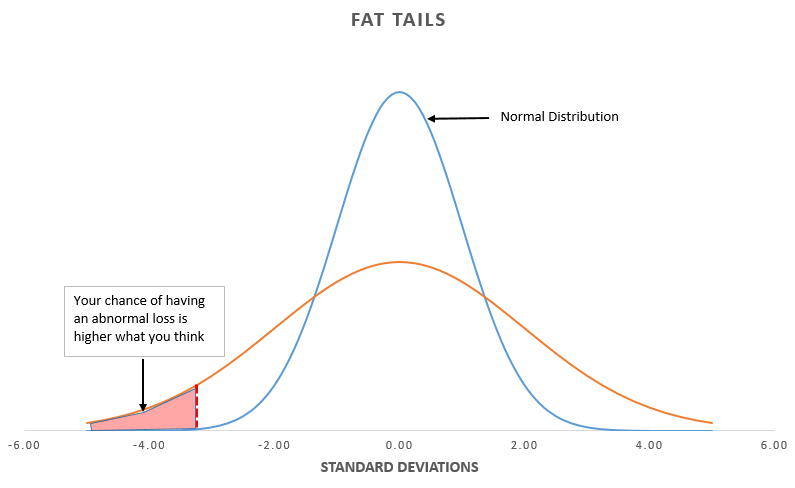

## Table of Contents

## What is Value at Risk (VaR) and why is it important in finance?

Value at Risk, often called VaR, is a way to measure how much money you could lose from an investment over a certain period of time. It tells you the maximum amount you might lose with a certain level of confidence, usually 95% or 99%. For example, if your VaR is $100,000 at a 95% confidence level over one day, it means there's a 5% chance you could lose more than $100,000 in a single day.

VaR is important in finance because it helps people and companies understand and manage the risks of their investments. By knowing the potential losses, they can make better decisions about how much risk to take. It's like a safety tool that helps prevent big financial surprises. Banks and investment firms use VaR to set limits on how much risk they are willing to take, and regulators use it to make sure these institutions are not taking too many risks.

## How does VaR help in managing risk in algorithmic trading?

In algorithmic trading, VaR helps traders understand the worst-case scenario for their investments. It tells them how much money they might lose on a bad day, which is really important when computers are making trading decisions super fast. By knowing this, traders can set up their algorithms to avoid taking too much risk. They can program the computers to stop trading if the potential losses get too high, which helps protect their money.

VaR also helps traders compare different trading strategies. If one strategy has a lower VaR, it means it's less risky, and traders might choose that one if they want to be safer. This way, VaR acts like a guide, helping traders pick the best path through the ups and downs of the market. By using VaR, traders can make smarter choices and keep their trading within safe limits.

## What are the different methods to calculate VaR in Python?

There are three main ways to calculate Value at Risk (VaR) in Python: the historical simulation method, the variance-covariance method, and the Monte Carlo simulation method. The historical simulation method uses past data to predict future risk. You take the historical returns of your investment, sort them from worst to best, and find the return at the point that matches your confidence level. For example, if you want a 95% confidence level, you look at the 5th percentile of the sorted returns. This method is easy to understand and code in Python using libraries like Pandas to handle the data sorting and calculations.

The variance-covariance method, also called the parametric method, assumes that returns follow a normal distribution. You need to calculate the mean and standard deviation of the returns. Then, you can use these to find the VaR. In Python, you can use NumPy to calculate the mean and standard deviation, and then use the normal distribution function to find the VaR at your chosen confidence level. This method is quick and works well if the returns really do follow a normal distribution, but it might not be as accurate if they don't.

The Monte Carlo simulation method uses random numbers to simulate many possible future outcomes. You create a model of how your investment might perform, then run it many times with different random inputs. Each run gives you a possible future return, and you collect all these returns to find the VaR at your chosen confidence level. In Python, you can use libraries like NumPy for the random number generation and Pandas to handle the data. This method can be more accurate than the others because it can handle complex situations, but it takes more time and computing power.

## Can you explain the variance-covariance method for calculating VaR?

The variance-covariance method for calculating Value at Risk (VaR) is based on the idea that the returns of your investment follow a normal distribution, like a bell curve. To use this method, you need to figure out the average return and how much the returns usually vary, which is called the standard deviation. Once you have these numbers, you can use them to find the VaR. For example, if you want a 95% confidence level, you need to find the return that is 1.65 standard deviations below the average return. This is because, in a normal distribution, 95% of the data falls within 1.65 standard deviations of the mean.

In Python, you can use the NumPy library to calculate the mean and standard deviation of your returns. After you have these numbers, you can use the normal distribution function from NumPy to find the VaR. You just need to plug in the mean, standard deviation, and the number of standard deviations for your chosen confidence level. This method is quick and easy to use, but it only works well if your returns really do follow a normal distribution. If they don't, the VaR you calculate might not be very accurate.

## How do you implement the historical simulation method for VaR in Python?

To implement the historical simulation method for calculating Value at Risk (VaR) in Python, you first need to gather historical data on the returns of your investment. This data can be stored in a list or a Pandas DataFrame. Once you have the data, you sort the returns from the worst to the best. If you want a 95% confidence level, you need to find the return at the 5th percentile of your sorted list. This means you look at the return that is worse than 95% of the other returns. In Python, you can use the Pandas library to sort the data and find the percentile easily.

For example, if you have a list of daily returns in a Pandas DataFrame called `returns`, you can sort it and find the 5th percentile like this: `sorted_returns = returns.sort_values()` and `var_95 = sorted_returns.quantile(0.05)`. The value you get from `var_95` is your VaR at a 95% confidence level. This method is simple and doesn't assume that returns follow a normal distribution, so it can be more accurate for real-world data. However, it relies on the past to predict the future, so if the market changes a lot, the VaR might not be as useful.

## What is the Monte Carlo simulation method for VaR and how to code it in Python?

The Monte Carlo simulation method for calculating Value at Risk (VaR) uses random numbers to guess what might happen in the future. You make a model of how your investment might do, then run it many times with different random numbers. Each time you run it, you get a possible future return. You collect all these returns and sort them from worst to best. If you want a 95% confidence level, you look at the return that is worse than 95% of the others. This method can be more accurate than others because it can handle tricky situations, but it takes more time and computer power.

To code the Monte Carlo simulation method in Python, you can use the NumPy library to make random numbers and the Pandas library to handle the data. First, you need to make a model of how your investment might do. This could be something simple like saying the returns follow a normal distribution with a certain average and spread. Then, you use NumPy to make a bunch of random returns based on your model. You run this many times, like 10,000 times, to get a lot of possible future returns. After that, you put all these returns into a Pandas DataFrame, sort them, and use the `quantile` function to find the VaR at your chosen confidence level. For example, if you want a 95% confidence level, you use `quantile(0.05)` to find the 5th percentile, which is your VaR.

## How can you backtest VaR models to ensure their accuracy?

Backtesting VaR models means checking if they work well by comparing what they predict with what actually happens. You do this by looking at past data and seeing if the losses were bigger than the VaR more often than they should be. For example, if your VaR is set at a 95% confidence level, you expect losses to be bigger than the VaR only 5% of the time. If you find that losses are bigger than the VaR more often than 5%, your model might not be accurate enough.

To backtest, you can use something called the "violation ratio." This is just the number of times the actual losses were bigger than the VaR, divided by the total number of times you checked. If your VaR is at a 95% confidence level, the violation ratio should be close to 0.05. If it's a lot different, like 0.10 or 0.02, your VaR model might need to be fixed. By doing this kind of check, you can make sure your VaR model is giving you good information about the risks you're taking.

## What are the limitations and criticisms of using VaR in risk management?

One big problem with using VaR in risk management is that it can make people feel too safe. VaR tells you the most you might lose with a certain level of confidence, but it doesn't say anything about how bad things could get if they go really wrong. For example, if your VaR says you might lose up to $100,000 with 95% confidence, it doesn't tell you what could happen in the other 5% of cases. This can lead to big surprises if things go much worse than expected. Also, VaR assumes that past data can predict the future, which isn't always true. Markets can change a lot, and what happened before might not happen again.

Another criticism of VaR is that it can be hard to calculate correctly. Different methods like historical simulation, variance-covariance, and Monte Carlo simulation can give different results. This means that two people looking at the same investment might come up with different VaR numbers, which can be confusing. Also, VaR often assumes that returns follow a normal distribution, but in real life, returns can be much more unpredictable. This can make VaR less accurate and reliable. Because of these issues, some people think that VaR should be used with other risk measures to get a better picture of the risks involved.

## How does VaR integrate with other risk management tools in algorithmic trading?

In algorithmic trading, VaR is often used together with other risk management tools to make sure traders are not taking too much risk. One common tool is stop-loss orders, which automatically sell an investment if it loses too much value. By knowing the VaR, traders can set these stop-loss orders at the right level to protect their money. Another tool is stress testing, which looks at how an investment might do in really bad situations. VaR can help traders decide which bad situations to test, making the stress tests more useful.

VaR also works well with risk limits, which are rules that say how much risk a trader can take. For example, a trader might have a rule that says they can't have a VaR higher than a certain amount. By checking the VaR regularly, traders can make sure they are following these rules. This helps them keep their trading safe and within the limits set by their company or by regulators. By using VaR along with these other tools, traders can get a better understanding of their risks and make smarter decisions.

## What advanced techniques can be used to enhance VaR calculations in Python?

One advanced technique to enhance VaR calculations in Python is to use more complex models of how returns behave. Instead of assuming returns follow a normal distribution, you can use models that can handle the fact that returns can be more unpredictable. For example, you can use a model called GARCH, which stands for Generalized Autoregressive Conditional Heteroskedasticity. This model can capture how the risk of an investment can change over time. In Python, you can use libraries like `arch` to fit a GARCH model to your data and then use it to make better guesses about future returns. This can make your VaR calculations more accurate because they take into account how the risk of your investment can change.

Another technique is to use machine learning to predict future returns. You can train a model on past data to guess what might happen next. For example, you can use a neural network to look at lots of different things that might affect your investment, like stock prices, economic news, and even social media sentiment. In Python, you can use libraries like `TensorFlow` or `scikit-learn` to build and train these models. Once you have a model that can predict future returns well, you can use it to run a Monte Carlo simulation and calculate VaR. This can give you a more accurate VaR because it takes into account more information than just past returns.

## How can VaR be used to optimize trading strategies in algorithmic trading?

VaR can help optimize trading strategies in algorithmic trading by giving traders a clear idea of how much risk they are taking. By knowing the VaR, traders can adjust their strategies to keep the risk at a level they are comfortable with. For example, if a strategy has a high VaR, meaning it could lose a lot of money on a bad day, traders might decide to trade less of that investment or set tighter stop-loss orders to limit potential losses. This way, VaR acts like a guide, helping traders find the right balance between making money and keeping their investments safe.

Another way VaR can optimize trading strategies is by helping traders compare different strategies. If one strategy has a lower VaR than another, it means it's less risky. Traders can use this information to choose the strategy that fits their risk tolerance best. By regularly checking the VaR of their strategies, traders can make sure they are not taking too much risk and can adjust their trading as the market changes. This helps them make smarter decisions and keep their trading within safe limits.

## What are the regulatory considerations for using VaR in financial institutions?

Financial institutions have to follow rules set by regulators when they use VaR to manage risk. Regulators want to make sure that banks and other financial companies are not taking too much risk. They often set rules about how VaR should be calculated and how often it should be checked. For example, banks might have to use a certain method to calculate VaR, like the historical simulation method, and they might have to check their VaR every day. Regulators also look at how often the actual losses are bigger than the VaR to see if the banks' models are working well.

Another important rule is that financial institutions have to hold enough money to cover potential losses. This is called capital requirements. If a bank's VaR is high, it means they might lose a lot of money, so they have to keep more money in reserve. Regulators check these capital requirements to make sure banks can handle bad days without going broke. By following these rules, financial institutions can use VaR to manage risk in a way that keeps everyone's money safe.

## References & Further Reading

[1]: Jorion, P. (2007). [Value at Risk: The New Benchmark for Managing Financial Risk](https://www.amazon.com/Value-Risk-Benchmark-Managing-Financial/dp/0071355022). McGraw-Hill Education.

[2]: Basel Committee on Banking Supervision. (1996). "[Amendment to the Capital Accord to incorporate market risks.](https://www.bis.org/publ/bcbs24.htm)" Bank for International Settlements.

[3]: Dowd, K. (2005). "[Measuring Market Risk](https://www.amazon.com/Measuring-Market-Risk-Kevin-Dowd/dp/0470013036)." Wiley.

[4]: J.P. Morgan/Reuters. (1996). "[RiskMetrics: Technical Document](https://www.msci.com/documents/10199/5915b101-4206-4ba0-aee2-3449d5c7e95a)." Fourth Edition.

[5]: Linsmeier, T. J., & Pearson, N. D. (1996). "[Risk Measurement: An Introduction to Value at Risk](https://www.exinfm.com/training/pdfiles/valueatrisk.pdf)". University of Illinois.

[6]: Pritsker, M. (2006). "[The Hidden Dangers of Historical Simulation](https://www.federalreserve.gov/pubs/feds/2001/200127/200127pap.pdf)." Journal of Banking & Finance.

[7]: Danielsson, J. (2011). "[Financial Risk Forecasting: The Theory and Practice of Forecasting Market Risk with Implementation in R and Python](https://www.financialriskforecasting.com/)." Wiley.

[8]: Glasserman, P. (2004). "[Monte Carlo Methods in Financial Engineering](https://link.springer.com/book/10.1007/978-0-387-21617-1)." Springer.

[9]: Microsoft Support. (2021). "[Use the Analysis ToolPak to perform complex data analysis](https://support.microsoft.com/en-au/office/use-the-analysis-toolpak-to-perform-complex-data-analysis-6c67ccf0-f4a9-487c-8dec-bdb5a2cefab6)."

[10]: Lowenstein, R. (2000). [*When Genius Failed: The Rise and Fall of Long-Term Capital Management*](https://www.amazon.com/When-Genius-Failed-Long-Term-Management/dp/0375758259). Random House.

[11]: Taleb, N. (2007). [*The Black Swan: The Impact of the Highly Improbable*](https://www.amazon.com/Black-Swan-Impact-Highly-Improbable/dp/0141034599). Random House