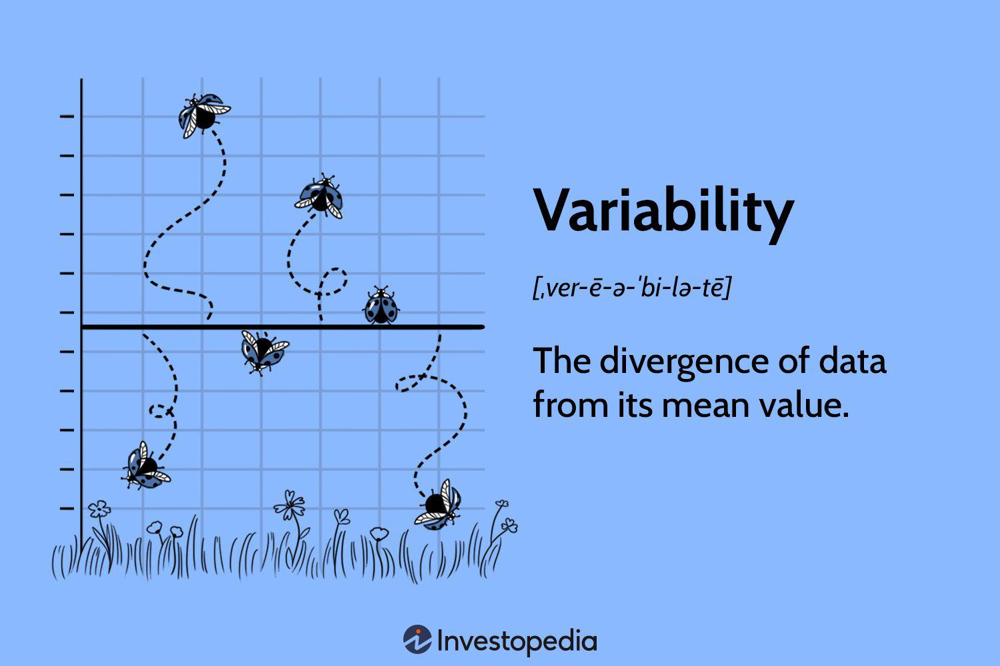

Algorithmic trading has fundamentally transformed financial markets by utilizing advanced computational capabilities to execute trades swiftly and in large volumes. Central to the success of these trading strategies is the ability to accurately measure and manage risk, a process that is inherently linked to a thorough understanding of statistics and variability. Risk measurement in financial markets involves quantifying the uncertainty in investment returns, which can be addressed through statistical techniques that analyze data dispersion and volatility. 

Understanding and managing variability through statistical measures such as variance and standard deviation are crucial for traders in developing robust strategies. Variance provides insights into the degree of spread in a dataset, thus helping traders assess the level of uncertainty or risk associated with a particular investment. Standard deviation, on the other hand, is an essential metric in quantifying the amount of variation or dispersion of a set of values, which can indicate potential price movements in financial instruments.



This article seeks to explore various techniques for measuring variability in statistics and how these apply to finance, especially in the context of algorithmic trading. By focusing on concepts like variance and standard deviation, we aim to understand their importance in building effective trading strategies. Moreover, by managing these statistics, traders can enhance performance optimization and improve decision-making processes in rapidly changing markets. As we examine these concepts, it becomes evident that mastering them not only assists in optimizing returns but also in controlling risk exposures, thus contributing to the overall efficiency and effectiveness of algorithmic trading.

## Table of Contents

## Understanding Variability in Statistics

Variability in statistics is a measure that quantifies the extent to which data points diverge from the mean of a dataset. This concept is integral in statistical analysis, providing insights into how data points are distributed within the dataset. The core measures of variability include variance and standard deviation, both of which are crucial for understanding and assessing risk, particularly in financial contexts.

Variance is a statistical metric that captures the average of the squared deviations from the mean. The formula for variance ($\sigma^2$) is given by:

$$
\sigma^2 = \frac{1}{N} \sum_{i=1}^{N} (X_i - \mu)^2
$$

where $X_i$ represents each individual data point, $\mu$ is the mean of the dataset, and $N$ is the total number of observations. Variance is a powerful tool in identifying how much risk is associated with an investment, as high variance typically indicates a high level of uncertainty and potential for significant deviation from expected outcomes.

Standard deviation, on the other hand, is the square root of variance and is expressed in the same units as the data, which makes it more interpretable. The formula for standard deviation ($\sigma$) is:

$$
\sigma = \sqrt{\frac{1}{N} \sum_{i=1}^{N} (X_i - \mu)^2}
$$

This metric is often preferred in financial analysis because it provides a direct understanding of potential variations in asset returns, allowing investors to anticipate possible fluctuations.

In the financial world, these measures are foundational. Understanding variability enables traders and investors to manage risk more effectively by forecasting trends and improving the accuracy of their predictions. For instance, high variability in historical returns might prompt a trader to adjust their strategy to mitigate risk or potentially capitalize on [volatility](/wiki/volatility-trading-strategies). Thus, a granular understanding of variability aids in constructing robust portfolios that balance risk and reward, ultimately optimizing investment decisions.

## Multiple Measurement Techniques in Finance

In finance, variability is a vital concept that measures the risk associated with investment returns. It provides insight into the degree of fluctuation in asset prices or returns, with higher variability indicating greater risk. Several techniques are commonly employed to quantify this variability.

One basic method is calculating the range, which is the difference between the maximum and minimum values within a dataset. While the range provides a quick glimpse of variability, its usefulness is limited by its sensitivity to outliers. More sophisticated statistical measures like variance and standard deviation offer a deeper understanding.

Variance ($\sigma^2$) provides a measure of how much the returns deviate from the average. It is calculated using the formula:

$$
\sigma^2 = \frac{1}{N} \sum_{i=1}^{N} (X_i - \mu)^2
$$

where $X_i$ represents each data point, $\mu$ is the mean of the dataset, and $N$ is the number of observations. Variance quantifies the degree of spread in the dataset, offering insights into the distribution of returns.

The standard deviation ($\sigma$) is the square root of the variance, providing a measure of variability in the same units as the data itself. It is widely used in finance as it provides a more intuitive sense of risk compared to variance.

Another critical tool in assessing variability in finance is the Sharpe ratio. This metric evaluates the risk-adjusted return of an investment by comparing excess return over the risk-free rate to the standard deviation of the investment returns. The Sharpe ratio is calculated as follows:

$$
\text{Sharpe Ratio} = \frac{R_p - R_f}{\sigma_p}
$$

where $R_p$ is the expected return of the portfolio, $R_f$ is the risk-free rate, and $\sigma_p$ is the standard deviation of the portfolio's excess return. A higher Sharpe ratio indicates better risk-adjusted returns, assisting investors in making comparative evaluations between different investment opportunities.

These statistical techniques not only measure variability but also standardize asset returns, facilitating deeper analysis. By providing a consistent framework for comparing different investments, these metrics enable investors and traders to make more informed decisions regarding portfolio management and strategy development.

## Calculating Variance: The Formula

Variance is a central statistical concept used to quantify the level of spread or [dispersion](/wiki/dispersion-trading) within a set of data points. Calculating variance involves applying the formula:

$$
\sigma^2 = \frac{1}{N} \sum (X_i - \mu)^2
$$

In this formula, $\sigma^2$ represents the variance, $N$ is the total number of observations, $X_i$ denotes each individual data point, and $\mu$ is the mean of the data set. By computing variance, one can determine how much the data points differ from the average value, offering insights into the variability of the dataset.

Understanding variance is crucial in risk assessment, particularly in financial markets where it provides a measure of the risk associated with the return on an investment. Higher variance suggests that data points are widely spread around the mean, indicating greater unpredictability and, consequently, higher risk. Conversely, lower variance indicates that data points are closer to the mean, suggesting more predictability and lower risk.

Algorithmic traders leverage variance to evaluate and refine trading strategies systematically. By incorporating variance into their models, traders can ensure strategies remain within predefined risk limits. Calculating variance enables traders to analyze potential future performance under various scenarios and adjust their strategies accordingly to maintain a balanced risk-reward ratio. This approach to risk management allows traders to optimize returns while minimizing potential losses in dynamic and volatile financial markets.

For practitioners interested in implementing variance calculations programmatically, Python provides efficient tools through libraries such as NumPy. Below is an example of how to calculate variance using Python:

```python
import numpy as np

# Sample data points
data_points = [10, 12, 23, 23, 16, 23, 21, 16]

# Calculate the mean of the data points
mean = np.mean(data_points)

# Calculate variance
variance = np.mean([(x - mean) ** 2 for x in data_points])

print("Variance:", variance)
```

This code example demonstrates calculating variance by first obtaining the mean of the dataset and then computing the average of the squared deviations from the mean, showcasing how variance is quantified in practical applications.

## Impact of Variance on Trading Strategies

Variance plays a crucial role in shaping trading strategies such as mean reversion and trend-following, both of which rely on understanding and predicting the variability in asset prices. High variance is often associated with unpredictable outcomes, which introduces the possibility of experiencing significant gains or losses. This inherent uncertainty necessitates the implementation of robust risk management techniques.

In mean reversion strategies, traders operate under the assumption that asset prices will tend to move back towards a historical mean or average level. A high variance in price movements can indicate a greater likelihood of price swings, posing both opportunities and risks for mean reversion traders. They can utilize these variances to gauge the strength and timing of potential entry and [exit](/wiki/exit-strategy) points in a trade. By analyzing variance, traders can distinguish between normal price fluctuations and significant deviations that may signal reversion opportunities.

Trend-following strategies, on the other hand, aim to capitalize on established price movements or trends. Here, the variance of an asset's returns can affect the reliability of identified trends. High variance might suggest a volatile market condition where price patterns are harder to predict and follow consistently. Traders adopting this strategy need to adjust their models to accommodate shifting variance levels, recalibrating indicators like moving averages or [momentum](/wiki/momentum) oscillators to optimize trade execution while keeping their risk exposure within acceptable limits.

To manage these strategies effectively, traders calibrate their models according to observed variance. Advanced algorithms and statistical tools may be employed to continuously assess variance levels. For instance, a trading algorithm could calculate the variance of asset returns over a specified period and adjust trading parameters dynamically. Here's a simple example in Python to compute variance using historical price data:

```python
import numpy as np

# Sample price data (e.g., closing prices)
prices = np.array([100, 105, 102, 108, 107])

# Calculate daily returns
returns = np.diff(prices) / prices[:-1]

# Compute variance of returns
variance = np.var(returns, ddof=1)

print(f"Variance of returns: {variance}")
```

This computational approach enables traders to maintain a finely tuned balance between capitalizing on market opportunities and managing potential risks, ensuring that their trading activities remain within predefined risk thresholds. Through this process, variance becomes not just a measure of risk but a pivotal component in refining and executing trading strategies effectively.

## Managing Variance in Algorithmic Trading

Variance management in [algorithmic trading](/wiki/algorithmic-trading) is crucial for optimizing trade performance and minimizing risk exposure. Key techniques to manage variance include diversification, position sizing, and adaptive algorithms.

**Portfolio Diversification:** Diversification is a fundamental strategy to manage variance and mitigate unsystematic risk, which is risk unique to specific assets or sectors. By distributing investments across various financial instruments, sectors, or geographical regions, traders can reduce the impact of any single asset's poor performance on the overall portfolio. This strategy capitalizes on the principle that not all assets will move in the same direction at the same time, thereby smoothing out potential fluctuations in return. For instance, combining equities with bonds, commodities, or real estate investments can provide a more stable overall performance.

**Position Sizing:** Effective position sizing ensures that the capital allocation per trade aligns with the trader’s risk tolerance and overall trading strategy. By determining the appropriate amount of capital to allocate to each trade, traders can manage the risk of significant losses while maximizing potential gains. This involves calculating the amount of risk one is willing to assume on a particular trade, often a percentage of the total trading capital. Traders typically use formulas to ascertain the optimal position size, factoring in the stop-loss level and the maximum risk per trade. 

**Adaptive Algorithms:** Adaptive algorithms are sophisticated tools that dynamically adjust trading strategies in response to real-time market changes. These algorithms utilize predictive analytics and machine learning techniques to forecast price movements and adapt accordingly. Machine learning models can analyze vast datasets for patterns or anomalies that traditional methods might overlook. By continuously learning and evolving based on historical data and current market conditions, these algorithms can enhance decision-making effectiveness. For example, an adaptive algorithm might increase trade frequency in high volatility periods while reducing exposure when the market environment indicates increased risk of loss.

Python, a versatile programming language, is frequently used in implementing these algorithms due to its rich ecosystem of libraries for data analysis and [machine learning](/wiki/machine-learning), such as NumPy, pandas, and scikit-learn. Below is a simple example of how position sizing can be calculated using Python:

```python
def calculate_position_size(account_balance, risk_per_trade, stop_loss_distance):
    risk_amount = account_balance * risk_per_trade
    position_size = risk_amount / stop_loss_distance
    return position_size

# Example usage
account_balance = 100000  # e.g., $100,000
risk_per_trade = 0.02  # 2% risk per trade
stop_loss_distance = 5.0  # e.g., $5 stop-loss distance

position_size = calculate_position_size(account_balance, risk_per_trade, stop_loss_distance)
print(f"Position Size: {position_size}")
```

By applying these variance management strategies, algorithmic trading systems can better align with desired risk-return profiles, ensuring resilient performance across varying market conditions.

## Variance vs. Volatility: Key Differences

Variance and volatility, while often used interchangeably in financial discussions, represent distinct concepts that play significant roles in risk assessment and strategy development. Variance measures the extent of data spread around the mean, providing insights into the expected distribution of returns. It is calculated using the formula:

$$
\sigma^2 = \frac{1}{N} \sum_{i=1}^{N} (X_i - \mu)^2
$$

where $\sigma^2$ is the variance, $N$ is the number of observations, $X_i$ is each data point, and $\mu$ is the mean. The focus of variance is on the data's dispersion, indicating how much returns vary from the average, which helps in understanding the consistency or predictability of an investment's performance.

Volatility, on the other hand, measures the degree of variation of trading prices and is quantified as the standard deviation of returns. This approach captures the magnitude of price movements and is considered a direct measure of risk, signifying potential fluctuations in financial instruments over a given period. The formula for volatility, representing standard deviation, is:

$$
\sigma = \sqrt{\frac{1}{N} \sum_{i=1}^{N} (X_i - \mu)^2}
$$

Volatility's primary concern is the range of price changes and its potential impacts, offering traders immediate insights into the uncertainty and risk associated with investments. While variance provides a detailed perspective on return distributions, volatility gives an immediate quantification of risk by expressing how large the price swings might be over time.

Understanding both variance and volatility enables traders to refine their strategies by balancing risk with expected returns. An effective blend of these metrics facilitates better portfolio management by allowing traders to assess the stability and predictability of returns, thus optimizing decision-making processes to respond adeptly to market conditions. This balance aids in tailoring investment approaches to align with individual risk appetites and market dynamics, ensuring sustained performance in financial markets.

## Case Studies: Variance in Action

Real-world examples provide clear insights into how variance functions as a critical tool in financial trading strategies, specifically in momentum trading. Momentum trading capitalizes on the continuance of existing trends in the market. A pivotal aspect in executing successful momentum strategies is the ability to measure and interpret variance, which reflects the dispersion of returns.

One use case is identifying potential market reversals through high variance levels, which suggest increased uncertainty and the potential for change in market direction. Traders can compute variance by employing the formula $\sigma^2 = \frac{1}{N} \sum (X_i - \mu)^2$, where $\sigma^2$ is the variance, $N$ is the total number of observations, $X_i$ represents individual data points, and $\mu$ is the mean of the dataset.

Consider a Python snippet that demonstrates how traders might calculate variance to inform their momentum strategy:

```python
import numpy as np

# Sample data: daily returns of a stock
returns = np.array([0.01, 0.02, -0.005, 0.015, -0.01, 0.005])

# Calculate mean and variance
mean_return = np.mean(returns)
variance = np.var(returns)

print("Mean Return:", mean_return)
print("Variance:", variance)
```

This calculation might reveal heightened variance during key periods, indicating potential entry or exit points to optimize decisions. If variance increases, traders may anticipate significant price movements, guiding them towards more conservative or aggressive positions depending on their risk appetite.

Case studies further highlight variance's role in strategy adjustments and risk mitigation. For instance, a trader analyzing historical data might identify that high variance periods coincide with successful trades in past momentum setups. This insight leads to the refinement of their momentum strategy, adjusting parameters such as position sizes and stop-loss limits to better adapt to varying market conditions.

Moreover, consistent returns can be achieved by managing the implications of variance proactively. Employing strategies that incorporate variance helps ensure that portfolios are balanced in accordance with risk tolerances, leading to improved long-term performance. Thus, variance not only aids in understanding and interpreting market dynamics but also enhances the capability of traders to adapt to changes, maintaining a competitive edge.

## Conclusion

Understanding and applying variability [statistics](/wiki/bayesian-statistics) has become integral to finance, especially in algorithmic trading, where precision in decision-making is paramount. At the heart of these strategies lies the mastery of variance and its effective management techniques. By comprehensively managing variance, traders can optimize their returns while maintaining a controlled exposure to risk, ensuring that financial decisions align with predefined risk appetite and strategic goals.

The landscape of finance is continuously evolving, driven by advancements in technology and analytics. As we progress, these developments will significantly enhance our ability to forecast market behaviors more accurately. For instance, machine learning algorithms are becoming more adept at identifying patterns in large datasets, offering deeper insights into how variance and other statistical measures can be leveraged for strategy refinement and risk management. This capability allows for more tailored trading strategies, adapting to dynamic market conditions while maintaining a balanced approach between risk and reward.

The trajectory of innovation in financial analytics is clear: a greater reliance on statistical measures, like variance, will underscore the development of increasingly sophisticated trading systems. These systems will not only predict market movements with higher accuracy but also provide robust frameworks for managing financial risks. As such, proficiency in variability statistics continues to be a cornerstone of success in the financial sector, signifying a critical skill set for traders and financial analysts aiming to navigate and excel in modern markets.

## References & Further Reading

[1]: Bergstra, J., Bardenet, R., Bengio, Y., & Kégl, B. (2011). ["Algorithms for Hyper-Parameter Optimization."](https://dl.acm.org/doi/10.5555/2986459.2986743) Advances in Neural Information Processing Systems 24.

[2]: ["Advances in Financial Machine Learning"](https://www.amazon.com/Advances-Financial-Machine-Learning-Marcos/dp/1119482089) by Marcos Lopez de Prado

[3]: ["Evidence-Based Technical Analysis: Applying the Scientific Method and Statistical Inference to Trading Signals"](https://www.amazon.com/Evidence-Based-Technical-Analysis-Scientific-Statistical/dp/0470008741) by David Aronson

[4]: ["Machine Learning for Algorithmic Trading"](https://github.com/stefan-jansen/machine-learning-for-trading) by Stefan Jansen

[5]: ["Quantitative Trading: How to Build Your Own Algorithmic Trading Business"](https://www.amazon.com/Quantitative-Trading-Build-Algorithmic-Business/dp/1119800064) by Ernest P. Chan