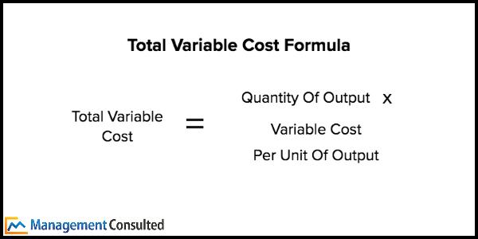

## Table of Contents

## What is a variable cost?

A variable cost is a type of expense that changes depending on how much a business produces or sells. For example, if a company makes more products, it will need to spend more on materials and labor. These costs go up and down with the level of activity in the business.

Understanding variable costs is important for businesses because it helps them figure out how much it costs to make each product. This information is useful for setting prices and planning how much to produce. When variable costs are low, a business can make more profit, but if they are high, it might be harder to make money.

## How do variable costs differ from fixed costs?

Variable costs and fixed costs are two types of expenses that businesses have. Variable costs change depending on how much a business produces or sells. For example, if a company makes more toys, it will need to buy more plastic and pay more workers, so its variable costs will go up. On the other hand, if the company makes fewer toys, its variable costs will go down. These costs are directly tied to the level of activity in the business.

Fixed costs, however, stay the same no matter how much a business produces or sells. These are expenses like rent for a factory, salaries for managers, or insurance. Even if the company makes no toys at all, it still has to pay these costs. Fixed costs are important because they help a business plan its budget, but they don't change with production levels like variable costs do.

Understanding the difference between variable and fixed costs is crucial for a business. It helps them figure out how much it costs to make each product and set prices that cover all their expenses. By knowing which costs are variable and which are fixed, a business can make better decisions about how much to produce and how to manage its money.

## Can you provide examples of variable costs in a business?

Variable costs are expenses that change depending on how much a business makes or sells. For example, in a bakery, the cost of flour and sugar goes up if they bake more cakes. If they bake fewer cakes, they need less flour and sugar, so these costs go down. Another example is a car factory where the cost of metal and tires changes with the number of cars they make. More cars mean more metal and tires, so the costs go up. Fewer cars mean less metal and tires, so the costs go down.

Another type of variable cost is labor. In a restaurant, if more people come to eat, the restaurant might need to hire more cooks and servers. This means the labor cost goes up. If fewer people come, they might need fewer staff, so the labor cost goes down. Delivery costs can also be variable. For a company that ships products, the more items they ship, the higher the cost for packaging and shipping. If they ship fewer items, these costs go down. 

These examples show how variable costs directly relate to the level of activity in a business. Understanding these costs helps businesses know how much it costs to make each product and set prices that cover all their expenses.

## How are variable costs calculated?

Variable costs are calculated by figuring out how much it costs to make one more item. For example, if a bakery makes one more cake, they need to add up the cost of the extra flour, sugar, and other ingredients they use. They also need to include the cost of any extra labor, like if they need to pay a worker to stay longer to bake that cake. By adding up all these costs, they can find out the variable cost for making one more cake.

To find the total variable cost for a business, they multiply the variable cost per item by the total number of items they make. For example, if it costs $2 to make one more cake and they make 100 cakes, the total variable cost would be $200. This helps businesses understand how their costs change when they make more or fewer products. By keeping track of these costs, they can make better decisions about how much to produce and how to set their prices.

## Why is it important to understand variable costs in business?

Understanding variable costs is really important for businesses because it helps them figure out how much it costs to make each product. When a business knows its variable costs, it can set prices that cover all its expenses and still make a profit. For example, if it costs $5 to make a toy and the business knows this, they can set a price that is higher than $5 to make money. If they didn't know their variable costs, they might set a price too low and lose money.

Also, knowing variable costs helps businesses decide how much to produce. If a business sees that making more products will increase its costs a lot, it might choose to make fewer items. On the other hand, if the variable costs are low, the business might decide to make more products to earn more profit. By understanding these costs, a business can plan better and make smarter decisions about how to use its resources.

## How do variable costs impact pricing strategies?

Variable costs are really important when a business decides how to set its prices. If a business knows how much it costs to make one more item, it can set a price that covers these costs and still makes a profit. For example, if it costs $3 to make a T-shirt, the business might set the price at $10 to cover the variable cost and make some money. If the variable costs go up, the business might need to raise its prices to keep making a profit. Understanding these costs helps a business set prices that are fair and profitable.

Variable costs also affect how a business chooses its pricing strategy. If the variable costs are low, a business might use a strategy to sell more items at a lower price to make more profit overall. For example, if it only costs a little more to make another sandwich, a restaurant might offer a discount to sell more sandwiches. On the other hand, if the variable costs are high, the business might choose to sell fewer items at a higher price. Knowing the variable costs helps a business decide the best way to price its products to make the most money.

## What is the relationship between variable costs and production volume?

Variable costs go up and down depending on how much a business makes. If a company makes more things, its variable costs will go up because it needs more materials and might need to pay more for labor. For example, if a toy factory makes more toys, it will need more plastic and more workers to put the toys together. So, the more the factory produces, the higher the variable costs will be.

On the other hand, if the company makes fewer things, its variable costs will go down. Using the same toy factory example, if they make fewer toys, they will use less plastic and might need fewer workers. This means that when production goes down, the variable costs also go down. Understanding this relationship helps businesses plan how much to produce and manage their costs better.

## How can variable costs be managed effectively?

To manage variable costs effectively, a business needs to keep a close eye on how much it costs to make each product. They can do this by regularly checking how much they spend on materials and labor. If they find that the cost of materials is going up, they might look for cheaper suppliers or buy in larger amounts to get a discount. They can also train workers to be more efficient, so it takes less time and fewer resources to make each item. By doing these things, a business can keep its variable costs under control and make more profit.

Another way to manage variable costs is to adjust production levels based on demand. If a business sees that fewer people are buying their products, they can make fewer items to lower their variable costs. On the other hand, if demand is high, they can increase production but should make sure they can still get materials at a good price. By matching production to demand, a business can avoid wasting resources and keep costs down. Understanding and managing variable costs like this helps a business stay profitable no matter how much they produce.

## What role do variable costs play in break-even analysis?

Variable costs are really important in break-even analysis because they help a business figure out how many items they need to sell to cover all their costs. Break-even analysis is when a business looks at its costs and sales to see how many products it needs to sell to make zero profit or loss. In this analysis, variable costs are added to fixed costs to find the total cost of making products. If a business knows its variable costs, it can calculate the break-even point by dividing the total costs by the price per item minus the variable cost per item.

For example, if it costs $2 to make one toy and the business has fixed costs of $1,000, they can use break-even analysis to find out how many toys they need to sell to cover all costs. If they sell each toy for $5, the break-even point would be when the money from sales equals the total costs. Understanding variable costs helps the business set the right price and plan how much to produce to reach this point. By managing variable costs well, a business can reach its break-even point faster and start making a profit sooner.

## How do variable costs affect a company's profitability?

Variable costs have a big impact on a company's profitability because they change depending on how much the company makes or sells. If a company can keep its variable costs low, it can make more profit. For example, if it costs less to make each toy, the company can sell the toys at a lower price and still make money, or keep the same price and make more profit per toy. On the other hand, if variable costs go up, it becomes harder for the company to make a profit. If the cost of making each toy goes up, the company might need to raise prices, which could make fewer people want to buy the toys, or they might have to accept lower profits.

Understanding and managing variable costs is key to improving profitability. By finding ways to reduce the cost of materials and labor, a company can lower its variable costs and increase its profits. For example, a company might buy materials in bulk to get a discount or train workers to be more efficient. By keeping variable costs under control, a company can set prices that cover all its costs and still make a good profit. This helps the company stay competitive and grow, even when the costs of making things change.

## Can variable costs change over time, and if so, why?

Yes, variable costs can change over time. This happens because the prices of materials and labor that a business uses to make its products can go up or down. For example, if the price of the metal used to make cars goes up, the variable cost for each car will also go up. Or if a company has to pay its workers more because of a new law, the labor cost, which is a variable cost, will increase. These changes can happen because of things like inflation, changes in the supply and demand for materials, or new government rules.

Businesses need to keep an eye on these changes because they affect how much it costs to make each product. If variable costs go up, a business might need to raise its prices or find ways to make things more cheaply to keep making a profit. On the other hand, if variable costs go down, a business can lower its prices to sell more items or keep the same prices and make more profit. Understanding how and why variable costs change helps a business plan better and stay profitable.

## How do businesses forecast variable costs for budgeting purposes?

Businesses forecast variable costs by looking at past data and trying to guess what will happen in the future. They look at how much they spent on materials and labor in the past and see if there are any patterns. For example, if the cost of flour went up every year, they might expect it to go up again. They also pay attention to things like inflation, which can make costs go up over time. By understanding these trends, businesses can make a good guess about what their variable costs will be in the future.

To make their forecasts more accurate, businesses also look at what is happening in the world around them. They might check if there are new laws that could change the cost of labor or if there are problems with getting materials that could make them more expensive. They also think about how much they plan to make or sell, because if they make more things, their variable costs will go up. By putting all this information together, businesses can create a budget that helps them plan for the future and make sure they have enough money to cover their costs.

## What are Variable Costs?

Variable costs in algorithmic trading refer to the expenses that change in direct correlation with trading activities and the volume of trades executed. These costs are not fixed, meaning they fluctuate based on the level of trading carried out, making them particularly important to monitor and manage for effective trading strategy implementation.

Some common examples of variable costs in this context include brokerage fees, transaction costs, and slippage. Brokerage fees are charges imposed by brokers for executing trades on behalf of traders. They can vary depending on the broker and the volume of trading, often calculated on a per-trade basis.

Transaction costs encompass the expenses directly associated with buying and selling financial instruments. These may include fees for executing trades, clearing and settlement fees, and any other charges that are proportional to the trade volume.

Slippage refers to the difference between the expected price of a trade and the actual price at which the trade is executed. Slippage occurs mostly during periods of high [volatility](/wiki/volatility-trading-strategies) or when executing large orders, leading to deviations that add to the variable costs incurred by the trader.

Understanding these variable costs is fundamental for traders who aim to manage their expenses effectively and maximize profits. Since these costs directly impact net gains, closely monitoring and analyzing them helps traders in refining their strategies to ensure cost-efficiency.

For example, the formula to calculate the total variable costs in a trading strategy can be expressed as:

$$
\text{Total Variable Cost} = \sum (\text{Number of Trades} \times \text{Cost per Trade})
$$

This formula allows traders to quantify their variable costs and assess the financial viability of their trading strategies. Integrating variable cost assessments into strategy development can aid in identifying areas where costs can be minimized, enhancing the overall profitability of trading activities.

## What is the impact of variable costs on algo trading?

In [algorithmic trading](/wiki/algorithmic-trading), variable costs can significantly impact the profitability of high-frequency trading ([HFT](/wiki/high-frequency-trading-strategies)) strategies. These costs, which include brokerage fees, transaction expenses, and slippage, vary with the [volume](/wiki/volume-trading-strategy) and frequency of trades. High transaction volumes, a hallmark of HFT strategies, can accumulate substantial variable costs that may erode potential profits.

Variable costs are particularly crucial in HFT given the razor-thin margins characteristic of such strategies. For instance, frequent transactions executed to exploit small price inefficiencies can result in cumulative expenses that overshadow gross profits if not managed effectively. This situation necessitates a meticulous cost management approach to maintain competitive profitability.

To illustrate, consider a simplified model where the variable costs $C$ associated with trading are determined by:

$$

C = (F + V) \times N
$$

where $F$ represents fixed fees per transaction, $V$ indicates variable costs proportional to the trade value and volume, and $N$ is the number of transactions. In HFT, where $N$ is large, even modest values of $F$ and $V$ can lead to significant total costs.

Effective management of these expenses allows traders to enhance their competitiveness. This can involve optimizing algorithmic strategies to reduce unnecessary trades, thereby minimizing $N$, or employing advanced execution techniques to lower $F$ and mitigate $V$. Additionally, adopting techniques such as smart order routing and leveraging [liquidity](/wiki/liquidity-risk-premium) pools effectively can help evade excessive costs and slippage.

Understanding and controlling variable costs is therefore essential for the financial success of algorithmic trading strategies. Failure to manage these expenses can lead to diminished returns, making cost management a focal point for traders aiming for sustained profitability.

## How do you calculate variable costs in algo trading?

Calculating variable costs in algorithmic trading is an essential task for determining the financial efficiency of trading strategies. These costs, which fluctuate with transaction volumes, include items such as brokerage fees, transaction costs, and slippage. The accurate assessment of these expenses is vital for optimizing trading strategies and maintaining profitability.

The fundamental approach to calculating variable costs involves the aggregation of all expenses that vary with the volume of trades. The most basic formula for this calculation is:

$$
\text{Total Variable Costs} = (\text{Number of Trades}) \times (\text{Cost per Trade})
$$

This formula serves as the foundational step for estimating the variable costs associated with trading activities. However, real-world scenarios often require more nuanced calculations due to the complexity of financial markets and the variety of costs involved.

For more precise assessments, it is crucial to consider factors like slippage, which is the difference between the expected price of a trade and the actual price, and other hidden costs that can arise during trading. These elements can be incorporated into more detailed models. Below is an example of how Python can be used to compute variable costs, taking slippage into account:

```python
def calculate_variable_costs(number_of_trades, cost_per_trade, average_slippage):
    total_trade_cost = number_of_trades * cost_per_trade
    total_slippage_cost = number_of_trades * average_slippage
    total_variable_cost = total_trade_cost + total_slippage_cost
    return total_variable_cost

# Example usage
number_of_trades = 1000
cost_per_trade = 0.01  # Dollar cost per trade
average_slippage = 0.005  # Average slippage per trade

total_costs = calculate_variable_costs(number_of_trades, cost_per_trade, average_slippage)
print(f"Total Variable Costs: ${total_costs}")
```

By refining the calculation method to include comprehensive cost elements, traders can derive more accurate cost estimates. This precision allows them to tweak their strategies effectively and achieve improved financial outcomes. Efficiently managing variable costs can lead to sustainable operations and competitive trading advantage.

## References & Further Reading

- Hasbrouck, J. (2009). *Trading Costs and Returns for U.S. Equities: Estimating Effective Costs from Daily Data*. This work provides insights into the methodologies for calculating trading costs, essential for understanding the financial implications of high-frequency trading strategies. It serves as a fundamental reference for traders seeking to gauge the cost-effectiveness of their operations.

- Kissell, R. (2013). *The Science of Algorithmic Trading and Portfolio Management*. This book covers advanced strategies in algorithmic trading, specifically addressing the calculation and management of variable costs. It highlights the significance of efficient transaction processing and the application of quantitative techniques to optimize trading performance.

- Almgren, R., & Chriss, N. (2000). *Optimal Execution of Portfolio Transactions*. This research discusses models of optimal trade execution, emphasizing the reduction of trading costs. It introduces mathematical frameworks that traders can use to minimize slippage and impact costs, crucial for maintaining a competitive edge in financial markets.

