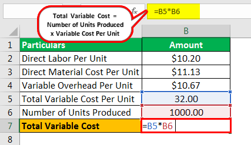

In the evolving landscape of finance, understanding variable costs and cost ratios is essential, particularly in algorithmic trading. This article examines the complex dynamics of financial calculations associated with variable costs and their implications for profitability. We explore how the variable cost ratio is incorporated into algorithmic trading strategies to optimize financial outcomes. These concepts are critical for managing expenses efficiently and enhancing decision-making in trading environments. Effectively applying these financial principles can significantly impact a company's profitability and strategic positioning in competitive markets.

Variable costs are expenses that fluctuate with production levels or trading activity. They include costs such as materials, direct labor, and trading fees, all of which can vary based on production volume or the number of trades executed. The variable cost ratio is a vital metric that shows the proportion of variable costs relative to sales or revenue, calculated by dividing total variable costs by net sales. This ratio provides insights into how well a company manages its variable costs in relation to revenue, with a lower ratio indicating that more sales are available to cover fixed costs and generate profit.



In the context of algorithmic trading, managing these costs becomes even more critical. Transaction fees, spreads, and slippage are examples of variable costs that directly affect trading profitability. Algorithmic systems employ pre-programmed strategies to minimize these costs, thus securing competitive advantages and improved margins. By utilizing techniques like Transaction Cost Analysis (TCA), traders can dissect and optimize their cost structures, ensuring maximum efficiency. Effective cost management techniques, such as intelligent order routing and strategic execution planning, help manage variable costs to align with overall financial goals. Understanding and controlling these costs is key to maintaining profitability and a strong market position.

## Table of Contents

## Understanding Variable Costs

Variable costs are a fundamental aspect of financial management, directly linked to the level of production or trading activity. Unlike fixed costs, which remain constant regardless of output, variable costs fluctuate with the volume of goods produced or services rendered. This variability means that as production increases, variable costs rise, and conversely, when production falls, these costs decline. This characteristic makes understanding and managing variable costs critical to maintaining or enhancing profitability.

Several common examples illustrate the nature of variable costs. In manufacturing, the cost of raw materials and direct labor are prime examples. These costs change in direct proportion to the number of units produced. Similarly, in the context of trading and finance, variable costs include trading fees, commissions, and other transaction-related expenses that vary with the volume of trades executed.

Understanding variable costs allows businesses and traders to adjust operations strategically. For instance, in a manufacturing setting, a company might focus on optimizing production processes to reduce material wastage and improve labor efficiency. In trading, algorithms might be leveraged to execute trades at optimal times to minimize fees and slippage. Both approaches aim to manage variable costs effectively, ultimately aiding in achieving improved profit margins.

The ability to predict and manage variable costs also plays a vital role in pricing strategy. Businesses can set their prices based on anticipated costs and desired profit margins. For traders, knowing the variabilities helps in formulating strategies that optimize trade execution paths to achieve the best net outcomes. By comprehensively analyzing variable costs and their drivers, companies and traders can align their operations with financial objectives, ensuring competitiveness and sustainability in dynamic markets.

## The Variable Cost Ratio

The variable cost ratio is a significant financial metric used to gauge the proportion of variable costs in relation to total revenue or net sales. This ratio is pivotal for understanding how efficiently a company or trading operation manages its variable costs against the revenue it generates. The formula to compute the variable cost ratio is expressed as:

$$
\text{Variable Cost Ratio} = \left( \frac{\text{Total Variable Costs}}{\text{Net Sales}} \right) \times 100\%
$$

This calculation offers crucial insights into cost management by highlighting how much of the sales revenue is consumed by variable costs. A lower variable cost ratio is generally favorable, indicating that a larger percentage of sales is available for covering fixed costs and generating profits. By maintaining a low variable cost ratio, businesses can ensure that a significant share of their revenues is contributing positively towards their profitability.

In practical terms, businesses use the variable cost ratio to assess their operational efficiency and strategize on pricing, production, and sales decisions. For example, a company with a high variable cost ratio may explore ways to reduce costs or increase sales prices to enhance its profitability. This metric is integral for financial managers and decision-makers who are focused on optimizing resource allocation and improving financial performance.

For further analysis, companies might integrate this ratio into their financial models and dashboards, allowing continuous monitoring and adjustment strategies. By doing so, they can align financial goals with operational tactics, ensuring sustained growth and competitive advantage in dynamic markets.

## Financial Calculation of Variable Cost Ratio

The calculation of the variable cost ratio is a fundamental financial metric used to evaluate the efficiency with which a business or trading operation manages its variable expenses in relation to its net sales. The formula is expressed as:

$$
\text{Variable Cost Ratio} = \left( \frac{\text{Total Variable Costs}}{\text{Net Sales}} \right) \times 100\%
$$

This percentage represents the portion of revenue consumed by variable costs, providing valuable insights into the financial structure and operational leverage of a company.

By calculating the variable cost ratio, businesses can identify their break-even point, or the level of sales necessary to cover both variable and fixed costs. This understanding aids in determining profitability thresholds essential for maintaining financial stability. For instance, if the variable cost ratio is high, a more significant portion of sales revenue is directed towards variable expenses, leaving less room for covering fixed costs and generating profit. In such cases, businesses may need to reassess production processes, cost control measures, or pricing strategies to enhance profitability.

Additionally, the variable cost ratio plays a critical role in forming pricing strategies, as it allows businesses to assess the cost-effectiveness of their production or trading activities. By analyzing shifts in the ratio over time, businesses can better understand the impacts of cost variations on profit margins and adjust their strategies accordingly to optimize financial outcomes. This metric serves as a tool for continuous improvement in operational and strategic planning, enabling businesses to align their cost management strategies with overall financial objectives for enhanced profitability and competitiveness.

## Variable Cost Management in Algorithmic Trading

In [algorithmic trading](/wiki/algorithmic-trading), managing variable costs is crucial for ensuring that trading strategies yield maximum profitability. Key variable costs include transaction fees, spreads, and slippage, all of which directly affect returns. 

Algorithmic trading platforms deploy pre-programmed strategies designed to minimize these costs, thereby securing a competitive edge and improving profit margins. These strategies may involve optimizing order execution to avoid market impact, selecting optimal trading times, and utilizing [liquidity](/wiki/liquidity-risk-premium) pools. By adopting these methods, traders can considerably reduce the costs associated with executing trades.

Advanced analytical techniques, such as Transaction Cost Analysis (TCA), play a vital role in dissecting and optimizing trading cost structures. TCA tools analyze the total cost of trading, pinpoint inefficiencies, and propose solutions for improvement. For instance, by examining slippage— the difference between the expected price of a trade and the actual price— TCA can refine trading algorithms to lower potential losses.

In Python, algorithmic traders often use libraries like NumPy and pandas to analyze transaction costs and optimize algorithms. Here is an example of how one might calculate the impact of slippage on trading costs:

```python
import numpy as np

# Example data: Expected prices and actual prices of trades
expected_prices = np.array([100.5, 101.0, 101.5, 102.0])
actual_prices = np.array([100.7, 101.1, 101.6, 102.3])

# Calculate slippage
slippage = actual_prices - expected_prices

# Calculate the average slippage cost per trade
average_slippage = np.mean(slippage)
print(f"Average Slippage Cost per Trade: {average_slippage:.2f}")
```

By continuously refining these algorithms and leveraging TCA, trading firms can achieve lower variable costs, translating to boosted profitability. The ultimate goal of variable cost management in algorithmic trading is to develop a framework that allows for the seamless integration of cost-efficient techniques within trading strategies, fostering sustainable financial gains in competitive markets.

## Techniques to Optimize Variable Costs

Effective cost management in trading, especially algorithmic trading, involves several techniques designed to optimize variable costs, enhance profitability, and maintain a competitive advantage. Key strategies include intelligent order routing, effective selection of brokerage services, reducing slippage, and leveraging market data for strategic planning.

Intelligent order routing is crucial for minimizing transaction costs. This technique involves using advanced algorithms to determine the most efficient pathways for executing trades. It considers factors such as liquidity, timing, and market conditions, thus reducing unnecessary costs associated with each transaction. Implementing intelligent order routing ensures that trades are executed at the best possible prices, minimizing market impact.

Selecting cost-effective brokerage services also plays a significant role. Different brokerage firms offer varying fee structures and services. By choosing brokers that provide competitive rates and necessary trading tools without extra costs, traders can substantially reduce their variable costs. This decision should be based on a thorough evaluation of the brokerage's services against their fees to ensure alignment with trading objectives.

High-frequency trading ([HFT](/wiki/high-frequency-trading-strategies)) algorithms benefit from strategies aimed at reducing slippage and market impact. Slippage occurs when there is a difference between the expected price of a trade and the actual execution price. HFT systems are designed to execute trades at high speeds and with precision, minimizing slippage. Techniques such as latency reduction, order splitting, and execution at the best available prices are employed. By reducing slippage and optimizing trade execution, these algorithms can significantly enhance profitability.

Leveraging market data is another effective technique for managing variable costs. By analyzing real-time data, traders can make informed decisions about market conditions, price movements, and liquidity. Effective use of such data allows for strategic execution planning, aligning trading strategies with financial goals. This approach also enables traders to anticipate market trends and adjust their operations to minimize costs.

In summary, optimizing variable costs in trading involves a combination of advanced technology and strategic planning. By implementing intelligent order routing, choosing cost-effective brokerage services, minimizing slippage through high-frequency trading strategies, and leveraging market data, traders can efficiently manage their variable costs, thereby aligning with their overall financial goals and improving profitability.

## Conclusion

Understanding and managing variable costs is crucial for financial efficiency and profitability in business management and algorithmic trading. This is largely due to the direct impact of variable costs on profit margins and operational effectiveness. By carefully analyzing these costs, businesses can make informed decisions that lead to improved financial outcomes.

The variable cost ratio, which measures the proportion of variable costs relative to total revenue, serves as an essential metric for evaluating financial health. It helps in determining how well a company or trading strategy is managing its costs in relation to its revenue. For instance, businesses can calculate the variable cost ratio using the formula:

$$
\text{Variable Cost Ratio (\%)} = \left( \frac{\text{Total Variable Costs}}{\text{Net Sales}} \right) \times 100
$$

A lower variable cost ratio indicates that a larger share of revenue is available to cover fixed costs and generate profit, signifying efficient cost management.

Implementing informed cost management strategies allows businesses and traders to enhance their bottom line. In algorithmic trading, strategies such as Transaction Cost Analysis (TCA) identify cost inefficiencies and optimize execution to reduce transaction fees and slippage. These efforts help maintain a competitive edge by maximizing profitability and ensuring that cost structures align with strategic financial goals.

By prioritizing the management of variable costs and leveraging techniques to optimize them, businesses and traders can achieve significant financial improvements. Consequently, these practices not only contribute to maintaining competitiveness in dynamic markets but also ensure long-term sustainability and success.

## References & Further Reading

[1]: Bergstra, J., Bardenet, R., Bengio, Y., & Kégl, B. (2011). ["Algorithms for Hyper-Parameter Optimization."](https://dl.acm.org/doi/10.5555/2986459.2986743) Advances in Neural Information Processing Systems 24.

[2]: ["Advances in Financial Machine Learning"](https://www.amazon.com/Advances-Financial-Machine-Learning-Marcos/dp/1119482089) by Marcos Lopez de Prado

[3]: ["Evidence-Based Technical Analysis: Applying the Scientific Method and Statistical Inference to Trading Signals"](https://www.amazon.com/Evidence-Based-Technical-Analysis-Scientific-Statistical/dp/0470008741) by David Aronson

[4]: ["Machine Learning for Algorithmic Trading"](https://github.com/stefan-jansen/machine-learning-for-trading) by Stefan Jansen

[5]: ["Quantitative Trading: How to Build Your Own Algorithmic Trading Business"](https://www.amazon.com/Quantitative-Trading-Build-Algorithmic-Business/dp/1119800064) by Ernest P. Chan