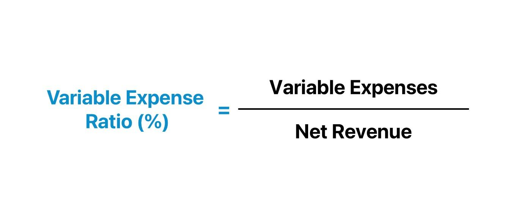

## Table of Contents

## What is a variable cost?

A variable cost is a cost that changes depending on how much you produce or sell. For example, if you make more products, your costs for materials and labor will go up. These costs are different from fixed costs, which stay the same no matter how much you produce.

Understanding variable costs is important for businesses because it helps them figure out how much it costs to make each product. This information is useful for setting prices and planning how much to produce. If a business knows its variable costs, it can make better decisions about how to grow and manage its money.

## How does the variable cost ratio differ from fixed costs?

The variable cost ratio and fixed costs are two different ways to look at business expenses. The variable cost ratio is a number that shows how much of your sales money goes to pay for variable costs. For example, if you sell something for $100 and it costs you $30 in variable costs to make it, your variable cost ratio is 30%. This ratio helps you see how changes in how much you produce or sell can affect your profits.

Fixed costs, on the other hand, are costs that stay the same no matter how much you produce or sell. These can be things like rent for your store or salaries for your staff. Fixed costs don't change with your level of production, so they don't have a ratio like variable costs do. Understanding both variable cost ratios and fixed costs is important for a business to know how to make money and plan for the future.

## What is the variable cost ratio?

The variable cost ratio is a number that tells you how much of the money you make from sales goes to pay for variable costs. Variable costs are things like the materials you use to make your products or the cost of labor that changes depending on how much you produce. If you sell something for $100 and it costs you $30 in variable costs to make it, your variable cost ratio is 30%. This means that 30% of your sales money is used to cover these costs.

Knowing the variable cost ratio is helpful for businesses because it shows how changes in production or sales can affect profits. If the variable cost ratio is high, it means a big part of your sales money is going to variable costs, which can make it harder to make a profit. By keeping an eye on this ratio, a business can make better decisions about pricing, how much to produce, and how to manage costs to stay profitable.

## Why is the variable cost ratio important for businesses?

The variable cost ratio is important for businesses because it shows them how much of their sales money is used to pay for variable costs. Variable costs are things like materials and labor that change depending on how much a business makes or sells. If a business knows its variable cost ratio, it can see how changes in what they produce or sell can affect their profits. For example, if the ratio is high, it means a big part of the sales money is going to these costs, which can make it harder to make a profit.

By keeping an eye on the variable cost ratio, a business can make better decisions about how to set prices, how much to produce, and how to manage costs. If the ratio is too high, the business might need to find ways to lower these costs or raise prices to make more profit. Understanding the variable cost ratio helps businesses plan better and stay profitable, which is important for growing and staying successful in the long run.

## How do you calculate the variable cost ratio?

The variable cost ratio is easy to figure out. You just need to know your total variable costs and your total sales. To find the ratio, you divide your total variable costs by your total sales. For example, if you spent $30 on variable costs to make a product and sold it for $100, you would divide $30 by $100 to get a variable cost ratio of 0.30, or 30%.

This ratio is important because it shows how much of your sales money goes to pay for things like materials and labor that change with how much you produce. If your variable cost ratio is high, it means a big part of your sales money is going to these costs, which can make it harder to make a profit. By keeping an eye on this ratio, you can make better decisions about pricing and how much to produce to keep your business profitable.

## Can you provide an example of calculating the variable cost ratio?

Let's say you run a bakery and you want to find out your variable cost ratio. You know that it costs you $2 to make one cake, and you sell each cake for $10. So, your variable cost for one cake is $2, and your total sales for one cake are $10. To find the variable cost ratio, you divide the variable cost by the total sales. In this case, $2 divided by $10 gives you a ratio of 0.20, or 20%.

Understanding this ratio helps you see how much of the money you make from selling cakes goes towards paying for the ingredients and other variable costs. If your variable cost ratio is 20%, it means that 20% of your sales money is used to cover these costs. This information is important because it can help you decide if you need to change your prices or find ways to lower your costs to make more profit.

## What are the common components included in variable costs?

Variable costs are the costs that change depending on how much you make or sell. Common things that make up variable costs are the materials you use to make your products, like the flour and sugar in a bakery, or the fabric in a clothing store. Another big part of variable costs is the labor that changes with how much you produce. For example, if you need more workers to make more cakes, the cost of paying them is a variable cost.

Other things that can be part of variable costs are the costs of shipping or delivering your products. If you sell more, you might need to spend more on shipping. Also, some businesses have to pay for things like electricity or water that change depending on how much they use, and these can be variable costs too. Knowing all these parts of variable costs helps businesses keep track of how much it costs to make their products and how to price them right.

## How does the variable cost ratio impact pricing strategies?

The variable cost ratio is really important when a business is figuring out how to set prices. This ratio shows how much of the money from sales goes to pay for things like materials and labor that change depending on how much you make or sell. If the variable cost ratio is high, it means a big part of the sales money is going to these costs. This can make it hard to make a profit unless the business sets its prices high enough to cover these costs and still make some money.

To set the right prices, a business needs to look at its variable cost ratio. If the ratio is low, the business might be able to set lower prices and still make a good profit. But if the ratio is high, the business might need to raise its prices or find ways to lower its variable costs. By understanding the variable cost ratio, a business can make smart choices about pricing that help it stay profitable and grow.

## How can changes in production volume affect the variable cost ratio?

When a business makes more or less of its products, the amount it spends on variable costs can change. Variable costs are things like materials and labor that go up or down depending on how much you produce. If you make more, you'll need more materials and maybe more workers, so your variable costs will go up. If you make less, you'll use fewer materials and might need fewer workers, so your variable costs will go down.

Changes in how much you produce can affect the variable cost ratio, which is the part of your sales money that goes to pay for variable costs. If you make more and your sales go up too, but your variable costs go up even more, your variable cost ratio might get higher. This means a bigger part of your sales money is going to variable costs, which can make it harder to make a profit. On the other hand, if you make less and your variable costs go down more than your sales, your variable cost ratio might get lower, which can help you make more profit. It's important for businesses to keep an eye on how changes in production affect their variable cost ratio so they can make good decisions about how much to produce and how to set prices.

## What are the limitations of using the variable cost ratio for decision making?

The variable cost ratio is a helpful tool for businesses, but it has some limits. One big limit is that it only looks at variable costs and doesn't include fixed costs. Fixed costs are things like rent and salaries that don't change no matter how much you make or sell. If a business only uses the variable cost ratio to make decisions, it might not think about how these fixed costs affect its profits. This can lead to wrong decisions about pricing and how much to produce.

Another limit is that the variable cost ratio can change a lot depending on how much you produce. If you make more, your variable costs might go up faster than your sales, which can make the ratio higher. But if you make less, your variable costs might go down more than your sales, making the ratio lower. This can make it hard to use the ratio to plan for the future because it can be different at different times. Businesses need to think about these changes when they use the variable cost ratio to make decisions.

Also, the variable cost ratio doesn't tell you about other important things like how much customers are willing to pay or what your competitors are doing. If you only look at the variable cost ratio, you might set prices too high or too low compared to what the market can handle. It's important for businesses to use the variable cost ratio along with other information to make the best choices about pricing and production.

## How does the variable cost ratio relate to contribution margin?

The variable cost ratio and the contribution margin are two important numbers that help businesses figure out how to make money. The variable cost ratio tells you how much of your sales money goes to pay for things like materials and labor that change depending on how much you make or sell. If you know your variable cost ratio, you can see how much of your sales money is left after you pay for these costs. The contribution margin is the money you have left from sales after you pay for variable costs. It's what helps cover your fixed costs, like rent and salaries, and what's left is your profit.

The variable cost ratio and the contribution margin are connected because they both help you understand how your business is doing. If your variable cost ratio is high, it means a big part of your sales money is going to pay for variable costs, so your contribution margin will be smaller. This can make it harder to cover your fixed costs and make a profit. But if your variable cost ratio is low, your contribution margin will be bigger, which makes it easier to cover fixed costs and make more profit. By keeping an eye on both the variable cost ratio and the contribution margin, a business can make better decisions about pricing and how much to produce to stay profitable.

## How can businesses use the variable cost ratio to improve operational efficiency?

Businesses can use the variable cost ratio to improve how they work by keeping an eye on how much of their sales money goes to pay for things like materials and labor. If the variable cost ratio is high, it means a big part of the money from sales is going to these costs. This can show the business where it might be spending too much. For example, if the cost of materials is too high, the business might look for cheaper suppliers or find ways to use less material. By doing this, the business can lower its variable costs and make the ratio smaller, which can help it make more profit.

Another way businesses can use the variable cost ratio to work better is by looking at how changes in what they make or sell affect this ratio. If making more products makes the variable cost ratio go up a lot, the business might need to find ways to make things more efficiently. This could mean using machines to help with work or training workers to be faster. By keeping the variable cost ratio low, the business can use its money better and make more profit, which helps it grow and stay strong.

## What is the Variable Cost Ratio?

The variable cost ratio is a significant financial metric used to gauge the proportion of variable costs in relation to total revenue or net sales. This ratio is pivotal for understanding how efficiently a company or trading operation manages its variable costs against the revenue it generates. The formula to compute the variable cost ratio is expressed as:

$$
\text{Variable Cost Ratio} = \left( \frac{\text{Total Variable Costs}}{\text{Net Sales}} \right) \times 100\%
$$

This calculation offers crucial insights into cost management by highlighting how much of the sales revenue is consumed by variable costs. A lower variable cost ratio is generally favorable, indicating that a larger percentage of sales is available for covering fixed costs and generating profits. By maintaining a low variable cost ratio, businesses can ensure that a significant share of their revenues is contributing positively towards their profitability.

In practical terms, businesses use the variable cost ratio to assess their operational efficiency and strategize on pricing, production, and sales decisions. For example, a company with a high variable cost ratio may explore ways to reduce costs or increase sales prices to enhance its profitability. This metric is integral for financial managers and decision-makers who are focused on optimizing resource allocation and improving financial performance.

For further analysis, companies might integrate this ratio into their financial models and dashboards, allowing continuous monitoring and adjustment strategies. By doing so, they can align financial goals with operational tactics, ensuring sustained growth and competitive advantage in dynamic markets.

## What is the Financial Calculation of Variable Cost Ratio?

The calculation of the variable cost ratio is a fundamental financial metric used to evaluate the efficiency with which a business or trading operation manages its variable expenses in relation to its net sales. The formula is expressed as:

$$
\text{Variable Cost Ratio} = \left( \frac{\text{Total Variable Costs}}{\text{Net Sales}} \right) \times 100\%
$$

This percentage represents the portion of revenue consumed by variable costs, providing valuable insights into the financial structure and operational leverage of a company.

By calculating the variable cost ratio, businesses can identify their break-even point, or the level of sales necessary to cover both variable and fixed costs. This understanding aids in determining profitability thresholds essential for maintaining financial stability. For instance, if the variable cost ratio is high, a more significant portion of sales revenue is directed towards variable expenses, leaving less room for covering fixed costs and generating profit. In such cases, businesses may need to reassess production processes, cost control measures, or pricing strategies to enhance profitability.

Additionally, the variable cost ratio plays a critical role in forming pricing strategies, as it allows businesses to assess the cost-effectiveness of their production or trading activities. By analyzing shifts in the ratio over time, businesses can better understand the impacts of cost variations on profit margins and adjust their strategies accordingly to optimize financial outcomes. This metric serves as a tool for continuous improvement in operational and strategic planning, enabling businesses to align their cost management strategies with overall financial objectives for enhanced profitability and competitiveness.

## What is the conclusion?

Understanding and managing variable costs is crucial for financial efficiency and profitability in business management and [algorithmic trading](/wiki/algorithmic-trading). This is largely due to the direct impact of variable costs on profit margins and operational effectiveness. By carefully analyzing these costs, businesses can make informed decisions that lead to improved financial outcomes.

The variable cost ratio, which measures the proportion of variable costs relative to total revenue, serves as an essential metric for evaluating financial health. It helps in determining how well a company or trading strategy is managing its costs in relation to its revenue. For instance, businesses can calculate the variable cost ratio using the formula:

$$
\text{Variable Cost Ratio (\%)} = \left( \frac{\text{Total Variable Costs}}{\text{Net Sales}} \right) \times 100
$$

A lower variable cost ratio indicates that a larger share of revenue is available to cover fixed costs and generate profit, signifying efficient cost management.

Implementing informed cost management strategies allows businesses and traders to enhance their bottom line. In algorithmic trading, strategies such as Transaction Cost Analysis (TCA) identify cost inefficiencies and optimize execution to reduce transaction fees and slippage. These efforts help maintain a competitive edge by maximizing profitability and ensuring that cost structures align with strategic financial goals.

By prioritizing the management of variable costs and leveraging techniques to optimize them, businesses and traders can achieve significant financial improvements. Consequently, these practices not only contribute to maintaining competitiveness in dynamic markets but also ensure long-term sustainability and success.

## References & Further Reading

[1]: Bergstra, J., Bardenet, R., Bengio, Y., & Kégl, B. (2011). ["Algorithms for Hyper-Parameter Optimization."](https://dl.acm.org/doi/10.5555/2986459.2986743) Advances in Neural Information Processing Systems 24.

[2]: ["Advances in Financial Machine Learning"](https://www.amazon.com/Advances-Financial-Machine-Learning-Marcos/dp/1119482089) by Marcos Lopez de Prado

[3]: ["Evidence-Based Technical Analysis: Applying the Scientific Method and Statistical Inference to Trading Signals"](https://www.amazon.com/Evidence-Based-Technical-Analysis-Scientific-Statistical/dp/0470008741) by David Aronson

[4]: ["Machine Learning for Algorithmic Trading"](https://github.com/stefan-jansen/machine-learning-for-trading) by Stefan Jansen

[5]: ["Quantitative Trading: How to Build Your Own Algorithmic Trading Business"](https://www.amazon.com/Quantitative-Trading-Build-Algorithmic-Business/dp/1119800064) by Ernest P. Chan