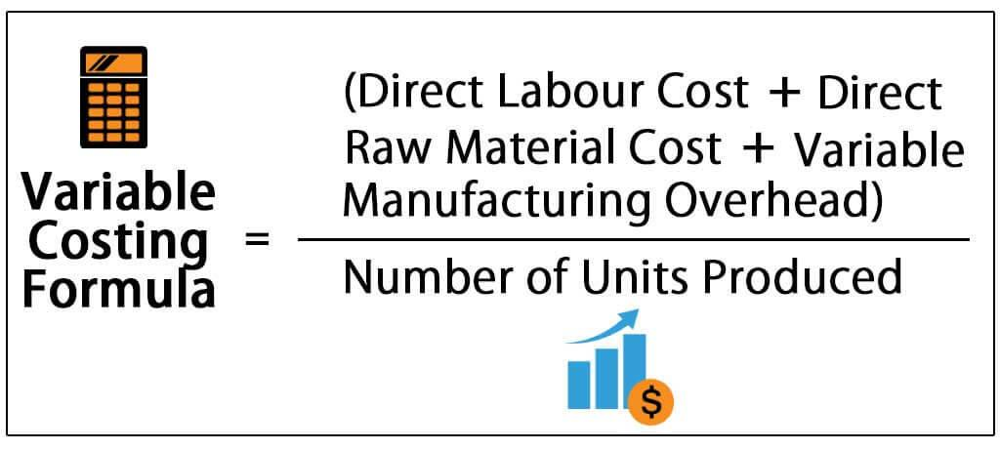

In the fast-paced world of algorithmic trading, understanding the nuances of cost management is critical to maintaining profitability. Among the key expenses to analyze are variable costs, which fluctuate depending on the level of trading activity. This variability makes them a central concern for traders looking to optimize their operations in the financial markets.

Algorithmic trading, or algo trading, has revolutionized these markets by enabling traders to execute orders at exceptional speeds and frequencies. Complex algorithms assess trading opportunities, sometimes in fractions of a second, analyzing a multitude of data points before executing trades. This capability provides a significant advantage in terms of speed and accuracy over traditional forms of trading.



However, despite these advantages, traders face the challenge of managing transaction costs, which can significantly affect their trading outcomes. Transaction costs, such as brokerage fees, market spreads, and slippage, can accumulate rapidly, especially given the high volume and frequency typical of algorithmic strategies. In some cases, these costs might even erode profits, turning a potentially winning strategy into a losing one. Thus, understanding and controlling these costs is a priority for traders aiming to maximize their returns.

This article provides a comprehensive analysis of variable cost business expenses within algorithmic trading, highlighting the importance of mitigating transaction costs through strategic planning and technological advancements. By leveraging advanced techniques such as Transaction Cost Analysis (TCA) and intelligent order routing, traders can fine-tune their strategies to enhance profitability. Such measures are essential, given that even minor inefficiencies can lead to substantial expenses over time. Ultimately, effective cost management not only preserves profit margins but also strengthens a trader's competitive positioning in an ever-evolving marketplace.

## Table of Contents

## Understanding Variable Costs in Trading

Variable costs in trading are expenses that fluctuate with the trading activity level, making their management crucial for maintaining profitability in algorithmic trading. These costs encompass a variety of elements, including brokerage fees, market spreads, slippage, and other exchange-related expenses. The variability of these costs arises from changes in the frequency and volume of trades executed. As trading activity increases, the associated variable costs generally increase, making them somewhat unpredictable and necessitating careful oversight.

Brokerage fees, for instance, are often charged on a per-trade basis, meaning that higher trading volumes result in higher fees. Market spreads represent the difference between the bid and ask prices; they can widen or narrow based on market liquidity and [volatility](/wiki/volatility-trading-strategies), directly impacting trading costs. Slippage, the difference between the expected price of a trade and the actual price at which it is executed, can occur when market conditions change rapidly, affecting the cost unpredictably.

Understanding the distinction between variable and fixed costs is essential for optimizing trading strategies. Fixed costs, such as infrastructure expenses or subscription fees for trading platforms, remain constant regardless of trading [volume](/wiki/volume-trading-strategy). In contrast, variable costs demand robust analysis as they can significantly impact overall trading performance.

For effective management of variable costs, traders often employ statistical and analytical tools. Python, for instance, offers various libraries such as `pandas` and `numpy` for analyzing trading data to assess cost patterns. By evaluating historical trading data, traders can identify trends and make informed decisions on how to adjust their strategies to minimize costs. Below is an example of how Python can be used to calculate average variable costs from trade data:

```python
import pandas as pd

# Sample trading data
data = {
    'trade_volume': [1000, 1500, 1200, 1300, 1600],
    'variable_costs': [100, 150, 120, 135, 155]
}

# Create a DataFrame
df = pd.DataFrame(data)

# Calculate average variable cost per trade volume
df['cost_per_volume'] = df['variable_costs'] / df['trade_volume']
average_cost = df['cost_per_volume'].mean()

print(f"Average variable cost per trade volume: {average_cost:.4f}")
```

In essence, the nuanced understanding of variable costs and their implications on trading strategies is indispensable. By effectively monitoring and analyzing these costs, traders can enhance their strategies, ensuring they are economically viable and competitive in the fast-paced world of [algorithmic trading](/wiki/algorithmic-trading).

## The Importance of Transaction Cost Analysis (TCA)

Transaction Cost Analysis (TCA) is a vital method employed in the evaluation and management of trading expenses, playing a pivotal role in enhancing trading efficiency and profitability. At its core, TCA enables traders to break down and examine various components of transaction costs. These components typically include the bid-ask spreads, market impact costs, and regulatory fees.

The bid-ask spread is the difference between the price to buy a security (ask) and the price to sell it (bid). This spread is an immediate cost incurred during trading and depends heavily on the [liquidity](/wiki/liquidity-risk-premium) of the financial market involved. In highly liquid markets, the spread tends to be narrower, reducing the cost a trader must pay.

Market impact costs are the changes in asset prices due to large trades, particularly prevalent in markets with lower liquidity. When a significant order is placed, it may shift the market price unfavorably, increasing the overall cost of the transaction. By using TCA, traders can anticipate and mitigate these impacts, such as by breaking large orders into smaller ones to minimize price disruption.

Regulatory fees are charges imposed by financial markets and government bodies for transactions, adding another layer of cost. These fees are sometimes fixed and at other times variable, depending on the nature of the trade and the regulatory framework governing it.

By systematically analyzing these cost components, TCA provides insights that are critical for strategy refinement. For instance, traders can utilize TCA to optimize order execution, a key aspect of trading that directly influences return on investment. Through TCA, traders gain a comprehensive view of where costs are incurred and how they can be minimized. An example of using Python to simulate this analysis could involve calculating the average market impact across different trade sizes:

```python
import numpy as np

def calculate_market_impact(trade_sizes, market_volatility, liquidity):
    impacts = []
    for size in trade_sizes:
        impact = size * market_volatility / liquidity
        impacts.append(impact)
    return np.mean(impacts)

trade_sizes = [10, 50, 100, 500]
market_volatility = 0.02  # assumed 2%
liquidity = 1000  # assumed liquidity factor

average_impact = calculate_market_impact(trade_sizes, market_volatility, liquidity)
print(f"Average Market Impact: {average_impact}")
```

This analysis can lead to the optimization of trading strategies, ensuring that trades are placed at times and sizes that incur minimal costs. Consequently, TCA becomes an indispensable component in the toolkit of traders committed to maximizing profitability and sustaining a competitive advantage in increasingly dynamic and complex financial markets. By reducing unnecessary costs and optimizing execution strategies, TCA equips traders with the capability to enhance their trading outcomes significantly.

## Algorithmic Trading Strategies and Variable Costs

In algorithmic trading, the development of strategies is intricately tied to the goal of minimizing transaction costs, thereby increasing net returns. This is particularly important in the context of high-frequency trading ([HFT](/wiki/high-frequency-trading-strategies)) algorithms, where the rapid execution of numerous trades can quickly accumulate costs. HFT algorithms exploit microsecond-level market opportunities, requiring sophisticated management of transaction expenses to maintain profitability.

Effective cost management in algorithmic trading involves a multi-faceted approach. Firstly, selecting appropriate execution venues is critical to optimize trades. Different trading venues offer varying liquidity levels and fee structures, which can impact the overall cost of executing a trade. Algorithmic traders must assess these factors to determine the most advantageous venues for their strategies. 

Secondly, managing order sizes is a crucial aspect of cost optimization. Balancing order sizes helps minimize the adverse impact on market prices—a phenomenon often referred to as market impact. Large orders can move asset prices unfavorably, increasing transaction costs. By strategically varying order sizes and timings, traders can reduce this impact. Algorithms can be programmed to split orders into smaller sizes, executing them gradually to minimize disruption to market prices.

Leveraging market liquidity is another essential strategy for cost reduction. Trading in highly liquid markets ensures narrower spreads and reduces slippage, the difference between the expected price of a trade and the actual price. Liquidity allows for the efficient absorption of trades without significantly altering asset prices. Algorithms designed to gauge and exploit liquidity patterns can improve execution efficiency, thus reducing costs.

The integration of these cost optimization strategies within algorithmic frameworks can be supported by quantitative analysis and [machine learning](/wiki/machine-learning) techniques. For example, Python, a popular language in financial analysis, can be used to simulate and test various execution strategies. By employing libraries like NumPy and pandas, traders can analyze historical market data, simulate order executions, and devise strategies that both minimize costs and enhance execution quality.

Overall, the careful consideration of execution venues, order management, and liquidity utilization forms the foundation of strategic cost management in algorithmic trading. By effectively integrating these elements, traders can enhance their net returns and sustain competitiveness in the high-stakes environment of modern financial markets.

## Techniques to Reduce Transaction Costs in Algo Trading

Employing techniques to reduce transaction costs is essential for maximizing profitability in algorithmic trading. One effective method is to use intelligent order-routing algorithms. These systems dynamically locate the most cost-effective execution opportunities by analyzing multiple factors, including market conditions, liquidity levels, and fee structures across various trading venues. By optimizing the routing of orders, traders can reduce transaction costs and enhance trade execution efficiency.

Selecting the right brokers is another pivotal step in minimizing transaction costs. It's vital that traders choose brokers whose fee structures align with their trading strategies and activity levels. For example, a broker who offers competitive rates on high-frequency trades would be a suitable match for a trader engaged in high-frequency trading (HFT). Careful selection of brokerage services can result in significant savings on transaction fees.

The use of advanced trading algorithms is also crucial in minimizing both slippage and market impact. Slippage occurs when there is a difference between the expected price of a trade and the actual price at which it is executed. Market impact refers to the effect of a trader's own orders on the market prices. By incorporating sophisticated algorithms designed to manage these factors, traders can ensure their trades are executed closer to the desired price points, thereby reducing unnecessary costs. For instance, utilizing techniques such as slicing larger orders into smaller tranches can help manage market impact.

Focusing trading activities in highly liquid markets can further help reduce transaction costs. Liquid markets, characterized by high trading volumes and participant activity, generally offer narrower spreads and lower slippage. This is because the abundance of buyers and sellers creates more opportunities for trades to be executed at favorable prices. Therefore, targeting these markets can lead to more efficient executions and lower trading costs.

In conclusion, by leveraging intelligent order-routing algorithms, selecting brokers wisely, utilizing advanced trading strategies, and operating in liquid markets, algorithmic traders can significantly reduce transaction costs. This not only improves profitability but also enhances overall trading performance.

## Conclusion

Effectively managing variable costs plays a pivotal role in the success of algorithmic trading, as these costs exert a significant influence on overall profitability. Traders who adopt comprehensive transaction cost analysis (TCA) can dissect and understand the various components of expenses such as bid-ask spreads, market impact costs, and regulatory fees. This detailed examination enables the fine-tuning of trading strategies, optimizing order execution and subsequently reducing unnecessary expenditures.

Integrating cost-reduction strategies into trading algorithms provides traders with a competitive edge. Employing intelligent order-routing algorithms and selecting brokers with fee structures that align with trading strategies can minimize costs effectively. Furthermore, utilizing advanced trading algorithms to diminish slippage and market impact ensures trades are executed at the most advantageous price points.

Staying vigilant about transaction costs and optimizing them can convert seemingly minor expenses into considerable opportunities for enhancing trading performance. By leveraging technological advancements and strategic planning, traders can transform variable costs from a financial burden into a strategic asset, thereby sustaining and potentially improving their profitability in the fast-evolving landscape of algorithmic trading.

## References & Further Reading

[1]: Hasbrouck, J. (2009). ["Trading Costs and Returns for U.S. Equities: Estimating Effective Costs from Daily Data."](https://www.jstor.org/stable/20488006) The Review of Financial Studies, 22(3), 971–1000.

[2]: Kissell, R. (2013). ["The Science of Algorithmic Trading and Portfolio Management."](https://www.sciencedirect.com/book/9780124016897/the-science-of-algorithmic-trading-and-portfolio-management) Academic Press.

[3]: Almgren, R., & Chriss, N. (2000). ["Optimal Execution of Portfolio Transactions."](https://smallake.kr/wp-content/uploads/2016/03/optliq.pdf) Journal of Risk.

[4]: Aldridge, I. (2013). ["High-Frequency Trading: A Practical Guide to Algorithmic Strategies and Trading Systems."](https://www.wiley.com/en-us/High+Frequency+Trading%3A+A+Practical+Guide+to+Algorithmic+Strategies+and+Trading+Systems-p-9780470579770) Wiley Finance.

[5]: Bouchaud, J.-P., & Potters, M. (2003). ["Theory of Financial Risk and Derivative Pricing"](https://www.cambridge.org/core/books/theory-of-financial-risk-and-derivative-pricing/5BBBA04CE72ED9E5E7C1C028D9A94FCB). Cambridge University Press.