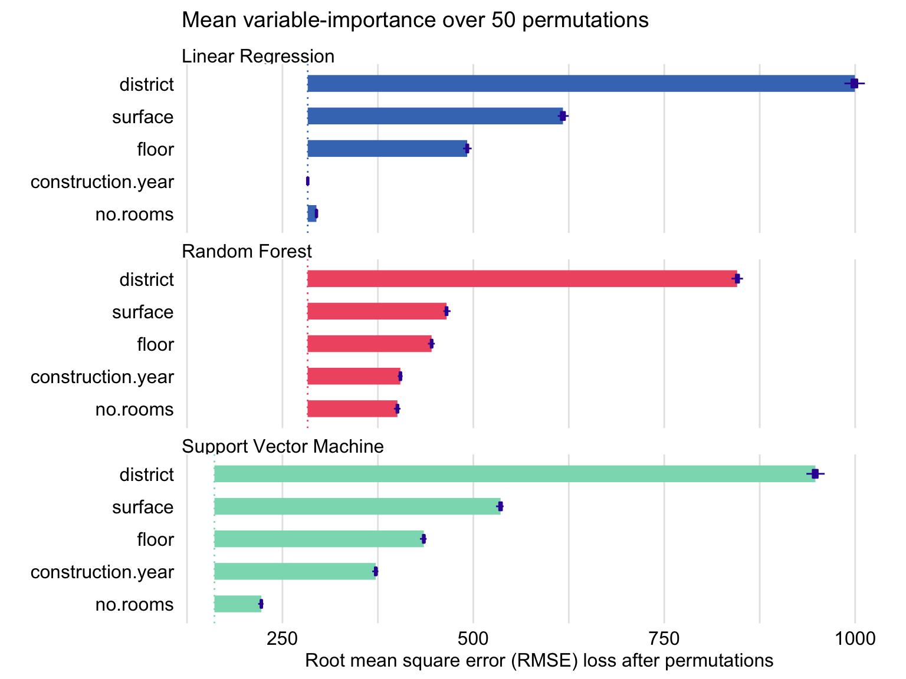

## Table of Contents

## What are variable importances in machine learning?

Variable importances in machine learning help us understand which features or inputs are most useful for making predictions. When we build a model, we use different pieces of information, called variables, to guess an outcome. Variable importance tells us which of these variables have the biggest impact on the model's predictions. This is important because it helps us focus on the most relevant information and can make our models simpler and more effective.

There are different ways to measure variable importance, depending on the type of model we are using. For example, in decision trees, we can see how much each variable helps to split the data into different groups. In other models, like linear regression, we can look at the coefficients of the variables. A larger coefficient means the variable has a bigger effect on the prediction. By understanding variable importance, we can improve our models and explain them better to others.

## Why is understanding variable importance useful in machine learning models?

Understanding variable importance in machine learning models is helpful because it shows us which pieces of information matter the most when making predictions. Imagine you're trying to guess if it will rain. You might look at the humidity, temperature, and wind speed. If humidity turns out to be the most important variable, you know to pay more attention to it. This helps us focus on the most useful data, making our models simpler and more accurate.

It also helps us explain our models to others. If a doctor uses a model to predict a patient's health risk, knowing which variables are most important can help them explain the prediction to the patient. For example, if the model shows that blood pressure is the most important variable, the doctor can focus on that when discussing the patient's health. By understanding variable importance, we can make better decisions and communicate more effectively.

## How can variable importance help in feature selection?

Variable importance helps in feature selection by showing us which pieces of information, or features, are most useful for making predictions. When we build a model, we often start with many features, but not all of them are equally important. By figuring out which features have the biggest impact on the model's predictions, we can choose to keep only the most important ones. This makes our model simpler and easier to understand, and it can also make the model work better because it focuses on the most relevant information.

For example, if we're trying to predict house prices, we might start with features like the number of bedrooms, the size of the house, and the age of the house. If we find out that the size of the house is the most important feature, we might decide to keep that one and maybe a few others, but leave out less important features like the color of the house. By using variable importance to guide our feature selection, we can build a model that is both effective and easy to explain to others.

## What are the common methods used to calculate variable importance?

One common method to calculate variable importance is by using decision trees and random forests. In decision trees, we can see how much each variable helps to split the data into different groups. This is called the Gini importance or the mean decrease in impurity. The idea is that if a variable helps to make a good split in the data, it's important. In random forests, which are made of many decision trees, we can average the importance scores across all the trees to get a more stable measure of variable importance. This method is great for models that use decision trees.

Another method is used in linear models like linear regression. Here, we look at the coefficients of the variables. A coefficient tells us how much the prediction changes when the variable changes by one unit. If a coefficient is big, it means the variable has a big effect on the prediction, so it's important. For example, in a simple linear regression model, the formula might look like $$y = \beta_0 + \beta_1 x_1 + \beta_2 x_2 + \epsilon$$. Here, $$\beta_1$$ and $$\beta_2$$ are the coefficients for variables $$x_1$$ and $$x_2$$. The bigger the absolute value of these coefficients, the more important the variable.

A third method is permutation importance, which can be used with any type of model. Here, we take a variable and mix up its values randomly, then see how much worse the model's predictions get. If the predictions get a lot worse, the variable is important. If the predictions don't change much, the variable isn't very important. This method is useful because it works with many different kinds of models, not just decision trees or linear models.

## Can you explain how the permutation importance method works?

Permutation importance is a way to figure out how important a variable is in a [machine learning](/wiki/machine-learning) model. Imagine you have a model that uses different pieces of information to make predictions. To find out how important one piece of information is, you mix up its values randomly and then see how much worse the model's predictions get. If the predictions get a lot worse, it means that piece of information was really important. If the predictions don't change much, it means that piece of information wasn't very important.

To do this, you start with your model and your data. You take one variable, like the age of a person, and you shuffle its values around randomly. Then you use the model to make predictions with this shuffled data. You compare these predictions to the predictions the model made with the original, unshuffled data. The difference between these two sets of predictions tells you how important the variable is. If the predictions are very different, the variable is important. If they're similar, the variable isn't very important. This method is great because it works with any kind of model, not just specific ones like decision trees or linear regression.

## How does the Gini importance measure variable importance in decision trees?

Gini importance is a way to figure out how important a variable is in a decision tree. Imagine you're trying to split a group of people into different teams based on their ages. If knowing someone's age helps you make a good split, then age is an important variable. In a decision tree, we use something called the Gini index to measure how good a split is. The Gini index shows how mixed up the groups are after a split. If a variable helps make the groups less mixed up, it gets a high Gini importance score, meaning it's important.

To calculate Gini importance, we look at how much each variable helps reduce the Gini index when it's used to split the data. If a variable helps a lot, it gets a higher score. For example, if we're trying to predict if someone will buy a product based on their age and income, and age helps make better splits than income, then age will have a higher Gini importance. This way, we can see which variables are most useful for making predictions in our decision tree model.

## What is the difference between global and local variable importance?

Global variable importance looks at how important a variable is for the whole model. It tells us which variables are most helpful in making predictions across all the data we have. For example, if we're trying to predict house prices, global importance might show us that the size of the house is very important no matter which houses we're looking at. This helps us understand the overall impact of each variable on our model's predictions.

Local variable importance, on the other hand, looks at how important a variable is for a specific prediction or a small part of the data. It helps us understand why the model made a certain prediction for a particular case. For instance, if we're predicting the price of a specific house, local importance might show us that the age of the house was very important for that one prediction, even if it's not as important overall. By using local importance, we can explain individual predictions better and see how different variables affect different parts of our data.

## How can variable importance be affected by correlated features?

When features in a dataset are correlated, it means they tend to change together. For example, in a dataset about houses, the number of bedrooms and the size of the house might be correlated because bigger houses usually have more bedrooms. This correlation can make it tricky to figure out how important each feature is. If two features are highly correlated, the model might think one of them is more important than it really is because it's getting similar information from both. This can lead to a situation where the model's idea of variable importance is skewed, and we might think a feature is more or less important than it actually is.

To deal with this, we can use methods like regularization in linear models, which can help by shrinking the coefficients of correlated features. For example, in a linear regression model, we might use Lasso regularization, which adds a penalty term to the coefficients, making them smaller and helping to reduce the impact of correlated features. The formula for Lasso regularization looks like this: $$ \text{minimize} \left( \sum_{i=1}^n (y_i - \sum_{j=1}^p x_{ij} \beta_j)^2 + \lambda \sum_{j=1}^p |\beta_j| \right) $$. By using techniques like this, we can get a better understanding of which features are truly important, even when they're correlated with each other.

## What are the limitations of using variable importance scores for model interpretation?

Using variable importance scores to understand a model can be tricky because these scores can be affected by many things. For example, if two pieces of information are closely related, like the number of bedrooms and the size of a house, the model might think one is more important than it really is. This can make it hard to know which piece of information is truly helpful. Also, different ways of calculating importance, like Gini importance or permutation importance, can give different results. This means that the scores might not always show the full picture of how the model works.

Another problem is that variable importance scores don't tell us how the model uses the information to make predictions. They just show which pieces of information are important, but not how they are important. For example, a high importance score for a variable might mean it's used a lot, but it doesn't tell us if it's used to increase or decrease the prediction. This can make it hard to explain the model's decisions to others. To get a better understanding, we might need to use other methods, like looking at how the model's predictions change when we change the values of different variables.

## How can variable importance be used to improve model performance?

Variable importance helps us improve our model by showing us which pieces of information are most helpful for making predictions. When we know which variables are important, we can focus on them and ignore the ones that don't help much. This makes our model simpler and easier to understand. For example, if we're trying to predict house prices and we find out that the size of the house is the most important variable, we can build a model that pays more attention to the size and less to other less important things like the color of the house. By doing this, our model can work better because it's using the most relevant information.

Another way variable importance can help is by showing us if some variables are too closely related. If two variables, like the number of bedrooms and the size of the house, are highly correlated, the model might think one is more important than it really is. We can use techniques like regularization to deal with this. For example, in a linear regression model, we might use Lasso regularization, which adds a penalty term to the coefficients, making them smaller and helping to reduce the impact of correlated variables. The formula for Lasso regularization looks like this: $$ \text{minimize} \left( \sum_{i=1}^n (y_i - \sum_{j=1}^p x_{ij} \beta_j)^2 + \lambda \sum_{j=1}^p |\beta_j| \right) $$. By using these techniques, we can make our model more accurate and easier to explain to others.

## What advanced techniques exist for assessing variable importance in complex models like neural networks?

In complex models like neural networks, assessing variable importance can be tricky because these models work differently than simpler models like decision trees or linear regression. One advanced technique is called SHAP (SHapley Additive exPlanations). SHAP values help us understand how much each variable contributes to a prediction by using ideas from game theory. Imagine you're playing a game where each player (variable) helps to make a prediction. SHAP values show us how much each player's contribution matters. This method works well for any model, not just neural networks, and it gives us a fair way to see the importance of each variable.

Another technique is called LIME (Local Interpretable Model-agnostic Explanations). LIME helps us understand how a model makes a specific prediction by creating a simpler model around that prediction. For example, if we want to know why a [neural network](/wiki/neural-network) predicted a high house price for a specific house, LIME would look at the features of that house and create a simple model to explain the prediction. This local approach helps us see how different variables affect the prediction for that one case. Both SHAP and LIME are powerful tools that help us understand complex models better, even though they work in different ways.

## How can you validate the reliability of variable importance measures in different datasets?

To validate the reliability of variable importance measures across different datasets, you can use a technique called cross-validation. This means you split your data into smaller parts and build your model many times, each time leaving out a different part of the data. You then check how important each variable is in each of these models. If the importance of a variable stays the same across all these different models, you can trust that it's really important. This helps you see if the variable importance you found is just a fluke or if it's something you can rely on.

Another way to check the reliability is by using different methods to measure variable importance and seeing if they agree with each other. For example, you might use Gini importance from decision trees, permutation importance, and SHAP values from a neural network. If all these methods say the same variable is important, you can feel more confident about it. Sometimes, you might find that different methods give different results, which can help you understand your data better and make your model more accurate. By using these techniques, you can make sure your variable importance measures are trustworthy and useful for improving your model.