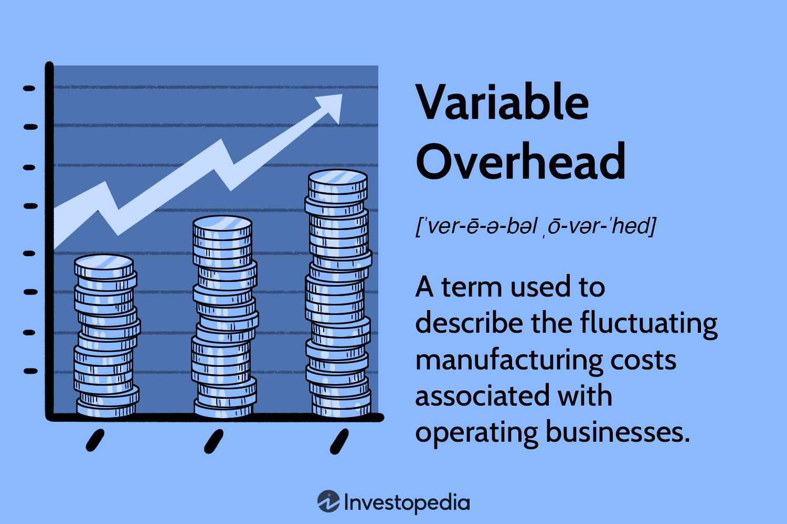

## Table of Contents

## What is variable overhead?

Variable overhead refers to the costs in a business that change depending on how much the business produces. These costs go up when the business makes more products and go down when it makes fewer. Examples of variable overhead include costs for utilities like electricity and gas, as well as indirect materials and supplies that are used in production.

Understanding variable overhead is important for businesses because it helps them plan their budgets and set prices for their products. By knowing how these costs change with production levels, a business can make better decisions about how much to produce and at what cost. This can lead to more efficient operations and better financial performance overall.

## How does variable overhead differ from fixed overhead?

Variable overhead and fixed overhead are two types of costs that businesses have to deal with, but they work in different ways. Variable overhead costs change based on how much a business produces. If a business makes more things, these costs go up. If it makes less, the costs go down. Examples of variable overhead include the cost of electricity used in production or the cost of supplies that are used to make products.

On the other hand, fixed overhead costs stay the same no matter how much a business produces. These costs don't change with production levels. For example, the rent for a factory or the salary of a manager are fixed overhead costs. They remain the same whether the business is making a lot of products or just a few.

Understanding the difference between variable and fixed overhead is important for businesses. It helps them plan their budgets better and make smarter decisions about production. By knowing which costs will change and which will stay the same, a business can figure out how to manage its money more effectively and keep its operations running smoothly.

## What are common examples of variable overhead costs in a business?

Variable overhead costs are the costs that go up and down based on how much a business makes. A common example is the cost of electricity used in the factory. When the factory makes more products, it uses more machines, and that means it uses more electricity. So, the cost of electricity goes up. Another example is the cost of supplies that are used in making products. These supplies, like cleaning materials or small tools, are used more when more products are being made, so their cost also changes.

Another type of variable overhead is the cost of indirect materials. These are materials that are needed for production but are not part of the final product. For example, if a business makes furniture, the glue used to put the pieces together is an indirect material. The more furniture the business makes, the more glue it needs, and the higher the cost of glue becomes. Also, costs for things like packaging materials can be variable overhead. When a business ships more products, it needs more boxes and packing materials, so these costs go up.

Understanding these variable overhead costs helps businesses plan better. They can see how costs change with production levels and make decisions about how much to produce. This can help them save money and be more efficient.

## How can variable overhead impact a company's pricing strategy?

Variable overhead can really change how a company decides to price its products. When a company knows how much its variable overhead costs change with production, it can set prices that cover these costs and still make a profit. If the variable overhead goes up a lot when they make more products, the company might need to charge more for each product to cover these extra costs. On the other hand, if they can keep variable overhead costs low, they might be able to charge less and still make money.

This understanding of variable overhead also helps a company decide how much to produce. If making more products means a big jump in variable overhead costs, it might not be worth it to produce a lot. The company might choose to make fewer products but charge more for each one. This way, they can keep their costs under control and still make a profit. By carefully managing variable overhead, a company can find the right balance between how much they produce and how much they charge, which helps them stay competitive in the market.

## What methods are used to allocate variable overhead to products or services?

One common method to allocate variable overhead to products or services is the activity-based costing (ABC) method. This method looks at the different activities that a business does and figures out how much each activity costs. Then, it assigns these costs to the products or services based on how much of each activity is used to make them. For example, if a product needs a lot of machine time, the cost of electricity used by the machines would be allocated to that product.

Another method is the direct labor hours method. This method uses the amount of time workers spend on making a product to decide how much variable overhead to assign to it. If a product takes a lot of time to make, it gets a bigger share of the variable overhead costs. This method is simpler than ABC but might not be as accurate because it assumes that all variable overhead costs change in the same way as labor hours.

A third way to allocate variable overhead is the machine hours method. This is similar to the direct labor hours method but focuses on the time machines are used instead of workers. If a product needs a lot of machine time, more of the variable overhead costs, like electricity and maintenance, are assigned to it. This method is useful when machines play a big role in production and can give a clearer picture of how variable overhead costs are used.

## How do companies track and monitor variable overhead?

Companies track and monitor variable overhead by keeping an eye on the costs that change with how much they produce. They use accounting systems to record these costs as they happen. For example, they might track the cost of electricity used in the factory every month. By looking at these records, they can see how much the costs go up or down when they make more or fewer products. This helps them understand how their variable overhead is changing over time.

To make tracking easier, companies might use software that automatically collects data on variable overhead costs. This software can show them reports and graphs that make it simple to see trends and patterns. By watching these trends, companies can spot any big changes in costs quickly. This helps them make better decisions about how to manage their money and keep their business running smoothly.

## What role does variable overhead play in budgeting and financial planning?

Variable overhead plays a big role in budgeting and financial planning for a company. When a company makes its budget, it needs to guess how much it will spend on variable overhead. This depends on how much they plan to produce. If they think they will make a lot of products, they will budget more for variable overhead costs like electricity and supplies. If they think they will make fewer products, they will budget less. By understanding how these costs change, a company can make a budget that is more accurate and helps them plan their money better.

In financial planning, knowing about variable overhead helps a company make smart decisions. They can see how changes in production will affect their costs and profits. For example, if making more products means a big jump in variable overhead costs, the company might decide to produce less to keep costs down. This way, they can plan their finances to make sure they have enough money to cover all their costs and still make a profit. By keeping an eye on variable overhead, a company can stay on top of its financial health and plan for the future.

## How can fluctuations in variable overhead affect profitability?

Fluctuations in variable overhead can really change how much profit a company makes. When variable overhead costs go up because the company is making more products, it might make less profit if it can't charge enough to cover these extra costs. For example, if the cost of electricity used in the factory goes up a lot, the company might have to spend more money than it planned. If they can't raise their prices to cover this, their profit will go down.

On the other hand, if variable overhead costs go down because the company is making fewer products, it might make more profit if it can keep its prices the same. For instance, if the company uses less electricity and supplies, it spends less money. If it can still sell its products at the same price, it will keep more of the money as profit. So, keeping an eye on how variable overhead changes can help a company make smart decisions to stay profitable.

## What are the challenges in managing variable overhead effectively?

Managing variable overhead can be tricky because these costs change all the time depending on how much a company makes. It's hard to predict exactly how much these costs will be, so companies need to guess and plan carefully. If they guess wrong, they might spend too much money or not have enough to cover all their costs. This can make it hard to keep the business running smoothly and make a profit.

Another challenge is that variable overhead costs can go up or down suddenly. For example, the price of electricity might jump because of a heatwave, or the cost of supplies might change because of problems with suppliers. When this happens, companies need to quickly adjust their plans and maybe even change how much they produce or what they charge for their products. Keeping up with these changes and making the right decisions fast can be really tough, but it's important for staying profitable.

## How can technology help in managing variable overhead?

Technology can make it easier for companies to keep track of variable overhead costs. Special software can automatically collect data on things like electricity use and the cost of supplies. This means companies can see how much they are spending on these costs every day, week, or month. By looking at this data, they can spot trends and see if costs are going up or down. This helps them plan better and make sure they have enough money to cover these costs.

Using technology also helps companies react quickly to changes in variable overhead. If the cost of electricity suddenly goes up, the software can show this right away. Then, the company can decide if they need to make less products or find a way to use less electricity. This quick reaction can help them save money and keep their profits up. By using technology, companies can manage their variable overhead more effectively and keep their business running smoothly.

## What advanced analytical techniques can be used to optimize variable overhead?

One advanced analytical technique to optimize variable overhead is regression analysis. This technique helps companies understand how different factors, like the number of products they make, affect their variable overhead costs. By using regression analysis, a company can see patterns and predict how much their costs will change if they make more or fewer products. This helps them plan better and make smart decisions about how much to produce to keep costs low and profits high.

Another technique is cost-volume-profit (CVP) analysis. This method looks at how changes in costs, sales volume, and prices affect a company's profits. By using CVP analysis, a company can figure out the best level of production to reach their profit goals. It helps them see how much they need to make and sell to cover all their costs, including variable overhead, and still make money. This way, they can adjust their production and pricing strategies to optimize their variable overhead and improve their financial performance.

## How does variable overhead management vary across different industries?

Variable overhead management can be very different from one industry to another because each industry has its own unique costs and ways of making things. In the manufacturing industry, variable overhead might include costs like electricity for machines and supplies used in production. These costs go up when the factory makes more products. So, manufacturers need to keep a close eye on how much they produce and how much it costs them. They might use special software to track these costs and make sure they don't spend too much money.

In the service industry, like restaurants or hotels, variable overhead might include costs for things like food ingredients or cleaning supplies. These costs change depending on how many customers they serve. For example, a restaurant will use more food and electricity if it's busy. Service businesses need to watch these costs carefully and adjust how they work to keep them under control. They might use technology to track their costs and see how they can save money by changing how they serve customers or manage their supplies.

In the tech industry, variable overhead can include costs for server usage and software licenses that change with the amount of data being processed or the number of users. Tech companies need to manage these costs by optimizing their data usage and scaling their services efficiently. They often use advanced analytics to predict how their costs will change and plan their operations accordingly. This helps them keep their variable overhead low and maintain high profitability.

## What is the understanding of Cost Accounting and Variable Overhead?

Cost accounting is a crucial component of financial management that involves the detailed tracking and recording of all production costs within a company. These production costs are typically categorized into fixed and variable costs, each playing a significant role in the financial landscape of a business.

Fixed costs are those that remain constant regardless of the level of production or business activity. Examples of fixed costs include rent, salaries, and insurance. These expenses do not change in the short term with the fluctuation in production levels and provide a stable view of the company's obligatory financial commitments.

In contrast, variable overhead refers to costs that vary directly with the level of business activity. These expenses include elements such as manufacturing supplies, energy costs, and direct labor wages. As production increases, so do these variable costs, creating a direct correlation between production levels and expenses. The formula for total variable costs is often represented as:

$$
\text{Total Variable Cost} = \text{Variable Cost per Unit} \times \text{Number of Units Produced}
$$

Understanding both fixed and variable costs is essential for effective resource allocation and pricing strategies. This differentiation allows businesses to perform more accurate cost analysis and budgeting. Companies can establish pricing strategies that cover these costs while ensuring profitability. For example, businesses often use break-even analysis to determine the minimum sales [volume](/wiki/volume-trading-strategy) needed to cover all fixed and variable costs. The break-even point (BEP) can be calculated as follows:

$$
\text{BEP (in units)} = \frac{\text{Fixed Costs}}{\text{Selling Price per Unit} - \text{Variable Cost per Unit}}
$$

Effective management of these costs allows companies to optimize their operations, ensuring input costs are controlled while maintaining output quality. By aligning production levels with the comprehension of variable overheads, businesses can strategically plan production schedules, investment in supplies, and allocate human resources aligning with customer demand and operational capabilities.

In conclusion, a solid understanding of cost accounting principles, particularly the distinction between fixed and variable overheads, is indispensable for informed decision-making. It aids in crafting operational strategies that ensure long-term financial stability and competitive pricing in the market.

## What is the Role of Variable Overhead in Business Expenses?

Variable overheads, characterized by their direct correlation to business activity levels, encompass a range of costs such as production supplies, energy expenditures, and labor wages. Such costs are intrinsic to production processes and directly fluctuate with the operational intensity of a business. For instance, the more products a company manufactures, the higher the consumption of materials like lubricants, the greater the energy usage to run machines, and the potential increase in wages for overtime or additional staffing.

Effective management of these variable overheads is crucial for businesses aiming to maintain consistent profit margins, especially in volatile market environments. When a company is aware of its operational costs and how they vary with production volumes, it can make informed pricing decisions. An example of this would be adjusting the sales price of a product based on the increased cost of production due to higher energy costs in peak seasons.

In this context, understanding the nuances of variable overheads enables businesses to devise strategic frameworks for pricing and product development. A company might choose to innovate its product line by integrating cost-effective materials or streamlining its production process to reduce waste and, consequently, variable costs.

For illustration, consider a manufacturing business with the following production-related expenses:

- Production Supplies: $0.50 per unit
- Energy Costs: $0.30 per unit
- Wages: $0.20 per unit

The total variable overhead cost per unit is calculated as follows:

$$
\text{Total Variable Overhead (per unit)} = \text{Production Supplies} + \text{Energy Costs} + \text{Wages}
$$

$$
\text{Total Variable Overhead (per unit)} = 0.50 + 0.30 + 0.20 = 1.00
$$

Understanding this variable overhead cost per unit allows the business to set a minimum price point to ensure profitability. Additionally, during times of increased production, which might lead to decreased per-unit fixed overheads, businesses can leverage these insights for competitive pricing strategies, possibly allowing for temporary price reductions to gain market share without sacrificing profit margins.

Thus, astute management and analysis of variable overheads provide a significant competitive edge, forming the backbone of strategic financial planning and operational efficiency in dynamic markets.

## What are the differences between Variable and Absorption Costing in Cost Accounting Methods?

Cost accounting methods play a crucial role in financial management and decision-making processes. Two primary approaches in cost accounting are variable costing and absorption costing, each serving distinct purposes and offering unique insights into a company's financial operations and strategies.

**Variable Costing**

Variable costing, also known as direct or marginal costing, is a method where only variable costs are considered when calculating the cost of goods sold and inventory. This approach includes costs that fluctuate directly with changes in production levels, such as direct materials, direct labor, and variable manufacturing overheads.

The primary benefit of variable costing is its utility in short-term decision-making and internal management. By excluding fixed overheads from product costs, managers can gain a clearer understanding of the incremental costs associated with producing an additional unit of product. This can be particularly useful in decisions involving pricing, product mix, and profitability analysis. In variable costing, the contribution margin is a critical metric, calculated as:

$$
\text{Contribution Margin} = \text{Sales} - \text{Variable Costs}
$$

This contribution margin helps in assessing the impact of varying production levels on profitability.

**Absorption Costing**

Absorption costing, sometimes referred to as full costing, incorporates both variable and fixed manufacturing costs into the cost of a product. This method aligns with Generally Accepted Accounting Principles (GAAP) and is required for external financial reporting. Fixed manufacturing overheads, such as factory rent and salaries, are allocated to individual units, ensuring that the entire cost of production is accounted for.

Absorption costing provides a comprehensive view of total production costs, which can aid in accurately assessing long-term financial performance and ensuring compliance with financial reporting standards. The formula to calculate the cost per unit in absorption costing can be expressed as:

$$
\text{Cost Per Unit} = \frac{\text{Total Variable Costs} + \text{Total Fixed Costs}}{\text{Total Units Produced}}
$$

Absorption costing enhances the visibility of overhead allocation across all units produced, which can influence pricing strategies and profitability evaluations.

**Impact on Financial Measurement and Operational Strategy**

The choice between variable and absorption costing can significantly impact financial measurement and operational strategy. Variable costing is more agile, providing immediate insight into the variable costs affecting profitability, aiding in optimizing short-term decisions. In contrast, absorption costing offers a holistic view of all manufacturing costs, ensuring accurate reflection of financial health in external reports.

Financial analysis using absorption costing might suggest profitability levels influenced by fixed costs allocation, necessitating strategic evaluation for pricing and output decisions. Conversely, the variable costing approach emphasizes the sensitivity of profit to sales volume, guiding operational adjustments to respond to market demands.

Both methods have their respective applications and benefits. Managers often use variable costing for internal decision support and performance management, while relying on absorption costing for meeting external reporting requirements and comprehensive cost analysis. Organizations must strategically integrate both approaches to align operational practices with financial objectives and compliance needs.

## What is Algorithmic Trading and How Does It Integrate with Financial Systems?

Algorithmic trading is a sophisticated method of executing trades using automated platforms that leverage complex algorithms to make high-speed decisions. This technological advancement necessitates the careful management of both fixed and variable costs to ensure profitability and operational efficiency.

Variable costing is crucial in [algorithmic trading](/wiki/algorithmic-trading), as it aids in calculating the marginal cost associated with each trade. This method focuses solely on variable costs, excluding fixed overheads, which provides a clearer picture of the incremental expenses incurred during trading activities. By understanding these costs, traders can optimize their execution strategies, thereby enhancing the cost-effectiveness of trades. For instance, the marginal cost equation can be represented as:

$$
\text{Marginal Cost} = \frac{\Delta \text{Total Variable Cost}}{\Delta \text{Quantity of Trades}}
$$

Integrating cost accounting into algorithmic trading elevates decision-making processes. With precise cost insights, trading firms can adjust their strategies to improve market responsiveness and profitability. Moreover, effective cost accounting informs the development of trading algorithms that are not only more adaptive to market conditions, but also mindful of cost implications.

The combination of algorithmic trading with robust cost accounting frameworks allows firms to maintain competitive advantages by minimizing losses associated with over-trading and optimizing the use of financial resources. This integration ultimately leads to greater overall organizational performance, ensuring that trading strategies align with financial objectives.

## References & Further Reading

- Horngren, C. T., Datar, S. M., & Rajan, M. V. (2014). *Cost Accounting: A Managerial Emphasis*. Prentice Hall. This book provides comprehensive insights into cost accounting practices, focusing on methods for capturing production costs which are critical for strategic financial management and decision-making.

- De Prado, M. L. (2018). *Advances in Financial Machine Learning*. Wiley. A key text for understanding the integration of machine learning in finance, this book discusses the use of algorithms to enhance trading strategies and improve financial performance.

- Kaplan, R. S., & Anderson, S. R. (2004). *Time-driven activity-based costing*. Harvard Business Review. This article introduces a refined approach to activity-based costing that offers a more accurate and straightforward method for measuring costs related to business activities, essential for effective resource allocation and pricing strategies.

These references offer foundational knowledge and advanced concepts crucial for optimizing cost accounting and integrating it with algorithmic trading. Each resource enhances understanding of the theoretical and practical applications necessary for current financial management challenges.

