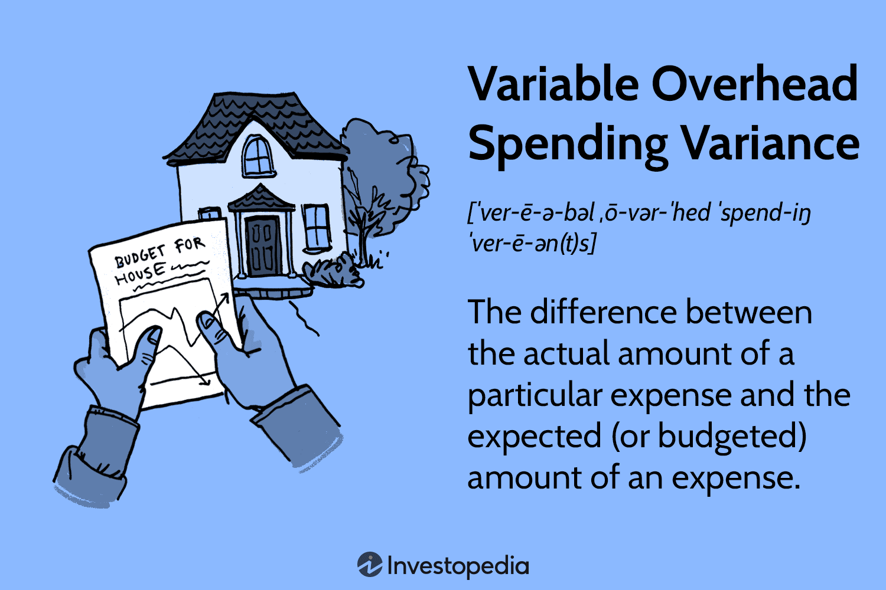

## Table of Contents

## What is variable overhead spending variance?

Variable overhead spending variance is the difference between what a company actually spent on variable overhead costs and what it should have spent based on the budget. Variable overhead costs are expenses that change depending on how much a company produces, like electricity or indirect materials. If a company spends more than expected, the variance is unfavorable. If it spends less, the variance is favorable.

This variance helps managers understand if they are managing their variable costs well. For example, if the variance is unfavorable, it might mean that the company is paying more for electricity than planned. Managers can then look into why this is happening and try to fix it. On the other hand, a favorable variance might mean the company found a way to save money, which is good news.

## How is variable overhead spending variance calculated?

Variable overhead spending variance is calculated by taking the difference between the actual amount spent on variable overhead and the amount that should have been spent according to the budget. The budgeted amount is based on the standard rate for variable overhead multiplied by the actual hours worked. If the actual spending is more than the budgeted amount, the variance is unfavorable. If it's less, the variance is favorable.

For example, let's say a company budgets $5 per hour for variable overhead and employees worked 1,000 hours. The budgeted variable overhead cost would be $5,000 (which is $5 times 1,000 hours). If the company actually spent $5,200 on variable overhead, the variable overhead spending variance would be $200 unfavorable ($5,200 actual minus $5,000 budgeted). This shows the company spent more than expected on variable overhead costs.

## Why is it important to analyze variable overhead spending variance?

Analyzing variable overhead spending variance is important because it helps businesses understand how well they are managing their costs. Variable overheads, like electricity or supplies, can change based on how much the business produces. By looking at the variance, a company can see if they are spending more or less than they planned. If they are spending more, it might mean they need to find ways to save money or fix problems that are causing higher costs.

If the variance shows the company is spending less than expected, it's good news because it means they are saving money. This can help the company decide if they can keep doing things the same way or if they should try to save even more. By keeping an eye on this variance, managers can make better decisions to keep the business running smoothly and profitably.

## Can you provide a simple example of variable overhead spending variance?

Let's say a small bakery budgets $0.10 per cookie for variable overhead costs like electricity and packaging. Last month, they made 10,000 cookies. So, their budgeted variable overhead cost was $1,000 (which is $0.10 times 10,000 cookies). But when they checked their bills, they found out they actually spent $1,100 on variable overhead costs.

This means their variable overhead spending variance was $100 unfavorable because they spent $100 more than they planned. The bakery's managers need to figure out why they spent more than expected. Maybe the electricity rates went up, or maybe they used more packaging than usual. By understanding this variance, they can try to fix the problem and save money next time.

## What factors can cause a variable overhead spending variance?

Variable overhead spending variance can be caused by many things. One common reason is changes in prices. For example, if the cost of electricity or supplies goes up, the company will spend more than they planned. Another reason could be using more resources than expected. If a factory runs longer hours or uses more materials, the variable overhead costs will be higher.

Another factor is how well the company manages its resources. If they are not careful, they might waste electricity or use too much packaging. On the other hand, if they find ways to save, like using energy-efficient machines or buying supplies in bulk, they might spend less than they expected. It's important for companies to keep an eye on these factors to control their costs and improve their spending variance.

## How does variable overhead spending variance differ from fixed overhead variance?

Variable overhead spending variance and fixed overhead variance are both ways to see how well a company is managing its costs, but they look at different kinds of costs. Variable overhead spending variance focuses on costs that change based on how much the company produces, like electricity or supplies. If the company spends more on these costs than they planned, the variance is unfavorable. If they spend less, it's favorable. This helps managers see if they need to save money or if they are already doing a good job.

Fixed overhead variance, on the other hand, looks at costs that stay the same no matter how much the company produces, like rent or salaries for managers. Fixed overhead variance can be broken down into two parts: spending variance and volume variance. The spending variance is the difference between what the company actually spent on fixed costs and what they budgeted. The volume variance shows if the company used its fixed resources more or less than expected. Both variances help managers keep an eye on different areas of their costs and make smart decisions.

## What are the implications of a favorable vs. an unfavorable variable overhead spending variance?

A favorable variable overhead spending variance means a company spent less on variable costs than they planned. This is good because it shows the company saved money. Maybe they found a cheaper supplier for materials or used less electricity than expected. When this happens, the company can use the extra money for other things, like growing the business or rewarding employees. It's a sign that the company is doing well in managing its costs.

An unfavorable variable overhead spending variance means the company spent more on variable costs than they planned. This is not good because it shows the company is spending more money than expected. Maybe the price of electricity went up or they used more supplies than they thought they would. When this happens, the company needs to figure out why and fix the problem. It's a warning sign that they need to be more careful with their spending to keep the business healthy.

## How can a company use variable overhead spending variance to improve its operations?

A company can use variable overhead spending variance to find out if they are spending too much or too little on costs that change with production, like electricity or supplies. If they see the variance is unfavorable, meaning they spent more than planned, they can look into why this happened. Maybe the price of electricity went up, or they used more materials than they thought they would. By figuring out the cause, they can make changes to save money. For example, they could switch to a cheaper supplier or find ways to use less electricity.

On the other hand, if the variance is favorable, meaning they spent less than planned, it's a good sign that they are managing their costs well. They can look at what they did right and keep doing it. Maybe they found a way to use less packaging or got a good deal on supplies. Knowing this helps them keep saving money and use the extra cash for other important things, like growing the business or rewarding employees. By keeping an eye on the variable overhead spending variance, a company can make smart choices to improve how they run their business.

## What are the common methods to manage and control variable overhead spending variance?

To manage and control variable overhead spending variance, companies can start by setting clear budgets for their variable costs. They should keep a close eye on these costs and compare them to the budget regularly. If they see they are spending more than planned, they can look into why this is happening. Maybe they can find a cheaper supplier for materials or switch to more energy-efficient equipment to save on electricity. By understanding where the extra spending is coming from, they can make changes to reduce costs.

Another way to manage variable overhead spending variance is to train employees to use resources wisely. If everyone in the company knows the importance of saving money, they can help by using less electricity or being careful with supplies. Companies can also use technology to help with this. For example, they can use software to track their spending in real-time and get alerts if costs start to go up. By staying on top of their variable costs and making smart choices, companies can keep their spending under control and improve their overall financial health.

## How does variable overhead spending variance relate to budgeting and forecasting?

Variable overhead spending variance is closely tied to budgeting and forecasting because it shows how well a company sticks to its budget for costs that change with production. When a company makes a budget, it guesses how much it will spend on things like electricity and supplies based on how much they plan to produce. If they spend more than they planned, the variance is unfavorable, which means they need to look at their budget and see if they need to change it or find ways to save money. If they spend less than they planned, the variance is favorable, which is good news because it means they saved money. This helps them see if their budget was right or if they need to make it better next time.

Forecasting is also important because it helps a company predict future costs and plan their budget. By looking at the variable overhead spending variance, a company can learn from past mistakes or successes and make better guesses about future costs. For example, if they see that electricity costs keep going up, they can plan for higher costs in the future and maybe look for ways to use less electricity. By using the information from the variance, they can make their forecasts more accurate and create a budget that helps them control their spending and keep the business running smoothly.

## What advanced techniques can be used to analyze variable overhead spending variance in complex scenarios?

In complex scenarios, companies can use advanced techniques like regression analysis to better understand variable overhead spending variance. Regression analysis helps them see how different factors, like the price of electricity or the amount of supplies used, affect their costs. By looking at data over time, they can find patterns and predict how changes in these factors might change their costs in the future. This can help them make better decisions about where to save money or how to plan their budget.

Another technique is using activity-based costing (ABC). This method looks at all the activities that go into making a product and assigns costs to each activity. By doing this, a company can see which activities are causing their variable overhead costs to go up or down. They can then focus on improving those activities to control their costs better. Using ABC helps them understand their costs in more detail and make smarter choices about how to manage their variable overhead spending variance.

## How do industry-specific factors influence variable overhead spending variance?

Industry-specific factors can really change how much a company spends on things like electricity or supplies, which are part of variable overhead costs. For example, in the manufacturing industry, the cost of raw materials can go up and down a lot. If the price of steel or plastic goes up, a company making cars or toys might spend more than they planned. On the other hand, in the tech industry, companies might spend a lot on electricity to run their data centers. If they start using more energy-efficient servers, they could spend less than they expected.

In the food service industry, things like food prices and labor costs can affect variable overhead spending variance. If the price of ingredients like meat or vegetables goes up, restaurants might have to spend more to make their dishes. Also, if they need to pay more for workers during busy times, their labor costs can go up. By understanding these industry-specific factors, companies can better plan their budgets and find ways to save money, even when costs are changing all the time.

## What is Variable Overhead Spending Variance Explained?

Variable Overhead Spending Variance represents the discrepancy between the actual variable overhead costs incurred and the budgeted or standard overhead costs for a certain period. This variance provides insights into the cost management efficiency concerning indirect expenses, which can be crucial in industries with fluctuating operational activities, such as [algorithmic trading](/wiki/algorithmic-trading).

Understanding this variance involves analyzing how well a business manages its indirect costs compared to its initial budgetary expectations. For algorithmic trading firms, effective management of these overheads is vital to optimize financial performance and maintain a lean operational framework.

The calculation of Variable Overhead Spending Variance can be expressed through a formula:

$$
\text{Variable Overhead Spending Variance} = \text{Actual Overhead Costs} - (\text{Budgeted Rate} \times \text{Actual Output})
$$

Where:
- **Actual Overhead Costs** are the real expenses incurred for variable overheads during the period.
- **Budgeted Rate** is the estimated per-unit cost for variable overhead.
- **Actual Output** is the quantity of production or activity achieved in the period.

For instance, consider an algorithmic trading firm that budgets $5 per trade for variable overheads, anticipating 1,000 trades, totaling $5,000. If the actual overhead incurred for these trades is $5,500, the variance calculation would be:

$$
\text{Variable Overhead Spending Variance} = \$5,500 - (\$5 \times 1,000) = \$500
$$

A positive variance indicates that the actual spending exceeds the budget, suggesting inefficiencies or unexpected expenses, potentially affecting profitability. Conversely, a negative variance implies that the actual spending was less than the budgeted amounts, which could imply efficient cost management or underestimations in budget forecasts.

Such analyses enable algo trading firms to refine their cost management strategies, addressing inefficiencies promptly and optimizing their operational decisions. Understanding Variable Overhead Spending Variance equips businesses to control costs better and ensure alignment with financial objectives.

## How do you calculate and interpret variable overhead spending variances?

Calculating variable overhead spending variances is a pivotal aspect of financial analysis in algorithmic trading. It involves determining the discrepancy between budgeted and actual overhead costs to assess financial performance and efficiency. Here's how it is done:

### Calculation Methodology

The formula to calculate the variable overhead spending variance is straightforward:

$$
\text{Variable Overhead Spending Variance} = \text{Actual Overhead Costs} - \text{Budgeted Overhead Costs}
$$

This equation helps in identifying the difference between what was planned and what was actually spent on variable overheads during a specific period.

### Interpretation of Variance

Interpreting the variance provides insightful clues about cost management efficiency. A positive variance indicates that actual overhead costs were higher than anticipated, suggesting potential inefficiencies or unexpected expenses in resource usage. This could be due to factors like higher utility consumption or increased indirect material costs. Conversely, a negative variance implies lower actual spending compared to the budget, which might suggest efficient cost management or lower-than-expected prices for indirect materials.

### Contributing Factors

1. **Unexpected Maintenance**: One of the common factors causing variance is unexpected maintenance. If trading infrastructure requires more frequent or costly repairs than anticipated, actual overhead costs may surpass the budgeted amounts.

2. **Price Changes in Indirect Materials**: Fluctuations in the costs of materials like lubricants or cleaning supplies, which indirectly affect trading operations, can significantly influence variances.

3. **Utility Costs Variations**: Changes in electricity or water tariffs can impact overhead costs unexpectedly, leading to positive or negative variances depending on market conditions.

By carefully analyzing these variances, algorithmic trading firms can uncover underlying cost patterns and adopt strategies to enhance financial outcomes. Through regular monitoring and analysis, businesses can align their spending more closely with budget expectations, identify areas for cost control, and improve overall operational efficiency.

## References & Further Reading

[1]: Bergstra, J., Bardenet, R., Bengio, Y., & Kégl, B. (2011). ["Algorithms for Hyper-Parameter Optimization."](https://dl.acm.org/doi/10.5555/2986459.2986743) Advances in Neural Information Processing Systems 24.

[2]: ["Advances in Financial Machine Learning"](https://www.amazon.com/Advances-Financial-Machine-Learning-Marcos/dp/1119482089) by Marcos Lopez de Prado

[3]: ["Evidence-Based Technical Analysis: Applying the Scientific Method and Statistical Inference to Trading Signals"](https://www.amazon.com/Evidence-Based-Technical-Analysis-Scientific-Statistical/dp/0470008741) by David Aronson

[4]: ["Machine Learning for Algorithmic Trading"](https://github.com/stefan-jansen/machine-learning-for-trading) by Stefan Jansen

[5]: ["Quantitative Trading: How to Build Your Own Algorithmic Trading Business"](https://www.amazon.com/Quantitative-Trading-Build-Algorithmic-Business/dp/1119800064) by Ernest P. Chan