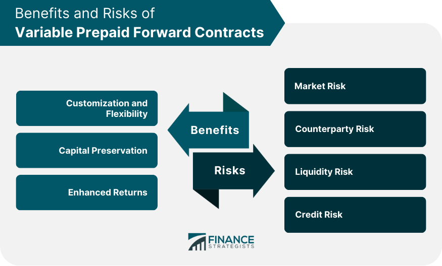

## Table of Contents

## What is a Variable Prepaid Forward Contract?

A Variable Prepaid Forward Contract is a financial agreement where someone who owns stocks can get money now by promising to give those stocks to someone else in the future. The amount of money they get upfront is based on the current value of the stocks, but it's less than what the stocks are worth because it's a loan against the future value of the stocks.

The twist with this contract is that the number of stocks the owner has to give back can change. It depends on how the stock price moves over time. If the stock price goes up, the owner might have to give back fewer stocks. If it goes down, they might need to give back more. This makes it a bit risky, but it can be useful for people who want money now and are willing to bet on their stocks' future performance.

## How does a Variable Prepaid Forward Contract work?

A Variable Prepaid Forward Contract is a deal where someone with stocks can get money right away. They do this by promising to give their stocks to someone else later. The money they get now is based on what the stocks are worth today, but it's a bit less because it's like a loan against the future value of the stocks. This means the person gets less money upfront than the stocks are currently worth.

The tricky part is that the number of stocks the person has to give back can change. It depends on how the stock price moves over time. If the stock price goes up, they might have to give back fewer stocks. But if the stock price goes down, they might need to give back more stocks. This makes it a bit risky, but it can be helpful for people who need money now and are willing to take a chance on their stocks' future performance.

## What are the key components of a Variable Prepaid Forward Contract?

A Variable Prepaid Forward Contract has a few main parts. First, there's the upfront payment, which is money the stock owner gets right away. This payment is based on the current value of the stocks but is less than their full worth because it's like a loan against the future value of the stocks. The stock owner agrees to give their stocks to someone else later, which is the second key part of the contract.

The third important part is that the number of stocks the owner has to give back can change. This depends on how the stock price moves over time. If the stock price goes up, the owner might have to give back fewer stocks. If it goes down, they might need to give back more. This makes the contract a bit risky, but it can be useful for people who need money now and are willing to bet on their stocks' future performance.

## Who typically uses Variable Prepaid Forward Contracts?

Variable Prepaid Forward Contracts are often used by people who own a lot of stocks and need money right away. These people might be business owners or executives who have a big part of their wealth tied up in company stocks. They use these contracts to get cash without selling their stocks, which can be important if they believe the stock price will go up in the future.

These contracts are also popular with investors who want to make money from changes in stock prices without buying the stocks themselves. They can agree to give money now in exchange for stocks later, betting that the stock price will move in a way that benefits them. This makes Variable Prepaid Forward Contracts a useful tool for both people who need cash and those looking to invest in the stock market.

## What are the benefits of using a Variable Prepaid Forward Contract?

One big benefit of using a Variable Prepaid Forward Contract is that it lets people get money right away without selling their stocks. This can be really helpful for business owners or executives who have a lot of their money tied up in company stocks. They can use the money for other things they need, like paying bills or starting new projects, without losing their stocks. Plus, if they think the stock price will go up in the future, they can keep their stocks and still get the cash they need now.

Another benefit is that these contracts can be a good way for investors to make money from changes in stock prices without actually buying the stocks. They can give money now and get stocks later, betting that the stock price will move in a way that helps them. This can be a smart move for people who know a lot about the stock market and want to take advantage of price changes without having to buy and sell stocks themselves.

## What are the risks associated with Variable Prepaid Forward Contracts?

One big risk of using a Variable Prepaid Forward Contract is that the number of stocks you have to give back can change. If the stock price goes down, you might have to give back more stocks than you expected. This can be a problem if the stock price drops a lot because you could end up losing more value than you got in cash upfront. It's a gamble on the future price of the stocks, and if you guess wrong, it can cost you.

Another risk is that you're locked into the contract. Once you agree to it, you can't change your mind easily. If something unexpected happens, like you need your stocks back sooner or the company does something that makes the stock price drop, you're stuck. This means you have to be very sure about your decision before you enter into the contract, because backing out can be hard and expensive.

## How do Variable Prepaid Forward Contracts differ from traditional forward contracts?

Variable Prepaid Forward Contracts and traditional forward contracts both let people agree to buy or sell something in the future at a price they set now. But they work a bit differently. In a traditional forward contract, the price and the amount of the thing you're buying or selling are fixed from the start. For example, if you agree to buy 100 shares of a stock at $50 each in six months, that's what you'll do no matter what happens to the stock price.

In a Variable Prepaid Forward Contract, the number of stocks you have to give back can change based on how the stock price moves. If the stock price goes up, you might give back fewer stocks, but if it goes down, you might have to give back more. This makes it riskier than a traditional forward contract because the final amount of stocks can be different from what you expected. Also, with a Variable Prepaid Forward Contract, you get money upfront, which is not usually the case with traditional forward contracts.

## What are the tax implications of entering into a Variable Prepaid Forward Contract?

When you enter into a Variable Prepaid Forward Contract, the tax rules can be tricky. The money you get upfront is usually not taxed right away because it's seen as a loan against your stocks, not as income. But when you finally give the stocks to the other person, you might have to pay capital gains tax. This depends on how much the stocks were worth when you made the deal compared to what they're worth when you give them away.

The tricky part is that the tax rules can change based on how the contract is set up and how the stock price moves. If the stock price goes up a lot, you might end up with a big tax bill when you give the stocks away. And if the contract is seen as a sale instead of a loan, you might have to pay taxes on the money you got upfront. It's a good idea to talk to a tax expert before you enter into one of these contracts to make sure you understand all the tax rules that might apply to you.

## How can Variable Prepaid Forward Contracts be used for hedging purposes?

Variable Prepaid Forward Contracts can be used for hedging to protect against the risk of stock prices going down. If someone owns a lot of stocks and is worried that the price might drop, they can use this contract to get money now and agree to give their stocks later. If the stock price does go down, they won't lose as much money because they already got some cash upfront. This way, they can protect themselves from big losses if the stock market takes a turn for the worse.

But it's not just about protecting against losses. These contracts can also be used to hedge against the need for cash in the future. If someone knows they'll need money later but wants to keep their stocks, they can use a Variable Prepaid Forward Contract to get the cash they need now. This way, they can plan for future expenses without having to sell their stocks at a bad time. It's a way to balance the need for money with the hope that their stocks will still be worth a lot in the future.

## What are the regulatory considerations for Variable Prepaid Forward Contracts?

Variable Prepaid Forward Contracts are subject to different rules depending on where you live and who you are. In the United States, these contracts are often looked at by the Securities and Exchange Commission (SEC) and the Financial Industry Regulatory Authority (FINRA). They want to make sure that people using these contracts are not doing anything wrong and that everyone understands the risks. If you're a company executive or a big investor, you might have to follow extra rules to make sure you're not using these contracts to hide what you're doing with your stocks.

It's also important to know that these contracts can be seen as loans or as sales of stocks, and this can change how they are regulated. If they are seen as loans, they might have to follow rules about lending money. If they are seen as sales, they might have to follow rules about selling stocks. Because of this, it's a good idea to talk to a lawyer or a financial expert before you enter into one of these contracts. They can help you understand all the rules you need to follow and make sure you're doing everything the right way.

## How do market conditions affect the performance of Variable Prepaid Forward Contracts?

Market conditions can really change how well a Variable Prepaid Forward Contract works. If the stock market is doing well and stock prices are going up, the person who got money upfront might have to give back fewer stocks. This is good for them because they can keep more of their stocks while still having the cash they needed. But if the market is not doing well and stock prices are going down, they might have to give back more stocks. This can be bad because they could lose more value than the money they got upfront.

The overall mood of the market also matters. If everyone is feeling good about the economy and buying stocks, the contract can be a smart move. But if people are worried and selling stocks, the contract can be risky. It's important for people using these contracts to keep an eye on what's happening in the market and be ready for things to change.

## What advanced strategies can be employed with Variable Prepaid Forward Contracts?

One advanced strategy with Variable Prepaid Forward Contracts is to use them as part of a bigger plan to manage money. For example, someone might use these contracts to get money now and then invest that money in other things, like real estate or different stocks. This way, they can spread out their money and not have all their eggs in one basket. If the stock they used for the contract goes down, they might still make money from their other investments. It's like playing a game where you try to win in different ways at the same time.

Another strategy is to use these contracts to take advantage of what you know about a company. If you work at a company and you think the stock price will go up because of a new product or a big deal, you can use a Variable Prepaid Forward Contract to get money now and then give back fewer stocks later. But you have to be careful because if you're wrong about the stock price, you could end up losing more than you gained. It's a bit like betting on a horse race, where you need to know a lot about the horses to make a good guess.

## References & Further Reading

[1]: ["Taxes & Investments: Prepaid Variable Forward Contracts"](https://accountinginsights.org/variable-prepaid-forward-contracts-components-tax-and-applications/) - Kitces.com

[2]: ["The Art of the Prepaid Forward Contract"](https://www.woodllp.com/Publications/Articles/pdf/Prepaid.pdf) - Susan B. Weiner Financial Writing

[3]: ["Algorithmic and High-Frequency Trading"](https://www.amazon.com/Algorithmic-High-Frequency-Trading-Mathematics-Finance/dp/1107091144) by Álvaro Cartea, Sebastian Jaimungal, and José Penalva

[4]: ["Risk Management and Financial Institutions"](https://www.simonfoucher.com/MBA/FINA%20695%20-%20Risk%20Management/riskmanagementandfinancialinstitutions4theditionjohnhull-150518225205-lva1-app6892.pdf) by John C. Hull

[5]: ["The Basics of Bitcoins and Blockchains"](https://www.amazon.com/Basics-Bitcoins-Blockchains-Introduction-Cryptocurrencies/dp/1642506737) by Antony Lewis

[6]: ["Option Volatility and Pricing: Advanced Trading Strategies and Techniques"](https://www.amazon.com/Option-Volatility-Pricing-Strategies-Techniques/dp/0071818774) by Sheldon Natenberg

[7]: Securities and Exchange Commission (SEC), ["Prepaid Variable Forward Contract"](https://accountinginsights.org/variable-prepaid-forward-contracts-components-tax-and-applications/)

[8]: ["Handbook of Financial Risk Management: Simulations and Case Studies"](https://onlinelibrary.wiley.com/doi/book/10.1002/9781118573570) by Thierry Roncalli