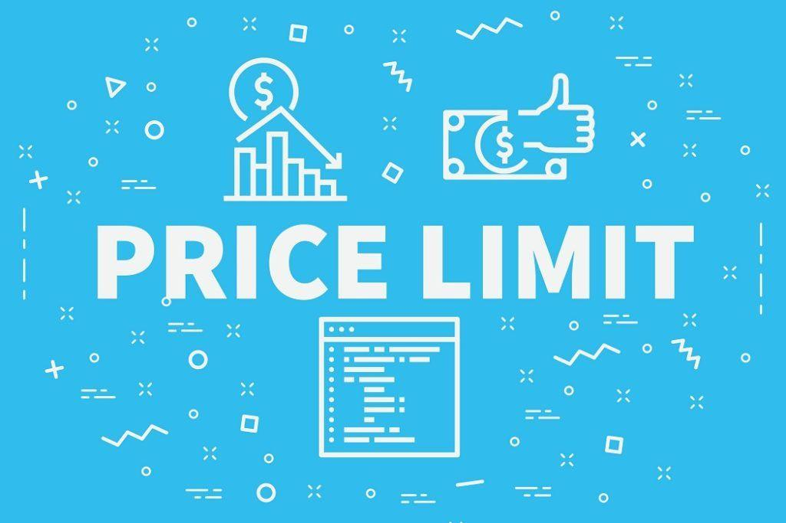

## Table of Contents

## What is a variable price limit?

A variable price limit is a rule used in some stock markets to control how much the price of a stock can change in one day. Instead of having a fixed limit, the limit changes based on things like how much the stock is traded or how much its price has moved recently. This helps keep the market stable by stopping big, sudden price changes that could cause problems.

For example, if a stock usually moves a lot, the variable price limit might be set higher to allow for normal changes. But if the market is very unstable, the limit might be set lower to keep things under control. This way, the market can adapt to different situations and protect investors from too much risk.

## How does a variable price limit differ from a fixed price limit?

A variable price limit changes depending on how the market is doing, while a fixed price limit stays the same no matter what. With a fixed price limit, the stock can only go up or down by a certain amount each day, like 10%. This can be good because it's simple and everyone knows what to expect. But it can be bad if the market changes a lot because it might not let the stock move as much as it needs to.

On the other hand, a variable price limit can change based on how much the stock is traded or how its price has been moving lately. This means it can be more flexible and better at handling big changes in the market. For example, if a stock is usually very active, the variable limit might be set higher to allow for normal ups and downs. This can help keep the market stable and protect investors from big, sudden changes in stock prices.

## What are the main purposes of implementing a variable price limit?

The main purpose of using a variable price limit is to keep the stock market stable. By changing the limit based on how the market is doing, it can stop big, sudden price changes that could cause problems. This helps make sure that the market stays calm and doesn't get too wild, which is good for everyone who invests in stocks.

Another reason for using a variable price limit is to protect investors. If the market is moving a lot, a fixed limit might not be enough to handle it. A variable limit can adjust to these changes, so it can stop prices from going too high or too low too quickly. This way, investors are safer and can trust that their money is being looked after well.

## In which markets are variable price limits commonly used?

Variable price limits are often used in stock markets, especially in places like China and India. These countries have big, busy markets where lots of people trade stocks every day. The variable price limits help keep things under control when the market gets too excited or too worried. By changing the limits based on how the market is doing, they can stop big, sudden price changes that could cause problems.

Another place where variable price limits are used is in futures markets. Futures are agreements to buy or sell something at a set price in the future, and these markets can be very fast-moving. Variable price limits help keep these markets stable by adjusting to how much the prices are moving. This way, they can protect traders from big, unexpected changes in the prices of futures contracts.

## How is the variable price limit calculated?

The variable price limit is calculated by looking at how the stock or market has been acting lately. If the stock price has been moving a lot, the limit might be set higher to let it keep moving normally. But if the market is acting wild or if there's a big event that could shake things up, the limit might be set lower to keep things calm. The idea is to use numbers like how much the stock has been traded or how much its price has changed recently to decide what the limit should be.

For example, in some markets, they might look at the average amount the stock price has moved over the last few days or weeks. If the average move is big, they might set the limit higher. If it's small, they might set it lower. This way, the limit can change every day or every week to match what's happening in the market. It's all about keeping the market stable and protecting people who are investing their money.

## What factors influence the setting of a variable price limit?

The main things that decide how a variable price limit is set are how much a stock's price has been moving lately and how much it's being traded. If a stock's price has been going up and down a lot, the limit might be set higher so it can keep moving normally without causing problems. On the other hand, if the market is acting crazy or there's a big event that could shake things up, the limit might be set lower to keep things calm. It's all about using numbers to figure out what the limit should be, so the market stays stable.

Another thing that can affect the variable price limit is how much the stock is being traded. If a lot of people are buying and selling the stock, the limit might be set higher to let it move more. But if not many people are trading it, the limit might be lower to keep things under control. By looking at how the stock has been acting and how much it's being traded, the market can set a limit that helps protect investors and keeps the market from getting too wild.

## Can you explain the impact of variable price limits on market volatility?

Variable price limits help to lower market volatility by stopping big, sudden price changes. When the market is moving a lot, the limits can change to match what's happening. This means that if a stock's price is going up and down a lot, the limit might be set higher to let it keep moving without causing problems. But if the market is acting crazy, the limit might be set lower to keep things calm. By doing this, variable price limits help to keep the market stable and stop it from getting too wild.

This can be good for investors because it protects them from big, unexpected changes in stock prices. When the market is calm, people feel safer about putting their money into stocks. But if the limits are too tight, they might stop the market from moving as much as it needs to. This can make it hard for the market to react to new information or big events. So, it's important to set the limits just right to balance keeping the market stable and letting it move when it needs to.

## What are the potential benefits of using variable price limits in trading?

Using variable price limits in trading can help keep the market calm and stop big, sudden price changes. When the market is moving a lot, the limits can change to match what's happening. This means that if a stock's price is going up and down a lot, the limit might be set higher to let it keep moving without causing problems. But if the market is acting crazy, the limit might be set lower to keep things calm. By doing this, variable price limits help to keep the market stable and stop it from getting too wild.

This can be good for investors because it protects them from big, unexpected changes in stock prices. When the market is calm, people feel safer about putting their money into stocks. But if the limits are too tight, they might stop the market from moving as much as it needs to. This can make it hard for the market to react to new information or big events. So, it's important to set the limits just right to balance keeping the market stable and letting it move when it needs to.

## What are the criticisms or challenges associated with variable price limits?

One big challenge with variable price limits is that they can be hard to set just right. If the limits are too tight, they might stop the market from moving as much as it needs to. This can make it hard for the market to react to new information or big events. People might get upset if they can't buy or sell stocks when they want to because the limits are too strict. On the other hand, if the limits are too loose, they might not stop big, sudden price changes. This can make the market too wild and risky for investors.

Another criticism is that variable price limits can be confusing for people who trade stocks. Because the limits change based on how the market is doing, it can be hard to know what the limit will be from one day to the next. This can make it tough for traders to plan their moves. They might feel like they can't trust the market because the rules keep changing. This uncertainty can make people less likely to invest, which can be bad for the market as a whole.

Lastly, setting and changing variable price limits can be a lot of work. It takes a lot of math and watching the market to figure out what the limits should be. This means that the people who run the market need to be really good at their jobs and have good tools to help them. If they get it wrong, it can cause problems for everyone who trades stocks. So, even though variable price limits can help keep the market stable, they come with their own set of challenges.

## How do regulatory bodies oversee the use of variable price limits?

Regulatory bodies keep a close eye on how variable price limits are used in the stock market. They make rules and guidelines that say how the limits should be set and changed. They also watch the market to make sure everyone is following these rules. If they see something that doesn't look right, they can step in and fix it. This helps make sure that the variable price limits are working the way they should and keeping the market stable.

Sometimes, regulatory bodies might change the rules about variable price limits if they see that the market needs it. They might do this after a big event or if they notice that the market is acting differently than usual. By keeping an eye on things and making changes when needed, regulatory bodies can help protect investors and keep the market fair for everyone.

## What are some case studies or examples where variable price limits have been effectively implemented?

In China, variable price limits have been used to keep the stock market stable. The Shanghai Stock Exchange and the Shenzhen Stock Exchange use variable price limits that change based on how much the stocks are moving. For example, during times when the market was very wild, like in 2015, the limits were set lower to stop big, sudden price changes. This helped calm things down and protect investors from losing too much money. By using variable price limits, the Chinese stock market was able to handle big changes and keep things under control.

In India, the National Stock Exchange also uses variable price limits to manage how much stock prices can change in one day. They look at how much the stock has been traded and how its price has moved recently to decide what the limit should be. This helps the market stay stable even when there are big events or a lot of trading going on. For example, during the global financial crisis in 2008, variable price limits helped stop the market from getting too wild and protected investors from big losses. By adjusting the limits to match what was happening in the market, the Indian stock exchange was able to keep things calm and safe for everyone.

## What future developments or innovations might we see in the application of variable price limits?

In the future, we might see smarter ways to set variable price limits using computers and math. These new ways could use special formulas to look at the market and decide what the limits should be. This could help the limits change more quickly and match what's happening in the market better. By using technology, the market could be even more stable and safe for people who invest their money.

Another thing we might see is variable price limits that change based on more than just how much stocks are moving. They could also look at news and social media to see if something big is happening that could shake up the market. By using all this information, the limits could be set just right to keep the market calm and protect investors from big, sudden changes. This could make the market even better at handling surprises and keeping things under control.

## What are Variable Price Limits and how do we understand them?

Variable price limits are critical mechanisms that function to manage and stabilize price volatility in financial markets. These mechanisms are essential for maintaining orderly trading environments by implementing a dynamic price range within which a security or commodity can fluctuate, thereby preventing erratic price movements. The concept of price limits is particularly pertinent in futures trading. They serve as protective measures against potential market manipulation and excessive speculation, which can lead to disruptive market behaviors.

The primary mechanism of variable price limits acts similarly to a circuit breaker. They introduce a temporary pause in trading when prices move outside a specified range, providing market participants a cooling-off period to assess and adjust to current market dynamics. This temporary halt in trading aids in preventing cascading price effects, such as those experienced during periods of financial stress or economic announcements that might trigger rapid market responses.

Determining variable price limits involves setting parameters based on market conditions, which can be adjusted according to fluctuations in market [volatility](/wiki/volatility-trading-strategies), trading [volume](/wiki/volume-trading-strategy), or macroeconomic factors. These limits are often defined as a percentage of the closing price and can vary depending on the asset class or specific market regulations. For instance, an exchange might set a limit at +/- 10% of the previous day's closing price for a given security.

Adjustments to variable price limits are informed by both historical data and predictive analytics. Incorporating mathematical models or simulations can enhance the flexibility and responsiveness of these limits. For example, an exponential moving average (EMA) of the stock's price might be used to smooth out short-term fluctuations and provide a more realistic assessment of significant price shifts. The EMA is calculated as:

$$
\text{EMA}_t = \left(\frac{P_t - \text{EMA}_{t-1}}{\alpha}\right) + \text{EMA}_{t-1}
$$

where $P_t$ is the price at time $t$ and $\alpha$ is the smoothing factor.

Incorporating advanced technologies such as [machine learning](/wiki/machine-learning) and real-time data analytics can further refine the setting and adjustment process for price limits, allowing for more granular responses to market conditions. For example, algorithms can be developed in Python to analyze market trends and adjust limits dynamically:

```python
def calculate_new_limit(price, volatility_index, base_limit=0.1):
    adjustment_factor = 1 + (volatility_index / 100)
    new_limit = base_limit * adjustment_factor
    return price * (1 + new_limit), price * (1 - new_limit)

# Example usage
current_price = 100
volatility_index = 5
upper_limit, lower_limit = calculate_new_limit(current_price, volatility_index)
print(f"Upper Limit: {upper_limit}, Lower Limit: {lower_limit}")
```

This example illustrates a basic approach to adjusting price limits based on volatility indexes, helping markets remain stable and orderly even amidst sudden economic shifts. In summary, variable price limits are indispensable tools in risk management strategies, aimed at preserving the integrity and functionality of financial markets.

## References & Further Reading

[1]: Lopez de Prado, M. (2018). ["Advances in Financial Machine Learning."](https://www.amazon.com/Advances-Financial-Machine-Learning-Marcos/dp/1119482089) Wiley.

[2]: Aronson, D. R. (2006). ["Evidence-Based Technical Analysis: Applying the Scientific Method and Statistical Inference to Trading Signals."](https://www.amazon.com/Evidence-Based-Technical-Analysis-Scientific-Statistical/dp/0470008741) Wiley.

[3]: Chan, E. P. (2009). ["Quantitative Trading: How to Build Your Own Algorithmic Trading Business."](https://github.com/ftvision/quant_trading_echan_book) Wiley.

[4]: Jansen, S. (2018). ["Machine Learning for Algorithmic Trading: Predictive Models to Extract Signals from Market and Alternative Data for Systematic Trading Strategies with Python."](https://github.com/stefan-jansen/machine-learning-for-trading) Packt Publishing.

[5]: Securities and Exchange Commission. (2010). ["Findings Regarding the Market Events of May 6, 2010."](https://www.sec.gov/news/studies/2010/marketevents-report.pdf) Report of the Staffs of the CFTC and SEC to the Joint Advisory Committee on Emerging Regulatory Issues.