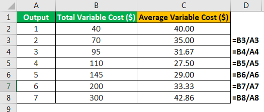

In today's dynamic financial markets, managing volatility is crucial for maintaining investor confidence and preserving market integrity. Financial markets are continually shaped by rapid technological advancements, which have introduced sophisticated trading practices such as algorithmic trading. These practices, while enhancing operational efficiency, can also contribute to significant volatility, highlighting the need for mechanisms that ensure market stability. Variable price limits are crucial tools implemented to address this challenge.

Variable price limits serve as a mechanism to moderate extreme price movements, thereby preventing occurrences that could undermine market stability. By defining a dynamic range within which a security's price can fluctuate, these limits help mitigate excessive speculation and potential market manipulation. Consequently, they maintain orderly market conditions that are essential for both passive investors and active traders.



Furthermore, variable price limits hold significant regulatory importance, influencing both stock and algorithmic trading strategies. Regulatory bodies implement these limits to promote a fair trading environment. Understanding how they function and their impact on different trading strategies is key, particularly as technological developments continue to reshape the financial landscape.

This article offers a comprehensive exploration of variable price limits, from their fundamental role in stock trading to their influence on algorithmic trading strategies. As markets advance and new complexities emerge, it is essential for investors and traders to grasp these concepts thoroughly. This understanding is integral to fostering informed decision-making and adapting to regulations effectively. By the conclusion of this article, readers will have gained essential insights into the operation and significance of variable price limits, equipping them for strategic engagement in today's financial markets.

## Table of Contents

## Understanding Variable Price Limits

Variable price limits are critical mechanisms that function to manage and stabilize price volatility in financial markets. These mechanisms are essential for maintaining orderly trading environments by implementing a dynamic price range within which a security or commodity can fluctuate, thereby preventing erratic price movements. The concept of price limits is particularly pertinent in futures trading. They serve as protective measures against potential market manipulation and excessive speculation, which can lead to disruptive market behaviors.

The primary mechanism of variable price limits acts similarly to a circuit breaker. They introduce a temporary pause in trading when prices move outside a specified range, providing market participants a cooling-off period to assess and adjust to current market dynamics. This temporary halt in trading aids in preventing cascading price effects, such as those experienced during periods of financial stress or economic announcements that might trigger rapid market responses.

Determining variable price limits involves setting parameters based on market conditions, which can be adjusted according to fluctuations in market [volatility](/wiki/volatility-trading-strategies), trading [volume](/wiki/volume-trading-strategy), or macroeconomic factors. These limits are often defined as a percentage of the closing price and can vary depending on the asset class or specific market regulations. For instance, an exchange might set a limit at +/- 10% of the previous day's closing price for a given security.

Adjustments to variable price limits are informed by both historical data and predictive analytics. Incorporating mathematical models or simulations can enhance the flexibility and responsiveness of these limits. For example, an exponential moving average (EMA) of the stock's price might be used to smooth out short-term fluctuations and provide a more realistic assessment of significant price shifts. The EMA is calculated as:

$$
\text{EMA}_t = \left(\frac{P_t - \text{EMA}_{t-1}}{\alpha}\right) + \text{EMA}_{t-1}
$$

where $P_t$ is the price at time $t$ and $\alpha$ is the smoothing factor.

Incorporating advanced technologies such as [machine learning](/wiki/machine-learning) and real-time data analytics can further refine the setting and adjustment process for price limits, allowing for more granular responses to market conditions. For example, algorithms can be developed in Python to analyze market trends and adjust limits dynamically:

```python
def calculate_new_limit(price, volatility_index, base_limit=0.1):
    adjustment_factor = 1 + (volatility_index / 100)
    new_limit = base_limit * adjustment_factor
    return price * (1 + new_limit), price * (1 - new_limit)

# Example usage
current_price = 100
volatility_index = 5
upper_limit, lower_limit = calculate_new_limit(current_price, volatility_index)
print(f"Upper Limit: {upper_limit}, Lower Limit: {lower_limit}")
```

This example illustrates a basic approach to adjusting price limits based on volatility indexes, helping markets remain stable and orderly even amidst sudden economic shifts. In summary, variable price limits are indispensable tools in risk management strategies, aimed at preserving the integrity and functionality of financial markets.

## How Variable Price Limits Work in Stock Trading

Variable price limits are instrumental in maintaining stable and orderly market conditions by capping sudden and drastic price movements in stock trading. These limits are particularly important during periods of high volatility, which can be triggered by significant news events or shifts in the economic landscape. By implementing these limits, exchanges aim to protect investors from the rapid loss of capital and potential market manipulation.

Different exchanges worldwide have the autonomy to set their own price limits, and these limits can vary based on the specific stocks being traded or prevailing market conditions. For instance, the New York Stock Exchange (NYSE) and Nasdaq both employ their own systems of circuit breakers, which temporarily halt trading if a stock's price movement exceeds a certain threshold within a specified timeframe. These circuit breakers are intended to provide a "cooling-off" period—an interval allowing traders to reassess their positions and strategies, thus reducing panic and irrational decision-making.

The approach to determining these price limits can be both percentage-based and value-based, taking into account historical volatility, trading volumes, and the overall state of the economy. For example, if a specific stock exhibits a higher level of historical volatility, the exchange might impose narrower limits to prevent excessive fluctuations.

Price limits' temporary halting of trade serves as a proactive measure in counteracting the destabilizing effects of market overreactions. During this phase, institutional investors, market makers, and individual traders have the opportunity to digest the underpinnings of market movements, consult updated information, and make informed decisions that contribute to the price discovery process.

Understanding the implementation and operation of these price limits is crucial for traders. By acknowledging the role of variable price limits, traders can develop more robust risk management strategies. They may adjust their trading algorithms to account for potential halts, thereby optimizing their trading strategies to function effectively even during constrained market conditions. Engaging with these market mechanisms helps traders not only in managing risk but also in capitalizing on temporary mispricings that might occur when trading is resumed.

In summary, variable price limits are a vital tool in stock trading, aimed at curbing excessive volatility and preserving market integrity. By providing a structured and regulated environment, they help in stabilizing markets during tumultuous periods, thereby fostering an atmosphere of confidence and trust among investors and traders alike.

## Impact on Algorithmic Trading Strategies

Algorithmic trading strategies depend on rapid, automated market responses to maximize efficiency and profitability. Variable price limits, which restrict the range within which a security’s price may fluctuate, can significantly impact these strategies. When a security's price hits its limit, trading is temporarily halted, which can disrupt the high-speed nature of [algorithmic trading](/wiki/algorithmic-trading). This necessitates adjustments in algorithms to accommodate potential trading halts and recalibrate strategies accordingly.

The implementation of variable price limits requires traders to re-evaluate their algorithmic models. For instance, when a price limit is reached, an algorithm designed to execute trades based on immediate price movements may falter, leading to missed opportunities or execution at unfavorable prices. Therefore, algorithms must be designed to anticipate and respond to these halts.

Adapting algorithms involves incorporating features that enhance risk management. One approach is to program algorithms to recognize the signs of an approaching price limit halt, such as increased volatility or a rapid approach towards the limit threshold. Risk management features can include setting stop-loss orders just before a price limit to mitigate potential losses or designing the algorithm to switch to a different strategy when certain volatility metrics are met.

Moreover, considering statistical models that account for historical price limit occurrences can improve a trading strategy's robustness. For example, machine learning techniques can be utilized to predict the likelihood of hitting a price limit based on historical data, allowing for preemptive adjustments to trading tactics. This can be implemented in Python as follows:

```python
from sklearn.ensemble import RandomForestClassifier
import numpy as np

# Example feature set
# X_train could include historical volatility, volume, market trends etc.
X_train = np.array([[0.1, 1000, 0.03], [0.15, 900, 0.04], [0.07, 1200, 0.02]])
# y_train represents whether a price limit was hit (1) or not (0)
y_train = np.array([1, 0, 1])

# Initialize the model
model = RandomForestClassifier(n_estimators=100, random_state=42)

# Fit model on training data
model.fit(X_train, y_train)

# Predicting on new data
X_new = np.array([[0.12, 1100, 0.035]])
is_limit_hit = model.predict(X_new)

if is_limit_hit:
    print("Adjust trading strategy: Price limit expected to be hit.")
else:
    print("Continue with current strategy.")
```

Incorporating variable price limits into algorithmic trading strategies not only enhances risk management but also promotes trading efficiency. By accounting for these limits, traders can ensure that their algorithms are resilient to market disruptions and capable of maintaining optimal performance even during periods of heightened volatility. Thus, understanding and adjusting for variable price limits is essential for traders seeking to maintain competitive edge and operational compliance in volatile market environments.

## The Regulatory Framework and Compliance

Regulatory bodies impose variable price limits to uphold fairness, transparency, and stability in financial markets. These limits are crucial for preventing market manipulation and ensuring that all market participants operate on a level playing field. Price limits act as a temporary pause in trading, allowing markets to recalibrate during periods of excessive volatility. Regulatory frameworks governing these limits vary across jurisdictions, reflecting the diverse nature of global financial markets.

**Compliance with Regulatory Frameworks**

Compliance with these regulations is vital for preserving market integrity and investor trust. Market participants, including exchanges, brokers, and traders, must adhere to the specified price limits to avoid penalties and maintain smooth market operations. Typically, exchanges are responsible for implementing and monitoring compliance with price limits. They must ensure that trading systems are capable of automatically halting trades once limits are breached and resuming them once conditions normalize.

**Adapting to Digital and Algorithmic Trading**

As digital and algorithmic trading become more prevalent, regulatory frameworks are adapting to address the unique challenges posed by these technologies. Traditional price limit systems may need enhancements to accommodate the rapid pace and complex strategies characteristic of algorithmic trading. Regulators are increasingly focusing on real-time monitoring and data analytics to better understand market dynamics and enforce compliance effectively.

For example, the use of machine learning and [artificial intelligence](/wiki/ai-artificial-intelligence) in trading strategies requires a nuanced regulatory approach. Policymakers must ensure that algorithms respect price limits while allowing for innovation in trading strategies. This may involve developing new compliance tools and frameworks that can dynamically adjust to market conditions in real-time.

**Navigating Legal Compliance**

Understanding these regulatory frameworks is crucial for trading entities to navigate legal compliance. Firms must invest in compliance systems and procedures to monitor trading activities actively. This includes utilizing advanced software that can process vast amounts of market data and identify potential breaches of price limits. Training programs for staff and traders can also help reinforce the importance of compliance and equip them with the knowledge needed to operate within regulatory boundaries.

In conclusion, while variable price limits are an essential tool for maintaining market stability, their effectiveness depends significantly on a robust regulatory framework and strict compliance. As financial markets continue to evolve with technological advancements, regulators and market participants must collaborate to ensure these frameworks remain relevant and effective in safeguarding market integrity.

## Challenges and Criticisms

Variable price limits in financial markets are mechanisms designed to curb excessive volatility and maintain orderly market conditions. However, these limits are not without their challenges and criticisms. One major concern is that they might encourage trading near set thresholds, potentially leading to an increase in speculative behavior as traders anticipate the limits being hit. This behavior can unintentionally create artificial price supports or barriers, disrupting natural market dynamics and possibly leading to price clustering around these limits.

Moreover, frequent trading halts caused by variable price limits can introduce [liquidity](/wiki/liquidity-risk-premium) issues. When trading is paused, participants may find it challenging to enter or [exit](/wiki/exit-strategy) positions, leading to increased uncertainty and potential financial losses. The heightened liquidity risk may also contribute to wider bid-ask spreads, affecting market efficiency and fluidity.

Critics argue that these halts, while intended as a cooling-off period, might sometimes exacerbate market stress, especially in situations where quick decision-making and market movements are deemed necessary. Liquidity issues can have a cascading effect on trader positions, as investors might face difficulty executing trades at their desired prices, resulting in potential market imbalances.

To address these concerns, some market participants and regulators propose alternative mechanisms or enhancements to existing systems. One potential solution is to develop more dynamic and adaptive price limit systems that can adjust in real-time to market conditions, thereby reducing the likelihood of artificial barriers.

Furthermore, incorporating artificial intelligence and machine learning into the design of these systems could improve their responsiveness and efficacy. For instance, AI-driven models might continuously analyze market data to set more accurate and context-sensitive limits, ensuring that the regulatory framework remains aligned with the ever-evolving market landscape.

By understanding and addressing these challenges, regulators and market participants can work towards equitable market regulation and foster innovation in trading systems. This balance is crucial for maintaining the integrity of financial markets while accommodating the needs of various stakeholders.

## Case Studies and Real-World Applications

Examining historical events where variable price limits have been utilized is essential for understanding their role in market stabilization. Key instances include the 2010 Flash Crash and the 2015 Chinese stock market turbulence, offering valuable lessons on managing market volatility.

The 2010 Flash Crash serves as a pivotal case in evaluating the efficacy of variable price limits. On May 6, 2010, the U.S. stock market experienced a rapid decline and recovery within minutes, primarily due to a confluence of factors, including algorithmic trading. During this period, the Dow Jones Industrial Average plummeted nearly 1,000 points before rebounding. The incident prompted regulatory bodies to reassess the existing circuit breaker mechanisms and led to the implementation of more robust variable price limits and trading halts. The introduction of the Limit Up-Limit Down (LULD) mechanism in 2013 by U.S. exchanges was a direct outcome, aiming to curb such drastic price movements.

In 2015, China's stock markets faced significant volatility, drawing attention to the role of trading limits in stabilizing markets. Persistent selling pressure led to significant market losses, prompting regulators to intervene with circuit breakers, including trading halts. These measures aimed to prevent steep declines by temporarily suspending trading when price swings exceeded specific thresholds. Despite these steps, the initial circuit breakers were criticized for exacerbating volatility, as the set thresholds were reached too quickly, leading to panicked selling. This scenario underscores the complexity of implementing effective variable price limits and highlights the need for well-calibrated mechanisms tailored to market dynamics.

Globally, variable price limits are adapted to the unique characteristics of different financial markets. For instance, the Tokyo Stock Exchange employs daily price limits to cap potential fluctuations, providing a buffer against excessive volatility. Similarly, European exchanges have developed volatility interruption mechanisms that temporarily pause trading, allowing reassessment during periods of instability.

These real-world applications and case studies demonstrate the significant impact variable price limits have on macroeconomic stability. They illustrate not only their utility in mitigating abrupt market shocks but also the challenges inherent in their implementation. Lessons from these events inform ongoing efforts to enhance market resilience and adapt regulatory frameworks to the evolving landscape of global financial markets.

## Conclusion: Future Implications and Developments

As financial markets advance through technological innovations, the significance of variable price limits in maintaining market stability and investor confidence has become increasingly apparent. The dynamic nature of these mechanisms necessitates continuous monitoring and adaptation to effectively manage emerging market complexities. As trading practices evolve, future developments in price limit systems may integrate more adaptive and intelligent approaches, leveraging the power of artificial intelligence (AI) and machine learning to refine their operation.

AI-driven systems can potentially optimize the setting and adjustment of price limits, ensuring they respond more efficiently to the nuanced fluctuations characteristic of modern markets. For instance, machine learning algorithms could be employed to analyze historical trading data, predict potential volatility spikes, and preemptively adjust price thresholds to mitigate disruptive market swings. This predictive capability could enhance the precision and reliability of price limits, offering a more resilient safeguard against sudden market perturbations.

The integration of contextual decision-making processes within trading frameworks is another promising development. By utilizing advancements in natural language processing (NLP), systems could interpret the potential impact of news events or regulatory changes in real time, dynamically adapting price limits to better reflect underlying market sentiment. Such systems would act not only as reactive barriers but as proactive stabilizers, promoting smoother market operations even in the face of unforeseen events.

Variable price limits are central to ensuring market integrity and building investor trust. As digital and algorithmic trading become more prevalent, stakeholders must engage in collaborative efforts to innovate and refine these systems continuously. Financial institutions, regulatory bodies, and technology firms must work together to develop frameworks that foster transparent, equitable, and resilient markets. This collaboration will be vital to address the challenges posed by rapid technological change and to safeguard against emerging threats to market stability.

In conclusion, the evolution of variable price limits is crucial to adapting to the complexities of our financial environment. Embracing technological advancements can lead to more effective price limit systems that better serve the needs of a changing financial landscape. Stakeholders must ensure these systems evolve to maintain their critical role in upholding market integrity and investor confidence well into the future.

## References & Further Reading

[1]: Lopez de Prado, M. (2018). ["Advances in Financial Machine Learning."](https://www.amazon.com/Advances-Financial-Machine-Learning-Marcos/dp/1119482089) Wiley.

[2]: Aronson, D. R. (2006). ["Evidence-Based Technical Analysis: Applying the Scientific Method and Statistical Inference to Trading Signals."](https://www.amazon.com/Evidence-Based-Technical-Analysis-Scientific-Statistical/dp/0470008741) Wiley.

[3]: Chan, E. P. (2009). ["Quantitative Trading: How to Build Your Own Algorithmic Trading Business."](https://github.com/ftvision/quant_trading_echan_book) Wiley.

[4]: Jansen, S. (2018). ["Machine Learning for Algorithmic Trading: Predictive Models to Extract Signals from Market and Alternative Data for Systematic Trading Strategies with Python."](https://github.com/stefan-jansen/machine-learning-for-trading) Packt Publishing.

[5]: Securities and Exchange Commission. (2010). ["Findings Regarding the Market Events of May 6, 2010."](https://www.sec.gov/news/studies/2010/marketevents-report.pdf) Report of the Staffs of the CFTC and SEC to the Joint Advisory Committee on Emerging Regulatory Issues.