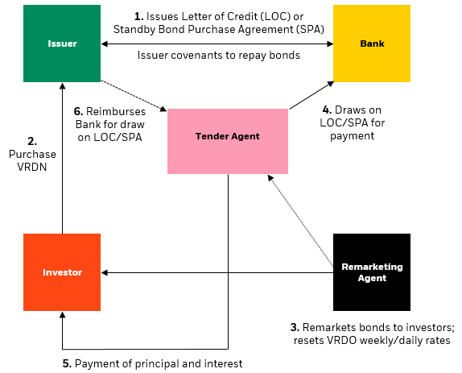

## Table of Contents

## What are Variable-Rate Demand Bonds (VRDBs)?

Variable-Rate Demand Bonds (VRDBs) are a type of municipal bond that have interest rates which change over time. Unlike traditional bonds that have a fixed interest rate, VRDBs have rates that reset periodically, often weekly or daily. This means that the interest payments can go up or down based on current market conditions. Investors can also sell their VRDBs back to the issuer or a third party at any time, usually at the face value of the bond.

These bonds are popular with investors who want flexibility and the ability to adjust to changing interest rates. They are often used by municipalities to finance projects like schools, hospitals, and infrastructure. Because the interest rates can change, VRDBs can be less predictable than fixed-rate bonds, but they offer the advantage of potentially lower interest costs if rates decrease. This makes them an attractive option for both issuers and investors looking for more adaptable investment opportunities.

## How do Variable-Rate Demand Bonds work?

Variable-Rate Demand Bonds, or VRDBs, are a type of bond where the interest rate changes over time. Instead of having a fixed rate like many bonds, the interest rate on VRDBs is reset regularly, often every week or every day. This means that if interest rates in the market go up, the rate on the VRDB will go up too, and if market rates go down, the VRDB rate will go down. This can be good for the people who issue the bonds because they might pay less interest if rates drop.

Another important feature of VRDBs is that investors can sell them back to the issuer or a third party at any time, usually for the full amount they paid. This makes VRDBs more flexible than other bonds because investors can get their money back whenever they want. This feature is useful for investors who might need their money back quickly. VRDBs are often used by cities or towns to pay for things like schools or roads, and they can be a good choice for both the people issuing the bonds and the people buying them because they offer flexibility and the chance to save on interest costs.

## What are the key features of VRDBs?

Variable-Rate Demand Bonds, or VRDBs, have interest rates that change over time. Instead of staying the same like many bonds, the interest rate on VRDBs is reset often, usually every week or every day. This means if the interest rates in the market go up, the rate on the VRDB will go up too. If market rates go down, the VRDB rate will go down. This can be good for the people who issue the bonds because they might pay less interest if rates drop.

Another important feature of VRDBs is that investors can sell them back to the issuer or a third party at any time, usually for the full amount they paid. This makes VRDBs more flexible than other bonds because investors can get their money back whenever they want. This feature is useful for investors who might need their money back quickly. VRDBs are often used by cities or towns to pay for things like schools or roads, and they can be a good choice for both the people issuing the bonds and the people buying them because they offer flexibility and the chance to save on interest costs.

## Who typically issues Variable-Rate Demand Bonds?

Variable-Rate Demand Bonds, or VRDBs, are usually issued by cities, towns, and other local governments. These groups use VRDBs to pay for big projects like building schools, hospitals, or fixing roads. They like VRDBs because the interest rates can change, which might help them save money if rates go down.

Sometimes, other organizations like universities or non-profit groups also issue VRDBs. They use the money from these bonds to fund their own projects. VRDBs are popular with these groups because they offer flexibility and can be less expensive than other types of bonds if interest rates drop.

## What are the benefits of investing in VRDBs?

Investing in Variable-Rate Demand Bonds, or VRDBs, can be a good choice for people who want flexibility. With VRDBs, you can get your money back whenever you want because you can sell them back to the issuer or a third party at any time. This is helpful if you need your money quickly. Also, since the interest rates on VRDBs change often, you might get a better rate if the market rates go up. This means you could earn more money on your investment.

Another benefit of VRDBs is that they can be less risky than other types of bonds. Because you can sell them back at any time, you don't have to worry about losing money if the bond's value goes down. Plus, VRDBs are often used by cities and towns to pay for important projects like schools and roads. This means your investment is helping to build things that make communities better. So, VRDBs offer both flexibility and a way to support local projects, making them a smart choice for many investors.

## What are the risks associated with VRDBs?

Investing in Variable-Rate Demand Bonds, or VRDBs, comes with some risks. One big risk is that the interest rates can change a lot. If the rates go up, that's good for you because you earn more money. But if the rates go down, you might earn less than you expected. This can make it hard to predict how much money you'll make from your investment.

Another risk is that even though you can usually sell your VRDBs back to the issuer or a third party at any time, there might be times when it's hard to do this. If the market is having problems, the issuer or the third party might not be able to buy back your bond right away. This could mean you have to wait to get your money back, which can be a problem if you need it quickly.

Also, VRDBs are often used by cities and towns to pay for big projects. If the city or town runs into money problems, it might affect their ability to pay back the bond. This means there's a small chance you could lose some or all of your investment if the issuer can't pay you back. So, while VRDBs can be a good choice, it's important to think about these risks before you invest.

## How is the interest rate determined for VRDBs?

The interest rate for Variable-Rate Demand Bonds, or VRDBs, is set by what's happening in the market. It changes often, usually every week or every day. A special person called a remarketing agent looks at what other similar bonds are paying and decides what the new rate for the VRDB should be. This way, the rate stays competitive with other bonds in the market.

If the market rates go up, the interest rate on the VRDB will go up too. This means you might earn more money on your investment. But if the market rates go down, the VRDB rate will go down as well, and you might earn less. This can make it hard to know exactly how much money you'll make from your VRDB, but it also means you could benefit if rates go up.

## What role do liquidity providers play in VRDBs?

Liquidity providers are important for Variable-Rate Demand Bonds, or VRDBs. They help make sure that investors can sell their bonds back whenever they want. If an investor decides they need their money back, they can ask the issuer to buy the bond back. But if the issuer can't do it right away, the liquidity provider steps in. They buy the bond from the investor, usually at the full amount the investor paid. This makes VRDBs safer for investors because they know they can get their money back quickly.

Liquidity providers are usually big banks or financial companies. They agree to buy back the bonds if needed, but they charge a fee for this service. This fee is paid by the issuer of the bond, not the investor. Having a liquidity provider helps keep the bond market stable and makes VRDBs more attractive to investors. It's like having a safety net that makes sure investors can always get their money back when they need it.

## How can VRDBs be put or tendered by investors?

Investors can put or tender their Variable-Rate Demand Bonds, or VRDBs, back to the issuer or a third party at any time. This means if an investor decides they want their money back, they can ask the issuer to buy the bond back. Usually, the issuer will buy it back at the full amount the investor paid for it. This is a big reason why VRDBs are popular because it gives investors a lot of flexibility.

If the issuer can't buy the bond back right away, a liquidity provider steps in. The liquidity provider is usually a big bank or financial company that agrees to buy the bond from the investor if the issuer can't. This makes sure that investors can always get their money back quickly, even if the issuer is having problems. The liquidity provider charges a fee for this service, but this fee is paid by the issuer, not the investor.

## What are the tax implications of investing in VRDBs?

Investing in Variable-Rate Demand Bonds, or VRDBs, can have some tax benefits. If you buy VRDBs that are issued by cities or towns, the interest you earn is usually not taxed by the federal government. This means you get to keep more of the money you earn from the bond. Some states also don't tax this interest, but it depends on where you live and where the bond was issued. So, it's a good idea to check the rules in your state.

However, there are some things to watch out for. If you sell your VRDBs for more money than you paid for them, you might have to pay capital gains tax on the profit. Also, if you use the money you earn from VRDBs to buy other investments, you might have to pay taxes on those earnings. It's always a good idea to talk to a tax advisor to understand all the tax rules that apply to your situation.

## How do VRDBs compare to other types of municipal bonds?

Variable-Rate Demand Bonds, or VRDBs, are different from other types of municipal bonds because their interest rates change over time. Most other municipal bonds have a fixed interest rate that stays the same until the bond matures. With VRDBs, the interest rate is reset often, usually every week or every day, based on what's happening in the market. This means if interest rates go up, you might earn more money, but if they go down, you might earn less. This can make VRDBs a bit unpredictable, but it also gives you the chance to benefit from rising rates.

Another big difference is that VRDBs let you get your money back whenever you want. You can sell them back to the issuer or a third party at any time, usually for the full amount you paid. This makes VRDBs more flexible than other municipal bonds, which you usually have to hold until they mature or sell on the open market. This feature is helpful if you need your money quickly. Other municipal bonds might offer more stability and predictability, but they don't give you the same level of flexibility that VRDBs do.

## What are some advanced strategies for managing a portfolio of VRDBs?

When managing a portfolio of Variable-Rate Demand Bonds, or VRDBs, one advanced strategy is to keep an eye on interest rate trends. Since the interest rates on VRDBs change often, you can try to predict when rates might go up or down. If you think rates are going to go up, you might want to hold onto your VRDBs because you could earn more money. But if you think rates are going to go down, you might want to sell your VRDBs and put your money into something else that might give you a better return. This strategy needs you to watch the market closely and make smart guesses about what will happen next.

Another strategy is to mix VRDBs with other types of investments in your portfolio. This can help spread out your risk. For example, you could have some VRDBs, some fixed-rate bonds, and some stocks. This way, if the interest rates on your VRDBs go down, you might still make money from your other investments. It's also a good idea to have a mix of VRDBs from different cities or towns. If one place has money problems and can't pay back their bonds, you won't lose all your money because you have bonds from other places too. Balancing your portfolio like this can help you manage the ups and downs of VRDBs better.

## References & Further Reading

[1]: Livingston, M. (2018). ["Bond Markets, Analysis, and Strategies"](https://mitpress.mit.edu/9780262046275/bond-markets-analysis-and-strategies/) (9th Edition). Pearson.

[2]: Aikman, D. (2019). ["The Role of Algorithmic Trading in Fixed Income Markets"](https://www.aeaweb.org/articles?id=10.1257/jep.33.1.107) Bank of England.

[3]: Lopez de Prado, M. (2018). ["Advances in Financial Machine Learning"](https://www.amazon.com/Advances-Financial-Machine-Learning-Marcos/dp/1119482089) Wiley.

[4]: Fabozzi, F. J. (2016). ["Handbook of Fixed-Income Securities,"](https://www.amazon.com/Handbook-Fixed-Income-Securities-Ninth/dp/1260473899) (8th Edition). McGraw-Hill Education.

[5]: ["Municipal Securities Rulemaking Board (MSRB): Guide to Municipal Securities"](https://www.msrb.org/Rules-and-Interpretations/MSRB-Rules) (n.d.). 

[6]: Jansen, S. (2020). ["Machine Learning for Algorithmic Trading"](https://github.com/stefan-jansen/machine-learning-for-trading) Packt Publishing.