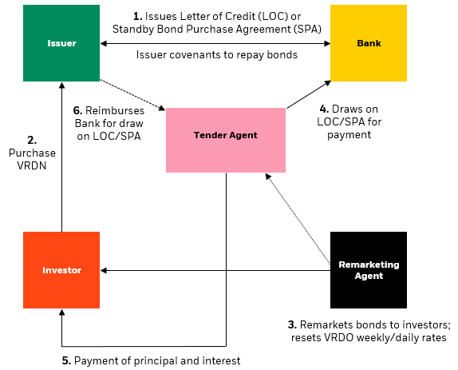

## Table of Contents

## What is a Variable Rate Demand Note (VRDN)?

A Variable Rate Demand Note (VRDN) is a type of debt security that has a floating interest rate and can be sold back to the issuer or a third party at any time. This makes it different from regular bonds, which have fixed interest rates and set maturity dates. The interest rate on a VRDN changes periodically, usually every week or month, based on a benchmark like the prime rate or the federal funds rate.

Because of their flexible interest rates and the ability to be sold back at any time, VRDNs are popular with investors who want to manage their money more actively. They are often used by municipalities and other public entities to raise money for projects. The ability to demand the note back gives investors a sense of security, as they can get their money back if they need it or if they think they can get a better return elsewhere.

## How does a Variable Rate Demand Note work?

A Variable Rate Demand Note, or VRDN, is a type of investment where the interest rate changes over time. Instead of having a fixed rate like a regular bond, the interest rate on a VRDN goes up or down based on a benchmark rate, like the prime rate or federal funds rate. This rate is usually reset every week or month, which means the amount of interest you earn can change often.

What makes VRDNs special is that you can ask for your money back at any time. This is called a "demand feature." If you decide you want your money back, you can sell the note back to the issuer or to a third party, usually a bank. This gives you more control over your investment because you can get your money back whenever you need it, unlike with regular bonds where you have to wait until they mature. This makes VRDNs a good choice for people who want flexibility with their investments.

## Who typically issues Variable Rate Demand Notes?

Variable Rate Demand Notes, or VRDNs, are usually issued by public organizations like cities, states, or other government bodies. These groups use VRDNs to borrow money for big projects, like building schools or roads. Since VRDNs have a floating [interest rate](/wiki/interest-rate-trading-strategies) and can be sold back at any time, they are a good way for these organizations to get money without locking into a fixed rate for a long time.

Sometimes, big companies also issue VRDNs. They do this for the same reason as public organizations: to borrow money for their projects or operations. The flexibility of VRDNs helps these companies manage their finances better, especially when interest rates are changing a lot.

## What are the benefits of investing in Variable Rate Demand Notes?

Investing in Variable Rate Demand Notes, or VRDNs, has some good points. One big benefit is that the interest rate changes often, usually every week or month. This means if the general interest rates go up, the interest you earn on your VRDN will go up too. This can be better than a regular bond where the interest rate stays the same no matter what happens in the market. Also, VRDNs are usually seen as pretty safe because they are often backed by public organizations like cities or states.

Another benefit is that you can get your money back whenever you want. With VRDNs, you can sell the note back to the issuer or a third party at any time. This is called the "demand feature." It gives you a lot of flexibility because you don't have to wait until the note matures to get your money back. This can be really helpful if you need your money for something else or if you see a better investment opportunity come along.

## What are the risks associated with Variable Rate Demand Notes?

One risk of investing in Variable Rate Demand Notes, or VRDNs, is that the interest rate can go down. Since the interest rate changes often, if the general interest rates in the market go down, the interest you earn on your VRDN will go down too. This means you might not make as much money as you hoped. Also, even though VRDNs are usually seen as safe, there's still a small chance that the issuer, like a city or state, might not be able to pay you back. This is called credit risk.

Another risk is that even though you can ask for your money back at any time, there's no guarantee that the issuer or the third party will have the money to give you right away. This is called [liquidity](/wiki/liquidity-risk-premium) risk. If a lot of people want their money back at the same time, it could be hard for the issuer to pay everyone. This is less common but something to think about. So, while VRDNs can be a good investment, it's important to understand these risks before you decide to invest.

## How is the interest rate determined on a Variable Rate Demand Note?

The interest rate on a Variable Rate Demand Note, or VRDN, changes often. It usually goes up or down every week or month. This rate is based on a benchmark rate, like the prime rate or the federal funds rate. These benchmark rates are set by big banks or the government and change depending on what's happening in the economy. When the benchmark rate goes up, the interest rate on your VRDN goes up too. If the benchmark rate goes down, your VRDN's interest rate goes down as well.

The exact interest rate on a VRDN is figured out by adding a small extra amount, called a spread, to the benchmark rate. This spread is decided when the VRDN is first issued and stays the same. For example, if the benchmark rate is 2% and the spread is 0.5%, then the interest rate on your VRDN would be 2.5%. This way, the interest rate can change with the market, but the spread helps make sure the issuer is paying a little more than the basic rate.

## Can you explain the role of a liquidity facility in VRDNs?

A liquidity facility is like a backup plan for Variable Rate Demand Notes, or VRDNs. It's there to make sure that if a lot of people want their money back at the same time, the issuer can still pay them. This is important because VRDNs let you ask for your money back whenever you want, and if everyone did that at once, it could be hard for the issuer to have enough cash on hand.

The liquidity facility is usually provided by a bank or another financial institution. They agree to step in and buy the VRDNs if the issuer can't pay back the investors right away. This helps keep things running smoothly and gives investors more confidence that they can get their money back when they need it. So, the liquidity facility acts like a safety net, making VRDNs a bit safer for everyone involved.

## What is the process for tendering a Variable Rate Demand Note?

When you want to get your money back from a Variable Rate Demand Note, or VRDN, you can do this by tendering the note. This means you tell the issuer or a special bank, called a remarketing agent, that you want to sell your VRDN back. You usually have to give them a little bit of notice, like a day or two, before you want your money. Once you've given your notice, the remarketing agent will try to sell your VRDN to someone else. If they can't find a buyer, the issuer or a bank that's agreed to help, called a liquidity provider, will buy it back from you.

This process is set up to make sure you can get your money back whenever you need it. It's one of the big reasons people like VRDNs because it gives them flexibility. But, if a lot of people want their money back at the same time, it can be hard for the issuer or the liquidity provider to pay everyone right away. That's why having a good liquidity facility is important. It acts like a safety net to make sure the system keeps working smoothly, even when a lot of people want to tender their notes at once.

## How do Variable Rate Demand Notes compare to other short-term investment options?

Variable Rate Demand Notes, or VRDNs, are different from other short-term investments like money market funds or certificates of deposit (CDs) in a few ways. VRDNs have interest rates that change often, usually every week or month, based on a benchmark rate. This means if interest rates go up, you can earn more money than you would with a fixed-rate investment like a CD. Also, VRDNs let you get your money back whenever you want, which is not always possible with other short-term investments. This makes VRDNs a good choice if you want flexibility and the chance to earn more interest.

On the other hand, other short-term investments like money market funds and CDs can be safer and easier to understand. Money market funds usually invest in very safe things like government securities and have a stable value, but the interest rates might be lower than VRDNs. CDs have a fixed interest rate and a set time before you can get your money back, which can be good if you want to know exactly how much you'll earn and when you'll get your money. But if you need your money before the CD matures, you might have to pay a penalty. So, while VRDNs offer more flexibility and potential for higher returns, they also come with more risks and complexity compared to other short-term investments.

## What are the tax implications of investing in Variable Rate Demand Notes?

When you invest in Variable Rate Demand Notes, or VRDNs, you need to think about taxes. The interest you earn from VRDNs is usually taxable. This means you have to pay taxes on the money you make from the interest, just like you would with other types of income. The tax rate depends on your income and where you live. If you're not sure how much you'll have to pay, it's a good idea to talk to a tax advisor.

Some VRDNs are issued by cities or states and might be tax-exempt. This means you don't have to pay federal taxes on the interest you earn from these notes. Sometimes, you might not have to pay state or local taxes either, but it depends on where you live and where the VRDN was issued. It's important to check the details of the VRDN to see if it's tax-exempt and to understand how it will affect your taxes.

## How do regulatory changes affect Variable Rate Demand Notes?

Regulatory changes can have a big impact on Variable Rate Demand Notes, or VRDNs. When the rules change, it can affect how VRDNs are issued, how they are sold, and how much interest they pay. For example, if new rules make it harder for banks to provide liquidity facilities, it might be tougher for issuers to offer VRDNs. This could make VRDNs less attractive to investors because they might worry about getting their money back if they need it.

Also, changes in tax laws can change how much money investors make from VRDNs. If the government decides to tax the interest from VRDNs differently, it could make them more or less appealing. For instance, if tax-exempt VRDNs lose their tax benefits, investors might not want to buy them as much. Keeping up with regulatory changes is important for anyone thinking about investing in VRDNs because these changes can affect how good of an investment they are.

## What advanced strategies can be used to optimize returns from Variable Rate Demand Notes?

One way to get more out of Variable Rate Demand Notes, or VRDNs, is to keep an eye on interest rates and be ready to act fast. Since the interest rates on VRDNs change often, you can make more money if you know when rates are going up. If you think rates will go up soon, you might want to hold onto your VRDNs a bit longer to get a higher interest rate. On the other hand, if you think rates will go down, you could sell your VRDNs back and look for a better investment. This strategy needs you to watch the market closely and be ready to make quick decisions.

Another strategy is to mix VRDNs with other types of investments. By having a mix of VRDNs and other things like stocks or bonds, you can spread out your risk. This way, if the interest rates on VRDNs go down, you might still make money from your other investments. Also, you can use VRDNs to balance out riskier investments. For example, if you have a lot of money in stocks, VRDNs can give you a safer place to put some of your money. This mix can help you make more money overall while keeping your investments safe.

## References & Further Reading

[1]: Fabozzi, F. J., & Mann, S. V. (2005). ["Handbook of Fixed Income Securities"](https://www.amazon.com/Handbook-Fixed-Income-Securities-Ninth/dp/1260473899). McGraw-Hill Education.

[2]: Schreiner, M. (2013). ["Variable Rate Demand Obligations (VRDOs): What You Need to Know"](https://www.investopedia.com/terms/v/variable_rate_demand_note.asp). National Association of College and University Business Officers (NACUBO).

[3]: ["Municipal Bonds: The Basics"](https://www.investopedia.com/investing/basics-of-municipal-bonds/) by the Securities Industry and Financial Markets Association (SIFMA).

[4]: Lopez de Prado, M. (2018). ["Advances in Financial Machine Learning"](https://www.amazon.com/Advances-Financial-Machine-Learning-Marcos/dp/1119482089). Wiley.

[5]: SEC staff (2012). ["Report on the Municipal Securities Market"](https://www.sec.gov/news/studies/2012/munireport073112.pdf). U.S. Securities and Exchange Commission. 

[6]: ["Algorithmic and High-Frequency Trading"](https://assets.cambridge.org/97811070/91146/frontmatter/9781107091146_frontmatter.pdf) by Alvaro Cartea, Sebastian Jaimungal, and Jose Penalva.

[7]: ["Municipal Bonds: Understanding Credit Risk"](https://www.fidelity.com/fixed-income-bonds/individual-bonds/municipal-bonds) by the Municipal Securities Rulemaking Board (MSRB).