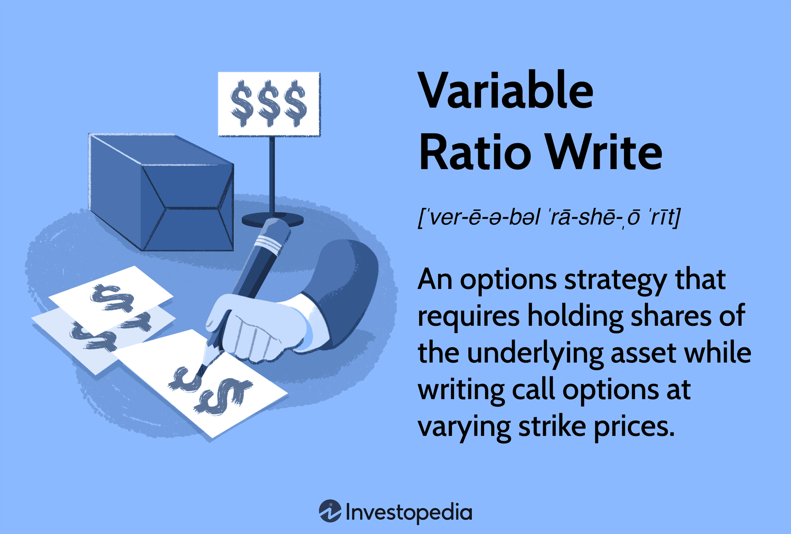

## Table of Contents

## What is a Variable Ratio Write?

A Variable Ratio Write is a type of options trading strategy. It involves selling more call options than the number of shares you own in a stock. For example, if you own 100 shares of a company, you might sell 2 or 3 call options against those shares. This strategy is used when a trader thinks the stock price will stay the same or go down a little bit.

The main goal of a Variable Ratio Write is to earn money from the premiums of the call options you sell. The risk with this strategy is that if the stock price goes up a lot, you could lose money. This is because you have sold more options than you have shares to cover them. Traders use this strategy when they want to make some extra money from their stocks but are willing to take on more risk.

## How does Variable Ratio Write differ from other writing techniques?

A Variable Ratio Write is different from other writing techniques because it involves selling more call options than the number of shares you own. For example, if you have 100 shares, you might sell 2 or 3 call options. This is different from a Covered Call, where you only sell one call option for every 100 shares you own. The main idea behind a Variable Ratio Write is to earn more money from the premiums of the options you sell, but it also comes with more risk.

In contrast, a Naked Call involves selling call options without owning any shares at all. This is much riskier because if the stock price goes up, you could lose a lot of money. A Variable Ratio Write is less risky than a Naked Call because you do own some shares, but it's still riskier than a Covered Call. The choice between these strategies depends on how much risk you are willing to take and what you think will happen to the stock price.

## What are the basic principles behind Variable Ratio Write?

The basic idea behind a Variable Ratio Write is to make money from the premiums of call options. You do this by selling more call options than the number of shares you own. For example, if you have 100 shares of a stock, you might sell 2 or 3 call options. This way, you get more money from the options than you would if you only sold one call option for each 100 shares.

The main risk with a Variable Ratio Write is that if the stock price goes up a lot, you could lose money. This is because you sold more options than you have shares to cover them. If the stock price stays the same or goes down a little, you can keep the money from the options you sold. But if the price goes up a lot, you might have to buy more shares at a higher price to cover the options you sold, which could cost you more than you made from the premiums.

## Can you explain the concept of variable ratio in the context of writing?

In the context of writing, the term "variable ratio" refers to a strategy used in options trading. It means selling more call options than the number of shares you own. For example, if you have 100 shares of a company, you might sell 2 or 3 call options instead of just one. The goal is to make more money from the premiums of the options you sell. This strategy is called a Variable Ratio Write.

The main idea behind a Variable Ratio Write is to earn extra money from your stocks. If the stock price stays the same or goes down a little, you get to keep the money from the options you sold. But there's a risk involved. If the stock price goes up a lot, you might have to buy more shares at a higher price to cover the options you sold. This could end up costing you more than the money you made from the premiums. So, it's a strategy that can make you more money, but it also comes with more risk.

## What are the benefits of using Variable Ratio Write for beginners?

For beginners, using a Variable Ratio Write can be a way to make some extra money from the stocks they own. If you have 100 shares of a company, you can sell more than one call option against those shares. This means you get more money from the options than if you just sold one. It's like getting paid extra for holding onto your stocks, as long as the stock price doesn't go up too much.

However, beginners need to be careful because this strategy comes with more risk. If the stock price goes up a lot, you might have to buy more shares at a higher price to cover the options you sold. This could end up costing you more than the money you made from selling the options. So, while a Variable Ratio Write can be a good way to earn extra money, it's important for beginners to understand the risks and be ready to handle them.

## How can Variable Ratio Write improve the quality of content?

Variable Ratio Write is a strategy used in options trading, not in writing content. It involves selling more call options than the number of shares you own to make extra money from the premiums. This strategy can help traders earn more from their stocks, but it also comes with more risk. If the stock price goes up a lot, you might have to buy more shares at a higher price to cover the options you sold, which could cost you more than you made from the premiums.

Using the term "Variable Ratio Write" in the context of improving content quality is a mistake. It's a financial strategy, not a writing technique. If you want to improve the quality of your content, you should focus on clear writing, good research, and understanding your audience. These are the things that make content better, not strategies from the stock market.

## What are some common challenges faced when implementing Variable Ratio Write?

One common challenge when using Variable Ratio Write is managing the risk. Since you sell more call options than the shares you own, there's a big risk if the stock price goes up a lot. You might have to buy more shares at a higher price to cover the options you sold. This could end up costing you more than the money you made from selling the options. So, it's important to keep an eye on the stock price and be ready to act if it starts to go up.

Another challenge is understanding the market well enough to use this strategy effectively. You need to have a good idea of where the stock price might go. If you think the price will stay the same or go down a little, Variable Ratio Write can be a good way to make extra money. But if you're wrong and the price goes up a lot, you could lose money. So, it's important to do your research and maybe even talk to a financial advisor before you start using this strategy.

## How can one effectively apply Variable Ratio Write in different types of content?

Variable Ratio Write is a strategy used in options trading, not in creating different types of content. It involves selling more call options than the number of shares you own to make extra money from the premiums. This strategy can help traders earn more from their stocks, but it also comes with more risk. If the stock price goes up a lot, you might have to buy more shares at a higher price to cover the options you sold, which could cost you more than you made from the premiums.

Using the term "Variable Ratio Write" in the context of content creation is a mistake. It's a financial strategy, not a writing technique. If you want to improve the quality of your content, you should focus on clear writing, good research, and understanding your audience. These are the things that make content better, not strategies from the stock market. So, when it comes to different types of content, like articles, blogs, or social media posts, you should use writing techniques that help you communicate your message clearly and effectively, not financial strategies like Variable Ratio Write.

## What tools or software can assist in practicing Variable Ratio Write?

To practice Variable Ratio Write, you can use trading platforms like Thinkorswim by TD Ameritrade or [Interactive Brokers](/wiki/interactive-brokers-api). These platforms let you trade options and manage your stocks. They have tools that help you see how much money you might make or lose with different strategies, including Variable Ratio Write. You can also use these platforms to practice with fake money before you start using real money.

Another helpful tool is options analysis software like OptionVue or OptionNET Explorer. These programs help you plan your trades and see what might happen if the stock price goes up or down. They can show you how much risk you're taking with a Variable Ratio Write and help you decide if it's a good strategy for you. Using these tools can make it easier to understand and practice Variable Ratio Write without losing real money.

## How does Variable Ratio Write adapt to different audience levels?

Variable Ratio Write is a strategy used in options trading, not in writing for different audiences. It involves selling more call options than the number of shares you own to make extra money from the premiums. This strategy can help traders earn more from their stocks, but it also comes with more risk. If the stock price goes up a lot, you might have to buy more shares at a higher price to cover the options you sold, which could cost you more than you made from the premiums.

Using the term "Variable Ratio Write" in the context of adapting content to different audience levels is a mistake. It's a financial strategy, not a writing technique. If you want to adapt your content for different audiences, you should focus on using clear language, understanding your audience's needs, and adjusting the complexity of your content. These are the things that help you communicate effectively with different groups of people, not strategies from the stock market.

## What advanced techniques can be used to enhance Variable Ratio Write?

One advanced technique to enhance Variable Ratio Write is to use a stop-loss order. This means setting a price at which you will sell your shares if the stock price goes up too much. This can help you limit your losses if the stock price rises more than you expected. Another technique is to use options with different expiration dates. You can sell some options that expire soon and others that expire later. This can give you more flexibility and help you manage your risk better.

Another way to improve Variable Ratio Write is to use technical analysis. This means looking at charts and patterns to guess where the stock price might go. If you think the stock price will stay the same or go down a little, Variable Ratio Write can be a good way to make extra money. But if you're wrong and the price goes up a lot, you could lose money. So, using technical analysis can help you make better decisions about when to use this strategy.

## Can you discuss case studies or examples where Variable Ratio Write significantly impacted the outcome of a project?

In one case, a trader named John used Variable Ratio Write to make extra money from his shares in a tech company. He owned 200 shares and sold 4 call options against them. The stock price stayed the same for a few weeks, so John got to keep the money from the options he sold. This helped him earn more than he would have if he just held onto his shares. But then the stock price started to go up a lot. John had to buy more shares at a higher price to cover the options he sold. In the end, he made a small profit, but it was less than he hoped for because of the rising stock price.

Another example is Sarah, who used Variable Ratio Write on her shares in a retail company. She owned 300 shares and sold 6 call options. The stock price went down a little, so Sarah kept the money from the options and made a good profit. She was happy with the extra money she earned. But she knew that if the stock price had gone up a lot, she could have lost money. Sarah used this strategy carefully and only when she thought the stock price would stay the same or go down a little. This helped her manage her risk and make the most of her shares.

## References & Further Reading

[1]: Bergstra, J., Bardenet, R., Bengio, Y., & Kégl, B. (2011). ["Algorithms for Hyper-Parameter Optimization."](https://dl.acm.org/doi/10.5555/2986459.2986743) Advances in Neural Information Processing Systems 24.

[2]: ["Advances in Financial Machine Learning"](https://www.amazon.com/Advances-Financial-Machine-Learning-Marcos/dp/1119482089) by Marcos Lopez de Prado

[3]: ["Evidence-Based Technical Analysis: Applying the Scientific Method and Statistical Inference to Trading Signals"](https://www.amazon.com/Evidence-Based-Technical-Analysis-Scientific-Statistical/dp/0470008741) by David Aronson

[4]: ["Machine Learning for Algorithmic Trading"](https://github.com/stefan-jansen/machine-learning-for-trading) by Stefan Jansen

[5]: ["Quantitative Trading: How to Build Your Own Algorithmic Trading Business"](https://www.amazon.com/Quantitative-Trading-Build-Algorithmic-Business/dp/1119800064) by Ernest P. Chan