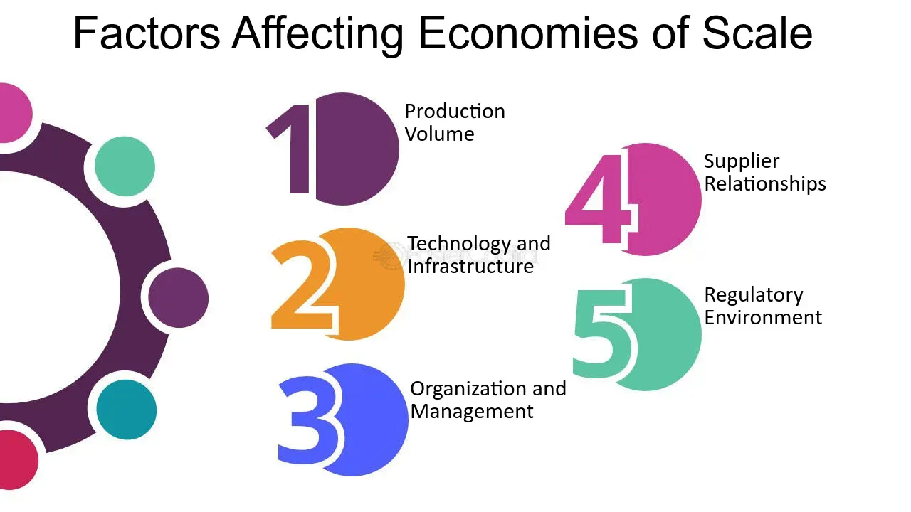

## Table of Contents

## What are economies of scale?

Economies of scale happen when a company grows bigger and can produce things more cheaply. As a company makes more of a product, the cost to make each item goes down. This is because the company can buy materials in bulk, use machines more efficiently, and spread out fixed costs like rent and salaries over more products.

For example, if a small bakery makes 100 loaves of bread a day, it might cost them $1 per loaf. But if they grow and start making 1,000 loaves a day, the cost might drop to $0.50 per loaf. This is because they can buy flour in larger amounts at a lower price per pound, and their ovens are used more efficiently. Economies of scale help big companies compete better because they can offer lower prices than smaller companies.

## How do production levels affect economies of scale?

Production levels are really important for economies of scale. When a company makes more of something, it can often make each item for less money. This happens because the company can buy materials in bigger amounts, which usually costs less per unit. Also, when they make more, they can use their machines and workers more efficiently. For example, a factory that makes 1,000 toys a day might spend less to make each toy than a factory that only makes 100 toys a day.

But, if a company gets too big and makes too much, it might start to see diseconomies of scale. This means that the cost to make each item starts going up again. This can happen because managing a very big company becomes harder, or because the company needs to pay more for things like storage or shipping. So, finding the right production level is key to getting the most out of economies of scale.

## What role does technology play in achieving economies of scale?

Technology plays a big role in helping companies achieve economies of scale. When companies use new technology, they can make things faster and with less waste. For example, a factory might use robots to build cars. Robots can work all day without getting tired, and they can do the same job over and over without making mistakes. This means the factory can make more cars in less time, and each car costs less to make.

Also, technology can help companies manage their business better. With computers and software, a company can keep track of how much it is making and spending. This helps them buy materials at the best price and plan how much to produce. For example, a company might use a computer program to figure out the best time to buy materials in bulk, which saves money. By using technology smartly, companies can grow bigger and make things more cheaply, which is what economies of scale is all about.

## How do input costs influence economies of scale?

Input costs are the money a company spends on things like materials, labor, and energy to make its products. When a company can buy these inputs in larger amounts, it often gets a better price. For example, if a company buys a lot of steel at once, the steel company might give them a discount. This means the cost to make each product goes down, which helps the company achieve economies of scale. The more a company can lower its input costs, the more it can produce at a lower cost per item.

However, if input costs go up, it can make it harder for a company to achieve economies of scale. For instance, if the price of oil goes up, it costs more to ship materials and products. This increase in costs can make it more expensive to produce each item, even if the company is making a lot of them. So, managing and reducing input costs is really important for a company to keep growing and benefiting from economies of scale.

## What is the impact of managerial efficiency on economies of scale?

Managerial efficiency is really important for a company to get the most out of economies of scale. When managers do a good job, they can make sure the company uses its resources well. This means they can make more products without spending a lot more money. For example, good managers can plan how to use machines and workers so that they are always busy, but not too busy. This helps the company make things cheaper as it grows bigger.

But if managers are not efficient, it can be hard for the company to benefit from economies of scale. If managers don't plan well, the company might end up wasting money or not using its machines and workers the best way. This can make it more expensive to make each product, even if the company is making a lot of them. So, having good managers is key to making sure a company can grow and still keep costs low.

## How does market size affect the potential for economies of scale?

Market size is really important for a company to achieve economies of scale. If the market is big, a company can sell a lot more of its products. This means they can make more things at once, which usually makes each item cheaper to produce. For example, if a company makes phones and there are millions of people who want to buy them, the company can make a lot of phones and get a good price for the materials they need. This helps them lower the cost of making each phone.

But if the market is small, it can be hard for a company to benefit from economies of scale. In a small market, there might not be enough people to buy a lot of products. So, the company can't make as many things at once, and they might not be able to buy materials in big amounts to get a discount. This means the cost to make each item stays high, and the company can't grow as much or make things as cheaply as they could in a bigger market.

## What are the effects of specialization and division of labor on economies of scale?

Specialization and division of labor help companies achieve economies of scale by making workers more efficient. When workers focus on just one part of the job, they get really good at it. This means they can do their part faster and with fewer mistakes. For example, in a car factory, one worker might only put on tires all day. Because they do the same thing over and over, they get really fast at it. This helps the factory make more cars in less time, which lowers the cost to make each car.

Also, when work is divided up, companies can use machines and tools better. If each worker has a specific job, the company can use machines that are made just for that job. This makes the whole process smoother and more efficient. For instance, a bakery might have one machine just for mixing dough and another for baking bread. By using these specialized machines, the bakery can make more bread faster and cheaper. So, specialization and division of labor are key to making economies of scale work well.

## How do economies of scale differ across various industries?

Economies of scale can look different in different industries because each industry has its own way of making things and its own costs. In manufacturing, like making cars or electronics, economies of scale are really important. Big factories can make a lot of products at once, which means they can buy materials in big amounts and use machines all the time. This makes each car or phone cheaper to make. But in service industries, like restaurants or hair salons, it's harder to get the same benefits. You can't serve a lot more customers just by making the restaurant bigger, because you still need more cooks and servers, and the cost of each meal doesn't go down as much.

In some industries, like software, economies of scale work in a special way. Once a software company makes a program, it can sell it to a lot of people without spending much more money. The cost to make the first copy of the software might be high, but after that, each extra copy costs almost nothing. This is different from industries like farming, where you need more land and equipment to grow more food, and the cost to grow each extra bushel of wheat doesn't go down as much. So, the way economies of scale help a company depends a lot on what kind of business it is and how it makes its products or services.

## What are the potential diseconomies of scale and how do they arise?

Diseconomies of scale happen when a company gets too big and the cost to make each item starts going up instead of down. This can happen for a few reasons. One reason is that it becomes harder to manage a very big company. When there are a lot of people and departments, communication can get messed up, and it can take longer to make decisions. This can lead to mistakes and wasted time, which makes things more expensive. Another reason is that big companies might have to pay more for things like storage and shipping. If they make a lot more products, they need more space to keep them and more trucks to move them around, which adds to the costs.

Also, when a company grows too big, it can be hard to keep workers happy and motivated. In a small company, everyone might know each other and feel like they are part of a team. But in a big company, workers might feel like just a small part of a big machine. This can make them less productive and more likely to leave, which means the company has to spend more money on hiring and training new people. So, while getting bigger can help a company save money at first, if it grows too much, it can start to cost more instead of less.

## How can a company measure its economies of scale?

A company can measure its economies of scale by looking at how the cost to make each product changes as it makes more of them. They can do this by keeping track of their total costs and dividing that by the number of products they make. If the cost per product goes down as they make more, that means they are getting economies of scale. For example, if a company makes 100 toys and it costs them $1000, each toy costs $10. If they then make 200 toys and it costs $1500, each toy now costs $7.50. This shows they are benefiting from economies of scale because the cost per toy went down.

Another way to measure economies of scale is by looking at the company's production efficiency. This means checking if they are using their machines, workers, and materials in the best way possible. If a company can make more products without spending a lot more money, that's a sign of good economies of scale. They can use special tools and software to help them see where they are saving money and where they might be wasting it. By keeping an eye on these things, a company can make sure it is growing in a way that keeps costs low and helps it make more profit.

## What strategies can businesses implement to maximize economies of scale?

Businesses can maximize economies of scale by focusing on increasing their production levels. When a company makes more of a product, it can often buy materials in bigger amounts, which usually costs less per unit. For example, a company might buy a lot of steel at once and get a discount. Also, by making more, the company can use its machines and workers more efficiently. If a factory makes more cars, the cost to make each car goes down because the machines are used all the time and workers get better at their jobs. So, finding ways to make more without spending a lot more money is key to getting the most out of economies of scale.

Another strategy is to use technology to help with production and management. Robots and computers can make things faster and with less waste. For example, a factory might use robots to build cars, which means they can make more cars in less time and each car costs less to make. Also, software can help a company keep track of how much it is making and spending. This helps them buy materials at the best price and plan how much to produce. By using technology smartly, a company can grow bigger and make things more cheaply, which is what economies of scale is all about.

## How do global economic factors influence a company's ability to achieve economies of scale?

Global economic factors can really affect how well a company can achieve economies of scale. For example, if the world economy is doing well, there might be more people wanting to buy things. This means a company can sell more of its products, which helps them make more at once and get a better price for materials. But if the world economy is not doing well, people might not buy as much, so the company can't make as many things at once. This makes it harder for them to get the benefits of economies of scale because they can't buy materials in big amounts or use their machines as efficiently.

Also, things like exchange rates and trade policies can make a big difference. If a company buys materials from another country, the price they pay can change a lot depending on the exchange rate. If their own currency gets weaker, it costs them more to buy the same amount of materials, which can make it harder to keep costs down. Trade policies, like tariffs or trade agreements, can also affect how much a company has to pay for materials and how easily they can sell their products in other countries. If trade policies make it harder or more expensive to do business, it can stop a company from growing and getting the benefits of economies of scale.

## References & Further Reading

[1]: Bergstra, J., Bardenet, R., Bengio, Y., & Kégl, B. (2011). ["Algorithms for Hyper-Parameter Optimization."](https://dl.acm.org/doi/10.5555/2986459.2986743) Advances in Neural Information Processing Systems 24.

[2]: ["Advances in Financial Machine Learning"](https://www.amazon.com/Advances-Financial-Machine-Learning-Marcos/dp/1119482089) by Marcos Lopez de Prado

[3]: ["Evidence-Based Technical Analysis: Applying the Scientific Method and Statistical Inference to Trading Signals"](https://www.amazon.com/Evidence-Based-Technical-Analysis-Scientific-Statistical/dp/0470008741) by David Aronson

[4]: ["Machine Learning for Algorithmic Trading"](https://github.com/stefan-jansen/machine-learning-for-trading) by Stefan Jansen

[5]: ["Quantitative Trading: How to Build Your Own Algorithmic Trading Business"](https://www.amazon.com/Quantitative-Trading-Build-Algorithmic-Business/dp/1119800064) by Ernest P. Chan