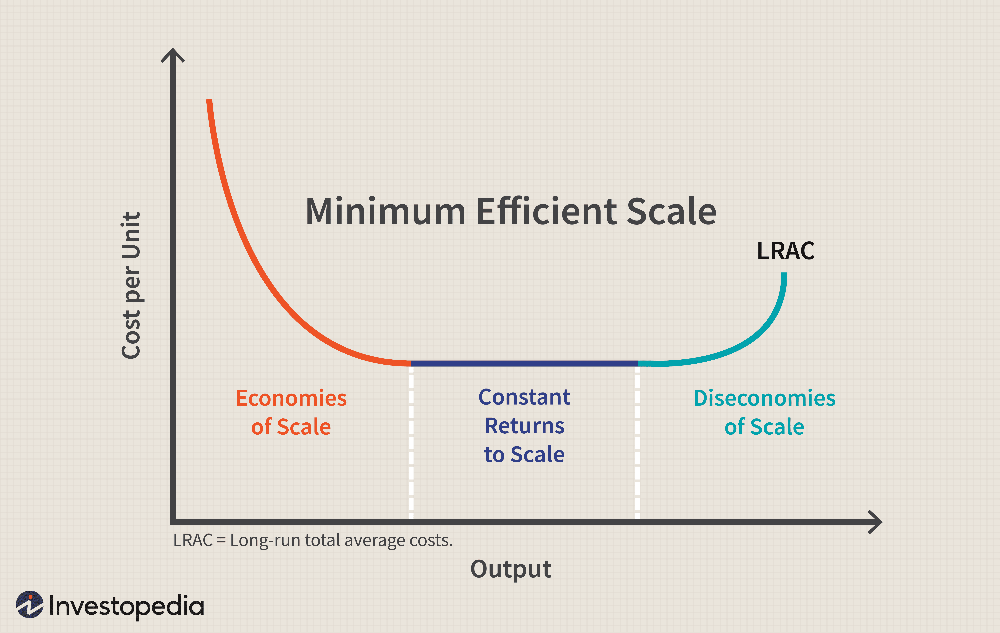

In contemporary financial markets, the intersection of economies of scale, cost reduction, and algorithmic trading is reshaping business models and driving competitive advantage. Economies of scale involve reducing average costs by increasing production volume, which is crucial in today's trading environments where efficiency and cost-effectiveness dictate success. Achieving economies of scale enables firms to spread fixed costs over a larger output, decrease operational costs per unit, and enhance profitability, which is more vital than ever in the fast-paced trading sector.

Algorithmic trading represents a key mechanism for achieving cost efficiencies and scalability. By utilizing advanced mathematical models and computational algorithms, businesses can automate trading processes, resulting in reduced manual intervention and decreased likelihood of human error. This automation facilitates rapid execution of trades, optimal pricing, and minimized market impact costs, benefiting traders through improved financial performance and resource allocation. Moreover, algorithmic trading can handle vast data volumes, allowing firms to analyze trends and execute strategies with precision and speed unmatched by traditional trading methods.



Businesses can leverage algorithmic trading to gain a competitive edge by optimizing their trade execution strategies, managing risks more effectively, and exploring new market opportunities. The integration of technologies such as AI and machine learning further enhances decision-making capabilities, enabling firms to capitalize on market inefficiencies and volatility. These advancements provide a pathway for scaling operations efficiently, ensuring that financial entities remain competitive globally.

The structure and main themes of this article will encompass a detailed examination of economies of scale within business models, innovative cost-reduction strategies, an overview of algorithmic trading, and its role in fostering cost efficiency. It will also address the competitive advantages offered by algorithmic trading, implementation strategies for business growth, and conclude with the synergy between these elements, encouraging firms to consider algorithmic trading as a strategic asset for future success.

## Table of Contents

## Understanding Economies of Scale in Business Models

Economies of scale refer to the cost advantages that businesses experience when production becomes efficient, as the cost per unit of output decreases with increasing scale. This concept is pivotal in reducing business costs and enhancing competitiveness. Economies of scale are categorized into two primary types: internal and external.

Internal economies of scale arise from within the company and are the result of factors such as improved operational efficiency, bulk purchasing of materials, and advanced manufacturing processes. As a company grows, it can invest in more effective production techniques, spread its fixed costs over a larger output, and negotiate better terms with suppliers. For example, a manufacturing firm might reduce its average costs by investing in cutting-edge machinery that speeds up production or by buying raw materials in bulk, thus receiving a discount.

External economies of scale occur outside the firm but within the industry. These are typically related to the overall growth of an industry or sector and can include a more skilled labor market, improved infrastructure, and a stronger network of suppliers. Industries that benefit from external economies of scale often see reductions in costs due to a concentrated cluster of resources and suppliers. For instance, the technology sector often benefits from external economies due to the concentration of related services and infrastructure in areas such as Silicon Valley.

Technology and globalization significantly contribute to economies of scale. Technological advancements enable businesses to increase output with more efficient use of resources, thereby reducing costs per unit. Automated manufacturing and advanced data analytics are examples of how technology facilitates economies of scale. Globalization, on the other hand, allows firms to access new markets and diverse resource pools, leading to larger production scales and increased bargaining power. As companies expand internationally, they optimize their production by strategically locating facilities where cost efficiencies can be maximized.

Numerous industries have successfully leveraged economies of scale. The automotive industry, for example, has benefitted through mass production techniques pioneered by companies like Ford, which made vehicle manufacturing more efficient and cost-effective. Similarly, the retail industry, exemplified by giants such as Walmart, utilizes economies of scale by purchasing products in massive quantities at reduced prices and distributing them through an extensive distribution network to minimize logistical costs.

In summary, understanding and utilizing economies of scale are crucial for businesses aiming to reduce costs and enhance competitive advantage. Through leveraging both internal and external factors, alongside embracing technology and globalization, industries can achieve significant cost efficiencies and sustainable growth.

## Cost Reduction through Smart Business Models

Cost reduction strategies are integral to enhancing business efficiency and competitiveness. Traditional cost reduction strategies typically involve economies of scale, where larger production volumes can decrease per-unit costs, bulk purchasing discounts, and optimization of supply chain processes. However, these methods might not be sufficient in today's rapidly changing market environments that demand flexibility and adaptation.

In contrast, innovative cost reduction strategies focus on leveraging new technologies and business models. Technological advancements in automation, [artificial intelligence](/wiki/ai-artificial-intelligence), and [machine learning](/wiki/machine-learning) can significantly minimize production and operational costs. For instance, automation reduces the need for manual labor, lowering labor costs and increasing production speed and consistency. AI and machine learning enhance predictive maintenance, reducing downtime and maintenance costs by optimizing the timing and nature of maintenance activities.

Specialization plays a crucial role in cost reduction by allowing businesses to focus on core competencies, leading to improved efficiency and productivity. By concentrating efforts on specialized areas, companies can achieve greater expertise and innovation, resulting in lower costs and differentiated products. This can create a competitive edge by enabling firms to operate more efficiently than their less-focused competitors.

The impact of new technologies on cost reduction cannot be overstressed. Advanced data analytics provide insights into consumer behavior, operational inefficiencies, and emerging market trends, allowing businesses to make informed decisions and reduce waste. Cloud computing reduces the cost of IT infrastructure through scalable resources that adjust to business needs, removing the burden of large capital expenditures for server equipment and maintenance.

An exemplary case study of effective cost reduction implementation is Toyota's Just-In-Time (JIT) manufacturing system. This strategy minimizes inventory costs by aligning production schedules with demand, ensuring resources are only used when needed. Another example is Amazon's use of technology in its logistics operations, employing robotics in fulfillment centers to reduce labor costs while increasing speed and accuracy in order processing.

By combining traditional and innovative strategies, businesses can create a comprehensive approach to cost reduction, improving their overall financial performance and competitiveness. This requires a continuous evaluation of existing processes and the willingness to adopt new technologies that streamline operations and enhance efficiency.

## Algorithmic Trading: An Overview

Algorithmic trading refers to the use of computer algorithms to automate trading decisions and actions in financial markets. This approach has gained increasing relevance due to its ability to process large amounts of data rapidly and execute trades at speeds and frequencies impossible for human traders. Algorithmic trading leverages computers to monitor market conditions, identify trading opportunities, and execute trades based on predefined criteria, thereby enhancing market efficiency and [liquidity](/wiki/liquidity-risk-premium).

Key components of [algorithmic trading](/wiki/algorithmic-trading) systems include data collection and processing modules, decision-making algorithms, and execution mechanisms. These systems often rely on technologies such as high-frequency trading ([HFT](/wiki/high-frequency-trading-strategies)), machine learning, and artificial intelligence to enhance their decision-making processes. High-frequency trading, for example, allows traders to capitalize on small price discrepancies across markets through rapid execution of trades. Alternatively, machine learning algorithms can analyze historical data to predict future market movements, adjusting their strategies accordingly.

The benefits of algorithmic trading over traditional trading practices are numerous. One significant advantage is increased speed and accuracy. Algorithms can evaluate vast datasets and execute trades more swiftly than any human, reducing latency and the risk of human error. Additionally, algorithmic trading enables the implementation of complex strategies that a human trader might find difficult to execute in real-time, such as statistical [arbitrage](/wiki/arbitrage) or [market making](/wiki/market-making). This form of trading can also operate 24/7, opening opportunities in international markets and providing continuous monitoring and trading capability.

However, algorithmic trading is not without challenges and risks. Market [volatility](/wiki/volatility-trading-strategies) can sometimes be exacerbated by automated trading, particularly during disruptive market events where algorithms may react simultaneously, leading to rapid price movements and potential market instability. Another significant risk is the management of algorithmic errors or "bugs" which can lead to significant financial losses if not detected and corrected promptly. Furthermore, the reliance on technology makes these systems susceptible to cybersecurity threats, requiring robust security measures to protect trade data and strategies.

In conclusion, while algorithmic trading presents substantial advantages in terms of speed, efficiency, and the complexity of strategies employed, it also necessitates careful management of technology-associated risks. As such, firms adopting algorithmic trading must ensure they have the necessary infrastructure, risk management procedures, and skilled personnel to effectively harness its potential.

## Algorithmic Trading as a Cost Reduction Tool

Algorithmic trading serves as a powerful tool for reducing operational costs within financial markets. It achieves this by automating the trading process, which not only improves efficiency but also allows for transactions at a scale that would be unfeasible for manual traders. The automation of trading systems reduces the reliance on human intervention, thereby minimizing the errors and costs associated with traditional trading practices.

One of the primary ways algorithmic trading minimizes costs is through the execution of high-frequency trades (HFT). These systems can execute trades at speeds and volumes significantly greater than human traders, leveraging arbitrage opportunities and minute pricing inefficiencies across markets. This rapid execution is made possible by sophisticated algorithms that analyze data, identify patterns, and make trading decisions within milliseconds.

Moreover, algorithmic trading reduces transaction costs by using complex strategies such as [statistical arbitrage](/wiki/statistical-arbitrage), market-making, and portfolio rebalancing. For instance, statistical arbitrage involves using quantitative models to identify price discrepancies between related financial instruments and executing trades to exploit these discrepancies. This strategy requires extensive data analysis and rapid execution, both of which are efficiently handled by algorithmic systems.

Real-world examples illustrate the cost efficiencies facilitated by algorithmic trading. For example, Renaissance Technologies, a [hedge fund](/wiki/hedge-fund-trading-strategies) known for its medallion fund, employs algorithmic trading models to achieve consistent high returns while maintaining low operational costs relative to the fund's size. Additionally, automated trading systems like those used by large financial institutions can reduce the cost of capital allocation and liquidity provision, enhancing their operational efficiency and profit margins.

The long-term financial benefits of incorporating algorithmic trading are significant. Firms that adopt these systems gain a competitive edge through lower operational costs and improved market access. The ability to rapidly respond to market conditions and execute trades efficiently not only enhances profitability but also mitigates risks associated with market volatility.

Furthermore, the integration of algorithmic trading models with advanced technologies such as artificial intelligence (AI) and machine learning (ML) enhances decision-making capabilities. These technologies allow trading systems to learn from historical data, refine predictive models, and optimize trading strategies, further driving down costs and increasing efficiency.

In conclusion, algorithmic trading presents a robust framework for achieving cost reductions through enhanced efficiency and scale. Firms leveraging these models can realize considerable cost savings and long-term competitive advantages, making algorithmic trading a valuable component of modern financial strategies.

## Competitive Advantages of Algorithmic Trading

Algorithmic trading offers several competitive advantages to firms seeking to thrive in the fast-paced and complex world of financial markets. The implementation of algorithmic strategies enables firms to enhance their trading capabilities, manage risks more effectively, and access a wider array of market opportunities.

One of the primary competitive advantages of algorithmic trading is its superior risk management capability. By leveraging algorithms that can process vast amounts of data at high speeds, firms can swiftly identify and react to potential market risks. For instance, algorithms can continuously monitor market fluctuations and implement predefined risk management strategies, such as automatically adjusting positions or triggering stop-loss orders when certain thresholds are reached. This real-time analytical power allows firms to mitigate risks that may arise from sudden market volatility, thereby safeguarding against potential financial losses.

Additionally, algorithmic trading provides strategic advantages in accessing broader and more diverse trading markets. Algorithms can execute trades across multiple markets and asset classes simultaneously, providing firms with an expansive reach that manual trading cannot match. This multi-market access enhances liquidity and enables firms to exploit arbitrage opportunities across different platforms. The ability to operate in a global trading environment is especially beneficial for firms looking to diversify their portfolios and tap into emerging markets, thus expanding their competitive footprint.

The integration of artificial intelligence (AI) and machine learning into algorithmic trading systems further amplifies decision-making capabilities. Machine learning models can analyze historical data to identify patterns and predict future price movements. They can adapt to new information and constantly refine their predictions, thus improving the accuracy and effectiveness of trading strategies over time. For example, natural language processing (NLP) algorithms can analyze financial news articles, social media mentions, or macroeconomic announcements to gauge market sentiment and inform trading decisions. By incorporating AI, firms gain an edge in anticipating market trends and making informed investment choices.

```python
# Example of a simple moving average crossover strategy in Python

import pandas as pd

def moving_average_crossover_strategy(symbol, short_window=40, long_window=100):
    # Fetch historical market data
    data = pd.read_csv(f"{symbol}_historical_data.csv", index_col='Date', parse_dates=True)

    # Calculate moving averages
    data['short_mavg'] = data['Close'].rolling(window=short_window, min_periods=1).mean()
    data['long_mavg'] = data['Close'].rolling(window=long_window, min_periods=1).mean()

    # Generate trading signals
    data['signal'] = 0
    data['signal'][short_window:] = \
        np.where(data['short_mavg'][short_window:] > data['long_mavg'][short_window:], 1, 0)

    # Create trading orders
    data['positions'] = data['signal'].diff()

    # Returning the data with signals
    return data

# Strategy implementation: Moving average crossover for a specified stock symbol
strategy_results = moving_average_crossover_strategy('AAPL')

```

In conclusion, firms employing algorithmic trading can significantly enhance their competitive position by leveraging advanced technologies for risk management, market access, and data-driven decision-making. The strategic integration of AI and machine learning into trading algorithms further empowers firms to remain agile and responsive in a constantly evolving financial landscape.

## Implementing Algorithmic Trading for Business Growth

To successfully incorporate algorithmic trading into business models, organizations must follow a systematic approach. Key steps include establishing clear objectives, selecting suitable technologies, developing and testing trading algorithms, and implementing risk management strategies.

1. **Establish Clear Objectives**: Businesses should define what they aim to achieve with algorithmic trading. Goals can range from cost reduction and efficiency gains to accessing new markets or financial instruments. Clear objectives guide the development and evaluation of algorithms.

2. **Select Appropriate Technologies**: A robust trading infrastructure is essential. This includes acquiring high-performance computing systems, data management solutions, and secure communication networks. Cloud-based platforms and open-source resources can offer cost-effective solutions for smaller firms.

3. **Develop and Test Algorithms**: The core of algorithmic trading is the development of algorithms that execute trades based on predefined criteria. These algorithms are often crafted using programming languages such as Python, which offers numerous libraries for financial data analysis and machine learning, like NumPy, pandas, and TensorFlow.

    ```python
    import numpy as np

    def moving_average(data, window_size):
        return np.convolve(data, np.ones(window_size)/window_size, mode='valid')

    price_data = [100, 102, 104, 103, 105]
    ma = moving_average(price_data, 3)
    print(ma)
    ```

    Thorough testing using historical data ([backtesting](/wiki/backtesting)) and simulation in real-time environments is crucial to validate these algorithms' efficacy.

4. **Implement Risk Management Strategies**: Risk management is integral to algorithmic trading. Techniques such as stop-loss orders, position sizing, and diversification can help in minimizing potential losses. Advanced algorithms may also incorporate dynamic risk assessments to adjust trading strategies in response to market changes.

Despite these structured steps, businesses face challenges during the adoption of algorithmic trading:

- **Complexity and Technical Expertise**: Developing sophisticated algorithms requires significant technical expertise. Partnerships with technology firms or hiring skilled professionals can help bridge this gap. 

- **Regulatory Compliance**: Navigating the complex regulatory environment is imperative. Staying informed about financial regulations and employing compliance officers can mitigate risks of non-compliance.

- **Data Privacy and Security**: Ensuring data integrity and protecting sensitive information are critical. Implementing robust cybersecurity measures and data encryption can address potential vulnerabilities.

To effectively integrate algorithmic trading with existing processes, businesses should adopt the following best practices:

- **Iterative Development**: Employ an iterative approach to algorithm development, allowing for continuous refinement and improvement based on performance feedback.

- **Interdepartmental Collaboration**: Encourage collaboration between trading desks, IT, risk management, and compliance teams to ensure cohesive implementation and operation of algorithmic systems.

- **Continuous Monitoring and Evaluation**: Regularly monitor algorithm performance and market conditions to ensure alignment with business strategies and objectives.

Several case studies illustrate successful implementation of algorithmic trading. For instance, Renaissance Technologies, a renowned quantitative investment management firm, has consistently achieved superior returns through its sophisticated algorithms and robust data analysis techniques. Similarly, Virtu Financial leverages high-frequency trading algorithms to ensure liquidity and efficiency across markets.

In summary, implementing algorithmic trading can significantly contribute to business growth by enhancing operational efficiency and enabling strategic market engagement. Through careful planning, risk management, and adherence to best practices, businesses can effectively harness the potential of algorithmic trading.

## Conclusion

The exploration of economies of scale and algorithmic trading underscores their pivotal role in enhancing financial performance within competitive trading environments. Economies of scale enable businesses to reduce average costs per unit as production scales up, facilitating more efficient operations and broader profit margins. This principle, when combined with algorithmic trading, provides businesses with robust tools for significant cost reductions and process optimizations.

Algorithmic trading, defined by its use of sophisticated algorithms and automation in financial transactions, offers substantial efficiencies over traditional trading practices. By executing trades at high speeds and optimizing decision-making processes, algorithmic trading reduces human error and operational costs, while increasing the scale and efficiency of market engagement. This synergy between cost reduction and algorithmic trading not only streamlines operations but also enhances financial performance, offering businesses a strategic advantage in volatile markets.

Looking ahead, advancements in machine learning and artificial intelligence promise to further refine and augment the capabilities of algorithmic trading. These technologies will likely enable even more precise risk management and market opportunity analysis. As the trading landscape evolves, the potential for increased economic efficiencies through improved data analysis and predictive modeling grows, making algorithmic trading a critical component of future business strategies.

Businesses are encouraged to view algorithmic trading not merely as a cost-reduction measure, but as a strategic asset capable of driving long-term growth and competitiveness. By integrating algorithmic systems into their trading and financial operations, companies can leverage this technology to optimize performance and maintain a competitive edge in increasingly complex and fast-paced markets.

## References & Further Reading

[1]: Bergstra, J., Bardenet, R., Bengio, Y., & Kégl, B. (2011). ["Algorithms for Hyper-Parameter Optimization."](https://dl.acm.org/doi/10.5555/2986459.2986743) Advances in Neural Information Processing Systems 24.

[2]: ["Advances in Financial Machine Learning"](https://www.amazon.com/Advances-Financial-Machine-Learning-Marcos/dp/1119482089) by Marcos Lopez de Prado

[3]: ["Evidence-Based Technical Analysis: Applying the Scientific Method and Statistical Inference to Trading Signals"](https://www.amazon.com/Evidence-Based-Technical-Analysis-Scientific-Statistical/dp/0470008741) by David Aronson

[4]: ["Machine Learning for Algorithmic Trading"](https://github.com/stefan-jansen/machine-learning-for-trading) by Stefan Jansen

[5]: ["Quantitative Trading: How to Build Your Own Algorithmic Trading Business"](https://www.amazon.com/Quantitative-Trading-Build-Algorithmic-Business/dp/1119800064) by Ernest P. Chan