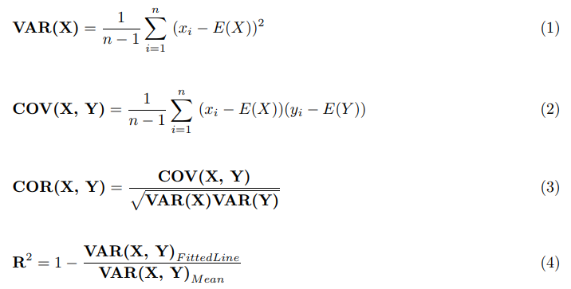

## Table of Contents

## What is variance and why is it important in statistics?

Variance is a way to measure how spread out a set of numbers is. Imagine you have a bunch of test scores from a class. If all the scores are close to the average, the variance is small. But if the scores are all over the place, with some really high and some really low, the variance is large. It's like looking at how much the numbers differ from each other.

Variance is important in statistics because it helps us understand the data better. When we know the variance, we can tell if the data is reliable or if it's all over the place. For example, if you're looking at the heights of a group of people, a small variance means most people are about the same height. A large variance means there's a big difference in heights. This helps in making decisions, like in business or science, where understanding how data behaves is crucial.

## How do you calculate the variance of a dataset?

To calculate the variance of a dataset, you first need to find the mean, which is just the average of all the numbers. Add up all the numbers in your dataset and then divide by how many numbers you have. Once you have the mean, you go through each number in your dataset and find out how far away it is from the mean. You do this by subtracting the mean from each number. This difference is called the deviation.

Next, you square each of these deviations. Squaring them makes sure all the numbers are positive and also gives more weight to larger differences. After squaring, you add up all these squared deviations. Then, you divide this total by the number of items in your dataset if it's a population, or by one less than the number of items if it's a sample. This final number is the variance. It tells you how spread out the numbers in your dataset are.

## What is the difference between population variance and sample variance?

Population variance and sample variance are two ways to measure how spread out numbers are in a dataset, but they are used in slightly different situations. Population variance is used when you have data for every single member of a group you're studying. For example, if you want to know the variance of the heights of all students in a school, you would use population variance. To calculate it, you add up all the squared deviations from the mean and then divide by the total number of data points.

Sample variance, on the other hand, is used when you only have data from a smaller part of the group you're studying. This is common in research where it's not possible to collect data from everyone. For instance, if you're studying the heights of students but only have data from a few classrooms, you would use sample variance. The calculation is similar to population variance, but you divide by one less than the total number of data points. This adjustment, called Bessel's correction, makes the estimate more accurate for the whole population.

## What does covariance measure and how is it used?

Covariance measures how two different sets of numbers change together. Imagine you have the scores of students in math and science. If students who do well in math also tend to do well in science, the covariance between math and science scores would be positive. If students who do well in math tend to do poorly in science, the covariance would be negative. If there's no clear pattern, the covariance is close to zero.

Covariance is used to understand the relationship between two variables. For example, businesses might use it to see if there's a link between how much they spend on advertising and how much they sell. If the covariance is positive, it suggests that more advertising leads to more sales. In finance, investors use covariance to see how different investments move together, helping them build a balanced portfolio where some investments go up when others go down.

## How do you compute the covariance between two variables?

To find the covariance between two sets of numbers, you start by figuring out the average of each set. Let's call these averages the mean of the first set and the mean of the second set. Then, for each pair of numbers from the two sets, you subtract the mean of the first set from the first number and the mean of the second set from the second number. You multiply these two differences together. You do this for every pair of numbers in your sets.

After you've multiplied all the pairs, you add up all these products. Finally, you divide this total by the number of pairs minus one if you're working with a sample, or just by the number of pairs if you're looking at the whole population. This final number is the covariance. It tells you if the two sets of numbers tend to move together (positive covariance), move in opposite directions (negative covariance), or don't have a clear pattern (covariance close to zero).

## Can you explain the relationship between variance and standard deviation?

Variance and standard deviation both tell us how spread out a set of numbers is, but they do it in slightly different ways. Variance is the average of the squared differences from the mean. It gives us a measure of how much the numbers in our dataset vary from the average. If the variance is small, it means the numbers are pretty close to the mean. If it's big, the numbers are spread out a lot.

Standard deviation is just the square root of the variance. It's like variance, but it's in the same units as the original numbers, which makes it easier to understand and use. For example, if you're looking at test scores, the standard deviation will be in points, just like the scores themselves. So, if the standard deviation is small, it means most scores are close to the average score. If it's large, the scores are all over the place. Both variance and standard deviation help us understand how consistent our data is, but standard deviation is often more practical because it's easier to relate to the original data.

## What is the significance of a positive versus a negative covariance?

When the covariance between two sets of numbers is positive, it means that as one set of numbers goes up, the other set tends to go up too. Think of it like this: if you're looking at the amount of ice cream sold and the temperature outside, a positive covariance would show that when it's hotter, people buy more ice cream. This helps us see that the two things are connected in a way where they move together.

On the other hand, a negative covariance means that as one set of numbers goes up, the other set tends to go down. For example, if you're looking at the number of umbrellas sold and the temperature, a negative covariance would show that when it's colder, people buy more umbrellas, maybe because it's more likely to rain. This tells us that the two things are connected, but they move in opposite directions.

## How does the concept of covariance relate to correlation?

Covariance and correlation both help us understand how two sets of numbers move together, but they do it in different ways. Covariance tells us if two things tend to go up or down together, but it doesn't tell us how strong this relationship is. For example, if you see that the number of hours people study and their test scores have a positive covariance, it means that more study time usually leads to higher scores. But covariance alone doesn't tell you if this link is strong or weak.

Correlation, on the other hand, is like an improved version of covariance. It takes the covariance and turns it into a number between -1 and 1, which makes it easier to understand how strong the relationship is. A correlation of 1 means the two things move perfectly together, a correlation of -1 means they move perfectly in opposite directions, and a correlation of 0 means there's no clear pattern. So, while covariance gives you a basic idea of whether two things move together, correlation tells you how closely they move together, making it a more useful tool for understanding relationships in data.

## What are the limitations of using covariance as a measure of relationship between variables?

Covariance tells us if two sets of numbers move together, but it has some problems. One big problem is that the size of the covariance depends on the units of the numbers. This means that if you change the units, like going from dollars to cents, the covariance number changes too. This makes it hard to compare the covariance between different sets of numbers because the size of the number doesn't mean the same thing in every situation.

Another issue is that covariance doesn't tell us how strong the relationship is between the two sets of numbers. It just tells us if they tend to go up or down together. This can be confusing because a big covariance number might not mean the relationship is strong if the numbers themselves are big. That's why people often use correlation instead, which fixes these problems by giving a number that's always between -1 and 1, making it easier to understand and compare.

## How can variance and covariance be applied in portfolio management?

In portfolio management, variance helps investors understand how much the value of their investments might change. If an investment has a high variance, it means its value could go up or down a lot, making it riskier. By looking at the variance of different investments, investors can decide if they want to take on more risk for possibly higher returns or if they want to play it safe with investments that have lower variance. This helps them build a portfolio that matches how much risk they're willing to take.

Covariance is also important in portfolio management because it shows how different investments move together. If two investments have a positive covariance, it means they tend to go up or down at the same time. This can be risky because if one investment loses value, the other one might too. But if two investments have a negative covariance, they move in opposite directions. This can be good for balancing a portfolio because when one investment goes down, the other might go up, helping to reduce overall risk. By understanding the covariance between different investments, investors can create a mix that helps them manage risk and possibly improve their returns.

## What advanced techniques exist for estimating variance and covariance in time series data?

When dealing with time series data, which is data collected over time, estimating variance and covariance can be tricky because the data points are not independent. One common advanced technique is the use of autoregressive conditional heteroskedasticity (ARCH) models and their extensions, like GARCH models. These models help capture how the variance of the data changes over time. For example, stock prices might have periods of high volatility followed by periods of calm. ARCH and GARCH models can account for this by using past data to predict future variance, making them useful for financial forecasting and risk management.

Another technique is the use of exponential smoothing methods for variance estimation, such as the exponentially weighted moving average (EWMA) model. This method gives more weight to recent data points, which is helpful when the variance of the time series changes over time. For example, if you're tracking the daily returns of a stock, you might want to give more importance to recent returns to get a better sense of current volatility. EWMA can be simpler to use than ARCH and GARCH models but still provides a good way to estimate changing variance.

For covariance in time series, vector autoregression (VAR) models are often used. These models look at how multiple time series affect each other over time. For instance, if you're studying the relationship between the stock prices of two companies, a VAR model can help you understand how changes in one company's stock price might influence the other's. By using historical data, VAR models can estimate the covariance between different time series, which is crucial for portfolio management and understanding economic relationships.

## How do you interpret and use variance-covariance matrices in multivariate analysis?

A variance-covariance matrix is like a table that shows how much each variable in a set of data changes on its own and how it changes with other variables. The numbers along the diagonal of the matrix tell you the variance of each variable, which is how spread out the numbers are for that variable. The numbers off the diagonal show the covariance between pairs of variables, telling you if they tend to go up and down together or in opposite directions. In simple terms, it's a way to see both how much each thing changes and how those changes relate to each other.

In multivariate analysis, the variance-covariance matrix is super useful because it helps you understand the whole picture of how your data behaves. For example, if you're studying different test scores of students, the matrix can show you how much each score varies and if high scores in one subject tend to go with high scores in another. This can help you make better decisions, like figuring out which subjects are closely related or how to group students for special programs. By looking at this matrix, you can get a clearer idea of the relationships in your data and use that to make smarter choices.

## What is the understanding of Covariance and Variance?

Variance and covariance are fundamental statistical concepts widely used in the field of finance, particularly in risk management and portfolio analysis. 

Variance quantifies the degree to which a set of numbers varies from its mean. It provides a numerical value that assesses how much individual data points differ from the average within a dataset. Mathematically, the variance ($\sigma^2$) of a dataset is calculated as the average of the squared differences from the mean ($\mu$). The formula for variance is expressed as:

$$
\sigma^2 = \frac{1}{N} \sum_{i=1}^{N} (x_i - \mu)^2
$$

where $N$ represents the number of data points, $x_i$ is each individual data point, and $\mu$ is the mean of the dataset. Variance is crucial in finance for assessing the volatility of an asset or portfolio, dictating the potential risk involved in financial decisions.

Covariance, on the other hand, measures how two variables change together. It indicates the degree to which the deviations of two variables from their respective means are aligned. A positive covariance implies that the variables move in the same direction, whereas a negative covariance indicates they move inversely. The covariance ($\text{cov}(X, Y)$) between two variables $X$ and $Y$ is defined as:

$$
\text{cov}(X, Y) = \frac{1}{N} \sum_{i=1}^{N} (x_i - \mu_x)(y_i - \mu_y)
$$

where $(x_i, y_i)$ are paired values from datasets of the two variables, and $\mu_x$ and $\mu_y$ are their respective means. In finance, covariance is a critical measure for understanding the correlation between asset returns, aiding in portfolio diversification strategies.

While both variance and covariance are used to understand variability, their applications differ widely. Variance focuses on the [dispersion](/wiki/dispersion-trading) within a single dataset, while covariance assesses the directional relationship between two datasets. The distinction between these measures becomes evident in financial contexts, such as portfolio theory, wherein variance quantifies risk and covariance facilitates diversification. Understanding both variance and covariance allows investors to optimize returns while managing risks effectively.

## What are Mathematical Formulas?

Calculating variance and covariance is fundamental in statistical analysis, playing a crucial role in understanding data dispersion and relationships between variables. These calculations help quantify risk and inform decision-making in [algorithmic trading](/wiki/algorithmic-trading).

Variance is used to measure the spread of a dataset around its mean. For a population, the variance (σ²) is calculated using the formula:

$$

\sigma^2 = \frac{\sum_{i=1}^{N} (x_i - \mu)^2}{N} 
$$

where $x_i$ represents each data point, $\mu$ is the mean of the data, and $N$ is the number of data points in the population. For a sample, the sample variance (s²) is given by:

$$

s^2 = \frac{\sum_{i=1}^{n} (x_i - \bar{x})^2}{n-1} 
$$

where $\bar{x}$ is the sample mean, and $n$ is the sample size. The denominators reflect that using $n-1$ provides an unbiased estimate when working with a sample.

Covariance measures how two variables change together, indicating the directional relationship between them. The population covariance between two variables, $X$ and $Y$, is expressed as:

$$

\text{cov}(X, Y) = \frac{\sum_{i=1}^{N} (x_i - \mu_X)(y_i - \mu_Y)}{N} 
$$

where $x_i$ and $y_i$ are data points, and $\mu_X$ and $\mu_Y$ represent means of variables $X$ and $Y$, respectively. For a sample, the sample covariance is calculated as:

$$

\text{cov}(X, Y) = \frac{\sum_{i=1}^{n} (x_i - \bar{x})(y_i - \bar{y})}{n-1} 
$$

As with variance, the denominator $n-1$ allows for an unbiased estimation in the case of a sample. 

In both variance and covariance, the components include individual data points, either from a population or a sample, and their respective means. The variance measures spread within a single dataset, while covariance assesses the joint variability of two datasets.

Understanding these formulas is important for traders implementing quantitative strategies, where variance can indicate the [volatility](/wiki/volatility-trading-strategies) of an asset, and covariance helps in assessing how assets move together, aiding in portfolio diversification decisions. Codifying these calculations in Python can further streamline their application in real-time trading scenarios. Here's an example of calculating sample variance and sample covariance using Python:

```python
import numpy as np

# Data examples
X = np.array([2, 4, 6, 8, 10])
Y = np.array([5, 10, 15, 20, 25])

# Sample variance for X
sample_variance_X = np.var(X, ddof=1)

# Sample covariance between X and Y
sample_covariance_XY = np.cov(X, Y, ddof=1)[0][1]

print("Sample Variance of X:", sample_variance_X)
print("Sample Covariance of X and Y:", sample_covariance_XY)
```

This code snippet leverages NumPy, a widely-used Python library for numerical computations, to simplify the process of calculating these statistical measures.

## What is the difference between Covariance and Correlation?

Correlation and covariance are fundamental concepts in statistical analysis, particularly in assessing the relationship between two variables. Both metrics are pivotal in financial markets for measuring how pairs of securities move in relation to each other, an essential element of algorithmic trading strategies.

**Introduction to Correlation and Its Relation to Covariance**

Covariance measures the directional tendency between two variables. If two variables tend to increase or decrease together, the covariance is positive. Conversely, if one variable tends to increase when the other decreases, the covariance is negative. However, covariance has one primary limitation: its magnitude is difficult to interpret because it is not standardized and depends on the scales of the variables involved.

Correlation, on the other hand, is a related concept that addresses this limitation by standardizing covariance. Correlation quantifies the degree to which two variables move in relation to each other, adjusting for the variables' standard deviations, thus providing a dimensionless figure that is easier to interpret.

**Comparison between Covariance and Correlation**

1. **Range**: The primary difference between covariance and correlation lies in their range. Covariance can take any positive or negative value, depending on the variables' scales, while correlation values are constrained within the interval [-1, 1]. A correlation of 1 indicates a perfect positive linear relationship, -1 indicates a perfect negative linear relationship, and 0 indicates no linear relationship.

2. **Units**: Covariance retains the units of the variables, resulting in a measurement that is difficult to interpret without context. Correlation, being dimensionless, provides a more intuitive understanding of the relationship strength and direction between variables.

3. **Interpretation**: Due to its standardized nature, correlation's interpretation is straightforward. A correlation coefficient close to 1 implies that as one variable increases, the second tends to increase proportionally. A correlation close to -1 means that as one variable increases, the other tends to decrease proportionally. Covariance, without standardization, can be less intuitive for comparative analysis across different datasets or variable pairs.

**Explanation of Pearson’s Correlation Coefficient**

Pearson’s correlation coefficient, denoted as $r$, is the most commonly used correlation measure. It is calculated as the covariance of the two variables divided by the product of their standard deviations:

$$
r = \frac{\text{cov}(X, Y)}{\sigma_X \sigma_Y}
$$

Where:
- $\text{cov}(X, Y)$ is the covariance between variables $X$ and $Y$,
- $\sigma_X$ is the standard deviation of $X$,
- $\sigma_Y$ is the standard deviation of $Y$.

This normalization process transforms the covariance into a correlation coefficient, providing a scale-invariant metric that facilitates comparison across different datasets and variable pairs.

By standardizing covariance, Pearson’s correlation coefficient simplifies the assessment of relationships between variables, making it an indispensable tool in the identification and deployment of correlation-based trading strategies. Its application supports a nuanced understanding of portfolio dynamics, essential for diversification and risk management in quantitative finance.

## How do you calculate covariance and variance?

Calculating covariance and variance is crucial for assessing how variables move together and measuring the spread of data points in financial datasets, respectively. Understanding how to perform these calculations manually provides foundational insights into their application in trading algorithms.

### Step-by-step Guide to Manually Calculating Variance

**Variance** quantifies how much a set of numbers diverge from their average value. It is formulated as follows:

$$
\text{Variance} (\sigma^2) = \frac{\sum (x_i - \mu)^2}{N}
$$

For a sample variance:

$$
\text{Sample Variance} (s^2) = \frac{\sum (x_i - \bar{x})^2}{n-1}
$$

where:
- $x_i$ represents each data point,
- $\mu$ is the mean of the entire population,
- $\bar{x}$ is the mean of the sample,
- $N$ is the number of data points in the population,
- $n$ is the number of data points in the sample.

**Example Calculation:**

Consider a dataset: [3, 7, 7, 19, 24]. 

1. Calculate the mean: 
   \[ \bar{x} = \frac{3 + 7 + 7 + 19 + 24}{5} = 12
$$

2. Compute each deviation from the mean, square it, and sum them:
   - $(3-12)^2 = 81$
   - $(7-12)^2 = 25$
   - $(7-12)^2 = 25$
   - $(19-12)^2 = 49$
   - $(24-12)^2 = 144$

3. Aggregate and divide by (n-1) for the sample variance:
   \[ s^2 = \frac{81 + 25 + 25 + 49 + 144}{4} = 81
$$

### Step-by-step Guide to Manually Calculating Covariance

**Covariance** measures how two variables change together. The formula is:

$$
\text{Covariance} (X, Y) = \frac{\sum (x_i - \bar{x})(y_i - \bar{y})}{n-1}
$$

where:
- $x_i, y_i$ are data points for variables X and Y,
- $\bar{x}, \bar{y}$ are the means of X and Y,
- $n$ is the number of pairs.

**Example Calculation:**

Given two datasets, X: [2, 8, 10] and Y: [7, 10, 12].

1. Calculate means:
   - $\bar{x} = \frac{2+8+10}{3} = 6.67$
   - $\bar{y} = \frac{7+10+12}{3} = 9.67$

2. Compute product of deviations:
   - $(2-6.67)(7-9.67) = 11.11$
   - $(8-6.67)(10-9.67) = 0.44$
   - $(10-6.67)(12-9.67) = 7.56$

3. Sum and divide by (n-1):
   \[ \text{Covariance} (X, Y) = \frac{11.11 + 0.44 + 7.56}{2} = 9.055
$$

### Automating Calculations with Python

Python can streamline these calculations using libraries like NumPy, which is particularly advantageous for large datasets.

**Python Code Example:**

```python
import numpy as np

# Data
data_x = np.array([2, 8, 10])
data_y = np.array([7, 10, 12])

# Variance
variance = np.var(data_x, ddof=1)  # ddof=1 for sample variance
print(f"Sample Variance of X: {variance}")

# Covariance
covariance_matrix = np.cov(data_x, data_y)
covariance = covariance_matrix[0, 1]
print(f"Covariance between X and Y: {covariance}")
```

This code demonstrates how to calculate sample variance and covariance efficiently, illustrating their crucial role in financial analysis and algorithmic trading. By automating these operations, traders and analysts can quickly adapt to changing datasets, enhancing decision-making processes rooted in statistical rigor.

## What are the practical applications in algorithmic trading?

In algorithmic trading, the application of covariance and variance plays a crucial role in developing effective trading strategies. These statistical tools are fundamental for assessing relationships between financial assets, estimating risk, and optimizing portfolios.

### Case Studies and Examples

1. **Pair Trading:**
   Pair trading is a market-neutral strategy that involves matching a long position with a short position in two stocks with high historical correlation. The core idea is to capitalize on the relative price movement of a pair of stocks. Covariance is used to determine whether the assets have historically moved together, thus making them potential candidates for [pair trading](/wiki/pair-trading). For example, if two stocks have a high covariance, it signifies that their price changes are associated, making them suitable for pair trading strategies.

2. **Portfolio Diversification:**
   Variance and covariance are integral to Modern Portfolio Theory (MPT), which aims to construct an investment portfolio that maximizes return for a given level of risk. Covariance between asset returns is crucial in this context as it helps assess the degree to which assets in a portfolio move in relation to one another. Portfolio risk can be reduced by selecting assets with low covariance, although a complete risk elimination is often not possible. The overall variance of a portfolio is calculated as follows:
$$
   \sigma_p^2 = \sum_{i=1}^{n} w_i^2 \sigma_i^2 + 2 \sum_{i=1}^{n} \sum_{j=i+1}^{n} w_i w_j \text{Cov}(r_i, r_j)

$$

   where $\sigma_p^2$ is the variance of the portfolio, $w_i$ and $w_j$ are the weights of the assets, $\sigma_i^2$ is the variance of asset $i$, and $\text{Cov}(r_i, r_j)$ is the covariance between asset $i$ and asset $j$.

### Practical Exercises and Example Scenarios

- **Exercise 1: Calculate Asset Covariance:**
  Given historical price data for two stocks in a CSV file, calculate the covariance using Python. Here's a simple Python code snippet for calculating covariance between two assets:

  ```python
  import pandas as pd

  # Load historical price data
  data = pd.read_csv('historical_prices.csv')
  stock1_returns = data['stock1'].pct_change()
  stock2_returns = data['stock2'].pct_change()

  # Calculate covariance
  covariance_matrix = stock1_returns.cov(stock2_returns)
  print('Covariance:', covariance_matrix)
  ```

- **Exercise 2: Portfolio Optimization:**
  Assume you are constructing a portfolio from three assets. Use variance and covariance to determine the optimal weights that minimize risk for a target return. You can extend the code above to calculate the covariance matrix and employ optimization techniques like quadratic programming to find the optimal weights.

- **Example Scenario: Volatility Estimation:**
  Traders can use variance to estimate the volatility of an asset. A higher variance indicates greater volatility, which may inform decisions about stop-loss orders, position sizing, and leverage. For instance, calculating the rolling variance of asset returns over different periods can help identify trends in volatility.

These examples underscore the importance of understanding and applying covariance and variance in algorithmic trading, facilitating better decision-making and strategy development for market practitioners.

## References & Further Reading

[1]: Lopez de Prado, M. (2018). ["Advances in Financial Machine Learning."](https://www.amazon.com/Advances-Financial-Machine-Learning-Marcos/dp/1119482089) John Wiley & Sons.

[2]: Aronson, D. R. (2006). ["Evidence-Based Technical Analysis: Applying the Scientific Method and Statistical Inference to Trading Signals."](https://www.amazon.com/Evidence-Based-Technical-Analysis-Scientific-Statistical/dp/0470008741) John Wiley & Sons.

[3]: Jansen, S. (2020). ["Machine Learning for Algorithmic Trading."](https://github.com/stefan-jansen/machine-learning-for-trading) Packt Publishing.

[4]: Chan, E. P. (2009). ["Quantitative Trading: How to Build Your Own Algorithmic Trading Business."](https://github.com/egorpe/EPChan-QuantitativeTrading/blob/master/example7_6.m) John Wiley & Sons.

[5]: Elton, E. J., Gruber, M. J., Brown, S. J., & Goetzmann, W. N. (2014). ["Modern Portfolio Theory and Investment Analysis."](https://www.amazon.com/Modern-Portfolio-Theory-Investment-Analysis/dp/1118469941) John Wiley & Sons.