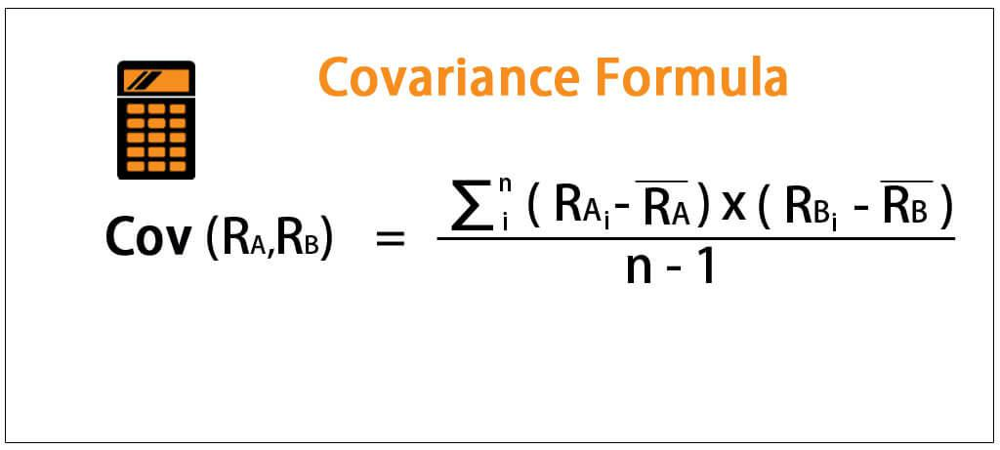

Algorithmic trading, a form of trading that leverages computers programmed to follow a defined set of instructions for placing trades, plays a pivotal role in modern financial markets. This method of trading capitalizes on speed, precision, and the ability to analyze vast quantities of data in real-time. As technology has evolved, algorithmic trading has gained popularity among institutional investors, hedge funds, and even retail traders due to its capacity to execute complex strategies at scale.

Two fundamental statistical concepts—covariance and variance—are critical to the optimization of trading strategies and effective risk management in algorithmic trading. Variance is a measure that quantifies the spread of a dataset around its mean. It provides insight into the level of risk associated with an asset by assessing the degree of variation in its historical price changes. An asset with high variance is considered more volatile, thus potentially riskier.



Covariance, on the other hand, assesses the directional relationship between two variables, indicating how the price movements of one asset are related to another. Positive covariance implies that assets tend to move in the same direction, whereas negative covariance suggests they move in opposite directions. In the context of portfolio management, these measures are indispensable for diversification strategies. By combining assets with low or negative covariance, traders can mitigate risk and enhance potential returns, given that not all components of the portfolio react similarly to market conditions.

In algorithmic trading, these statistical tools are used extensively to refine trading algorithms and develop strategies that respond dynamically to market conditions. Employing variance allows traders to anticipate and manage volatility, while covariance is instrumental in formulating strategies like pair trading, where traders exploit price differentials between related stocks.

This article aims to explore the critical application of covariance and variance within algorithmic trading, focusing on their role in strategy enhancement and risk management. Through a systematic examination, readers will gain a clearer understanding of these statistical concepts and how they can be leveraged to improve trading outcomes in increasingly competitive financial markets.

## Table of Contents

## Understanding Covariance and Variance

Variance and covariance are fundamental statistical concepts widely used in the field of finance, particularly in risk management and portfolio analysis. 

Variance quantifies the degree to which a set of numbers varies from its mean. It provides a numerical value that assesses how much individual data points differ from the average within a dataset. Mathematically, the variance ($\sigma^2$) of a dataset is calculated as the average of the squared differences from the mean ($\mu$). The formula for variance is expressed as:

$$
\sigma^2 = \frac{1}{N} \sum_{i=1}^{N} (x_i - \mu)^2
$$

where $N$ represents the number of data points, $x_i$ is each individual data point, and $\mu$ is the mean of the dataset. Variance is crucial in finance for assessing the volatility of an asset or portfolio, dictating the potential risk involved in financial decisions.

Covariance, on the other hand, measures how two variables change together. It indicates the degree to which the deviations of two variables from their respective means are aligned. A positive covariance implies that the variables move in the same direction, whereas a negative covariance indicates they move inversely. The covariance ($\text{cov}(X, Y)$) between two variables $X$ and $Y$ is defined as:

$$
\text{cov}(X, Y) = \frac{1}{N} \sum_{i=1}^{N} (x_i - \mu_x)(y_i - \mu_y)
$$

where $(x_i, y_i)$ are paired values from datasets of the two variables, and $\mu_x$ and $\mu_y$ are their respective means. In finance, covariance is a critical measure for understanding the correlation between asset returns, aiding in portfolio diversification strategies.

While both variance and covariance are used to understand variability, their applications differ widely. Variance focuses on the [dispersion](/wiki/dispersion-trading) within a single dataset, while covariance assesses the directional relationship between two datasets. The distinction between these measures becomes evident in financial contexts, such as portfolio theory, wherein variance quantifies risk and covariance facilitates diversification. Understanding both variance and covariance allows investors to optimize returns while managing risks effectively.

## Mathematical Formulas

Calculating variance and covariance is fundamental in statistical analysis, playing a crucial role in understanding data dispersion and relationships between variables. These calculations help quantify risk and inform decision-making in [algorithmic trading](/wiki/algorithmic-trading).

Variance is used to measure the spread of a dataset around its mean. For a population, the variance (σ²) is calculated using the formula:

$$

\sigma^2 = \frac{\sum_{i=1}^{N} (x_i - \mu)^2}{N} 
$$

where $x_i$ represents each data point, $\mu$ is the mean of the data, and $N$ is the number of data points in the population. For a sample, the sample variance (s²) is given by:

$$

s^2 = \frac{\sum_{i=1}^{n} (x_i - \bar{x})^2}{n-1} 
$$

where $\bar{x}$ is the sample mean, and $n$ is the sample size. The denominators reflect that using $n-1$ provides an unbiased estimate when working with a sample.

Covariance measures how two variables change together, indicating the directional relationship between them. The population covariance between two variables, $X$ and $Y$, is expressed as:

$$

\text{cov}(X, Y) = \frac{\sum_{i=1}^{N} (x_i - \mu_X)(y_i - \mu_Y)}{N} 
$$

where $x_i$ and $y_i$ are data points, and $\mu_X$ and $\mu_Y$ represent means of variables $X$ and $Y$, respectively. For a sample, the sample covariance is calculated as:

$$

\text{cov}(X, Y) = \frac{\sum_{i=1}^{n} (x_i - \bar{x})(y_i - \bar{y})}{n-1} 
$$

As with variance, the denominator $n-1$ allows for an unbiased estimation in the case of a sample. 

In both variance and covariance, the components include individual data points, either from a population or a sample, and their respective means. The variance measures spread within a single dataset, while covariance assesses the joint variability of two datasets.

Understanding these formulas is important for traders implementing quantitative strategies, where variance can indicate the [volatility](/wiki/volatility-trading-strategies) of an asset, and covariance helps in assessing how assets move together, aiding in portfolio diversification decisions. Codifying these calculations in Python can further streamline their application in real-time trading scenarios. Here's an example of calculating sample variance and sample covariance using Python:

```python
import numpy as np

# Data examples
X = np.array([2, 4, 6, 8, 10])
Y = np.array([5, 10, 15, 20, 25])

# Sample variance for X
sample_variance_X = np.var(X, ddof=1)

# Sample covariance between X and Y
sample_covariance_XY = np.cov(X, Y, ddof=1)[0][1]

print("Sample Variance of X:", sample_variance_X)
print("Sample Covariance of X and Y:", sample_covariance_XY)
```

This code snippet leverages NumPy, a widely-used Python library for numerical computations, to simplify the process of calculating these statistical measures.

## Covariance vs. Correlation

Correlation and covariance are fundamental concepts in statistical analysis, particularly in assessing the relationship between two variables. Both metrics are pivotal in financial markets for measuring how pairs of securities move in relation to each other, an essential element of algorithmic trading strategies.

**Introduction to Correlation and Its Relation to Covariance**

Covariance measures the directional tendency between two variables. If two variables tend to increase or decrease together, the covariance is positive. Conversely, if one variable tends to increase when the other decreases, the covariance is negative. However, covariance has one primary limitation: its magnitude is difficult to interpret because it is not standardized and depends on the scales of the variables involved.

Correlation, on the other hand, is a related concept that addresses this limitation by standardizing covariance. Correlation quantifies the degree to which two variables move in relation to each other, adjusting for the variables' standard deviations, thus providing a dimensionless figure that is easier to interpret.

**Comparison between Covariance and Correlation**

1. **Range**: The primary difference between covariance and correlation lies in their range. Covariance can take any positive or negative value, depending on the variables' scales, while correlation values are constrained within the interval [-1, 1]. A correlation of 1 indicates a perfect positive linear relationship, -1 indicates a perfect negative linear relationship, and 0 indicates no linear relationship.

2. **Units**: Covariance retains the units of the variables, resulting in a measurement that is difficult to interpret without context. Correlation, being dimensionless, provides a more intuitive understanding of the relationship strength and direction between variables.

3. **Interpretation**: Due to its standardized nature, correlation's interpretation is straightforward. A correlation coefficient close to 1 implies that as one variable increases, the second tends to increase proportionally. A correlation close to -1 means that as one variable increases, the other tends to decrease proportionally. Covariance, without standardization, can be less intuitive for comparative analysis across different datasets or variable pairs.

**Explanation of Pearson’s Correlation Coefficient**

Pearson’s correlation coefficient, denoted as $r$, is the most commonly used correlation measure. It is calculated as the covariance of the two variables divided by the product of their standard deviations:

$$
r = \frac{\text{cov}(X, Y)}{\sigma_X \sigma_Y}
$$

Where:
- $\text{cov}(X, Y)$ is the covariance between variables $X$ and $Y$,
- $\sigma_X$ is the standard deviation of $X$,
- $\sigma_Y$ is the standard deviation of $Y$.

This normalization process transforms the covariance into a correlation coefficient, providing a scale-invariant metric that facilitates comparison across different datasets and variable pairs.

By standardizing covariance, Pearson’s correlation coefficient simplifies the assessment of relationships between variables, making it an indispensable tool in the identification and deployment of correlation-based trading strategies. Its application supports a nuanced understanding of portfolio dynamics, essential for diversification and risk management in quantitative finance.

## Calculating Covariance and Variance

Calculating covariance and variance is crucial for assessing how variables move together and measuring the spread of data points in financial datasets, respectively. Understanding how to perform these calculations manually provides foundational insights into their application in trading algorithms.

### Step-by-step Guide to Manually Calculating Variance

**Variance** quantifies how much a set of numbers diverge from their average value. It is formulated as follows:

$$
\text{Variance} (\sigma^2) = \frac{\sum (x_i - \mu)^2}{N}
$$

For a sample variance:

$$
\text{Sample Variance} (s^2) = \frac{\sum (x_i - \bar{x})^2}{n-1}
$$

where:
- $x_i$ represents each data point,
- $\mu$ is the mean of the entire population,
- $\bar{x}$ is the mean of the sample,
- $N$ is the number of data points in the population,
- $n$ is the number of data points in the sample.

**Example Calculation:**

Consider a dataset: [3, 7, 7, 19, 24]. 

1. Calculate the mean: 
   \[ \bar{x} = \frac{3 + 7 + 7 + 19 + 24}{5} = 12
$$

2. Compute each deviation from the mean, square it, and sum them:
   - $(3-12)^2 = 81$
   - $(7-12)^2 = 25$
   - $(7-12)^2 = 25$
   - $(19-12)^2 = 49$
   - $(24-12)^2 = 144$

3. Aggregate and divide by (n-1) for the sample variance:
   \[ s^2 = \frac{81 + 25 + 25 + 49 + 144}{4} = 81
$$

### Step-by-step Guide to Manually Calculating Covariance

**Covariance** measures how two variables change together. The formula is:

$$
\text{Covariance} (X, Y) = \frac{\sum (x_i - \bar{x})(y_i - \bar{y})}{n-1}
$$

where:
- $x_i, y_i$ are data points for variables X and Y,
- $\bar{x}, \bar{y}$ are the means of X and Y,
- $n$ is the number of pairs.

**Example Calculation:**

Given two datasets, X: [2, 8, 10] and Y: [7, 10, 12].

1. Calculate means:
   - $\bar{x} = \frac{2+8+10}{3} = 6.67$
   - $\bar{y} = \frac{7+10+12}{3} = 9.67$

2. Compute product of deviations:
   - $(2-6.67)(7-9.67) = 11.11$
   - $(8-6.67)(10-9.67) = 0.44$
   - $(10-6.67)(12-9.67) = 7.56$

3. Sum and divide by (n-1):
   \[ \text{Covariance} (X, Y) = \frac{11.11 + 0.44 + 7.56}{2} = 9.055
$$

### Automating Calculations with Python

Python can streamline these calculations using libraries like NumPy, which is particularly advantageous for large datasets.

**Python Code Example:**

```python
import numpy as np

# Data
data_x = np.array([2, 8, 10])
data_y = np.array([7, 10, 12])

# Variance
variance = np.var(data_x, ddof=1)  # ddof=1 for sample variance
print(f"Sample Variance of X: {variance}")

# Covariance
covariance_matrix = np.cov(data_x, data_y)
covariance = covariance_matrix[0, 1]
print(f"Covariance between X and Y: {covariance}")
```

This code demonstrates how to calculate sample variance and covariance efficiently, illustrating their crucial role in financial analysis and algorithmic trading. By automating these operations, traders and analysts can quickly adapt to changing datasets, enhancing decision-making processes rooted in statistical rigor.

## Role of Covariance and Variance in Algo Trading

Statistical measures like covariance and variance play a crucial role in enhancing trading strategies within algorithmic trading. These measures provide vital insights into the behavior of financial instruments, contributing to more informed decision-making processes.

Covariance is integral to risk management and diversification, especially within portfolio management. It measures the directional relationship between the returns of two assets. A positive covariance indicates that asset returns move together, while a negative covariance signals that they move inversely. By understanding these relationships, traders can construct diversified portfolios that minimize risk. Diversification relies on combining assets with low or negative covariance. This minimizes the overall portfolio risk without sacrificing returns, following the principle of Modern Portfolio Theory established by Harry Markowitz. Essentially, covariance helps in optimizing the trade-off between risk and return in portfolio construction.

Variance, on the other hand, is pivotal in assessing volatility and asset risk. It provides a quantitative measure of the dispersion of asset returns. Higher variance implies greater risk, as asset prices are more likely to deviate significantly from their mean. In algorithmic trading, understanding an asset's variance is critical for strategies targeting volatility, such as volatility [arbitrage](/wiki/arbitrage). These strategies exploit differences between predicted and actual volatility, capitalizing on mispricings. Variance is also utilized in setting stop-loss limits and position sizing, ensuring that portfolios are not excessively exposed to volatile moves.

Incorporating these statistical measures into algorithmic models enhances the ability to manage risk effectively and capitalize on market opportunities. By employing covariance and variance, traders can develop sophisticated models that predict market movements and adjust positions dynamically to optimize returns. This underscores the pivotal role these measures play in the success of algorithmic trading strategies.

## Practical Applications in Algorithmic Trading

In algorithmic trading, the application of covariance and variance plays a crucial role in developing effective trading strategies. These statistical tools are fundamental for assessing relationships between financial assets, estimating risk, and optimizing portfolios.

### Case Studies and Examples

1. **Pair Trading:**
   Pair trading is a market-neutral strategy that involves matching a long position with a short position in two stocks with high historical correlation. The core idea is to capitalize on the relative price movement of a pair of stocks. Covariance is used to determine whether the assets have historically moved together, thus making them potential candidates for [pair trading](/wiki/pair-trading). For example, if two stocks have a high covariance, it signifies that their price changes are associated, making them suitable for pair trading strategies.

2. **Portfolio Diversification:**
   Variance and covariance are integral to Modern Portfolio Theory (MPT), which aims to construct an investment portfolio that maximizes return for a given level of risk. Covariance between asset returns is crucial in this context as it helps assess the degree to which assets in a portfolio move in relation to one another. Portfolio risk can be reduced by selecting assets with low covariance, although a complete risk elimination is often not possible. The overall variance of a portfolio is calculated as follows:
$$
   \sigma_p^2 = \sum_{i=1}^{n} w_i^2 \sigma_i^2 + 2 \sum_{i=1}^{n} \sum_{j=i+1}^{n} w_i w_j \text{Cov}(r_i, r_j)

$$

   where $\sigma_p^2$ is the variance of the portfolio, $w_i$ and $w_j$ are the weights of the assets, $\sigma_i^2$ is the variance of asset $i$, and $\text{Cov}(r_i, r_j)$ is the covariance between asset $i$ and asset $j$.

### Practical Exercises and Example Scenarios

- **Exercise 1: Calculate Asset Covariance:**
  Given historical price data for two stocks in a CSV file, calculate the covariance using Python. Here's a simple Python code snippet for calculating covariance between two assets:

  ```python
  import pandas as pd

  # Load historical price data
  data = pd.read_csv('historical_prices.csv')
  stock1_returns = data['stock1'].pct_change()
  stock2_returns = data['stock2'].pct_change()

  # Calculate covariance
  covariance_matrix = stock1_returns.cov(stock2_returns)
  print('Covariance:', covariance_matrix)
  ```

- **Exercise 2: Portfolio Optimization:**
  Assume you are constructing a portfolio from three assets. Use variance and covariance to determine the optimal weights that minimize risk for a target return. You can extend the code above to calculate the covariance matrix and employ optimization techniques like quadratic programming to find the optimal weights.

- **Example Scenario: Volatility Estimation:**
  Traders can use variance to estimate the volatility of an asset. A higher variance indicates greater volatility, which may inform decisions about stop-loss orders, position sizing, and leverage. For instance, calculating the rolling variance of asset returns over different periods can help identify trends in volatility.

These examples underscore the importance of understanding and applying covariance and variance in algorithmic trading, facilitating better decision-making and strategy development for market practitioners.

## Challenges in Using Statistical Measures

In the context of algorithmic trading, the use of statistical measures such as covariance and variance comes with a set of challenges that can impact the accuracy and effectiveness of trading strategies. One notable issue is the presence of spurious correlations, which can lead traders to erroneously identify relationships between unrelated variables. Such correlations can arise due to chance or because of external factors not considered in the analysis, potentially resulting in misleading trading signals and suboptimal decision-making. For instance, a statistical test might suggest a strong correlation between two assets merely due to a shared market trend rather than a true causal relationship.

In addition to spurious correlations, the dynamic nature of financial markets poses a significant challenge to the reliability of these statistical measures. Market conditions can change rapidly due to political events, economic shifts, or sudden market sentiment alterations, affecting the stability and predictive power of covariance and variance. This volatility can render existing models inadequate, as they may have been calibrated under different market circumstances, leading to incorrect risk assessments and misguided trading strategies.

To address these challenges, traders and analysts can employ adaptive models that can adjust to changing market conditions. These models often incorporate [machine learning](/wiki/machine-learning) algorithms that continuously learn from new data, allowing trading strategies to evolve over time in response to market dynamics. Techniques such as rolling window analysis or expanding window analysis can be used to update statistical measures, ensuring they remain relevant in shifting environments.

Robust validation techniques provide another layer of protection against the pitfalls of using statistical measures. Backtesting strategies extensively across diverse time periods and market conditions can help identify potential weaknesses in a strategy, reducing the risk of relying on spurious correlations. Cross-validation, where data is split into training and testing sets, can also be an effective tool in ensuring models generalize well to unseen data.

Furthermore, traders are encouraged to use a combination of statistical measures alongside qualitative insights and other non-statistical information to create a more comprehensive view of the market. By integrating various data sources and methodologies, traders can enhance the robustness and reliability of their algorithmic trading models, mitigating the risks associated with statistical fallacies and market volatility.

## Conclusion

Covariance and variance are fundamental statistical measures that significantly enhance the effectiveness of algorithmic trading. By quantifying the degree of variation and the directional relationship between financial instruments, these tools provide traders with valuable insights into market dynamics and asset interdependencies. Variance, a measure of dispersion within a dataset, helps traders assess the volatility and risk associated with individual assets. This information is crucial for developing strategies that seek to maximize returns while minimizing exposure to undesirable fluctuations in asset prices.

Furthermore, covariance provides insights into how two assets move in relation to one another, which is instrumental in constructing diversified portfolios. Understanding the covariance between assets enables traders to identify combinations of securities that may reduce overall portfolio volatility. For instance, a positive covariance indicates that two assets generally move in the same direction, whereas a negative covariance suggests opposing movements. By leveraging these insights, algorithmic trading strategies can better manage risk through effective diversification techniques.

The necessity of covariance and variance in risk assessment is underscored by their roles in strategic decision-making. These measures allow traders to gauge potential risks and rewards, formulating strategies that are statistically sound and aligned with their investment goals. The ability to accurately model and predict market behavior using these statistical tools enables more refined and responsive trading algorithms.

Continuous exploration and refinement of the utilization of covariance and variance in trading are highly encouraged. As market conditions and instrument correlations evolve, traders must adapt their models and strategies to remain competitive. This dynamic approach ensures that statistical measures remain relevant and effective in predicting market movements and mitigating risks. By staying informed and flexible, traders can continuously enhance their strategies, reinforcing the importance of these statistical tools in algorithmic trading.

## Further Reading and Resources

For those interested in further developing their understanding of covariance and variance within the context of algorithmic trading, a variety of online courses, [books](/wiki/algo-trading-books), and computational resources can be particularly valuable.

**Recommended Online Courses:**

1. **Coursera - Financial Engineering and Risk Management**: Offered by Columbia University, this course provides insights into the use of statistical measures such as variance and covariance in risk management and quantitative trading.

2. **Udemy - Algorithmic Trading & Quantitative Analysis Using Python**: This course is valuable for beginners aiming to get hands-on experience with Python to automate trading strategies based on statistical methods.

3. **edX - Introduction to Computational Finance and Financial Econometrics**: Provided by the University of Michigan, this course focuses on computational techniques and econometric strategies, emphasizing the application of variance and covariance in financial markets.

**Books and Academic Papers:**

1. **"Quantitative Finance for Dummies" by Steve Bell**: This book is an excellent resource for understanding the basics of quantitative finance, including statistical measures like covariance and variance.

2. **"Statistical Analysis of Financial Data in R" by René Carmona**: With practical examples, this book offers comprehensive coverage of using statistical tools in finance, complete with R implementations.

3. **"Probability and Statistics for Finance" by Svetlozar T. Rachev et al.**: This book provides a theoretical foundation for statistical measures, discussing variance and covariance in the context of financial models.

4. **Academic Paper: "Modern Portfolio Theory and Investment Analysis" by Edwin J. Elton et al.**: This paper provides theoretical underpinnings of covariance and variance in portfolio management and diversification strategies.

**Computational Resources:**

1. **Python Libraries:**
   - **NumPy and Pandas**: Essential for performing statistical computations like variance and covariance quickly, supporting large datasets.
   - **scipy.stats**: Offers advanced statistical functions, including calculating covariance matrices and other distribution-related functions.

2. **QuantConnect and Quantopian**: These platforms provide environments for algorithmic trading with built-in tools to compute statistical measures such as variance and covariance.

3. **GitHub Repositories**:
   - **QuantTools:** Offers tools and libraries for quantitative finance, focusing on applications in R and Python.
   - **ta-lib (Technical Analysis Library)**: Provides various technical indicators useful in algorithmic trading, leveraging variance and covariance.

By engaging with these resources, learners and practitioners can deepen their familiarity with key statistical concepts and effectively apply them to algorithmic trading strategies.

## References & Further Reading

[1]: Lopez de Prado, M. (2018). ["Advances in Financial Machine Learning."](https://www.amazon.com/Advances-Financial-Machine-Learning-Marcos/dp/1119482089) John Wiley & Sons.

[2]: Aronson, D. R. (2006). ["Evidence-Based Technical Analysis: Applying the Scientific Method and Statistical Inference to Trading Signals."](https://www.amazon.com/Evidence-Based-Technical-Analysis-Scientific-Statistical/dp/0470008741) John Wiley & Sons.

[3]: Jansen, S. (2020). ["Machine Learning for Algorithmic Trading."](https://github.com/stefan-jansen/machine-learning-for-trading) Packt Publishing.

[4]: Chan, E. P. (2009). ["Quantitative Trading: How to Build Your Own Algorithmic Trading Business."](https://github.com/egorpe/EPChan-QuantitativeTrading/blob/master/example7_6.m) John Wiley & Sons.

[5]: Elton, E. J., Gruber, M. J., Brown, S. J., & Goetzmann, W. N. (2014). ["Modern Portfolio Theory and Investment Analysis."](https://www.amazon.com/Modern-Portfolio-Theory-Investment-Analysis/dp/1118469941) John Wiley & Sons.