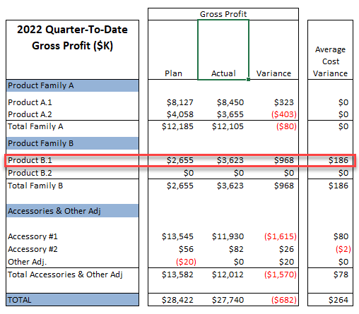

## Table of Contents

## What is gross margin percentage?

Gross margin percentage is a way to measure how much money a business makes after paying for the things it sells. It's calculated by taking the gross profit (which is the money left after subtracting the cost of goods sold from the total revenue) and dividing it by the total revenue. Then, you multiply the result by 100 to get a percentage. This percentage shows how much of each dollar of revenue is profit before other expenses like rent, salaries, and taxes are taken out.

Understanding the gross margin percentage is important for businesses because it helps them see if they are pricing their products correctly and if they are managing their costs well. A higher gross margin percentage means the business is keeping more money from each sale, which is good. If the percentage is low, it might mean the business needs to find ways to reduce costs or increase prices to make more profit. By keeping an eye on this percentage, a business can make better decisions to stay healthy and grow.

## How is gross margin percentage calculated?

Gross margin percentage is figured out by taking the gross profit and dividing it by the total revenue, then multiplying by 100 to turn it into a percentage. Gross profit is what you get when you subtract the cost of the things you sold from the money you made selling them. So, if you made $100 from selling something and it cost you $60 to make or buy it, your gross profit would be $40. Then, you'd divide that $40 by the $100 you made, which gives you 0.4. Multiply 0.4 by 100, and you find out your gross margin percentage is 40%.

This number tells you how much of the money you earn from sales is left after you pay for the stuff you sell. It's important because it shows if you're doing a good job at setting prices and keeping costs down. A higher percentage means you're keeping more money from each sale before other costs like rent or employee salaries come into play. If your gross margin percentage is low, it might be a sign that you need to look at your prices or find cheaper ways to get or make what you're selling.

## What factors can affect the gross margin percentage?

Several things can change a business's gross margin percentage. One big thing is how much it costs to make or buy the things the business sells. If these costs go up because of higher prices for materials or because it's harder to find them, the gross margin percentage can go down unless the business raises its prices too. Another thing that can affect it is how much customers are willing to pay. If a business can't charge more for its products even when costs go up, the gross margin will shrink. Also, if a business starts selling more of a product that doesn't make as much profit, that can lower the overall gross margin percentage.

Another factor is how well the business manages its inventory. If a business has to sell old stock at a discount, that can hurt the gross margin. Also, if the business can't keep up with demand and loses sales, that can affect the gross margin too. Competition plays a role as well. If other businesses start selling similar products for less, a business might have to lower its prices to stay competitive, which can reduce the gross margin percentage. Finally, changes in the economy, like inflation or a recession, can impact both costs and what customers are willing to spend, influencing the gross margin percentage in different ways.

## How does a change in price impact the gross margin percentage?

When a business changes the price of what it sells, it can really affect the gross margin percentage. If the business raises the price and the cost to make or buy the product stays the same, the gross margin percentage goes up. That's because the business is making more money from each sale without spending more to get the product. But if the business lowers the price and the cost stays the same, the gross margin percentage goes down because the business is making less money from each sale.

It's also important to think about how customers will react to a price change. If a business raises prices, customers might buy less, which could hurt the overall gross margin percentage even if the percentage per item goes up. On the other hand, if a business lowers prices, it might sell more products, which could help the gross margin percentage if the increase in sales makes up for the lower price per item. So, changing prices can be tricky, and businesses need to think about both the cost of their products and how customers will respond.

## How does a change in cost impact the gross margin percentage?

When the cost of making or buying the things a business sells goes up, the gross margin percentage goes down if the business keeps selling those things at the same price. That's because the business is spending more money to get the product, but it's not making any more money from selling it. So, the profit from each sale gets smaller, and that's what the gross margin percentage shows. For example, if it used to cost $50 to make a product and now it costs $60, but the business still sells it for $100, the gross profit drops from $50 to $40, and the gross margin percentage goes down too.

On the other hand, if the cost goes down and the business keeps the price the same, the gross margin percentage goes up. This is good because the business is spending less to get the product, but it's still making the same amount of money from selling it. So, the profit from each sale gets bigger, which makes the gross margin percentage higher. For example, if the cost to make a product drops from $50 to $40, but the business still sells it for $100, the gross profit goes up from $50 to $60, and the gross margin percentage increases.

## Can you explain the relationship between price, cost, and gross margin percentage with an example?

Let's say a business sells a toy for $20. It costs them $10 to make each toy. So, when they sell a toy, they make a gross profit of $10 ($20 - $10). To find the gross margin percentage, they divide the gross profit ($10) by the selling price ($20), which gives them 0.5. When they multiply 0.5 by 100, they see that their gross margin percentage is 50%. This means that for every dollar they make from selling the toy, half of it is profit before other expenses.

Now, let's see what happens if the cost to make the toy goes up to $15, but they keep selling it for $20. The gross profit now drops to $5 ($20 - $15). When they calculate the gross margin percentage again, they divide $5 by $20, which gives them 0.25. Multiplying 0.25 by 100, they find their new gross margin percentage is 25%. So, because the cost went up, the business is now making less profit from each toy, and their gross margin percentage has gone down.

If instead, the business decides to raise the price of the toy to $25 while keeping the cost at $10, the gross profit becomes $15 ($25 - $10). Now, when they calculate the gross margin percentage, they divide $15 by $25, which gives them 0.6. Multiplying 0.6 by 100, they see their gross margin percentage is now 60%. By raising the price, the business increased its profit from each toy, and their gross margin percentage went up.

## What are common strategies to manage variance in gross margin percentage?

To manage changes in gross margin percentage, businesses often look at their costs closely. They try to find ways to make or buy their products cheaper. This might mean finding new suppliers, using less expensive materials, or making their production process more efficient. By lowering costs, they can keep their gross margin percentage stable even if they can't raise their prices. Another way is to negotiate better deals with suppliers or to buy in larger quantities to get discounts, which can help keep costs down and gross margin up.

Businesses also pay attention to their prices. They might raise prices if costs go up, but they have to be careful because customers might not want to pay more. Sometimes, they can offer different versions of their products at different price points to appeal to more customers without lowering their gross margin too much. Another strategy is to focus on selling more of the products that have a higher gross margin percentage. This way, even if some products have lower margins, the overall gross margin percentage stays healthy. By keeping an eye on both costs and prices, businesses can manage changes in their gross margin percentage effectively.

## How can businesses use variance analysis to improve their gross margin percentage?

Businesses can use variance analysis to understand why their gross margin percentage changes over time. They do this by comparing what they planned to spend and earn with what actually happened. If they find that their costs are higher than expected, they can look into why this happened. Maybe the price of materials went up, or maybe they're not making things as efficiently as they could. By figuring out the reasons for the cost variances, businesses can take steps to control these costs better, like finding cheaper suppliers or improving their production process. This can help keep their gross margin percentage from going down.

On the other hand, if the variance analysis shows that their revenue is lower than expected, businesses can look at why customers might not be buying as much. Maybe they need to adjust their prices or offer promotions to boost sales. They might also find that some products have a higher gross margin than others, so they can focus on selling more of those to improve the overall gross margin percentage. By using variance analysis to spot and fix problems with costs and revenue, businesses can make smarter decisions to keep their gross margin percentage healthy and stable.

## What are the industry-specific considerations for managing gross margin percentage variance?

Different industries have different things to think about when trying to keep their gross margin percentage steady. For example, in the retail industry, businesses often have to deal with changing prices for the things they sell. If the cost of goods goes up because of things like inflation or problems with getting supplies, stores might have to raise their prices. But they have to be careful because if they raise prices too much, customers might go to other stores. So, retailers need to find a good balance between keeping costs down and setting prices that customers will still pay. They might also try to sell more of their own brand products, which usually have a higher gross margin than name-brand items.

In the manufacturing industry, managing gross margin percentage can be tricky because it involves controlling the cost of making things. Manufacturers have to deal with the cost of raw materials, labor, and running their factories. If the price of materials goes up, it can really hurt their gross margin unless they can find ways to make things cheaper or charge more for their products. They might try to use automation to make their production more efficient, or they might look for new suppliers who can give them better deals. By keeping a close eye on these costs and finding ways to reduce them, manufacturers can help keep their gross margin percentage from dropping too much.

## How does the volume of sales influence the variance in gross margin percentage?

The volume of sales can really affect a business's gross margin percentage. When a business sells more products, it can spread out its fixed costs, like rent or salaries, over more items. This means that each product doesn't have to make as much profit to cover those costs, which can help the gross margin percentage stay healthy or even go up. But if the business has to lower prices to sell more, that can hurt the gross margin percentage. So, businesses need to find a good balance between selling more and keeping prices high enough to make a good profit.

On the other hand, if sales volume goes down, the gross margin percentage can be affected in a different way. With fewer sales, the fixed costs are spread over fewer items, which means each item has to make more profit to cover those costs. This can make the gross margin percentage go down. Also, if the business has to sell products at a discount to move them, that can lower the gross margin percentage even more. So, managing sales volume is important for keeping the gross margin percentage stable and making sure the business stays profitable.

## What advanced statistical methods can be used to predict and analyze gross margin percentage variance?

Businesses can use advanced statistical methods like regression analysis to predict and understand changes in their gross margin percentage. Regression analysis helps them see how different things, like the cost of materials or the price they sell things for, affect their gross margin. By looking at past data, businesses can make a model that shows how these factors change the gross margin percentage. This model can then be used to predict what might happen in the future if costs or prices change. It's like having a crystal ball that helps businesses make better decisions about pricing and costs to keep their gross margin healthy.

Another useful method is time series analysis, which looks at how the gross margin percentage changes over time. This can help businesses spot patterns or trends that might not be obvious just by looking at the numbers. For example, they might see that their gross margin goes down every year during a certain season, which could be because of higher costs or lower sales. By understanding these patterns, businesses can plan ahead and take steps to manage their gross margin better. Using these advanced statistical methods helps businesses not just react to changes in their gross margin percentage, but also predict and control them to stay profitable.

## How can businesses integrate gross margin percentage variance analysis into their overall financial strategy?

Businesses can use gross margin percentage variance analysis to make their financial strategy stronger. They do this by looking at their gross margin percentage and figuring out why it changes. If they see that their costs are going up and hurting their gross margin, they can find ways to spend less money on making or buying their products. They might talk to their suppliers to get better deals or change how they make things to save money. By keeping an eye on these costs and making smart choices, businesses can keep their gross margin percentage from going down too much, which helps them stay profitable.

Another way businesses use gross margin percentage variance analysis in their financial strategy is by watching their sales and prices. If they see that selling more products is making their gross margin go up, they might focus on selling even more. But if they have to lower prices to sell more, they need to be careful because that can hurt their gross margin. By understanding how sales and prices affect their gross margin, businesses can set prices that keep customers happy while still making a good profit. This helps them plan better and make sure they have enough money to grow and succeed.

## What is Gross Margin in Trading and How is it Understood?

Gross margin is a critical metric for evaluating the financial health of a trading operation, especially within algorithmic trading environments. It is the percentage of revenue that remains after subtracting the cost of goods sold (COGS). Understanding gross margin allows traders and trading algorithms to assess the efficiency of cost management and is key to optimizing profitability.

The gross margin is calculated using the formula:

$$
\text{Gross Margin (\%)} = \left(\frac{\text{Revenue} - \text{COGS}}{\text{Revenue}}\right) \times 100
$$

Where:
- **Revenue** is the total income generated from trading activities.
- **COGS** represents the direct costs associated with the trading process, including transaction fees and any costs directly incurred in executing trades.

In [algorithmic trading](/wiki/algorithmic-trading), evaluating gross margin helps assess how efficiently a trading strategy converts its trading capital into profits after accounting for costs. Algorithm-driven strategies, harnessing immense computational power, can perform this analysis in real-time, adjusting to fluctuations in the market to maintain or improve profit margins.

For instance, if an algorithm identifies that a particular strategy is generating low gross margins due to high transaction costs, it can be programmed to reduce trading frequency or seek alternative strategies with better cost-efficiency. This real-time analysis and strategy adjustment aim to maximize the profitability metrics central to algorithmic success.

Traders can employ these insights to optimize trading algorithms further. By reducing COGS through lower transaction fees or improved execution strategies, higher gross margins can be achieved, thus enhancing overall profitability. Moreover, sophisticated algorithmic models may include [machine learning](/wiki/machine-learning) components that continuously refine cost management strategies, ensuring the trading operation remains both competitive and financially viable.

Understanding and optimizing gross margin is therefore essential in algorithmic trading, providing traders with the strategic insight needed to craft profitable and efficient trading systems.

## What are the key components of margin analysis in relation to price and cost variance?

Variance analysis is essential for understanding and managing the financial dynamics within trading operations. It encompasses the examination of deviations between planned and actual economic outcomes, providing an analytical framework to identify areas of efficiency and inefficiency. In the context of gross margin analysis, two primary components emerge: price variance and cost variance.

### Price Variance

Price variance represents the difference between the expected and actual selling prices of securities or commodities. It can be defined mathematically as:

$$
\text{Price Variance} = (\text{Actual Price} - \text{Budgeted Price}) \times \text{Actual Quantity}
$$

This metric is vital for traders as it reveals whether the market conditions have led to higher or lower prices than anticipated. In algorithmic trading, understanding price variance allows traders to adapt their strategies dynamically. For instance, if the actual market price is consistently higher than expected, it may indicate an opportunity to increase the selling pressure, thus capturing the additional margin.

### Cost Variance

Cost variance, on the other hand, highlights disparities in cost projections versus actual costs. It is calculated as follows:

$$
\text{Cost Variance} = (\text{Budgeted Cost} - \text{Actual Cost}) \times \text{Actual Quantity}
$$

This measure helps traders pinpoint inefficiencies in cost management related to trading operations. Understanding cost variances is crucial for maintaining robust trading strategies, as it enables the identification of unexpected expenses that could erode gross margins. By addressing these cost discrepancies, traders can optimize their expenditure and enhance overall profitability.

### Integrative Analysis

Both price and cost variance analyses are indispensable for dissecting gross margin fluctuations. They provide a dual perspective on the impacts of market behavior and operational effectiveness. In a volatile market environment, these analyses serve as tools for traders to realign their strategies with prevailing market conditions.

The application of variance analysis in trading relies on utilizing these insights to make informed decisions. By continuously monitoring and evaluating both price and cost variances, traders can fine-tune their strategies, ensuring they remain competitive and aligned with the broader financial landscape.

### Python Example for Calculating Variance

A practical approach to calculating variance can be seen through a simplified Python example:

```python
def calculate_variance(budgeted, actual, quantity):
    variance = (actual - budgeted) * quantity
    return variance

# Example usage
budgeted_price = 100
actual_price = 105
actual_quantity = 1000

price_variance = calculate_variance(budgeted_price, actual_price, actual_quantity)
print(f"Price Variance: {price_variance}")

budgeted_cost = 95
actual_cost = 98

cost_variance = calculate_variance(budgeted_cost, actual_cost, actual_quantity)
print(f"Cost Variance: {cost_variance}")
```

In conclusion, by leveraging price and cost variance analysis, traders can achieve a deeper understanding of the factors impacting their gross margins. This comprehensive approach allows for the development of flexible trading strategies that can navigate and capitalize on market fluctuations.

## How can Price Variance Analysis be implemented in Trading Algorithms?

Price variance analysis is an essential component for understanding how deviations in pricing affect overall trading outcomes. This analysis helps traders develop strategies that integrate statistical models to forecast price movements and adapt algorithmic trading systems accordingly, crucial for navigating volatile market environments.

Price variance is represented by the formula:

$$
\text{Price Variance} = (\text{Actual Price} - \text{Expected Price}) \times \text{Quantity Sold}
$$

By employing this metric, traders can pinpoint areas where the actual selling price diverges from the expected price, allowing them to understand the impact on revenue and profitability.

Traders can leverage statistical models such as Autoregressive Integrated Moving Average (ARIMA), Generalized Autoregressive Conditional Heteroskedasticity (GARCH), and machine learning techniques like regression analysis or neural networks to forecast future price movements. These models use historical price data to identify patterns and trends that inform more accurate predictions. For instance, an ARIMA model can be employed in Python as follows:

```python
import pandas as pd
from statsmodels.tsa.arima.model import ARIMA

# Load your price data
data = pd.read_csv('price_data.csv')

# Fit the ARIMA model
model = ARIMA(data['price'], order=(5,1,0))
model_fit = model.fit()

# Make price predictions
forecast = model_fit.forecast(steps=5)
print(forecast)
```

Incorporating these forecasts into algorithmic trading strategies allows for more adaptive trading systems that respond effectively to real-time market shifts. Algorithms can dynamically adjust buy and sell decisions based on predicted price variances, optimizing profitability. This approach is vital for ensuring that trading systems are not only reactive but also proactive in capitalizing on market opportunities.

Continuous monitoring of price variance enables real-time data feedback into trading algorithms. By setting up automated systems to track these metrics, traders can swiftly react to price changes, refining their algorithms to better align with current market conditions. This adaptability and precision directly translate to enhanced trading performance and profitability. 

The iterative process of refining algorithms through price variance analysis also creates a feedback loop where trading strategies are constantly improved, aligning closely with the ever-changing market dynamics. Thus, implementing price variance analysis not only aids in maximizing profits but also ensures the development of robust, flexible trading algorithms that can withstand and thrive in volatile financial markets.

## References & Further Reading

[1]: Bergstra, J., Bardenet, R., Bengio, Y., & Kégl, B. (2011). ["Algorithms for Hyper-Parameter Optimization."](https://dl.acm.org/doi/10.5555/2986459.2986743) Advances in Neural Information Processing Systems 24.

[2]: ["Advances in Financial Machine Learning"](https://www.amazon.com/Advances-Financial-Machine-Learning-Marcos/dp/1119482089) by Marcos Lopez de Prado

[3]: ["Evidence-Based Technical Analysis: Applying the Scientific Method and Statistical Inference to Trading Signals"](https://www.amazon.com/Evidence-Based-Technical-Analysis-Scientific-Statistical/dp/0470008741) by David Aronson

[4]: ["Machine Learning for Algorithmic Trading"](https://github.com/stefan-jansen/machine-learning-for-trading) by Stefan Jansen

[5]: ["Quantitative Trading: How to Build Your Own Algorithmic Trading Business"](https://www.amazon.com/Quantitative-Trading-Build-Algorithmic-Business/dp/1119800064) by Ernest P. Chan