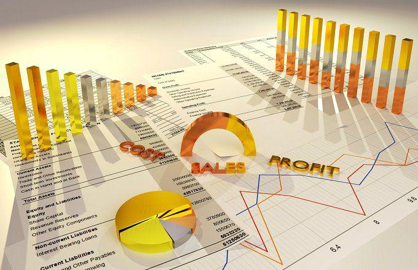

In the ever-evolving landscape of financial trading, the importance of understanding gross margin and variance analysis cannot be overstated. These concepts are fundamental to assessing and improving the financial performance of trading operations. Gross margin, a critical measure, helps traders evaluate the percentage of revenue remaining after accounting for the cost of goods sold (COGS). This metric is foundational in determining the efficiency of cost management and overall profitability within trading strategies.

Variance analysis, on the other hand, involves an in-depth examination of deviations between planned and actual financial outcomes. This includes price variance—the difference between expected and actual selling prices—and cost variance, which highlights discrepancies in cost projections. Analyzing these variances is vital for understanding fluctuations in gross margin and refining trading strategies to align with market conditions.



In the arena of algorithmic trading, where strategies are often data-driven and automated, the intersection of gross margin and variance analysis plays a crucial role. Understanding how these financial concepts impact algorithmic trading strategies can lead to improved trading efficiency and profitability. By incorporating insights from variance analysis, traders can enhance their decision-making processes, aligning their strategies with statistical insights to manage risks effectively.

Ultimately, mastering the intricacies of gross margin and variance analysis equips traders with the tools to develop adaptive and profitable trading algorithms. This comprehensive approach to financial analysis is essential for maintaining a competitive edge in the rapidly changing financial environment. As traders continue to explore innovative ways to integrate financial metrics into their algorithms, they are better positioned to optimize their trading strategies for superior performance and profitability.

## Table of Contents

## Understanding Gross Margin in Trading

Gross margin is a critical metric for evaluating the financial health of a trading operation, especially within algorithmic trading environments. It is the percentage of revenue that remains after subtracting the cost of goods sold (COGS). Understanding gross margin allows traders and trading algorithms to assess the efficiency of cost management and is key to optimizing profitability.

The gross margin is calculated using the formula:

$$
\text{Gross Margin (\%)} = \left(\frac{\text{Revenue} - \text{COGS}}{\text{Revenue}}\right) \times 100
$$

Where:
- **Revenue** is the total income generated from trading activities.
- **COGS** represents the direct costs associated with the trading process, including transaction fees and any costs directly incurred in executing trades.

In [algorithmic trading](/wiki/algorithmic-trading), evaluating gross margin helps assess how efficiently a trading strategy converts its trading capital into profits after accounting for costs. Algorithm-driven strategies, harnessing immense computational power, can perform this analysis in real-time, adjusting to fluctuations in the market to maintain or improve profit margins.

For instance, if an algorithm identifies that a particular strategy is generating low gross margins due to high transaction costs, it can be programmed to reduce trading frequency or seek alternative strategies with better cost-efficiency. This real-time analysis and strategy adjustment aim to maximize the profitability metrics central to algorithmic success.

Traders can employ these insights to optimize trading algorithms further. By reducing COGS through lower transaction fees or improved execution strategies, higher gross margins can be achieved, thus enhancing overall profitability. Moreover, sophisticated algorithmic models may include [machine learning](/wiki/machine-learning) components that continuously refine cost management strategies, ensuring the trading operation remains both competitive and financially viable.

Understanding and optimizing gross margin is therefore essential in algorithmic trading, providing traders with the strategic insight needed to craft profitable and efficient trading systems.

## Price and Cost Variance: Key Components in Margin Analysis

Variance analysis is essential for understanding and managing the financial dynamics within trading operations. It encompasses the examination of deviations between planned and actual economic outcomes, providing an analytical framework to identify areas of efficiency and inefficiency. In the context of gross margin analysis, two primary components emerge: price variance and cost variance.

### Price Variance

Price variance represents the difference between the expected and actual selling prices of securities or commodities. It can be defined mathematically as:

$$
\text{Price Variance} = (\text{Actual Price} - \text{Budgeted Price}) \times \text{Actual Quantity}
$$

This metric is vital for traders as it reveals whether the market conditions have led to higher or lower prices than anticipated. In algorithmic trading, understanding price variance allows traders to adapt their strategies dynamically. For instance, if the actual market price is consistently higher than expected, it may indicate an opportunity to increase the selling pressure, thus capturing the additional margin.

### Cost Variance

Cost variance, on the other hand, highlights disparities in cost projections versus actual costs. It is calculated as follows:

$$
\text{Cost Variance} = (\text{Budgeted Cost} - \text{Actual Cost}) \times \text{Actual Quantity}
$$

This measure helps traders pinpoint inefficiencies in cost management related to trading operations. Understanding cost variances is crucial for maintaining robust trading strategies, as it enables the identification of unexpected expenses that could erode gross margins. By addressing these cost discrepancies, traders can optimize their expenditure and enhance overall profitability.

### Integrative Analysis

Both price and cost variance analyses are indispensable for dissecting gross margin fluctuations. They provide a dual perspective on the impacts of market behavior and operational effectiveness. In a volatile market environment, these analyses serve as tools for traders to realign their strategies with prevailing market conditions.

The application of variance analysis in trading relies on utilizing these insights to make informed decisions. By continuously monitoring and evaluating both price and cost variances, traders can fine-tune their strategies, ensuring they remain competitive and aligned with the broader financial landscape.

### Python Example for Calculating Variance

A practical approach to calculating variance can be seen through a simplified Python example:

```python
def calculate_variance(budgeted, actual, quantity):
    variance = (actual - budgeted) * quantity
    return variance

# Example usage
budgeted_price = 100
actual_price = 105
actual_quantity = 1000

price_variance = calculate_variance(budgeted_price, actual_price, actual_quantity)
print(f"Price Variance: {price_variance}")

budgeted_cost = 95
actual_cost = 98

cost_variance = calculate_variance(budgeted_cost, actual_cost, actual_quantity)
print(f"Cost Variance: {cost_variance}")
```

In conclusion, by leveraging price and cost variance analysis, traders can achieve a deeper understanding of the factors impacting their gross margins. This comprehensive approach allows for the development of flexible trading strategies that can navigate and capitalize on market fluctuations.

## The Role of Variance Analysis in Algorithmic Trading

Algorithmic trading, characterized by automated buying and selling of financial instruments, leverages the power of data to make decisions. Within this context, variance analysis stands as a fundamental tool. This analysis involves examining the discrepancies between expected and actual financial metrics, providing traders with insights essential for improving decision-making and strategy refinement.

Variance metrics, such as price and cost variances, can be integrated into trading algorithms to anticipate market behavior more accurately. The process begins with collecting large datasets covering both current and historical market conditions. Traders can use these datasets to calculate statistical measures such as the mean, variance, and standard deviation. These metrics illuminate patterns and anomalies in price movements or transaction costs, informing more precise strategy adjustments.

Understanding variance also aids in managing risks. In financial markets, risk is often quantified via metrics such as Value at Risk (VaR) or Conditional Value at Risk (CVaR). These calculations rely on the variance of asset returns to estimate the potential for losses within a specified confidence interval over a particular period. By incorporating variance analysis into these calculations, traders can better assess the probability and potential extent of unfavorable market shifts.

Here's an example of how variance might be utilized in a simple Python trading algorithm:

```python
import numpy as np

def calculate_variance(prices):
    return np.var(prices)

def simple_trading_strategy(prices):
    variance = calculate_variance(prices)
    # Example threshold for variance-based trading decision
    threshold = 0.05 

    if variance < threshold:
        return "Buy"
    else:
        return "Sell"

# Example price data
prices = [100, 102, 101, 105, 107, 110]
trade_decision = simple_trading_strategy(prices)
print(f"Trade Decision: {trade_decision}")
```

In this scenario, the variance of price data guides buying or selling decisions, demonstrating a simplified application of variance analysis.

Moreover, incorporating variance metrics enables algorithm designers to enhance both accuracy and performance. By continually refining how variance is calculated and applied, designers ensure the algorithm remains responsive to evolving market dynamics. This refinement involves [backtesting](/wiki/backtesting) algorithms against historical data to evaluate how variance metrics influence trading outcomes and adjusting parameters accordingly to optimize performance.

Ultimately, variance analysis contributes significantly to the robustness of algorithmic trading strategies, supporting traders in navigating complex financial landscapes with improved precision and adaptability.

## Implementing Price Variance Analysis in Trading Algorithms

Price variance analysis is an essential component for understanding how deviations in pricing affect overall trading outcomes. This analysis helps traders develop strategies that integrate statistical models to forecast price movements and adapt algorithmic trading systems accordingly, crucial for navigating volatile market environments.

Price variance is represented by the formula:

$$
\text{Price Variance} = (\text{Actual Price} - \text{Expected Price}) \times \text{Quantity Sold}
$$

By employing this metric, traders can pinpoint areas where the actual selling price diverges from the expected price, allowing them to understand the impact on revenue and profitability.

Traders can leverage statistical models such as Autoregressive Integrated Moving Average (ARIMA), Generalized Autoregressive Conditional Heteroskedasticity (GARCH), and machine learning techniques like regression analysis or neural networks to forecast future price movements. These models use historical price data to identify patterns and trends that inform more accurate predictions. For instance, an ARIMA model can be employed in Python as follows:

```python
import pandas as pd
from statsmodels.tsa.arima.model import ARIMA

# Load your price data
data = pd.read_csv('price_data.csv')

# Fit the ARIMA model
model = ARIMA(data['price'], order=(5,1,0))
model_fit = model.fit()

# Make price predictions
forecast = model_fit.forecast(steps=5)
print(forecast)
```

Incorporating these forecasts into algorithmic trading strategies allows for more adaptive trading systems that respond effectively to real-time market shifts. Algorithms can dynamically adjust buy and sell decisions based on predicted price variances, optimizing profitability. This approach is vital for ensuring that trading systems are not only reactive but also proactive in capitalizing on market opportunities.

Continuous monitoring of price variance enables real-time data feedback into trading algorithms. By setting up automated systems to track these metrics, traders can swiftly react to price changes, refining their algorithms to better align with current market conditions. This adaptability and precision directly translate to enhanced trading performance and profitability. 

The iterative process of refining algorithms through price variance analysis also creates a feedback loop where trading strategies are constantly improved, aligning closely with the ever-changing market dynamics. Thus, implementing price variance analysis not only aids in maximizing profits but also ensures the development of robust, flexible trading algorithms that can withstand and thrive in volatile financial markets.

## Future Trends and Technologies in Variance Analysis

The future of variance and cost analysis in trading is increasingly shaped by the integration of advanced technologies such as [artificial intelligence](/wiki/ai-artificial-intelligence) (AI), machine learning (ML), and big data analytics. These technologies are revolutionizing how traders extract insights from complex datasets and refine their trading strategies with greater precision and speed.

AI and ML technologies enhance variance analysis by allowing for real-time data processing and predictive analytics. Machine learning algorithms can be trained to recognize patterns in historical trading data, enabling the anticipation of price movements and variance outcomes. For instance, unsupervised learning can segment data into clusters to identify distinct market phases, while supervised learning methods like regression analysis can predict future price variances based on historical behavior.

Big data analytics play a pivotal role by providing the computational power and scalability needed to analyze vast amounts of data. This capability ensures that trading strategies are based on comprehensive and up-to-date information, which is crucial for maintaining a competitive edge in fast-moving markets. The integration of big data with AI and ML can automate the process of variance analysis, reducing human error and increasing the reliability of trading signals.

Emerging tools and methodologies are set to further reshape variance analysis. Deep learning techniques, such as convolutional neural networks (CNNs) and recurrent neural networks (RNNs), are being adapted to financial markets to model complex temporal dependencies and nonlinear relationships within trading data. These models offer potential for enhanced forecasting of price variances.

Moreover, natural language processing (NLP) is increasingly utilized to analyze unstructured data sources, such as news articles and social media sentiment, which can influence market conditions and contribute to variance. Python libraries like TensorFlow and PyTorch facilitate the development and deployment of these advanced AI models, streamlining the integration of cutting-edge technology into trading algorithms.

Traders who embrace these innovations stand to gain significant advantages. By harnessing AI, ML, and big data, they can develop more responsive and adaptable trading strategies, optimize risk management, and ultimately improve profitability. As these technologies continue to evolve, staying updated and adaptive becomes essential for success in dynamic financial markets. Embracing these tools will not only enhance trading efficiency but also ensure sustained competitiveness in the ever-evolving landscape of algorithmic trading.

## Conclusion

Effective variance analysis is a cornerstone of successful algorithmic trading strategies. By understanding the intricacies of gross margin, price, and cost variance, traders are empowered to make informed decisions that enhance trading outcomes. This analysis provides essential insights into optimizing trading performance, helping to identify where adjustments are needed to improve profitability and minimize risks.

Gross margin analysis serves as a fundamental tool in evaluating the efficiency of algorithmic trading operations. It reveals insights into the portion of revenue that surpasses the cost of goods sold (COGS), spotlighting the economic efficiency and pricing strategy of automated trading systems. Mastering gross margin allows traders to refine their strategy for cost management and improve overall profitability.

Price and cost variance analysis are crucial complements to gross margin metrics. Price variance sheds light on the differences between expected and actual selling prices, while cost variance examines deviations in anticipated and actual costs. These factors are essential for understanding fluctuations in gross margin and allow traders to adapt their strategies based on actual market conditions and operational performance.

Incorporating variance analysis in trading algorithms stems from its capability to enhance decision-making processes. By employing statistical models and data analytics, traders can anticipate market behavior and adapt their strategies dynamically. This approach enhances risk management capabilities and optimizes trades to align with evolving market trends.

Looking forward, the integration of advanced technologies such as artificial intelligence, machine learning, and big data will further enhance the precision and effectiveness of variance analysis in trading. These technologies offer innovative methods to refine strategies, resulting in more adaptive and profitable trading algorithms.

In conclusion, by mastering the components of variance analysis—gross margin, price, and cost variance—traders can develop more effective trading algorithms. This comprehensive understanding enables them to devise strategies that are not only robust and profitable but also adaptable to the rapidly changing financial landscape. Staying updated with emerging technologies and methodologies ensures traders maintain a competitive edge in the dynamic world of algorithmic trading.

## References & Further Reading

[1]: Bergstra, J., Bardenet, R., Bengio, Y., & Kégl, B. (2011). ["Algorithms for Hyper-Parameter Optimization."](https://dl.acm.org/doi/10.5555/2986459.2986743) Advances in Neural Information Processing Systems 24.

[2]: ["Advances in Financial Machine Learning"](https://www.amazon.com/Advances-Financial-Machine-Learning-Marcos/dp/1119482089) by Marcos Lopez de Prado

[3]: ["Evidence-Based Technical Analysis: Applying the Scientific Method and Statistical Inference to Trading Signals"](https://www.amazon.com/Evidence-Based-Technical-Analysis-Scientific-Statistical/dp/0470008741) by David Aronson

[4]: ["Machine Learning for Algorithmic Trading"](https://github.com/stefan-jansen/machine-learning-for-trading) by Stefan Jansen

[5]: ["Quantitative Trading: How to Build Your Own Algorithmic Trading Business"](https://www.amazon.com/Quantitative-Trading-Build-Algorithmic-Business/dp/1119800064) by Ernest P. Chan