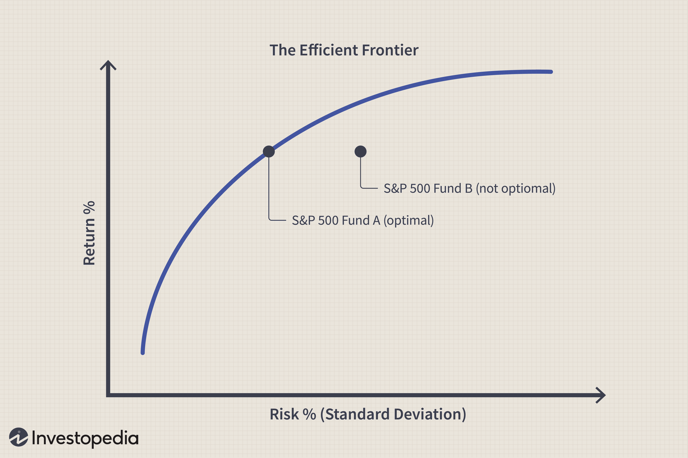

In the modern financial landscape, stock investing and algorithmic trading have become increasingly prevalent strategies for both institutional and individual investors. The pursuit of optimizing returns while mitigating risks has led to the adoption of complex investment strategies that require a thorough understanding of various risk factors. As investors aim to navigate these complexities, recognizing the importance of concepts such as investment risk, variance, and algorithmic trading becomes essential in constructing effective investment portfolios.

Investment risk encompasses the uncertainties associated with the potential outcomes of an investment, reflecting both the possibility of gains and losses. In evaluating these risks, variance plays a critical role by quantifying the dispersion of returns—a key factor in assessing the volatility of an investment. High variance indicates a wider range of potential returns, aligning with aggressive investment strategies that aspire for higher rewards, albeit with increased risk. Conversely, a low variance signifies more stable returns, appealing to conservative investors who prioritize steady income over potential higher gains.



Algorithmic trading enhances the investment process by using computer systems to execute trades based on predetermined criteria, eliminating human error and inefficiencies. These systems integrate advanced quantitative methods to analyze market data, optimize trading decisions, and manage risks effectively. One notable technique in risk management is the use of Value at Risk (VaR), which estimates the potential loss in investment value over a specific period, offering insights into risk exposure and helping investors maintain controlled and balanced portfolios.

This article intends to provide a comprehensive overview of these core concepts—investment risk, variance, and the role of algorithmic trading—equipped with quantitative metrics and illustrative examples. By making these complex ideas accessible to both novice and seasoned investors, we aim to empower them to balance risk and return efficiently, ultimately achieving their financial goals.

## Table of Contents

## Understanding Investment Risk

Investment risk refers to the potential for an investment’s return to differ from the expected outcome, leading to either a gain or a loss. Understanding the nature of these risks is crucial for investors aiming to develop successful investment strategies.

Risks can be broadly categorized into systematic and unsystematic risks. Systematic risks, also known as market risks, affect the entire market and are influenced by macroeconomic factors such as changes in interest rates, inflation, recessions, or political instability. As these risks impact all assets to varying degrees, they cannot be mitigated through diversification.

Conversely, unsystematic risks are specific to an individual stock or sector. These can arise from company-specific events like management changes, product recalls, or sector-specific regulations. Unlike systematic risks, unsystematic risks can be reduced through diversification, wherein an investor includes a variety of assets in their portfolio to mitigate the effect of a negative event targeting a single entity or sector.

Investors' risk tolerance varies and is influenced by several factors such as age, income, investment goals, and time horizon. Younger investors may have a higher risk tolerance, as they have more time to recover from potential losses, while older investors nearing retirement might prioritize preserving capital. Income levels can also dictate risk tolerance, where individuals with higher disposable income might be more willing to take on riskier investments.

Accurately assessing risk is essential for informed investment decisions. It assists investors in determining which stocks to include in their portfolios and how to allocate assets for optimal returns. By understanding both systematic and unsystematic risks, and considering personal risk tolerance, investors can tailor their strategies to meet their financial goals while managing potential downsides effectively.

## The Role of Variance in Stock Investing

Variance serves as a key metric in stock investing by quantifying the risk associated with the [dispersion](/wiki/dispersion-trading) of investment returns. It provides insights into the [volatility](/wiki/volatility-trading-strategies) of a portfolio, allowing investors to gauge the potential range within which the actual returns may fluctuate around the expected return.

Variance is mathematically defined as the average of the squared deviations of each data point from the mean. The formula is represented as:

$$
\sigma^2 = \frac{\sum (x_i - \mu)^2}{N}
$$

where $\sigma^2$ denotes variance, $x_i$ represents each data point, $\mu$ is the mean of the data points, and $N$ is the number of data points. A higher variance indicates a larger spread of returns, suggesting greater risk but also the potential for higher returns, often sought by aggressive investors. These investors might accept higher volatility as part of a strategy aiming for substantial gains over the long term.

Conversely, low variance indicates that the returns are more clustered around the mean, signifying stability. This characteristic is desirable for conservative investors who prioritize steady income with less exposure to extensive market fluctuations. For such investors, maintaining minimal volatility helps protect their capital while generating consistent, albeit modest, returns.

Investors employ variance to better understand the volatility inherent in their portfolios and make more informed, calculated investment decisions. By assessing the variance of individual stocks or entire portfolios, investors can align their investment choices with their risk tolerance and financial goals. For example, a high variance stock could be balanced with other lower variance investments to achieve a more stable overall portfolio. Through this strategic allocation, the potential rewards and risks are managed systematically, contributing to a well-rounded investment strategy.

## Algorithmic Trading and Risk Management

Algorithmic trading uses sophisticated computer systems and mathematical models to execute trades with precision and speed. These systems operate based on pre-set criteria, eliminating the emotional factors that often affect human traders. By efficiently processing large volumes of market data, [algorithmic trading](/wiki/algorithmic-trading) systems can identify and capitalize on short-lived market opportunities, providing an edge in competitive trading environments.

A critical aspect of algorithmic trading is risk management. One prevalent technique is Value at Risk (VaR), which quantifies the potential loss in the value of a portfolio within a given time frame, under normal market conditions, at a specific confidence level. VaR is calculated using historical market data and statistical methods. The formula for VaR can be represented as follows:

$$
VaR = \text{{Initial Investment}} \times z \times \sigma \times \sqrt{t}
$$

where:
- $z$ is the z-score associated with the desired confidence level,
- $\sigma$ is the standard deviation of portfolio returns,
- $t$ is the time horizon.

By employing VaR, traders can assess the risk of loss and adjust their strategies accordingly. For example, if the VaR of a portfolio is calculated to be $10,000 at a 95% confidence level, it implies that there is only a 5% chance that the portfolio will incur losses exceeding $10,000 in the specified period.

Besides VaR, algorithmic trading systems may integrate other risk management techniques, such as stop-loss orders, diversification, and hedging strategies, to mitigate potential financial downsides further. Stop-loss orders enable automatic selling when a stock's price falls below a predetermined level, preventing substantial losses. Diversification spreads investment across various assets to reduce risk concentration. Hedging involves making trades that offset existing positions, thus minimizing risk exposure.

Investors can achieve enhanced portfolio performance and stability by uniting algorithmic trading with comprehensive risk management practices. The capability of algorithms to execute trades rapidly, without the emotional biases of human traders, and their ability to systematically manage risk, positions them as valuable tools in modern investment strategies. As technology continues to evolve, algorithmic trading systems will likely advance, offering even more sophisticated mechanisms for profit optimization and risk management.

## Calculating and Interpreting Variance

To calculate variance, one begins by determining the mean (average) of the data set. Once the mean is established, each individual data point ($x_i$) is subtracted from this mean ($\mu$), and the result is squared to ensure that all deviations are positive. These squared deviations are then averaged by dividing the sum by the number of data points (N). This computation is expressed by the formula:

$$
\sigma^2 = \frac{\sum (x_i - \mu)^2}{N}
$$

Variance serves as a crucial measure of investment risk, allowing investors to assess the degree of volatility associated with a particular asset or portfolio. A higher variance indicates greater dispersion in the data points, suggesting that the investment returns are more spread out over a range. This spread implies more fluctuation and a higher level of risk, which may appeal to investors willing to take on greater risk for the possibility of higher returns.

On the other hand, a lower variance indicates returns that are closer to the mean, symbolizing stability and lower investment risk. This is often preferred by conservative investors looking for predictable and steady income streams.

Investors frequently utilize variance calculations to comprehend the volatility present within their portfolios. For example, calculating the variance of a tech stock's historical returns compared to that of a utility stock can reveal how much more volatile the tech stock might be. The tech sector typically exhibits higher variance due to potentially larger fluctuations in earnings and market perception, capturing a different risk profile compared to the more stable utility sector.

Here is a simple Python code snippet to calculate variance:

```python
def calculate_variance(data):
    # Calculate the mean
    mean = sum(data) / len(data)
    # Square the difference of each element from the mean
    squared_diffs = [(x - mean) ** 2 for x in data]
    # Calculate variance as average of squared differences
    variance = sum(squared_diffs) / len(data)
    return variance

# Example usage
data_points = [10, 20, 12, 23, 18]
variance = calculate_variance(data_points)
print(f"The variance of the data set is: {variance}")
```

This formula and approach equip investors with a quantitative metric to make more informed decisions, helping them tailor their strategies to align with their risk appetite and financial objectives.

## Case Studies and Real-World Applications

Analyzing real-world examples can provide clarity on how variance and algorithmic trading function in practice. One of the key differences in risk profiles can be observed when comparing the variance in the returns of tech stocks versus utility stocks. Technology companies are often subject to high volatility due to rapid innovation cycles, competitive pressures, and regulatory challenges. This leads to a higher variance in their stock returns, indicating both greater risk and potentially higher reward. For example, tech stock giants like Apple and Amazon have historically shown significant price fluctuations owing to market sentiment and technological advancements. 

In contrast, utility stocks are generally regarded as safer investments. Companies in the utility sector provide essential services such as electricity, water, and natural gas, leading to more predictable and stable revenue streams. This stability is reflected in a lower variance of returns, making utility stocks appealing to conservative investors who prioritize steady income over high returns.

Algorithmic trading, commonly used by institutional investors, plays a significant role in managing investment risk. A case study of an algorithmic trading strategy employing Value at Risk (VaR) can illustrate this application. VaR is a statistical technique used to measure the potential loss in value of a portfolio over a defined period for a given confidence interval. For example, a VaR calculation might predict that there is a 5% chance that a portfolio could lose more than $1 million over a month. 

Algorithmic trading systems can utilize such risk management metrics to automate trading decisions and minimize potential losses. By continuously analyzing market data and adjusting positions in real-time, these algorithms can optimize portfolio performance even during volatile market conditions. The integration of VaR into algorithmic strategies allows traders to adjust the level of risk exposure dynamically, ensuring that the portfolio aligns with predefined risk tolerance levels.

These practical applications demonstrate how investors can tailor their investment strategies according to their risk preferences and financial objectives. By understanding the variance of different asset classes and utilizing advanced trading techniques like algorithmic trading, investors can enhance their ability to manage risks effectively, thus aligning their portfolios with both their short-term goals and long-term financial strategy.

## Conclusion

Stock investing involves navigating through various risks, with variance playing a key role in assessing and managing these risks. Variance helps investors understand the level of volatility and uncertainty associated with different investments, allowing them to tailor their strategies to meet their risk preferences. By quantifying the extent to which returns can deviate from expectations, variance provides a vital tool for estimating potential risks and rewards in stock portfolios.

Algorithmic trading offers sophisticated tools that automate buying and selling decisions. These systems enhance efficiency by executing trades at high speeds and across global markets, reducing human error, and optimizing order placement. Algorithmic trading also aids in managing risk through the use of quantitative measures such as Value at Risk (VaR), which estimates potential loss and allocates capital more effectively. By leveraging these high-tech systems, investors can better manage portfolio performance while adapting to market changes swiftly.

Understanding and calculating variance can empower investors to make informed decisions. Variance calculations allow investors to evaluate the volatility of an individual stock or portfolio, helping them choose investments that align with their goals and risk appetite. For instance, a high variance may attract aggressive investors seeking high returns, while a low-variance portfolio might appeal to conservative investors prioritizing stability and consistent income streams.

Continuous learning and adaptation to evolving market technologies and strategies are crucial for maintaining a competitive edge in investment risk management. As new financial instruments, trading algorithms, and data analysis techniques emerge, investors are compelled to keep abreast of these advancements to refine their investment strategies continually. This ongoing development equips investors with the knowledge to use advanced tools and strategies to achieve their financial objectives while effectively managing investment risks.

## References & Further Reading

[1]: Marcos Lopez de Prado, "Advances in Financial Machine Learning," Wiley, 2018. [Link](https://www.amazon.com/Advances-Financial-Machine-Learning-Marcos/dp/1119482089)

[2]: David Aronson, "Evidence-Based Technical Analysis: Applying the Scientific Method and Statistical Inference to Trading Signals," Wiley, 2006. [Link](https://onlinelibrary.wiley.com/doi/book/10.1002/9781118268315)

[3]: Stefan Jansen, "Machine Learning for Algorithmic Trading," Packt Publishing, 2018. [Link](https://github.com/stefan-jansen/machine-learning-for-trading)

[4]: Ernest P. Chan, "Quantitative Trading: How to Build Your Own Algorithmic Trading Business," Wiley, 2009. [Link](https://books.google.com/books/about/Quantitative_Trading.html?id=j70yEAAAQBAJ)

[5]: Michael C. Thomsett, "Options Trading for the Conservative Investor: Increasing Profits Without Increasing Your Risk," FT Press, 2009. [Link](https://www.amazon.com/Options-Trading-Conservative-Investor-Increasing/dp/0137042000)

[6]: Hull, John C., "Options, Futures, and Other Derivatives," Prentice Hall, 9th edition, 2014. [Link](https://www.amazon.com/Options-Futures-Other-Derivatives-9th/dp/0133456315)