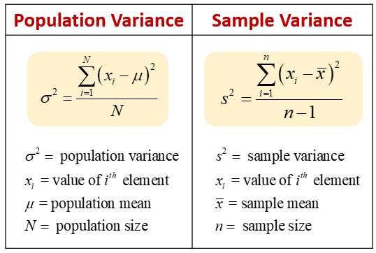

## Table of Contents

## What is variance in statistics?

Variance in statistics is a measure of how spread out a set of numbers is. Imagine you have a bunch of numbers, and you want to know if they are close together or far apart. Variance helps you figure that out. It calculates the average of the squared differences from the mean (average) of the numbers. If the numbers are all close to the mean, the variance will be small. If the numbers are spread out a lot, the variance will be large.

To calculate variance, you first find the mean of your numbers. Then, for each number, you subtract the mean and square the result. After that, you find the average of all those squared differences. This average is the variance. It's a bit tricky because it involves squaring the differences, but it's important because it gives us a clear picture of how much the numbers vary from the average.

## Why is variance important in data analysis?

Variance is really important in data analysis because it helps us understand how spread out our data is. When we look at a set of numbers, we want to know if they are all bunched up close together or if they are spread out all over the place. Variance gives us a number that tells us exactly that. If the variance is small, it means our numbers are pretty close to the average. If the variance is big, it means our numbers are all over the place, far from the average. This information is crucial because it helps us make better decisions based on our data.

For example, if you're a teacher looking at test scores, a small variance means most students scored around the same, while a big variance means some students did really well and others did not so well. This can help you figure out if you need to change how you teach or if the test was fair. In business, if you're looking at sales data, a high variance might show that sales are unpredictable, which could mean you need to look into why sales are so up and down. Understanding variance helps us see the bigger picture and make smarter choices.

## How does variance differ from standard deviation?

Variance and standard deviation are both ways to measure how spread out numbers are in a set of data. They are closely related, but they give us the information in different ways. Variance is the average of the squared differences from the mean. It's like taking each number, seeing how far it is from the average, squaring that distance, and then finding the average of all those squared distances. This gives us a number that shows how spread out the data is, but it's in squared units, which can be a bit hard to understand.

Standard deviation, on the other hand, is the square root of the variance. It brings the measure back to the original units of the data, which makes it easier to understand and use. If the variance is in squared units, like square inches, the standard deviation will be back in inches. This makes standard deviation a more practical tool for many people because it's easier to relate to the original data. Both variance and standard deviation tell us about the spread of data, but standard deviation is often preferred because it's in the same units as the data we started with.

## What is the formula for calculating variance for a population?

To calculate the variance for a population, you start by finding the mean (average) of all the numbers in your population. Let's call the mean "μ". Then, for each number in your population, you subtract the mean from that number and square the result. This gives you a set of squared differences. You add up all these squared differences and then divide by the total number of numbers in your population, which we'll call "N". The formula for population variance, often written as σ^2, is: σ^2 = (Σ(x_i - μ)^2) / N. Here, Σ means "sum of", x_i represents each number in your population, and the rest is just what we described.

This formula might look a bit complicated, but it's really just a way to measure how spread out your numbers are. If all your numbers are close to the mean, the squared differences will be small, and so will the variance. If your numbers are all over the place, far from the mean, the squared differences will be big, and so will the variance. This helps you understand if your data is tightly packed or widely spread out, which is useful in all sorts of situations, from science to business.

## What is the formula for calculating variance for a sample?

To find the variance for a sample, you start by figuring out the mean of your sample. Let's call this mean "x̄". Then, for each number in your sample, you subtract the mean from that number and square the result. You add up all these squared differences. But instead of dividing by the total number of numbers in your sample, like you do for a population, you divide by one less than the total number of numbers in your sample. This is called "n-1", where "n" is the total number of numbers in your sample. The formula for sample variance, often written as s^2, is: s^2 = (Σ(x_i - x̄)^2) / (n-1). Here, Σ means "sum of", x_i represents each number in your sample, and the rest is just what we described.

Using "n-1" instead of "n" in the formula for sample variance is called Bessel's correction. This correction makes the sample variance a better estimate of the population variance. When you're working with a sample, you don't have all the data from the entire population, so you need to adjust your calculations to get a more accurate picture of how spread out the whole population might be. This way, your sample variance is a bit bigger than if you just used "n", which helps to account for the fact that you're only looking at a part of the whole.

## How do you calculate variance step-by-step?

To calculate variance, first find the mean of your numbers. Add up all the numbers and then divide by how many numbers you have. This mean is like the middle point of your numbers. Next, for each number, subtract the mean from it. This shows how far each number is from the middle. Square each of these differences. Squaring makes all the differences positive and also makes bigger differences even bigger. Add up all these squared differences.

Now, if you're working with a whole population, divide this total by the number of numbers you have. This gives you the variance for the population. But if you're working with just a sample of the population, divide by one less than the number of numbers you have. This is called Bessel's correction and it makes your sample variance a better guess of what the population variance might be. The number you get is the variance, which tells you how spread out your numbers are.

## Can you provide a simple example of variance calculation?

Let's say you have test scores from five students: 80, 90, 70, 85, and 75. First, you find the average (mean) of these scores. You add them up: 80 + 90 + 70 + 85 + 75 = 400. Then, you divide by the number of scores, which is 5. So, the mean is 400 divided by 5, which equals 80. Now, you need to see how far each score is from this mean. For the first score, 80, it's 80 - 80 = 0. For the second score, 90, it's 90 - 80 = 10. For the third score, 70, it's 70 - 80 = -10. For the fourth score, 85, it's 85 - 80 = 5. And for the fifth score, 75, it's 75 - 80 = -5.

Next, you square each of these differences to make them positive and to make bigger differences even bigger. So, 0 squared is 0, 10 squared is 100, -10 squared is 100, 5 squared is 25, and -5 squared is 25. Now, you add up all these squared differences: 0 + 100 + 100 + 25 + 25 = 250. Since you're working with a small sample of scores, you divide this total by one less than the number of scores, which is 4 (5 - 1). So, you divide 250 by 4, which gives you 62.5. This number, 62.5, is the variance of the test scores. It tells you how spread out the scores are from the average score of 80.

## What are the common misconceptions about variance?

One common misconception about variance is that it tells you the average difference from the mean. But variance actually tells you the average of the squared differences from the mean. This means the number you get for variance is in squared units, which can be confusing. People sometimes forget that you need to take the square root of the variance to get the standard deviation, which is in the same units as your original data and easier to understand.

Another misconception is that a higher variance always means the data is bad or unreliable. But variance just shows how spread out the data is. Sometimes, having a high variance can be good because it means your data covers a wide range of values, which can be useful in certain situations. For example, if you're looking at the heights of people in a city, a high variance might mean there's a diverse population, which is interesting and not necessarily bad.

## How does variance affect the interpretation of data?

Variance helps us understand how spread out our data is. When we look at a set of numbers, variance tells us if those numbers are close together or if they are all over the place. If the variance is small, it means most of the numbers are pretty close to the average. This can make us feel more sure about our data because it's not jumping around a lot. For example, if you're a teacher and the variance of test scores in your class is small, it means most students scored around the same, which might show that your teaching method is working well for everyone.

On the other hand, if the variance is big, it means the numbers are spread out a lot. This can make things trickier because it shows that there's a lot of difference in the data. A big variance might mean that some parts of your data are very different from others. For example, if you're running a business and the variance in your daily sales is high, it means your sales can be really high some days and really low on others. This can be useful information because it might show you need to look into why sales are so unpredictable and maybe change how you run your business to make things more stable.

## What are the limitations of using variance as a measure of spread?

One big problem with using variance to see how spread out numbers are is that it can be hard to understand. Variance is the average of the squared differences from the mean, which means the number you get is in squared units. This can be confusing because it doesn't match up with the original numbers you started with. For example, if you're measuring the heights of people in inches, the variance will be in square inches, which doesn't make a lot of sense when you're thinking about height. To fix this, you need to take the square root of the variance to get the standard deviation, which is back in the original units and easier to understand.

Another issue with variance is that it can make big differences in the data seem even bigger. When you square the differences from the mean, small differences stay small, but big differences get a lot bigger. This can make the variance seem more important than it really is. For example, if you have one number that's way off from the rest, it can make the variance really high, even if most of the other numbers are close together. This can give you a wrong idea about how spread out your data really is. So, while variance is useful, it's important to think about these limitations when you're using it to understand your data.

## How can variance be used in more advanced statistical analyses?

Variance is really important in more advanced statistics because it helps us understand how data behaves in different situations. For example, in something called Analysis of Variance (ANOVA), we use variance to see if different groups of data are different from each other. Imagine you're testing three different fertilizers on plants to see which one makes them grow the most. ANOVA uses variance to figure out if the differences in plant growth are because of the fertilizers or just because of random chance. By comparing the variance within each group of plants to the variance between the groups, ANOVA can tell you if the fertilizers really make a difference.

Another way variance is used in advanced statistics is in regression analysis. This is when we try to predict one thing based on another. For example, if you want to predict how much a house will sell for based on its size, you'd use regression. Variance helps us understand how well our predictions match up with what really happens. If the variance of the differences between our predictions and the actual house prices is small, it means our predictions are pretty good. But if the variance is big, it means our predictions are all over the place and we need to find a better way to predict house prices. So, variance helps us see how good our statistical models are and where we need to improve them.

## What are some real-world applications of variance in different fields?

In the world of finance, variance is used to measure how risky an investment might be. Imagine you're thinking about buying stocks. If the variance of the stock prices is high, it means the prices can go up and down a lot, which makes it riskier. But if the variance is low, it means the prices are pretty stable, so it's less risky. This helps people decide which stocks to buy or sell based on how much risk they're okay with. Companies also use variance to figure out how their profits might change over time, which helps them plan for the future.

In healthcare, doctors and researchers use variance to understand how patients respond to different treatments. If a new medicine is being tested, variance can show if some patients get better a lot while others don't change much. A high variance might mean the medicine works well for some people but not for others, so doctors might need to find other treatments for those who don't respond well. This helps make sure patients get the best care possible by understanding how different they might react to the same treatment.

In education, teachers use variance to see how students are doing on tests. If the variance of test scores in a class is low, it means most students scored around the same, which could show that the teaching method is working well for everyone. But if the variance is high, it means some students did really well while others didn't do so well. This can help teachers figure out if they need to change how they teach or if they need to give extra help to some students to make sure everyone can learn and do well.

## What is Understanding Variance in Statistics?

Variance is a fundamental statistical concept that quantifies the degree of spread in a data set. It serves as a critical measure of how much individual data points differ from the overall mean, offering an essential lens through which variability can be assessed. The calculation of variance involves averaging the squared differences between each data point and the mean value of the data set. Mathematically, the variance $\sigma^2$ is expressed using the formula:

$$
\sigma^2 = \frac{1}{N} \sum_{i=1}^{N}(X_i - \mu)^2
$$

where $X_i$ represents each individual data point, $\mu$ symbolizes the mean of the data set, and $N$ stands for the total number of observations. This calculation helps capture how distributed or concentrated the data points are within the set.

In financial contexts, variance is pivotal for evaluating the risk and potential [volatility](/wiki/volatility-trading-strategies) associated with investment returns. Higher variance signifies a broader range of returns, indicating more substantial fluctuations in an investment's value. This volatility provides insight into the level of uncertainty or risk that an investor might face. Conversely, a lower variance suggests returns that are more stable and predictable.

Understanding variance is particularly important for investors and analysts as they seek to balance return on investment with risk exposure. It provides the groundwork for various advanced statistical tools and risk assessment techniques, aiding in the formulation and evaluation of financial strategies. In effect, variance contributes significantly to determining the risk-return profile of a given investment, making it an indispensable tool in financial analysis.

## How do you calculate variance using the formula?

The formula for calculating variance, a vital statistic in the analysis of trading strategies, is expressed as: 

$$
\sigma^2 = \frac{1}{N} \sum_{i=1}^{N} (X_i - \mu)^2
$$

In this equation:

- $\sigma^2$ represents the variance.
- $N$ denotes the total number of observations in the dataset.
- $X_i$ signifies the individual data points or returns.
- $\mu$ is the mean or average of the dataset.

The variance formula serves to quantify the degree to which individual returns $X_i$ deviate from the mean $\mu$ of the dataset. By calculating variance, traders can comprehensively understand the distribution and spread of returns, which is crucial for evaluating the consistency and predictability of a trading strategy's performance.

Here's a simple Python function that calculates variance:

```python
def calculate_variance(returns):
    n = len(returns)
    mean = sum(returns) / n
    squared_diffs = [(x - mean) ** 2 for x in returns]
    variance = sum(squared_diffs) / n
    return variance

returns = [0.1, 0.2, 0.15, 0.3, 0.25]
variance = calculate_variance(returns)
print(f"The variance of returns is: {variance}")
```

In this Python code, `calculate_variance` takes a list of returns, computes the mean, and uses it to determine the squared differences for each return. The average of these squared differences provides the variance, illustrating the fluctuation in returns around the mean.

Understanding the spread of returns through variance calculation allows traders to adjust their algorithmic trading strategies with greater precision, aligning them with specific risk-reward frameworks. This ensures strategies are well-equipped to optimize performance while mitigating potential risks inherent due to variations in expected returns.

## How can one manage variance in algorithmic trading?

Effective variance management in algorithmic trading is essential for mitigating risk and achieving consistent returns. Several techniques can be employed to manage variance effectively:

1. **Diversification**: Diversifying the portfolio is one of the primary strategies for managing variance. By spreading investments across various asset classes, sectors, or geographic regions, traders can reduce unsystematic risk – the risk specific to a single asset. The underlying principle is that the negative performance of some assets can be offset by the positive performance of others. This can be mathematically represented by the correlation coefficient, where lower correlation between assets leads to greater diversification benefits.

2. **Position Sizing**: Determining the optimal size of each trade is crucial for controlling variance. Position sizing involves calculating the appropriate amount of capital to allocate to each trade based on the risk tolerance and the expected volatility of the asset. By limiting the size of individual trades, traders can prevent substantial losses and ensure that the overall portfolio remains within acceptable risk parameters. A commonly used method for position sizing is the Kelly Criterion, which uses the formula:
$$
   f^* = \frac{bp - q}{b}

$$

   where $f^*$ is the fraction of the portfolio to wager, $b$ is the odds received on the wager, $p$ is the probability of winning, and $q$ is the probability of losing.

3. **Adaptive Algorithms**: These are designed to adjust trading strategies in response to changing market conditions, effectively managing variance. Adaptive algorithms can modify their parameters in real-time based on historical data and predictive analytics. Machine learning techniques, such as reinforcement learning, can be employed to create algorithms that learn from market patterns and adjust accordingly. This adaptability ensures that the trading system remains robust under different volatility regimes.

A potential implementation in Python using a simple example of adaptive algorithms might include using libraries like NumPy and pandas to process historical data and scikit-learn for developing [machine learning](/wiki/machine-learning) models that predict future volatility. Here's a basic pseudocode outline:

```python
import numpy as np
import pandas as pd
from sklearn.ensemble import RandomForestRegressor

# Load historical market data
data = pd.read_csv('market_data.csv')
features = data[['feature1', 'feature2', 'feature3']]
target = data['volatility']

# Train a model to predict volatility
model = RandomForestRegressor()
model.fit(features, target)

# Predict future volatility
predicted_volatility = model.predict(new_data)

# Adjust trading strategy based on predicted volatility
if predicted_volatility > threshold:
    # Reduce position size or diversify more
else:
    # Maintain or increase positions
```

4. **Regular Rebalancing**: Regularly rebalancing the portfolio ensures that it maintains its desired risk level. Over time, the proportions of assets in a portfolio can drift due to varying returns, which may lead to an unintended risk exposure. By periodically realigning the portfolio back to its target allocation, traders can maintain their risk and return objectives.

5. **Risk Metrics and Analysis**: Using advanced risk metrics such as Value at Risk (VaR) or Conditional Value at Risk (CVaR) helps in quantifying the potential loss in a portfolio. Regular analysis of these metrics allows traders to understand and control the variance effectively.

Managing variance in algorithmic trading involves a combination of these strategies, each tailored to fit the specific needs and objectives of the trading system. By employing a comprehensive approach towards variance management, traders can enhance their ability to achieve stable, risk-adjusted returns over time.

## References & Further Reading

[1]: Lopez de Prado, M. (2018). ["Advances in Financial Machine Learning"](https://www.amazon.com/Advances-Financial-Machine-Learning-Marcos/dp/1119482089). Wiley.

[2]: Chan, E. P. (2009). ["Quantitative Trading: How to Build Your Own Algorithmic Trading Business"](https://github.com/ftvision/quant_trading_echan_book). Wiley.

[3]: Aronson, D. R. (2006). ["Evidence-Based Technical Analysis: Applying the Scientific Method and Statistical Inference to Trading Signals"](https://www.amazon.com/Evidence-Based-Technical-Analysis-Scientific-Statistical/dp/0470008741). Wiley.

[4]: Jansen, S. (2020). ["Machine Learning for Algorithmic Trading"](https://github.com/stefan-jansen/machine-learning-for-trading). Packt Publishing.

[5]: Fabozzi, F. J., Focardi, S. M., & Kolm, P. N. (2010). ["Mathematics of Financial Modeling and Investment Management"](https://www.semanticscholar.org/paper/Quantitative-Equity-Investing%3A-Techniques-and-Fabozzi-Focardi/1c49a2a53919f7e65cb96f16691b8ff726fd3cd7). Wiley.