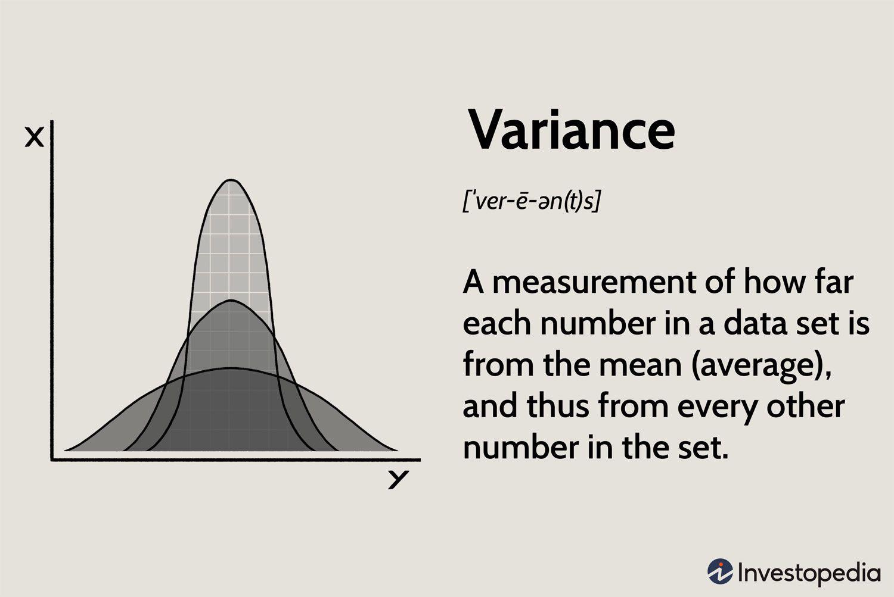

Algorithmic trading, commonly referred to as algo trading, has fundamentally transformed financial markets, leveraging the power of computers to execute trading decisions that were once handled manually. This transformation hinges significantly on the application of statistical measurements to develop strategies that balance risk and return. Variance, a core statistical metric, plays an indispensable role in this process by providing insights into the variability and risk associated with investment returns.

Understanding variance is essential for algorithmic traders who strive to optimize their strategies. Variance quantifies the dispersion of data points in a dataset, offering a measure of how much individual data points differ from the mean. In finance, it serves as a critical indicator of the risk and potential volatility inherent in investment returns. Accurate assessment and management of variance can enable traders to align their strategies with their specific risk tolerance levels, ultimately enhancing decision-making and performance outcomes.



This article examines the concept of variance and its relevance to algorithmic trading. We will explore how variance is mathematically calculated, highlight its significance in the context of trading strategies, and introduce methods for effectively managing it to achieve consistent and stable returns. By addressing these aspects, the article aims to provide a comprehensive understanding of how variance can be both a tool for uncovering opportunities and a metric for managing trading risks.

## Table of Contents

## Understanding Variance in Statistics

Variance is a fundamental statistical concept that quantifies the degree of spread in a data set. It serves as a critical measure of how much individual data points differ from the overall mean, offering an essential lens through which variability can be assessed. The calculation of variance involves averaging the squared differences between each data point and the mean value of the data set. Mathematically, the variance $\sigma^2$ is expressed using the formula:

$$
\sigma^2 = \frac{1}{N} \sum_{i=1}^{N}(X_i - \mu)^2
$$

where $X_i$ represents each individual data point, $\mu$ symbolizes the mean of the data set, and $N$ stands for the total number of observations. This calculation helps capture how distributed or concentrated the data points are within the set.

In financial contexts, variance is pivotal for evaluating the risk and potential [volatility](/wiki/volatility-trading-strategies) associated with investment returns. Higher variance signifies a broader range of returns, indicating more substantial fluctuations in an investment's value. This volatility provides insight into the level of uncertainty or risk that an investor might face. Conversely, a lower variance suggests returns that are more stable and predictable.

Understanding variance is particularly important for investors and analysts as they seek to balance return on investment with risk exposure. It provides the groundwork for various advanced statistical tools and risk assessment techniques, aiding in the formulation and evaluation of financial strategies. In effect, variance contributes significantly to determining the risk-return profile of a given investment, making it an indispensable tool in financial analysis.

## Variance in Algorithmic Trading

Algorithmic trading leverages automated and programmed trading strategies that rely heavily on statistical measures, including variance, to assess the performance and stability of their methodologies. Variance, in this context, is employed as a critical tool to measure the [dispersion](/wiki/dispersion-trading) or volatility of returns that a specific trading strategy might yield over a given period. A high variance indicates a larger spread in returns, which could imply either substantial gains or potential sizeable losses. This aspect is particularly crucial for traders to consider, as it directly correlates with the risk associated with a trading strategy.

Understanding and managing variance enables traders to refine and optimize their strategies, ensuring they align with their specific risk tolerance levels. An effective approach to managing variance involves analyzing historical return distributions and adjusting the strategies to minimize unwarranted risk while aiming for consistent performance. In practice, traders might use Python libraries such as NumPy to calculate the variance of their strategy's returns. Here is a basic example:

```python
import numpy as np

# Sample list of returns from a trading strategy
returns = [0.02, 0.03, -0.01, 0.04, 0.005, -0.02]

# Calculate the variance
variance = np.var(returns)
print(f"Variance of the trading strategy returns: {variance}")
```

In this example, variance offers critical insights into whether the [algorithmic trading](/wiki/algorithmic-trading) strategy exposes traders to excessive risk or whether it provides a statistically favorable risk-reward profile. Thus, effectively managing variance is not merely about risk limitation; it's also about unlocking the potential for profits in a controlled and systematic manner, fostering confidence in the strategies employed. By continually refining these strategies in response to variance measurements, traders can bolster resilience and adaptability, paving the way for smarter, risk-adjusted decision-making in the fast-paced world of algorithmic trading.

## Calculating Variance: The Formula

The formula for calculating variance, a vital statistic in the analysis of trading strategies, is expressed as: 

$$
\sigma^2 = \frac{1}{N} \sum_{i=1}^{N} (X_i - \mu)^2
$$

In this equation:

- $\sigma^2$ represents the variance.
- $N$ denotes the total number of observations in the dataset.
- $X_i$ signifies the individual data points or returns.
- $\mu$ is the mean or average of the dataset.

The variance formula serves to quantify the degree to which individual returns $X_i$ deviate from the mean $\mu$ of the dataset. By calculating variance, traders can comprehensively understand the distribution and spread of returns, which is crucial for evaluating the consistency and predictability of a trading strategy's performance.

Here's a simple Python function that calculates variance:

```python
def calculate_variance(returns):
    n = len(returns)
    mean = sum(returns) / n
    squared_diffs = [(x - mean) ** 2 for x in returns]
    variance = sum(squared_diffs) / n
    return variance

returns = [0.1, 0.2, 0.15, 0.3, 0.25]
variance = calculate_variance(returns)
print(f"The variance of returns is: {variance}")
```

In this Python code, `calculate_variance` takes a list of returns, computes the mean, and uses it to determine the squared differences for each return. The average of these squared differences provides the variance, illustrating the fluctuation in returns around the mean.

Understanding the spread of returns through variance calculation allows traders to adjust their algorithmic trading strategies with greater precision, aligning them with specific risk-reward frameworks. This ensures strategies are well-equipped to optimize performance while mitigating potential risks inherent due to variations in expected returns.

## Impact of Variance on Trading Strategies

Variance is a fundamental component in the development and evaluation of trading strategies, offering both potential for profit and risk. In algorithmic trading, it plays a significant role by dictating the range of possible returns and influencing the decision-making process for strategies like mean reversion and trend-following.

High variance signifies a wide dispersion of returns, which can lead to unpredictable financial outcomes. This unpredictability may result in substantial profits during favorable market conditions, but it also poses the risk of significant losses during adverse periods. Therefore, high variance strategies require robust risk management practices. Traders often employ measures such as stop-loss orders, which help limit losses during periods of heightened volatility.

Mean reversion strategies, which operate under the assumption that asset prices will return to their historical averages, are inherently tied to variance. High variance in the underlying asset's price indicates a more significant deviation from the mean and suggests a stronger potential for reversion. However, this increased variance also elevates the risk, as price deviations may persist longer than anticipated. The effectiveness of mean reversion strategies is often contingent upon accurately assessing variance and adjusting entry and [exit](/wiki/exit-strategy) points accordingly.

Similarly, trend-following strategies rely on capturing persistent price movements over time. These strategies thrive in high variance environments where large price swings create opportunities for profit. However, the same variance that provides greater profit potential also increases the likelihood of false signals, where temporary price fluctuations could be misinterpreted as a trend.

Managing variance is critical for optimizing these strategies. Techniques like adjusting the length of the look-back period in moving averages, using multiple time frame analysis, or employing volatility filters help traders mitigate risks associated with high variance. Via these methods, traders aim to distinguish genuine market movements from noise caused by short-term variance.

In summary, variance's impact on trading strategies is substantial, providing the dual effect of heightened profit potential and increased risk. Effective management of variance is essential for traders to capitalize on opportunities while safeguarding their portfolios against unpredictable market swings.

## Variance vs. Volatility: Key Differences

Variance and volatility are fundamental concepts in finance and trading, often used interchangeably but possessing distinct meanings. Variance is a statistical measure that captures the degree of spread in a set of data points from their mean. It is particularly important for evaluating the dispersion of returns in a financial portfolio or trading strategy and indicates the variability of returns over time.

Volatility, on the other hand, is more grounded in the practical movement of prices and is generally expressed as the standard deviation of returns. It denotes the rate and magnitude of price changes in a financial instrument over a certain period. Volatility is a direct measure of risk as it reflects the extent of fluctuations in asset prices, facilitating predictions about price movements based on historical data.

Both metrics are interrelated mathematically, as volatility is the square root of variance. Mathematically, if $\sigma^2$ represents variance, volatility is expressed as $\sigma$. Here is a simple Python code snippet to illustrate how you can calculate both variance and volatility from a list of returns:

```python
import numpy as np

def calculate_variance_volatility(returns):
    variance = np.var(returns)
    volatility = np.std(returns)
    return variance, volatility

# Example usage
returns = [0.02, 0.05, -0.03, 0.01, 0.04]
variance, volatility = calculate_variance_volatility(returns)
print(f"Variance: {variance}, Volatility: {volatility}")
```

Understanding the distinction between variance and volatility aids traders in honing their strategies. While variance offers insights into the expected range of returns, volatility helps anticipate potential extreme price shifts. When crafting trading strategies, both metrics must be considered to align with individual risk tolerance and investment objectives, enabling better risk management and strategy optimization.

For instance, investors focusing on minimum variance strategies aim to minimize the variance of portfolio returns, thereby smoothing out potential fluctuations. Conversely, strategies like volatility targeting adjust the exposure based on current volatility levels to maintain a desired risk profile.

By comprehensively understanding variance and volatility, traders can develop more resilient strategies that effectively balance anticipated returns against potential risks, enhancing their ability to manage financial uncertainties.

## Managing Variance in Algo Trading

Effective variance management in algorithmic trading is essential for mitigating risk and achieving consistent returns. Several techniques can be employed to manage variance effectively:

1. **Diversification**: Diversifying the portfolio is one of the primary strategies for managing variance. By spreading investments across various asset classes, sectors, or geographic regions, traders can reduce unsystematic risk – the risk specific to a single asset. The underlying principle is that the negative performance of some assets can be offset by the positive performance of others. This can be mathematically represented by the correlation coefficient, where lower correlation between assets leads to greater diversification benefits.

2. **Position Sizing**: Determining the optimal size of each trade is crucial for controlling variance. Position sizing involves calculating the appropriate amount of capital to allocate to each trade based on the risk tolerance and the expected volatility of the asset. By limiting the size of individual trades, traders can prevent substantial losses and ensure that the overall portfolio remains within acceptable risk parameters. A commonly used method for position sizing is the Kelly Criterion, which uses the formula:
$$
   f^* = \frac{bp - q}{b}

$$

   where $f^*$ is the fraction of the portfolio to wager, $b$ is the odds received on the wager, $p$ is the probability of winning, and $q$ is the probability of losing.

3. **Adaptive Algorithms**: These are designed to adjust trading strategies in response to changing market conditions, effectively managing variance. Adaptive algorithms can modify their parameters in real-time based on historical data and predictive analytics. Machine learning techniques, such as reinforcement learning, can be employed to create algorithms that learn from market patterns and adjust accordingly. This adaptability ensures that the trading system remains robust under different volatility regimes.

A potential implementation in Python using a simple example of adaptive algorithms might include using libraries like NumPy and pandas to process historical data and scikit-learn for developing [machine learning](/wiki/machine-learning) models that predict future volatility. Here's a basic pseudocode outline:

```python
import numpy as np
import pandas as pd
from sklearn.ensemble import RandomForestRegressor

# Load historical market data
data = pd.read_csv('market_data.csv')
features = data[['feature1', 'feature2', 'feature3']]
target = data['volatility']

# Train a model to predict volatility
model = RandomForestRegressor()
model.fit(features, target)

# Predict future volatility
predicted_volatility = model.predict(new_data)

# Adjust trading strategy based on predicted volatility
if predicted_volatility > threshold:
    # Reduce position size or diversify more
else:
    # Maintain or increase positions
```

4. **Regular Rebalancing**: Regularly rebalancing the portfolio ensures that it maintains its desired risk level. Over time, the proportions of assets in a portfolio can drift due to varying returns, which may lead to an unintended risk exposure. By periodically realigning the portfolio back to its target allocation, traders can maintain their risk and return objectives.

5. **Risk Metrics and Analysis**: Using advanced risk metrics such as Value at Risk (VaR) or Conditional Value at Risk (CVaR) helps in quantifying the potential loss in a portfolio. Regular analysis of these metrics allows traders to understand and control the variance effectively.

Managing variance in algorithmic trading involves a combination of these strategies, each tailored to fit the specific needs and objectives of the trading system. By employing a comprehensive approach towards variance management, traders can enhance their ability to achieve stable, risk-adjusted returns over time.

## Case Studies: Variance in Action

Real-world applications of variance in algorithmic trading strategies illuminate its significant impact on their success and adaptability. One illustrative example is [momentum](/wiki/momentum) trading. In momentum trading, traders buy assets that have shown an upward price movement and sell those with a downward trajectory. This strategy heavily relies on variance to assess the stability and sustainability of momentum. High variance in price movements can indicate potential reversals, prompting traders to fine-tune their entry and exit strategies to optimize returns.

Consider the Python code snippet for calculating variance in a momentum trading strategy:

```python
import numpy as np

def calculate_variance(returns):
    mean_return = np.mean(returns)
    variance = np.mean((returns - mean_return)**2)
    return variance

# Example returns from a momentum strategy
returns = [0.02, 0.03, 0.015, -0.01, 0.025]
variance = calculate_variance(returns)

print(f"Variance of momentum strategy returns: {variance}")
```

This code calculates the variance of a given set of returns, helping traders understand the spread of returns and adjust the strategy as necessary to mitigate risk.

Mean reversion is another strategy that demonstrates the critical role of variance. In this approach, traders expect prices to revert to their historical averages and transact based on deviations from this mean. Variance here helps determine the degree of deviation that signifies a trading opportunity. A higher variance might indicate strong outlying movements, signaling a potential reversion point, thus enabling traders to capitalize on temporary mispricings.

Consider an example where a trader analyzes stock prices that historically revert to a mean value, using variance to gauge how far prices have departed from this mean. By quantifying the deviation magnitude, traders can set thresholds for trade executions, aiming to profit as prices revert.

Through these examples, it becomes evident that variance serves as an essential tool, guiding traders in assessing risk and adjusting their strategies accordingly. By accurately measuring and managing variance, traders can enhance their strategies' resilience, achieving more stable performance and improved risk-adjusted returns.

## Conclusion

Variance is a core concept in both [statistics](/wiki/bayesian-statistics) and algorithmic trading, serving as a fundamental tool for evaluating and managing risk. By providing a quantitative measure of the spread of returns, variance enables traders to assess the potential fluctuation in their investment outcomes. A deep understanding of variance equips traders with the insights necessary to adjust and optimize their trading strategies in accordance with their risk tolerance and investment goals.

Mastering variance allows traders to develop more resilient strategies aimed at achieving stable, risk-adjusted returns. Techniques such as diversification and position sizing are underpinned by an appropriate analysis of variance, ensuring that the risks are adequately spread across different investments. Furthermore, algorithmic trading systems can be programmed to use variance as a parameter for making dynamic adjustments to trading rules, thereby enhancing the potential for consistent profitability.

The continuous evolution of technology promises to further advance the tools available for variance management in trading strategies. Innovations in machine learning and [artificial intelligence](/wiki/ai-artificial-intelligence) are likely to provide traders with enhanced capabilities for predicting market behavior and adjusting strategies in real time. Using sophisticated algorithms, traders can further analyze vast amounts of data to refine their understanding of variance, improving the accuracy of risk assessments and optimizing decision-making processes. As these technologies continue to develop, they are set to play a crucial role in enabling traders to effectively manage variance and bolster their trading performance in dynamic and complex financial markets.

## References & Further Reading

[1]: Lopez de Prado, M. (2018). ["Advances in Financial Machine Learning"](https://www.amazon.com/Advances-Financial-Machine-Learning-Marcos/dp/1119482089). Wiley.

[2]: Chan, E. P. (2009). ["Quantitative Trading: How to Build Your Own Algorithmic Trading Business"](https://github.com/ftvision/quant_trading_echan_book). Wiley.

[3]: Aronson, D. R. (2006). ["Evidence-Based Technical Analysis: Applying the Scientific Method and Statistical Inference to Trading Signals"](https://www.amazon.com/Evidence-Based-Technical-Analysis-Scientific-Statistical/dp/0470008741). Wiley.

[4]: Jansen, S. (2020). ["Machine Learning for Algorithmic Trading"](https://github.com/stefan-jansen/machine-learning-for-trading). Packt Publishing.

[5]: Fabozzi, F. J., Focardi, S. M., & Kolm, P. N. (2010). ["Mathematics of Financial Modeling and Investment Management"](https://www.semanticscholar.org/paper/Quantitative-Equity-Investing%3A-Techniques-and-Fabozzi-Focardi/1c49a2a53919f7e65cb96f16691b8ff726fd3cd7). Wiley.