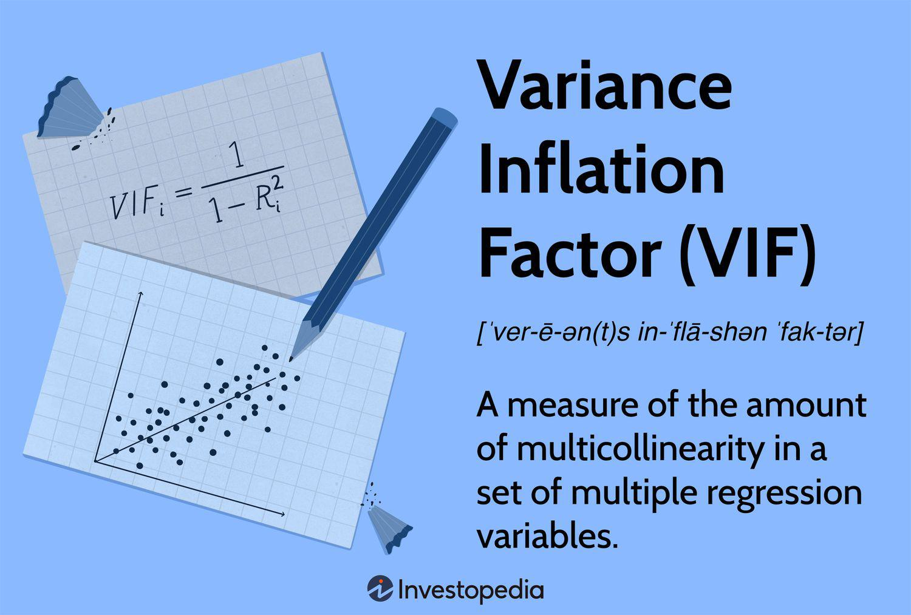

## Table of Contents

## What is the Variance Inflation Factor (VIF)?

The Variance Inflation Factor (VIF) is a measure used in statistics to check how much the variance of an estimated regression coefficient is increased because of multicollinearity. Multicollinearity happens when two or more predictor variables in a regression model are highly correlated with each other. When this happens, it can make it hard to figure out which variable is really affecting the outcome. VIF helps to spot this problem by giving a number that shows how much the variance is "inflated".

To calculate VIF, you run a regression where one of the predictor variables is the dependent variable, and all the other predictor variables are the independent variables. The VIF for a variable is then found by taking the reciprocal of 1 minus the R-squared value from this regression. If the VIF is high, it means that the variable is highly correlated with the other variables, and this can cause issues in the model. A common rule of thumb is that a VIF above 5 or 10 suggests a problematic amount of multicollinearity, and you might need to fix your model by removing or combining some of the variables.

## Why is VIF important in statistical modeling?

VIF is important in statistical modeling because it helps us understand if our model has a problem called multicollinearity. Multicollinearity happens when two or more of the variables we are using to predict something are too closely related to each other. This can make our model less reliable because it becomes hard to figure out which variable is really doing the predicting. By using VIF, we can see how much this problem is affecting our model. If the VIF is high for a variable, it means that variable is too similar to others, and we might need to change our model to make it work better.

When we find high VIF values, it's a warning sign that our model might not be giving us the best or most accurate predictions. If we ignore multicollinearity, our model can become unstable, meaning small changes in the data can lead to big changes in our predictions. By checking VIF, we can take action to fix these issues, like removing some variables or combining them in a way that reduces their similarity. This helps make our model more trustworthy and useful for making decisions based on the data.

## How is VIF calculated?

To calculate VIF, you first need to run a special regression. Imagine you have a bunch of variables you're using to predict something. Take one of those variables and treat it like it's the thing you're trying to predict. Use all the other variables to see how well they can predict this one variable. After you run this regression, you get something called R-squared, which tells you how well the other variables can explain the one you're focusing on.

Now, to find the VIF, you use the R-squared from this special regression. The formula for VIF is simple: take 1 and subtract the R-squared value you got. Then, take the result and divide 1 by it. So, if your R-squared was 0.5, you'd do 1 - 0.5 = 0.5, and then 1 / 0.5 = 2. That number, 2, is the VIF for the variable you were focusing on. A high VIF means that variable is too similar to the others, and you might need to adjust your model.

## What does a high VIF value indicate?

A high VIF value means that one of the variables in your model is too similar to the other variables you're using. This is called multicollinearity, and it can make your model less reliable because it's hard to figure out which variable is really helping to predict the outcome. When variables are too similar, it's like they're fighting over who gets to explain the same thing, which can confuse your model.

If you see a high VIF, it's a sign that you might need to change your model to make it work better. You could try removing some variables or combining them in a way that makes them less similar. This helps your model give more accurate and trustworthy predictions, because it can better tell which variables are really important.

## What is considered a high VIF value?

A high VIF value is usually anything above 5 or 10. These numbers are like warning signs that tell us our model might have a problem called multicollinearity. Multicollinearity happens when the variables we use to predict something are too similar to each other. When this happens, it's hard for our model to figure out which variable is really helping to make good predictions.

If we see a VIF value that's higher than 5 or 10, it means we need to take a closer look at our model. We might need to take out some variables or combine them in a way that makes them less similar. Doing this can help our model work better and give us more accurate predictions. It's important to fix high VIF values because they can make our model less reliable.

## How can multicollinearity affect regression models?

Multicollinearity can make regression models less reliable. It happens when two or more of the variables we use to predict something are too similar to each other. When this happens, it's hard for the model to figure out which variable is really helping to make good predictions. It's like if you had two friends trying to explain the same thing to you at the same time. You might get confused about who is saying what. In the same way, the model can get confused about which variable is doing the predicting.

Because of this confusion, the model's predictions can become less accurate. Small changes in the data can lead to big changes in the model's predictions, making it unstable. This can be a big problem if we're using the model to make important decisions. To fix this, we need to look at the variables and see if any of them are too similar. We might need to remove some variables or combine them in a way that makes them less alike. This helps the model work better and give us more trustworthy predictions.

## What are the steps to detect multicollinearity using VIF?

To detect multicollinearity using VIF, you first need to run a special kind of regression for each variable in your model. Imagine you have a bunch of variables that you're using to predict something. Take one of those variables and pretend it's the thing you're trying to predict. Then, use all the other variables to see how well they can explain this one variable. After you run this regression, you'll get a number called R-squared, which tells you how well the other variables can predict the one you're focusing on.

Next, you calculate the VIF for the variable you're focusing on. You do this by taking 1 and subtracting the R-squared value you got. Then, you take 1 and divide it by that result. The number you get is the VIF for that variable. If the VIF is high, it means that variable is too similar to the others. A common rule is that a VIF above 5 or 10 is a sign of multicollinearity. You would repeat this process for all the variables in your model to see if any of them have high VIF values. If you find any, it's a warning that your model might need some changes to work better.

## How can you address high VIF values in a dataset?

When you find high VIF values in your dataset, it means some of your variables are too similar to each other. This can make your model less reliable because it's hard to tell which variable is really helping to predict the outcome. To fix this, you can try removing some of the variables that have high VIF values. If you remove a variable, the VIF values of the remaining variables might go down, making your model better.

Another way to deal with high VIF values is to combine similar variables. For example, if you have two variables that measure similar things, you could add them together or take their average to make one new variable. This new variable can help reduce multicollinearity because it's less similar to the other variables in your model. By doing this, you can make your model more accurate and trustworthy, which is important for making good predictions.

## Can VIF be used in models other than linear regression?

Yes, VIF can be used in models other than linear regression, but it's most commonly used with linear models. The idea behind VIF is to check how much the variance of an estimated regression coefficient is increased because of multicollinearity. This problem can happen in other types of models too, like logistic regression or even some machine learning models. But, in these cases, you need to be careful because the way VIF is calculated is based on linear relationships, so it might not work perfectly for non-linear models.

To use VIF in other models, you can still follow the basic steps of calculating it, but you should keep in mind that the results might not be as clear or reliable as they are in linear regression. For example, in logistic regression, you could still run a linear regression of each variable against all the others to get the R-squared value and then calculate VIF. However, because logistic regression deals with probabilities rather than continuous outcomes, the interpretation of VIF might need some adjustments. So, while VIF can be applied to other models, it's important to understand its limitations and consider other methods to check for multicollinearity in non-linear settings.

## What are the limitations of using VIF?

VIF is a useful tool for spotting multicollinearity in linear regression models, but it has some limitations. One big problem is that VIF only works well for linear models. If you're using a different kind of model, like logistic regression or a machine learning model, VIF might not give you the right answers. This is because VIF is based on the idea of linear relationships, and if your model doesn't follow those rules, the VIF numbers might not be trustworthy.

Another issue is that VIF can be hard to interpret when you have a lot of variables. If you're working with a model that has many variables, it can be tricky to figure out which ones to remove or combine to fix the multicollinearity problem. Also, VIF doesn't tell you what to do to fix the problem; it just tells you that there is a problem. You have to use your own judgment to decide how to change your model. So, while VIF is helpful, it's not a complete solution and should be used along with other methods to check and improve your model.

## How does VIF relate to the condition index in multicollinearity analysis?

VIF and the condition index are both ways to check for multicollinearity in a model, but they look at the problem from different angles. VIF tells you how much the variance of a variable's estimated regression coefficient is increased because of multicollinearity. You calculate VIF by running a special regression for each variable and using the R-squared from that regression. If a variable has a high VIF, it means it's too similar to other variables, and that can make your model less reliable. A common rule is that a VIF above 5 or 10 is a sign of trouble.

The condition index, on the other hand, looks at the overall structure of your data to see if there's multicollinearity. It's calculated by taking the square root of the ratio of the largest eigenvalue to the smallest eigenvalue from the data's correlation matrix. A high condition index, often above 30 or even 10, suggests that there's a problem with multicollinearity. While VIF focuses on each variable one at a time, the condition index gives you a big-picture view of how all the variables are working together. Both methods can help you spot multicollinearity, but using them together gives you a fuller understanding of your model's issues.

## What advanced techniques can be used alongside VIF to diagnose and mitigate multicollinearity?

Besides VIF, there are other advanced techniques you can use to spot and fix multicollinearity in your model. One way is to look at the correlation matrix of your variables. This is like a table that shows how much each variable is related to the others. If you see high numbers in the table, it means some variables are too similar, and you might need to take out or combine them. Another method is principal component analysis (PCA). PCA helps you see which variables are most important and can help you make new variables that are less similar to each other. This can make your model better by reducing the problem of multicollinearity.

You can also use ridge regression, which is a type of regression that adds a little bit of extra information to your model to help with multicollinearity. It does this by adding a penalty to the size of the coefficients, which can make the model more stable even when variables are similar. Another technique is to use stepwise regression, where you add or remove variables one at a time to see how it affects your model. This can help you find the best set of variables that work well together without being too similar. By using these methods along with VIF, you can get a better understanding of your model and make it more reliable.

## What is the relationship between VIF and Multicollinearity?

Variance Inflation Factor (VIF) is a statistical measure used to detect multicollinearity in regression models. Multicollinearity arises when two or more independent variables in a model are highly correlated, which can distort the interpretation of the model. When variables are collinear, it becomes challenging to determine the individual effect of each independent variable on the dependent variable, potentially leading to skewed or unreliable results.

To calculate VIF, one first needs to determine the R-squared value $(R^2_i)$ for each independent variable $i$, which is obtained by regressing $i$ against all other independent variables in the model. The formula for VIF is expressed as:

$$
VIF_i = \frac{1}{1 - R^2_i}
$$

A VIF value exceeding 5-10 is typically considered indicative of problematic multicollinearity. Values exceeding this range suggest that the affected variable's coefficient estimates may reflect the effects of multicollinearity rather than the true influence of the variable on the dependent metric.

Understanding and utilizing VIF are crucial for refining the accuracy of regression models, especially in [algorithmic trading](/wiki/algorithmic-trading), where predictive reliability is paramount. High VIF values necessitate intervention, which may involve removing or combining variables or employing advanced techniques such as Principal Component Analysis (PCA) for dimensionality reduction. By addressing multicollinearity through the application of VIF, analysts and traders improve the robustness and performance of their predictive models, thereby enhancing decision-making processes in financial markets.

## How can VIF be implemented for multicollinearity detection?

Variance Inflation Factor (VIF) is an essential diagnostic tool in identifying multicollinearity, a common issue in regression-based algorithmic trading models where independent variables are highly correlated. Multicollinearity can distort the statistical significance of predictor variables, complicating the interpretation of their influence on dependent outcomes. VIF quantifies how much the variance of a regression coefficient is inflated due to multicollinearity, thus guiding adjustments for more reliable trading strategies.

The calculation of VIF is straightforward and can be easily implemented using Python's statsmodels library or other statistical software. VIF for a particular predictor is computed using the formula:

$$
\text{VIF}_i = \frac{1}{1 - R_i^2}
$$

where $R_i^2$ represents the coefficient of determination obtained by regressing the $i^{th}$ independent variable against all other predictors. A VIF value exceeding 5 to 10 is generally considered indicative of problematic multicollinearity, though the threshold can vary depending on the context.

Here's an example of calculating VIF in Python using the statsmodels library:

```python
import pandas as pd
import statsmodels.api as sm
from statsmodels.stats.outliers_influence import variance_inflation_factor

# Sample DataFrame
data = pd.DataFrame({
    'Variable1': [1.3, 2.4, 3.1, 4.2],
    'Variable2': [2.1, 4.3, 6.2, 8.4],
    'Variable3': [1.1, 1.9, 2.6, 3.9]
})

# Add a constant column for intercept
data = sm.add_constant(data)

# Calculate VIF for each feature
vif_data = pd.DataFrame()
vif_data['Variable'] = data.columns
vif_data['VIF'] = [variance_inflation_factor(data.values, i) for i in range(data.shape[1])]

print(vif_data)
```

This example demonstrates how to integrate VIF calculations into existing data workflows and identify multicollinearity issues. If high VIF values are detected, several interventions can be implemented to address multicollinearity:

1. **Remove or Merge Highly Collinear Variables:** By eliminating one of the correlated predictors or merging them into a single predictor, the multicollinearity problem can be alleviated.

2. **Dimensionality Reduction Techniques:** Using methods such as Principal Component Analysis (PCA), traders can reduce the dataset's dimensionality while preserving as much variance as possible. PCA transforms the original set of predictors into a new set of uncorrelated variables (principal components), which can then be used in regression models to improve outcomes.

These interventions help maintain the robustness and interpretive clarity of regression models, enhancing the effectiveness of algorithmic trading strategies by ensuring that predictor relationships do not adversely affect model predictions.

## References & Further Reading

Recommended [books](/wiki/algo-trading-books) and articles for understanding multicollinearity, VIF, and their applications in algorithmic trading include:

1. **“Applied Regression Analysis” by Norman R. Draper and Harry Smith**: This book provides a comprehensive overview of regression techniques, including chapters dedicated to multicollinearity. It is a useful resource for understanding the mathematical principles behind variance inflation factors (VIF).

2. **“Introduction to Linear Regression Analysis” by Douglas C. Montgomery, Elizabeth A. Peck, and G. Geoffrey Vining**: This text covers a wide range of regression analysis topics, with particular focus on diagnosing and addressing multicollinearity issues within statistical models.

3. **“Algorithmic Trading: Winning Strategies and Their Rationale” by Ernest P. Chan**: Chan’s book explores various algorithmic trading strategies, highlighting the role of statistical models including regression analysis. Though not devoted entirely to multicollinearity, it stresses the importance of robust data analysis techniques in developing effective trading algorithms.

4. **Research Articles**:
   - "Variance Inflation Factors and Multicollinearity: A Perspective on Regression Models" provides insights into interpreting VIF and its significance in identifying multicollinearity in financial datasets.
   - "Quantitative Finance and Algorithmic Trading" discusses the application of advanced statistical methods, such as regression analysis, in optimizing trading strategies.

For those interested in the practical implementation of these techniques, exploring the following Python-based resources could be beneficial:

- **Python Libraries Documentation**:
  - **Statsmodels**: This library provides classes and functions for estimating and testing statistical models, including functions for computing VIF.
  - **Scikit-learn**: Although primarily a machine learning library, it includes tools for processing financial data and implementing multicollinearity diagnostics.

- **Online Tutorials and Courses**:
  - Websites like Coursera, edX, and DataCamp offer courses on data analysis and algorithmic trading that include modules on regression analysis and VIF calculation.

- **GitHub Repositories**: Many open-source projects and code examples illustrate the implementation of regression models in trading, offering practical insights and hands-on experience with handling multicollinearity.

Exploring these resources will deepen the understanding of advanced statistical techniques, enhancing the precision of trading models and consequently, the decision-making process in financial markets.

