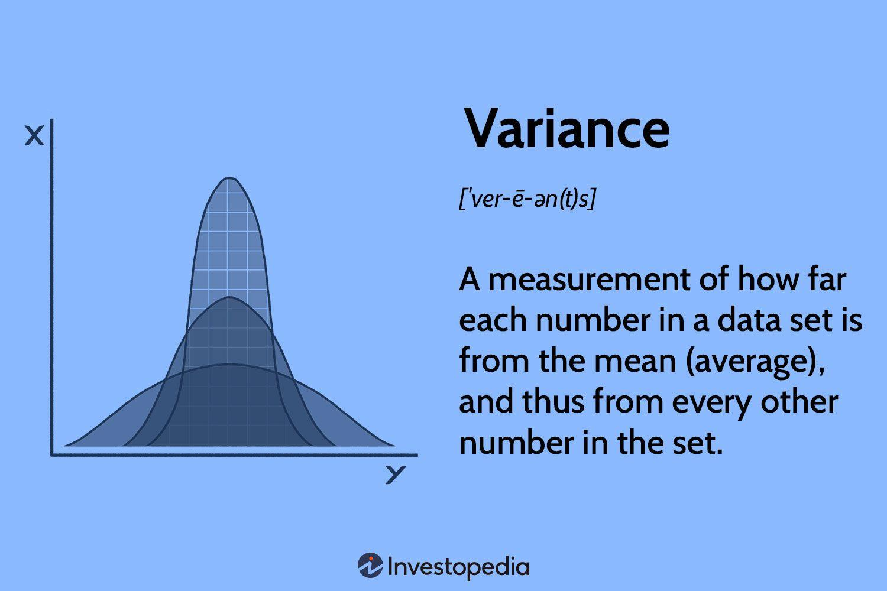

## Table of Contents

## What is variance in statistics?

Variance is a way to measure how spread out numbers in a set are. Imagine you have a group of numbers. Variance tells you if those numbers are close together or if they are far apart. If the variance is small, it means the numbers are pretty close to each other. If the variance is big, it means the numbers are spread out a lot.

To find the variance, you start by figuring out the average of all the numbers. Then, you see how far each number is from that average. You square those distances, add them up, and then divide by the number of items in your set. This gives you the variance. It's a bit of math, but it helps us understand how much the numbers in a group differ from each other.

## How is variance calculated?

To calculate variance, first find the average (or mean) of all the numbers in your set. Add up all the numbers and then divide by how many numbers you have. This average is important because it's the middle point of your set. Next, you need to see how far each number is from this average. For each number, subtract the average from it. This difference shows how much each number deviates from the middle.

After finding these differences, square each one. Squaring makes all the differences positive and also gives more weight to bigger differences. Now, add up all these squared differences. This total is called the sum of squares. Finally, to get the variance, divide this sum of squares by the number of items in your set. If you're calculating the variance of a sample (a smaller group taken from a larger group), you divide by one less than the number of items instead. This gives you the variance, which shows how spread out your numbers are.

## Why is variance important in data analysis?

Variance is important in data analysis because it helps us understand how spread out our data is. When we look at a set of numbers, it's not enough to just know the average. We also need to know if those numbers are close to the average or if they are all over the place. Variance tells us this. If the variance is small, it means most of the numbers are close to the average, which can be good if we want our data to be consistent. If the variance is large, it means the numbers are spread out a lot, which might show us that there's a lot of variety in our data.

This information is really useful in many areas. For example, in business, if you're looking at the sales of different products, a high variance might show that some products sell a lot more than others. This could help you decide which products to focus on. In science, if you're doing an experiment, a low variance in your results might mean your experiment is reliable. Understanding variance helps us make better decisions by showing us not just the average, but how much things can differ from that average.

## What is the difference between variance and standard deviation?

Variance and standard deviation are both ways to measure how spread out numbers are in a set, but they do it a bit differently. Variance is the average of the squared differences from the mean. It tells you how much the numbers in your set vary from the average. To find it, you calculate how far each number is from the mean, square those distances, add them up, and then divide by the number of items in your set.

Standard deviation is the square root of the variance. It's like variance, but it gives you the result in the same units as your original numbers. This makes it easier to understand because it's in the same scale as your data. While variance gives you a number that's squared, standard deviation brings it back to the original scale, making it more intuitive. Both are important, but standard deviation is often used more because it's easier to relate to the actual data.

## Can you explain the concept of population variance versus sample variance?

When we talk about variance, we can be talking about a whole group, which we call a population, or just a part of that group, which we call a sample. Population variance is the variance of all the numbers in the entire group. To find it, you calculate the average of all the numbers, then see how far each number is from that average, square those distances, add them up, and divide by the total number of items in the population. This gives you the variance of the whole group.

Sample variance is a bit different because it's based on just a part of the group. When you only have a sample, you want your variance to be a good guess of what the variance would be if you had the whole population. So, instead of dividing by the number of items in your sample, you divide by one less than the number of items. This makes the sample variance a bit bigger, which helps it be a better estimate of the population variance. It's a way to correct for the fact that you're only looking at a part of the group.

## How does variance relate to the mean of a dataset?

Variance shows how spread out the numbers in a dataset are around the mean. The mean is just the average of all the numbers. When you calculate variance, you first find the mean, then see how far each number is from that mean. You square these distances, add them up, and divide by the number of items. This process tells you if the numbers are close to the mean or if they are spread out a lot.

If the variance is small, it means the numbers in your dataset are pretty close to the mean. This can be good if you want things to be consistent. For example, if you're looking at the test scores of a class, a small variance means most students scored near the average. On the other hand, if the variance is large, it means the numbers are more spread out. This might show there's a lot of variety in your data. In the test scores example, a large variance might mean some students did very well while others did not, showing a big difference in performance.

## What are the limitations of using variance as a measure of spread?

Variance is a useful way to see how spread out numbers are, but it has some problems. One big problem is that variance is in squared units, which can be hard to understand. If you're measuring something like height in centimeters, the variance will be in square centimeters, which doesn't make sense in everyday life. This makes it tricky to explain to people who aren't used to working with squared units. Also, because variance squares the differences from the mean, it can make big differences seem even bigger. This can sometimes give a wrong idea of how spread out the numbers really are.

Another issue with variance is that it can be affected a lot by just a few numbers that are very different from the rest. These numbers, called outliers, can make the variance much larger than it would be without them. This means that variance might not always show the true spread of most of the data if there are a few extreme values. So, while variance is good for understanding how spread out data is, it's important to be careful and maybe use other ways to measure spread too, like the standard deviation or the range, to get a full picture of the data.

## How can variance be used to assess risk in financial contexts?

In financial contexts, variance is often used to measure the risk of an investment. Imagine you have a stock, and you want to know how much its price might go up or down. Variance helps you see how much the stock's price moves around its average price. If the variance is high, it means the stock's price can change a lot, which is riskier. If the variance is low, the price doesn't move as much, so it's less risky. Investors use this information to decide if they're okay with the risk or if they want to find a safer investment.

For example, if you're looking at two different stocks, one with a high variance and one with a low variance, you might choose the one with low variance if you don't want to take big risks. On the other hand, if you're willing to take more risk for the chance of higher returns, you might go for the stock with high variance. By understanding the variance, investors can make smarter choices about where to put their money, balancing the potential for profit against the risk of losing money.

## What are some common misconceptions about variance?

One common misconception about variance is that it tells you everything you need to know about how spread out data is. But variance only gives you part of the story. It's the average of the squared differences from the mean, which means it's in squared units and can be hard to understand. Also, variance can be thrown off by just a few numbers that are way different from the rest, called outliers. So, it's important to use other ways to measure spread too, like standard deviation or the range, to get a full picture.

Another misconception is that a high variance always means something bad. In some cases, a high variance might show that there's a lot of variety in the data, which can be good. For example, in a business, if sales of different products have a high variance, it might mean some products are doing really well. It's all about what you're trying to learn from the data. Variance is a tool, not a judgment, and it should be used with other information to make the best decisions.

## How does the concept of variance apply in machine learning and data science?

In [machine learning](/wiki/machine-learning) and data science, variance is really important because it helps us understand how our models work. Imagine you have a model that's trying to predict something, like the price of a house based on its size and location. Variance tells us how much the model's predictions might change if we use different sets of data. If the variance is high, it means the model's predictions can be all over the place, which is bad because it's not reliable. We want our models to give us consistent answers, so we try to keep the variance low. This helps us make better predictions and trust our models more.

Another way variance comes into play is when we're trying to understand our data. In data science, we often look at different sets of numbers to find patterns or make decisions. Variance helps us see how spread out these numbers are. For example, if we're looking at customer ages for a store, a high variance might mean the store attracts a wide range of ages, while a low variance might mean it mostly attracts people of similar ages. By understanding the variance, data scientists can make better choices about how to analyze and use the data to solve problems or make predictions.

## What advanced statistical tests use variance as a key component?

One important test that uses variance is called Analysis of Variance, or ANOVA for short. ANOVA helps us see if there are big differences between groups of numbers. Imagine you're testing three different diets to see which one helps people lose the most weight. ANOVA looks at the variance within each diet group and compares it to the variance between the groups. If the variance between the groups is much bigger than the variance within the groups, it means the diets probably make a difference. This test is really useful in lots of areas, like science, business, and medicine, to find out if different things or treatments have different effects.

Another test that uses variance is called the F-test. The F-test is often used to compare variances of two sets of numbers to see if they're different. For example, you might want to know if the variance in test scores between two different schools is the same or not. The F-test looks at the ratio of the variances of the two groups. If this ratio is really different from 1, it means the variances are not the same, which can tell us a lot about how spread out the data is in each group. The F-test is a key part of many other statistical tests and helps us understand if the spread of our data is important or just random.

## How can variance be minimized in experimental design?

In experimental design, one way to minimize variance is by making sure everything is as similar as possible in each part of the experiment. This means using the same tools, doing the experiment in the same place, and making sure the conditions are the same for everyone. For example, if you're testing how different fertilizers help plants grow, you want all the plants to be the same type, in the same kind of soil, and getting the same amount of water and sunlight. By keeping everything else the same, you reduce the chance that other things, not the fertilizer, are making the results different.

Another way to minimize variance is by using a lot of data. The more data you have, the less impact any one strange result can have on your overall findings. This is called increasing the sample size. If you're doing a survey about how people feel about a new product, asking more people will give you a better idea of what everyone thinks, not just a few. By having more data, you can see the true pattern and not be thrown off by a few unusual answers. Both of these ways help make your experiment's results more reliable and easier to understand.

## What is the understanding of variance in algo trading?

Variance in [algorithmic trading](/wiki/algorithmic-trading) is a statistical measure that quantifies the degree of [dispersion](/wiki/dispersion-trading) in trading returns. It provides insights into the risk associated with a trading strategy by capturing the extent to which returns deviate from the expected mean. Mathematically, variance is calculated as the average of the squared differences from the mean. The formula for variance $\sigma^2$ is given by:

$$
\sigma^2 = \frac{1}{N} \sum_{i=1}^{N} (X_i - \mu)^2
$$

where $N$ is the number of observations, $X_i$ represents each individual return, and $\mu$ is the mean of the returns.

A high variance signifies a large spread in the returns, which indicates potential for both significant gains and losses. This variability in returns implies that the outcome of the trading strategy could be unpredictable, posing challenges for traders who aim for consistent performance. Conversely, low variance suggests that returns are clustered closely around the mean, reflecting a more predictable trading outcome.

Variance is crucial in risk assessment of trading strategies. It aids traders in understanding the extent of potential fluctuations in returns, allowing for better decisions in aligning trading strategies with their risk tolerance. For most algorithmic trading strategies, a balance between risk and return is sought. By understanding variance, traders can assess whether the expected returns justify the level of risk implied by the variance.

In algorithmic trading, variance can be managed through various techniques such as diversification, where multiple uncorrelated assets are traded to reduce overall portfolio variance. This aspect of variance also aligns closely with the concept of risk diversification in finance, highlighting how understanding statistical variance assists in crafting robust trading strategies that can withstand market volatilities.

Furthermore, variance is foundational in evaluating the Sharpe Ratio, a widely used metric in trading that assesses return per unit of risk. The Sharpe Ratio formula is:

$$
S = \frac{R_p - R_f}{\sigma}
$$

where $R_p$ is the portfolio return, $R_f$ is the risk-free rate of return, and $\sigma$ is the standard deviation of the portfolio returns, which is the square root of variance.

In summary, variance is a pivotal element in the landscape of algorithmic trading, underlining its significance in gauging the risk and effectiveness of trading strategies. Understanding and managing variance is essential for traders aiming to optimize their strategies and achieve desirable risk-adjusted returns.

## What are the key differences between Variance and Volatility?

Variance and [volatility](/wiki/volatility-trading-strategies) are fundamental yet distinct concepts in the financial landscape, especially pertinent to algorithmic trading. Although both are measures of risk, they address significantly different aspects.

Variance is a statistical measure that reflects the dispersion of returns from their average. It is mathematically defined as the expected value of the squared deviations from the mean, calculated using the formula:

$$

\text{Variance} = \frac{1}{N} \sum_{i=1}^{N} (x_i - \mu)^2 
$$

Where $x_i$ represents each individual return, $\mu$ is the mean of the returns, and $N$ is the number of observations. Variance provides an indication of the degree of uncertainty and potential variability in an investment's returns over time. High variance suggests that returns are spread out over a larger range, indicating greater variability and possible unpredictability.

Volatility, on the other hand, refers to the rate at which the price of a security increases or decreases for a given set of returns. It is often annualized and expressed in percentage terms. Volatility is typically quantified as the standard deviation of returns, indicating the magnitude of price movements irrespective of their direction. It provides insights into market stability; higher volatility means more substantial price swings and thus greater risk.

In essence, while variance is concerned with the spread of the data points of returns, volatility captures the degree of price fluctuation experienced over time. Although related, their roles in financial analysis serve different purposes. Variance offers a more static measure of dispersion, grounded in historical data. Volatility is more fluid, representing ongoing price dynamics and market sentiments.

The confusion between the two arises because both ultimately aim to quantify risk. However, for traders, understanding their distinct nature is crucial for effective strategy formulation. A trading algorithm focusing solely on variance might concentrate on risk associated with the potential range of returns, whereas one considering volatility might be more dynamic, adjusting to real-time market changes.

Traders can develop more nuanced strategies by distinguishing between these concepts. For instance, a low-variance, high-volatility environment suggests stable returns with pronounced price movements, which could be leveraged for short-term trades. Conversely, a high-variance but low-volatility scenario indicates a wide range of outcomes from individual trades on a historically stable asset, calling for more robust risk management strategies.

Understanding the nuances between variance and volatility enables traders to better tailor their strategies, allowing for more sophisticated risk assessment and management mechanisms to handle changing market conditions.

## How can one manage variance in algo trading?

Managing variance is essential for the sustainability of an algorithmic trading strategy as it directly influences both risk and return. Successfully managing variance ensures that a trading strategy can achieve consistent performance over time. Several techniques can be adopted to control variance, including diversification, position sizing, and adaptive algorithms.

### Diversification

Diversification involves spreading investments across various asset classes, sectors, or markets, reducing exposure to any single source of risk. By holding a diversified portfolio, traders can stabilize returns, as negative performance in one asset can be offset by positive performance in another. Diversification is mathematically backed by the principle that the variance of a portfolio is potentially lower than the weighted average variance of its individual components, thanks to the correlation between those components.

### Position Sizing

Position sizing is another pivotal technique used to manage variance. It involves determining the number of units of each asset to hold in a trading portfolio. Effective position sizing can reduce the risk of large losses by limiting the exposure to any single trade or investment. A common formula to calculate position size based on risk is:

$$
\text{Position Size} = \frac{\text{Total Portfolio Value} \times \text{Risk Per Trade}}{\text{Trade Risk}}
$$

where "Risk Per Trade" is the percentage of the portfolio a trader is willing to lose on a single trade, and "Trade Risk" is the difference between the entry and stop-loss price.

### Adaptive Algorithms

Adaptive algorithms adjust their parameters in response to changing market conditions, thereby managing variance dynamically. These algorithms use real-time data to modify trading signals, potentially reducing variance based on current market volatility. For example, a moving average strategy can adapt its period based on the observed market volatility, becoming more sensitive during high volatility periods and more stable during low volatility periods.

### Practical Steps and Tools

Traders can employ several practical steps to manage variance effectively:

1. **Backtesting**: Backtesting trading strategies on historical data can help traders understand the variance exhibited by their strategies in past market conditions. Tools like QSTrader can automate this process, providing detailed variance analysis.

2. **Monte Carlo Simulations**: Monte Carlo simulations can assess the possible outcomes of a trading strategy by simulating numerous random trials, helping to estimate the expected variance and mitigate potential risks.

3. **Risk Management Frameworks**: Establishing a robust risk management framework helps in maintaining capital and managing variance. This includes setting maximum drawdown limits and using stop-loss strategies.

4. **Regular Performance Reviews**: Periodically reviewing trading performance helps traders adjust their strategies to minimize variance. This involves analyzing performance metrics and adapting strategies to align with changing market conditions.

By employing these techniques and tools, traders can effectively manage variance, ensuring more stable returns and minimizing the risk of large losses in their trading portfolios.

## References & Further Reading

[1]: Bergstra, J., Bardenet, R., Bengio, Y., & Kégl, B. (2011). ["Algorithms for Hyper-Parameter Optimization."](https://proceedings.neurips.cc/paper/2011/file/86e8f7ab32cfd12577bc2619bc635690-Paper.pdf) Advances in Neural Information Processing Systems 24.

[2]: ["Advances in Financial Machine Learning"](https://www.amazon.com/Advances-Financial-Machine-Learning-Marcos/dp/1119482089) by Marcos Lopez de Prado

[3]: ["Evidence-Based Technical Analysis: Applying the Scientific Method and Statistical Inference to Trading Signals"](https://www.amazon.com/Evidence-Based-Technical-Analysis-Scientific-Statistical/dp/0470008741) by David Aronson

[4]: ["Machine Learning for Algorithmic Trading"](https://github.com/stefan-jansen/machine-learning-for-trading) by Stefan Jansen

[5]: ["Quantitative Trading: How to Build Your Own Algorithmic Trading Business"](https://books.google.com/books/about/Quantitative_Trading.html?id=j70yEAAAQBAJ) by Ernest P. Chan