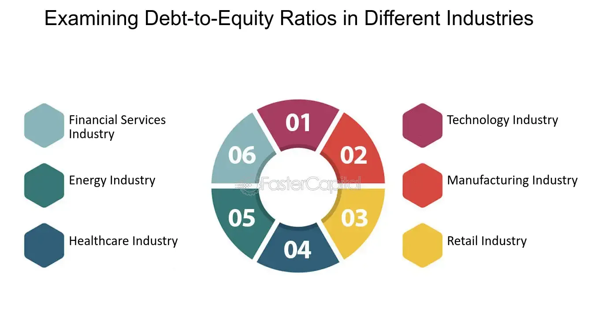

## Table of Contents

## What is the debt-to-equity ratio?

The debt-to-equity ratio is a financial measure that shows how much a company uses debt compared to its equity to run its business. It's calculated by dividing a company's total liabilities by its total equity. This ratio helps investors and analysts understand the financial health and risk level of a company. A higher debt-to-equity ratio means the company is using more debt to finance its operations, which can be riskier because it has to pay back more money.

On the other hand, a lower debt-to-equity ratio suggests that a company is using less debt and more of its own money to run its business, which can be seen as less risky. Different industries have different typical debt-to-equity ratios, so it's important to compare a company's ratio with others in the same industry. This ratio is just one tool among many that people use to make decisions about investing in or lending to a company.

## Why is the debt-to-equity ratio important for analyzing a company's financial health?

The debt-to-equity ratio is important because it tells us how a company is balancing the money it borrows with the money it owns. If a company has a high debt-to-equity ratio, it means it's using a lot of borrowed money to run its business. This can be risky because the company has to pay back that money, and if it can't, it might get into financial trouble. On the other hand, if the ratio is low, it means the company is mostly using its own money, which is generally safer but might mean it's not growing as fast as it could.

This ratio helps investors and lenders decide if they want to put money into a company. If a company has a lot of debt compared to its equity, it might be seen as too risky for some investors. They might worry that the company won't be able to pay back its loans, especially if things go wrong. But if the debt-to-equity ratio is low, it might make investors feel more comfortable because the company seems to be in a stronger financial position. By looking at this ratio, people can get a quick idea of how financially stable a company is and make better decisions about whether to invest or lend money to it.

## How do you calculate the debt-to-equity ratio?

To calculate the debt-to-equity ratio, you need two pieces of information from a company's balance sheet: its total liabilities and its total equity. Total liabilities are all the money the company owes, like loans and other debts. Total equity is the value of the company that belongs to the owners or shareholders. Once you have these numbers, you divide the total liabilities by the total equity. The formula looks like this: Debt-to-Equity Ratio = Total Liabilities / Total Equity.

For example, if a company has total liabilities of $500,000 and total equity of $1,000,000, you would calculate the debt-to-equity ratio like this: $500,000 / $1,000,000 = 0.5. This means the company has half as much debt as it does equity. This simple calculation helps people understand how a company is using borrowed money versus its own money to run its business.

## What are the general benchmarks for a 'good' debt-to-equity ratio?

A 'good' debt-to-equity ratio can be different depending on the industry. Generally, a lower ratio is seen as better because it means the company is not using too much borrowed money. For many industries, a debt-to-equity ratio of around 1 to 1.5 is often considered okay. But for some industries, like utilities or telecoms, a higher ratio might be normal because they need a lot of money to build things like power plants or networks.

It's important to compare a company's debt-to-equity ratio with other companies in the same industry. What might be a high ratio for one type of business could be normal for another. Also, a company with a very low ratio might not be using debt to grow, which can be a missed opportunity. So, when looking at this ratio, think about what's typical for that industry and what the company is trying to do with its money.

## How does the debt-to-equity ratio vary across different industries?

The debt-to-equity ratio can be very different from one industry to another because each type of business has its own way of making money and its own needs for money. For example, industries like utilities and telecoms often have high debt-to-equity ratios. These businesses need a lot of money to build big things like power plants or networks, so they borrow more. It's common for these companies to have ratios of 2 or even higher, and people in the industry see this as normal.

On the other hand, industries like technology or retail might have lower debt-to-equity ratios. These businesses might not need as much money to start up or run, so they don't borrow as much. A tech company might have a ratio of around 0.5 or less, which is seen as good in that industry. People looking at these companies expect them to have less debt compared to their equity.

Understanding what's a normal debt-to-equity ratio for an industry helps people see if a company is using money in a smart way. If a company's ratio is a lot higher or lower than what's normal for its industry, it might be a sign that something is going on. Investors and lenders use this information to decide if they want to put money into a company or not.

## What factors influence the debt-to-equity ratio in different industries?

Different industries have different debt-to-equity ratios because of the way they make and spend money. Some industries, like utilities and telecoms, need a lot of money to build big things like power plants or networks. These companies often borrow a lot of money to do this, which makes their debt-to-equity ratio higher. It's normal for these companies to have ratios of 2 or even more because everyone in the industry knows they need to borrow to get their big projects done.

Other industries, like technology or retail, don't need as much money to start up or keep going. A tech company might just need computers and software, which don't cost as much as a power plant. So, these companies usually borrow less money and have lower debt-to-equity ratios, maybe around 0.5 or less. People in these industries think a lower ratio is good because it means the company isn't taking on too much debt.

The kind of business a company is in affects how much it borrows and how much it owns. Industries that need a lot of money upfront, like manufacturing or real estate, might have higher debt-to-equity ratios because they need loans to buy expensive equipment or land. On the other hand, service industries or businesses that don't need big investments might keep their debt low, leading to lower ratios. Knowing what's normal for an industry helps people understand if a company is using money wisely.

## Can you provide examples of industries with typically high debt-to-equity ratios?

Some industries have high debt-to-equity ratios because they need a lot of money to build big things. For example, the utility industry often has high ratios. Utility companies need to borrow money to build power plants and other big projects. So, it's normal for them to have debt-to-equity ratios of 2 or even higher. Everyone in the industry knows they need to borrow to get their big projects done.

Another example is the telecom industry. Telecom companies need a lot of money to build networks and towers. They borrow money to do this, which makes their debt-to-equity ratios higher. It's common for telecom companies to have ratios of around 2 or more. People in the industry see this as normal because they know it takes a lot of money to build the networks that let us use our phones and the internet.

The real estate industry is another example. Real estate companies often need to borrow money to buy land and build houses or buildings. This makes their debt-to-equity ratios higher. It's common for these companies to have ratios of 1.5 or more. People in the real estate industry understand that borrowing money is part of how they do business.

## Can you provide examples of industries with typically low debt-to-equity ratios?

The technology industry often has low debt-to-equity ratios. Tech companies usually don't need a lot of money to start up or keep going. They might just need computers and software, which don't cost as much as building a factory or a power plant. So, these companies usually borrow less money and have lower debt-to-equity ratios, maybe around 0.5 or less. People in the tech world think a lower ratio is good because it means the company isn't taking on too much debt.

Another industry with typically low debt-to-equity ratios is retail. Retail businesses sell things directly to people, and they don't need huge amounts of money to start up or run their stores. They might have some debt, but usually not as much as industries that need to build big things. So, retail companies often have debt-to-equity ratios below 1. People in the retail industry see this as normal because these businesses can often run well without borrowing a lot of money.

## How does the capital intensity of an industry affect its typical debt-to-equity ratio?

The capital intensity of an industry has a big impact on its typical debt-to-equity ratio. Capital intensity means how much money an industry needs to spend on things like buildings, machines, or technology to make money. Industries that need a lot of money to get started or keep running, like utilities or telecoms, are very capital intensive. These industries often borrow a lot of money to pay for big projects like power plants or networks. Because they borrow so much, their debt-to-equity ratios are usually higher. People in these industries see high ratios as normal because they know it takes a lot of money to build the things they need.

On the other hand, industries that don't need as much money to operate, like technology or retail, are less capital intensive. These businesses might just need computers, software, or a store to sell things. Since they don't need to spend as much to get started or keep going, they don't need to borrow as much money. This means their debt-to-equity ratios are usually lower. People in these industries think a lower ratio is good because it means the company isn't taking on too much debt. So, the amount of money an industry needs to spend on big things directly affects how much it borrows and what its debt-to-equity ratio looks like.

## What are the implications of a high debt-to-equity ratio in industries sensitive to economic cycles?

In industries that are sensitive to economic cycles, like construction or manufacturing, a high debt-to-equity ratio can be risky. These industries can have good times when the economy is doing well, but they can also have bad times when the economy slows down. If a company in one of these industries has a lot of debt, it might struggle to pay back its loans during a downturn. This could lead to financial trouble or even bankruptcy if the company can't make its payments.

On the other hand, during good economic times, a high debt-to-equity ratio might not be as big of a problem. Companies in these industries might use the borrowed money to grow quickly and take advantage of the good economy. But they need to be careful because if the economy turns bad, their high debt could become a big problem. So, while a high debt-to-equity ratio can help a company grow fast when times are good, it also makes the company more vulnerable when the economy isn't doing well.

## How do regulatory environments impact debt-to-equity ratios in specific industries?

Regulatory environments can affect how much debt companies in certain industries can take on, which changes their debt-to-equity ratios. For example, in the banking industry, rules set by the government can limit how much debt banks can have compared to their equity. These rules are made to keep banks safe and stop them from taking too many risks. If a bank has to follow strict rules, it might not be able to borrow as much money, so its debt-to-equity ratio stays lower.

In industries like utilities or telecoms, regulations might allow or even encourage companies to take on more debt. These industries often need a lot of money to build things like power plants or networks, and regulators might see borrowing as a good way to fund these projects. So, companies in these industries might have higher debt-to-equity ratios because the rules let them borrow more. The way regulations work in different industries can really change how much debt companies are willing or able to take on, and this shows up in their debt-to-equity ratios.

## What advanced analytical methods can be used to compare debt-to-equity ratios across industries more effectively?

To compare debt-to-equity ratios across industries more effectively, you can use something called regression analysis. This method helps you see how different things, like the type of industry, affect the debt-to-equity ratio. By using regression analysis, you can find out if an industry's debt-to-equity ratio is high or low because of its own special needs or because of other reasons. This can give you a clearer picture of what's normal for each industry and help you understand why some industries have higher or lower ratios than others.

Another useful method is cluster analysis. This method groups companies into different categories based on how similar their debt-to-equity ratios are. By doing this, you can see patterns and find out which industries are more alike in how they use debt and equity. Cluster analysis can show you if companies in the same industry have similar ratios, or if there are big differences that might need more looking into. Using these advanced methods can help you make better sense of debt-to-equity ratios and compare them across industries in a smarter way.

## What is the Debt-to-Equity Ratio and How Do We Understand It?

The debt-to-equity (D/E) ratio stands as a fundamental financial metric for evaluating a company's financial leverage, particularly illustrating the balance between debt financing and equity financing. It provides a clear representation of how a company finances its operations and growth, offering insight into its financial health and risk exposure.

A high D/E ratio commonly suggests that a company is aggressively pursuing its expansion strategies through debt, which can imply higher potential financial risks if not managed properly. Elevated levels of debt may lead to increased interest obligations and can amplify the impact of economic downturns, thereby raising the company's financial vulnerability. For instance, in economic climates where interest rates are volatile, companies with high D/E ratios might face difficulties in covering their debt payments without affecting operations.

Conversely, a lower D/E ratio typically indicates a more conservative approach to growth, with less reliance on borrowed funds. This approach can lead to lower risk profiles since the company limits its exposure to debt-related obligations. Companies that maintain a lower D/E ratio may have greater flexibility to navigate financial challenges and adjust to changing market conditions, thus appealing to risk-averse investors.

Investors and creditors extensively use the D/E ratio to assess a company's financial health and risk profile. A balanced D/E ratio is generally favored as it reflects a stable equilibrium between debt and equity, underpinning a company's capacity to sustain its operations over the long term without excessive reliance on debt. Such equilibrium not only comforts stakeholders regarding the company’s ability to meet its financial obligations but also indicates prudent management of financial resources.

The calculation of the D/E ratio is straightforward and involves dividing a company's total liabilities by its shareholder equity:

$$
\text{D/E Ratio} = \frac{\text{Total Liabilities}}{\text{Shareholder Equity}}
$$

This formula allows stakeholders to easily quantify financial leverage and compare it against industry benchmarks. While evaluating a company's D/E ratio, it's important to consider the industry-specific norms, as different industries operate under unique economic conditions and have varying capital structure requirements.

In summary, the D/E ratio is an essential tool for financial analysis, reflecting the underlying strategy employed by a company to balance growth with financial stability. Its application helps investors and managers alike to make informed decisions, maintaining a vigilant eye on potential financial risks and adjusting strategies accordingly.

## How does Debt Capital influence Corporate Growth?

Debt capital is crucial for companies seeking to expand while maintaining their ownership structure. Through debt financing, firms can fund research and development, pursue strategic acquisitions, and extend their market presence without issuing new equity. This approach allows existing shareholders to retain control and potentially benefit from increased earnings and share value.

Proper management of the debt-to-equity (D/E) ratio is vital to avoid excessive leverage, which can heighten financial risk. A well-balanced D/E ratio ensures a company's capital structure is optimized. This optimization is often evaluated using the Weighted Average Cost of Capital (WACC), which represents the average rate a company is expected to pay to finance its assets. The formula for WACC is:

$$
WACC = \left(\frac{E}{V} \times Re\right) + \left(\frac{D}{V} \times Rd \times (1 - Tc)\right)
$$

where:

- $E$ is the market value of equity
- $V$ is the total market value of equity and debt
- $Re$ is the cost of equity
- $D$ is the market value of debt
- $Rd$ is the cost of debt
- $Tc$ is the tax rate

A lower WACC indicates a reduction in the overall cost of capital, which can lead to heightened shareholder value and improved profitability. Companies strive to achieve an optimal blend of debt and equity to maintain financial flexibility and support growth initiatives while mitigating risk.

Balancing these elements enables firms to meet their strategic growth objectives efficiently. Successful debt management involves a calculated approach to leverage, allowing companies to capitalize on growth opportunities while safeguarding against market [volatility](/wiki/volatility-trading-strategies) and economic downturns. Effective use of debt contributes to sustainable value creation, ensuring that shareholders reap the benefits of strategic investments over the long term.

## References & Further Reading

Investopedia provides an excellent overview of the Debt-to-Equity (D/E) Ratio and its implications on financial leverage and stability, offering insights into how companies balance their debt and equity to manage financial risk effectively [Investopedia](https://www.investopedia.com/terms/d/debtequityratio.asp). This resource is beneficial for understanding the basic concept and practical applications of the D/E ratio in various financial contexts. 

"Corporate Finance: Theory and Practice" by Aswath Damodaran presents a comprehensive exploration of financial metrics, including the D/E ratio, providing detailed analysis and methodologies to evaluate corporate financial structures [Damodaran, Aswath. Corporate Finance: Theory and Practice]. Damodaran's work is instrumental for those seeking to gain a thorough understanding of corporate finance theories and their application in real-world scenarios.

The CFA Institute investigates deeply into financial leverage and the Debt-to-Equity Ratio as crucial aspects of evaluating capital structures. Their materials are well-regarded in the finance community for offering foundational and advanced knowledge on how these ratios inform investment decisions and corporate strategies [CFA Institute, Corporate Finance Material].

John C. Hull's works examine the integration of financial derivatives with corporate financial metrics, including the influences of leverage and risk management [Hull, John C. Options, Futures, and Other Derivatives]. Hull's comprehensive analysis is valuable for professionals seeking to connect derivative markets with broader financial and corporate strategies, enhancing understanding of leverage effects.

Research studies focusing on industry dynamics provide essential context on how external factors influence financial ratios like the D/E ratio. Such studies help to comprehend how industry-specific conditions, such as regulatory changes or macroeconomic shifts, impact the financial strategies and risk profiles of companies. These dynamics are crucial for investors aiming to contextualize financial metrics within the broader economic and industry landscape.

These references provide varied perspectives and depths of information beneficial for investors, analysts, and financial professionals interested in fully grasping the implications of the Debt-to-Equity Ratio, enabling them to make informed and strategic investment decisions.

