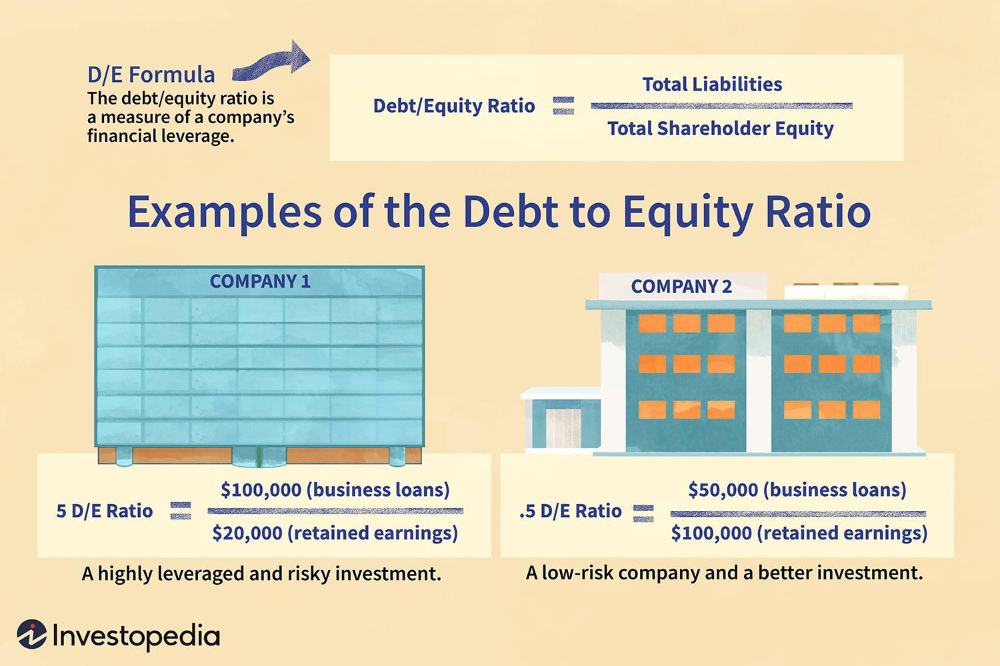

The debt-to-equity (D/E) ratio is a crucial financial metric for evaluating a company's financial leverage. It compares a company's total liabilities to its shareholder equity, offering insights into how the company finances its operations and manages the balance between debt and equity financing. This ratio reveals not only how effectively a company is leveraging its debt to propel growth but also the potential risks associated with its financial strategy. A higher D/E ratio generally indicates that a company relies more heavily on borrowed funds, which could imply a greater risk if the company faces economic downturns. Conversely, a lower D/E ratio suggests a more conservative financial approach with a reliance on equity.

This article examines the multifaceted role of the D/E ratio in finance and investment, emphasizing its importance in understanding a company's financial framework and strategic posture. We investigate how the D/E ratio varies significantly across industries, driven by differing capital requirements and business models. For instance, industries like utilities may exhibit higher D/E ratios due to substantial capital investments in infrastructure, whereas technology firms often display lower ratios due to the inherent unpredictability of their revenues and reliance on equity for funding research and development.



Additionally, the link between debt capital and corporate growth underscores a company's ability to expand without diluting ownership stakes, providing insights into the sustainability of growth strategies and shareholder value enhancement. Algorithmic trading further leverages financial metrics like the D/E ratio, incorporating them into trading strategies to optimize decision-making and risk management. The goal of this article is to equip investors, analysts, and decision-makers with a comprehensive understanding of the D/E ratio's significance in making informed financial decisions. By mastering this metric, they can optimize risk-return profiles and align strategies with broader financial objectives.

## Table of Contents

## Understanding Debt-to-Equity Ratio

The debt-to-equity (D/E) ratio stands as a fundamental financial metric for evaluating a company's financial leverage, particularly illustrating the balance between debt financing and equity financing. It provides a clear representation of how a company finances its operations and growth, offering insight into its financial health and risk exposure.

A high D/E ratio commonly suggests that a company is aggressively pursuing its expansion strategies through debt, which can imply higher potential financial risks if not managed properly. Elevated levels of debt may lead to increased interest obligations and can amplify the impact of economic downturns, thereby raising the company's financial vulnerability. For instance, in economic climates where interest rates are volatile, companies with high D/E ratios might face difficulties in covering their debt payments without affecting operations.

Conversely, a lower D/E ratio typically indicates a more conservative approach to growth, with less reliance on borrowed funds. This approach can lead to lower risk profiles since the company limits its exposure to debt-related obligations. Companies that maintain a lower D/E ratio may have greater flexibility to navigate financial challenges and adjust to changing market conditions, thus appealing to risk-averse investors.

Investors and creditors extensively use the D/E ratio to assess a company's financial health and risk profile. A balanced D/E ratio is generally favored as it reflects a stable equilibrium between debt and equity, underpinning a company's capacity to sustain its operations over the long term without excessive reliance on debt. Such equilibrium not only comforts stakeholders regarding the company’s ability to meet its financial obligations but also indicates prudent management of financial resources.

The calculation of the D/E ratio is straightforward and involves dividing a company's total liabilities by its shareholder equity:

$$
\text{D/E Ratio} = \frac{\text{Total Liabilities}}{\text{Shareholder Equity}}
$$

This formula allows stakeholders to easily quantify financial leverage and compare it against industry benchmarks. While evaluating a company's D/E ratio, it's important to consider the industry-specific norms, as different industries operate under unique economic conditions and have varying capital structure requirements.

In summary, the D/E ratio is an essential tool for financial analysis, reflecting the underlying strategy employed by a company to balance growth with financial stability. Its application helps investors and managers alike to make informed decisions, maintaining a vigilant eye on potential financial risks and adjusting strategies accordingly.

## Optimal Debt-to-Equity Ratio by Industry

Debt-to-equity (D/E) ratios vary significantly across industries due to distinct financial strategies and differing market conditions. These differences are primarily driven by sector-specific operational demands and financing practices, which in turn influence the typical capital structure within each industry.

Industries such as utilities typically exhibit higher D/E ratios. This phenomenon is largely attributed to the substantial infrastructure investments required to maintain and expand services, which is often financed through debt. Utility companies benefit from stable cash flows and regulated pricing structures, allowing them to sustain higher levels of debt responsibly. Consequently, these companies opt for increased leverage, as it enables them to fund capital-intensive projects without excessively diluting shareholder equity.

Conversely, technology sectors are characterized by lower D/E ratios. The inherent uncertainties in revenue streams, along with significant research and development expenses, prompt tech companies to rely more heavily on equity financing. This approach reduces financial risk in environments where future cash flows are unpredictable. Equity financing provides the necessary flexibility to adapt to rapid technological advancements and volatile market conditions.

Understanding these variances is essential for conducting accurate financial analysis and making informed investment decisions. Investors use industry-specific benchmarks to interpret D/E ratios effectively, recognizing that an optimal ratio can vary widely between sectors. For instance, while a high D/E ratio might be standard in utilities, the same ratio could signal potential risk in the technology sector.

A strategic understanding of industry-specific D/E norms supports investors in assessing corporate financial health. This knowledge guides decision-making processes by aligning investment strategies with sector-specific risk profiles and growth prospects. By factoring in industry norms, investors can better determine the appropriate level of financial leverage for companies within different sectors, optimizing their risk-return profiles and enhancing the efficacy of their financial analyses.

## Debt Capital and Corporate Growth

Debt capital is crucial for companies seeking to expand while maintaining their ownership structure. Through debt financing, firms can fund research and development, pursue strategic acquisitions, and extend their market presence without issuing new equity. This approach allows existing shareholders to retain control and potentially benefit from increased earnings and share value.

Proper management of the debt-to-equity (D/E) ratio is vital to avoid excessive leverage, which can heighten financial risk. A well-balanced D/E ratio ensures a company's capital structure is optimized. This optimization is often evaluated using the Weighted Average Cost of Capital (WACC), which represents the average rate a company is expected to pay to finance its assets. The formula for WACC is:

$$
WACC = \left(\frac{E}{V} \times Re\right) + \left(\frac{D}{V} \times Rd \times (1 - Tc)\right)
$$

where:

- $E$ is the market value of equity
- $V$ is the total market value of equity and debt
- $Re$ is the cost of equity
- $D$ is the market value of debt
- $Rd$ is the cost of debt
- $Tc$ is the tax rate

A lower WACC indicates a reduction in the overall cost of capital, which can lead to heightened shareholder value and improved profitability. Companies strive to achieve an optimal blend of debt and equity to maintain financial flexibility and support growth initiatives while mitigating risk.

Balancing these elements enables firms to meet their strategic growth objectives efficiently. Successful debt management involves a calculated approach to leverage, allowing companies to capitalize on growth opportunities while safeguarding against market [volatility](/wiki/volatility-trading-strategies) and economic downturns. Effective use of debt contributes to sustainable value creation, ensuring that shareholders reap the benefits of strategic investments over the long term.

## Algorithmic Trading and Financial Metrics

Algorithmic trading employs sophisticated quantitative models and computer algorithms to automate trading decisions, with financial ratios such as the debt-to-equity (D/E) ratio serving as critical indicators. The D/E ratio is particularly useful in assessing a company's financial leverage and identifying potential vulnerabilities that may arise in volatile market conditions. A high D/E ratio, for instance, may signal increased risk exposure, aiding algorithms in making informed trading decisions.

Sophisticated algorithmic systems utilize Python libraries, such as Pandas and NumPy, to process vast datasets, automate calculations, and enhance the precision of trading decisions. These tools support rapid data manipulation and numerical computations, integral to algorithmic strategies. For example, using Python, traders can efficiently calculate the D/E ratio for multiple companies:

```python
import pandas as pd

# Suppose 'data' is a DataFrame containing companies' financial data
data['D/E Ratio'] = data['Total Liabilities'] / data['Shareholder Equity']

# Filtering companies with D/E ratio above a certain threshold
high_leverage_companies = data[data['D/E Ratio'] > threshold]
```

In optimizing trade execution, financial metrics like the D/E ratio are embedded within algorithms to align with broader financial strategies. This incorporation aids in dynamically adjusting portfolios, either enhancing returns or minimizing risk, based on real-time market data and anticipated trends. Traders might integrate the D/E ratio in broader algorithms that adjust position sizes or hedge against market downturns.

The adoption of algorithmic techniques enhances the speed and accuracy of trading strategies, particularly in complex financial landscapes characterized by rapid market shifts. These algorithms can execute orders in milliseconds, allowing trades to capitalize on fleeting opportunities, adapt to new information, and rebalance portfolios efficiently.

Overall, [algorithmic trading](/wiki/algorithmic-trading) harnesses the analytical power of financial metrics such as the D/E ratio to drive strategic trading decisions, aligning them with not only immediate market conditions but overarching financial goals. This integration ensures that trading strategies remain both responsive and well-founded amid fluctuating financial environments.

## Conclusion

The debt-to-equity (D/E) ratio is a crucial metric that plays a significant role in evaluating a company's financial health and guiding strategic management decisions. It serves as a barometer for understanding the balance between debt and equity, providing insights into financial stability. A well-balanced D/E ratio suggests a harmonious relationship between debt and equity, thereby reducing exposure to financial risks and fostering stability. This equilibrium ensures that companies are not overly reliant on either financing method, which can lead to vulnerabilities.

Incorporating the D/E ratio into corporate finance and algorithmic trading further underscores its importance in strategic decision-making. For corporate finance, it helps in optimizing capital structure, guiding companies on whether to increase equity or take on more debt based on current economic conditions and corporate strategies. In algorithmic trading, the D/E ratio is integrated as a key variable within trading algorithms, offering a systematic approach to evaluating financial leverage and informing buying or selling decisions during market fluctuations.

Continuous monitoring of D/E ratios by investors is essential to ensure alignment with broader financial objectives. It plays a vital role in optimizing risk-return profiles by allowing investors to identify potential red flags or opportunities within a company's capital structure. By tracking changes in the D/E ratio over time, investors can make informed decisions about portfolio adjustments to maintain desired risk levels.

Integrating D/E ratios into financial analysis and trading algorithms enriches investment strategies, making them more informed and adaptive. The ability to swiftly analyze and respond to changes in a company's financial leverage enhances the responsiveness and precision of investment strategies, ensuring they remain robust under varying market conditions. This integration not only aids in managing risk but also in seizing opportunities derived from market inefficiencies, ultimately contributing to a more efficient and effective investment management process.

## References & Further Reading

Investopedia provides an excellent overview of the Debt-to-Equity (D/E) Ratio and its implications on financial leverage and stability, offering insights into how companies balance their debt and equity to manage financial risk effectively [Investopedia](https://www.investopedia.com/terms/d/debtequityratio.asp). This resource is beneficial for understanding the basic concept and practical applications of the D/E ratio in various financial contexts. 

"Corporate Finance: Theory and Practice" by Aswath Damodaran presents a comprehensive exploration of financial metrics, including the D/E ratio, providing detailed analysis and methodologies to evaluate corporate financial structures [Damodaran, Aswath. Corporate Finance: Theory and Practice]. Damodaran's work is instrumental for those seeking to gain a thorough understanding of corporate finance theories and their application in real-world scenarios.

The CFA Institute investigates deeply into financial leverage and the Debt-to-Equity Ratio as crucial aspects of evaluating capital structures. Their materials are well-regarded in the finance community for offering foundational and advanced knowledge on how these ratios inform investment decisions and corporate strategies [CFA Institute, Corporate Finance Material].

John C. Hull's works examine the integration of financial derivatives with corporate financial metrics, including the influences of leverage and risk management [Hull, John C. Options, Futures, and Other Derivatives]. Hull's comprehensive analysis is valuable for professionals seeking to connect derivative markets with broader financial and corporate strategies, enhancing understanding of leverage effects.

Research studies focusing on industry dynamics provide essential context on how external factors influence financial ratios like the D/E ratio. Such studies help to comprehend how industry-specific conditions, such as regulatory changes or macroeconomic shifts, impact the financial strategies and risk profiles of companies. These dynamics are crucial for investors aiming to contextualize financial metrics within the broader economic and industry landscape.

These references provide varied perspectives and depths of information beneficial for investors, analysts, and financial professionals interested in fully grasping the implications of the Debt-to-Equity Ratio, enabling them to make informed and strategic investment decisions.