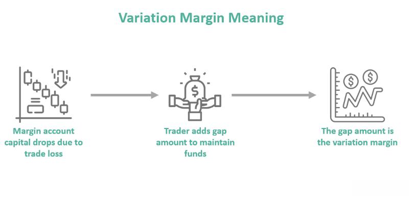

In the world of financial markets, effective risk management is paramount to maintaining a stable and efficient trading environment. Variation margin serves as a crucial component in this system, acting as a buffer that absorbs market fluctuations and guards against potential financial instability. It functions by adjusting the collateral required from traders, ensuring they have sufficient funds to cover any adverse market movements. This dynamic process is essential for mitigating risks and preventing defaults that could cascade through financial systems.

This article explores the intricate connections between variation margin, collateral, and algorithmic trading, each playing a significant role in the broader context of financial risk management. Collateral, often in the form of cash or securities, acts as a safety net that supports the margining process, reducing the risk of counterparty default. Algorithmic trading, which relies on computer algorithms to make swift trading decisions, introduces additional layers of complexity and opportunity in managing variation margin requirements. These automated systems enhance the ability to react in real time to margin requirements, optimizing the balance between risk and reward.



By examining these elements, we aim to provide a comprehensive overview of how they interplay to maintain market stability. The effective management of variation margin not only protects individual traders and clearinghouses but also contributes to the resilience of financial markets as a whole. Through this lens, understanding the ongoing enhancements in technology and strategies for collateral management becomes critical for participants seeking to navigate the evolving landscape of global markets.

## Table of Contents

## What is Variation Margin?

Variation margin is a pivotal financial mechanism used by clearinghouses to ensure stability within the financial markets. This mechanism involves the regular adjustment of a trader's account to reflect the current market value of their trades, thereby covering potential losses that may arise from market fluctuations. The primary objective of variation margin is to mitigate credit risk by ensuring that all parties involved in a transaction maintain adequate financial resources to cover any shortfalls.

In practice, variation margin functions as a risk management tool that responds dynamically to changes in market prices. When the market value of a trader's position decreases, resulting in a potential loss, the clearinghouse calls for additional funds (variation margin) to be deposited into the trader's account. This requirement protects the financial integrity of both the trader and the clearinghouse, preventing scenarios where market participants might be unable to meet their financial obligations.

Mathematically, variation margin can be expressed through the change in the market value of the open positions of a trader. If $V_t$ represents the market value of a position at time $t$, and $V_{t-1}$ its value at the previous assessment, then the variation margin requirement $\Delta VM$ can be formulated as:

$$
\Delta VM = V_t - V_{t-1}
$$

This formula indicates that the variation margin is positive when there's a loss and negative when there's a gain. By continuously updating margins according to real-time data, clearinghouses can maintain market discipline and reduce systemic risk.

In the context of futures contracts, variation margin plays an essential role in maintaining a balanced financial landscape. As futures contracts fluctuate in value, the variation margin adjusts the trader's collateral to account for these changes, thus ensuring that positions are adequately collateralized at all times. This mechanism is crucial in preventing defaults and preserving confidence in financial instruments that rely heavily on leveraged positions.

Overall, variation margin constitutes an integral part of the financial markets, acting as a safeguard against [volatility](/wiki/volatility-trading-strategies) and ensuring that all participants maintain the financial resources necessary to meet their obligations. It is a cornerstone in the architecture of contemporary financial risk management frameworks.

## Role in Financial Risk Management

Variation margin is a key component in the framework of financial risk management, specifically designed to address the potential for losses inherent in the trading and clearing processes. It is primarily used to manage counterparty risk and ensure the integrity of the financial system, even in times of heightened market volatility. This process involves adjusting the collateral provided by traders in response to fluctuations in market prices. Such adjustments are essential for maintaining sufficient financial backing to cover potential losses, thereby minimizing default risk.

Effective management of variation margin helps clearinghouses and market participants maintain stability during periods of high volatility, which might otherwise lead to significant financial distress. During times of market turmoil, asset values can change rapidly, posing a risk to the solvency of traders and clearinghouses. By requiring additional collateral when asset prices move unfavorably, variation margin ensures that there is a buffer to absorb potential losses. This buffering effect is crucial in preventing a cascade of defaults that could disrupt the entire financial ecosystem.

Consider an example where a trader holds a position with a derivative contract subject to daily fluctuations. If market prices drop, the value of the contract may fall below the initial margin posted. In this situation, a clearinghouse will issue a variation margin call to compensate for the loss in value, prompting the trader to deposit additional funds. This mechanism ensures that the trader maintains adequate capital to satisfy their financial obligations, thus reducing the risk of a failure to meet contract terms.

Mathematically, the calculation of variation margin ($VM$) can be reflected as:
$$
VM = MV_{\text{current}} - MV_{\text{previous}}
$$
where $MV_{\text{current}}$ and $MV_{\text{previous}}$ are the current and previous market values of the position, respectively.

Furthermore, the systematic execution of variation margin calls aids in stabilizing the financial ecosystem amid market downturns. By mandating participants to uphold their financial commitments dynamically, the system maintains a balance that promotes fairness and reduces systemic risk. This proactive approach is especially crucial during economic downturns when market confidence is typically lower, and the propensity for [liquidity](/wiki/liquidity-risk-premium) crises is higher. Overall, the role of variation margin in risk management is indispensable, ensuring that markets function smoothly even under stress, ultimately safeguarding both individual traders and the financial system at large.

## Collateral and Margin Calls

Collateral plays a critical role in financial markets by acting as a safety net to offset the risks connected with variation margin. It is provided by traders as a guarantee to assure the settlement of potential losses that might arise due to market fluctuations. As financial markets experience volatility, the value of assets can fluctuate rapidly, necessitating an effective use of collateral to maintain market stability.

A margin call is initiated when a trading account's equity falls below the necessary maintenance margin level. This event prompts traders to deposit additional funds or securities to restore the account to the specified margin requirement. Failure to meet a margin call might result in the liquidation of trading positions, which can lead to significant financial losses and market instability.

Efficient management of collateral is imperative for meeting margin calls without resorting to the liquidation of positions. This efficiency can be achieved through diverse strategies, including maintaining a diversified pool of collateral assets to provide flexibility and reduce dependency on any single asset. Moreover, leveraging technology for real-time monitoring of account balances and sophisticated risk assessment can enable traders to anticipate and respond promptly to margin calls.

The incorporation of automated systems for collateral management is becoming increasingly popular, allowing for the seamless transfer and allocation of collateral to satisfy margin requirements. These systems help minimize human error, increase speed, and improve operational efficiency in managing collateral across different trading venues.

By actively managing collateral and understanding the dynamics of margin calls, traders can better navigate the complexities of financial markets, ensuring both stability and profitability in their trading activities.

## Impact of Market Volatility

Market volatility plays a crucial role in shaping variation margin requirements within financial markets. Variation margin refers to the funds required by clearinghouses to adjust traders' accounts in response to market fluctuations. When markets are highly volatile, the prices of underlying assets can change rapidly within short periods, thereby affecting the variation margin demands.

During periods of high volatility, traders may experience increased margin calls. A margin call occurs when an account's equity falls below the required maintenance margin due to unfavorable market movements. This mechanism compels traders to deposit additional funds to cover potential losses. As a result, higher volatility can strain liquidity management, as traders must quickly source additional capital to meet these calls. The liquidity pressure is intensified when multiple assets in a portfolio are simultaneously affected by market swings.

For instance, consider the hypothetical scenario where a trader holds a futures contract on a stock index. If market conditions cause a significant decline in the index value, the trader may face a margin call to maintain their position. Mathematically, if $V_0$ is the initial contract value and $V_t$ is the new value due to market changes, then the variation margin $VM$ required can be represented by:

$$
VM = (V_0 - V_t) \times \text{Contract Multiplier}
$$

In such cases, a high value of $V_0 - V_t$ during market volatility results in a larger variation margin requirement, precipitating a margin call.

To manage these challenges, traders are encouraged to adopt adaptive strategies. One effective method is the implementation of real-time risk monitoring systems that provide instant updates on margin requirements. These systems enable traders to preemptively manage their positions and mitigate the impact of sudden volatility. Moreover, robust risk management strategies, such as diversifying asset holdings and employing hedging techniques, can help cushion against adverse market movements.

The ability to promptly react to market changes, particularly those induced by volatility, is vital for maintaining liquidity and avoiding forced liquidation of positions under severe conditions. Equipped with comprehensive strategies and technological tools, traders can better navigate volatile markets, ensuring they meet variation margin requirements while sustaining financial stability.

## Algorithmic Trading and Risk Management

Algorithmic trading, a method utilizing algorithms to execute trading orders at high speed and [volume](/wiki/volume-trading-strategy), is reshaping risk management in financial markets. By leveraging programmed instructions, [algorithmic trading](/wiki/algorithmic-trading) optimizes trading strategies to meet margin requirements dynamically. This process involves adjusting trading positions based on real-time market analysis, ensuring that traders maintain the necessary variation margin to protect against market fluctuations. 

Automated systems are integral to this optimization, providing the capacity to track variation margins and manage collateral efficiently. These systems enable the real-time assessment of margin levels, ensuring traders have sufficient capital to meet potential losses. For example, algorithmic strategies can continuously monitor a trader’s portfolio and automatically execute trades to maintain the required margin levels, reducing the likelihood of a margin call.

Furthermore, algorithmic trading enhances risk mitigation by ensuring swift responses to margin calls. In scenarios of increased market volatility, algorithms can promptly liquidate or alter positions to replenish margin levels, safeguarding against default. By integrating real-time data analytics, these systems can predict the need for margin adjustments and execute trades that align with the trader's risk management objectives.

Python, a popular language for developing algorithmic trading strategies, offers libraries such as Pandas and NumPy for data manipulation and analysis. Automated trading solutions can be implemented using these tools to streamline the margin management process. For instance, a basic Python script may include:

```python
import pandas as pd
import numpy as np

def adjust_positions(current_margin, required_margin, positions):
    if current_margin < required_margin:
        # Logic to adjust positions could be included here
        positions = positions * (required_margin / current_margin)
    return positions

# Example usage
current_margin = 9500
required_margin = 10000
positions = np.array([100, 200, 150])

adjusted_positions = adjust_positions(current_margin, required_margin, positions)
print("Adjusted Positions:", adjusted_positions)
```

This script highlights a simplistic strategy for adjusting trading positions based on margin requirements, showcasing how algorithmic systems can automate risk management processes. By refining these algorithms, traders can achieve higher efficiency in maintaining their margin levels, ultimately contributing to a more stable trading environment.

## Strategies for Optimizing Margin Requirements

Diversification is a cornerstone strategy for optimizing margin requirements within financial portfolios. By spreading investments across various asset classes, sectors, or geographic regions, traders can mitigate the risk associated with adverse price movements in a specific market. This distributed approach reduces exposure to single market events, helping to maintain a stable variation margin requirement and enhancing the overall resilience of a financial portfolio.

Real-time monitoring tools have revolutionized the management of trading positions in response to variation margin needs. These systems utilize advanced algorithms and data analytics to provide up-to-the-minute insights into market dynamics, enabling traders to adjust their positions proactively. By continuously assessing changes in market conditions, these tools can help prevent margin shortfalls and reduce the likelihood of margin calls. For instance, Python libraries such as `pandas` and `numpy` can be employed to analyze large datasets efficiently, while visualization tools like `matplotlib` allow for the clear presentation of trends and forecasts.

```python
import pandas as pd
import numpy as np
import matplotlib.pyplot as plt

# Sample code to simulate portfolio diversification and monitor variation margin
# Generate random data for portfolio returns
np.random.seed(42)
portfolio_returns = np.random.normal(0, 0.1, 100)

# Calculate variation margin requirement over time
variation_margin_requirement = np.maximum.accumulate(np.absolute(portfolio_returns))

# Plot the variation margin requirement
plt.figure(figsize=(10, 6))
plt.plot(variation_margin_requirement, label='Variation Margin Requirement')
plt.title('Portfolio Variation Margin Over Time')
plt.xlabel('Time')
plt.ylabel('Margin Requirement')
plt.legend()
plt.show()
```

Implementing advanced collateral management solutions across trading venues enhances overall efficiency in meeting variation margin needs. These solutions involve sophisticated risk assessment models and streamlined processes for collateral transfers, ensuring rapid and effective fund reallocation in response to margin calls. By optimizing the use of collateral, traders can maintain liquidity and minimize the operational impact of margin fluctuations.

Incorporating these strategies—diversification, real-time monitoring, and advanced collateral management—can significantly enhance a trader's ability to handle variation margin requirements efficiently. This not only stabilizes financial positions but also contributes to the broader objective of maintaining market stability in face of volatility.

## Regulatory Considerations

Regulations around variation margin play a critical role in ensuring the stability and integrity of financial markets. Variation margin, as a tool of risk management, requires that market participants maintain sufficient capital reserves to cover potential losses from market fluctuations. This process acts as a safeguard against defaults that could ripple through the financial system, compromising its integrity.

Global compliance with variation margin requirements establishes a level playing field for financial markets. Regulatory bodies across different jurisdictions have implemented standards to ensure that all market participants adhere to minimum margin requirements. For instance, the International Organization of Securities Commissions (IOSCO) and the Basel Committee on Banking Supervision (BCBS) have issued guidelines that promote consistency in margin practices globally. These regulations aim to prevent systemic risk by ensuring that all firms are equally prepared to handle adverse market conditions.

Traders and financial institutions must remain vigilant about regulatory changes related to variation margins. Regulatory environments are dynamic, with frequent updates and revisions reflecting the evolving nature of financial markets. Non-compliance with these regulations can lead to significant penalties, including fines, increased capital requirements, or restrictions on trading activities. Therefore, market participants should invest in robust compliance frameworks and regularly update their knowledge on regulatory developments.

In summary, regulation around variation margins is integral to maintaining market stability and fairness. By adhering to global compliance standards, financial institutions can mitigate systemic risks and promote a secure trading environment. Keeping abreast of regulatory changes is essential for avoiding penalties and ensuring ongoing compliance in the financial landscape.

## Future Trends and Conclusion

The future of variation margins is intrinsically linked to technological advancements that are reshaping the financial industry. As markets become increasingly digital, the need for effective and efficient margin management is paramount. Innovations in technology, particularly in [artificial intelligence](/wiki/ai-artificial-intelligence) (AI) and [machine learning](/wiki/machine-learning) (ML), are providing new tools for enhancing margin practices. Advanced algorithms are capable of analyzing vast amounts of market data in real-time, enabling more precise adjustments to variation margin requirements. This real-time analysis is critical for responding swiftly to market fluctuations and for optimizing the allocation of collateral.

Blockchain technology is another transformative force in margin management. Its inherent transparency and immutability can enhance the security and efficiency of margin transactions. Blockchain can facilitate the automatic execution of margin calls and settlements, thus reducing the time lags and operational risks associated with traditional methods. Smart contracts, deployed on blockchain platforms, can automate the enforcement of margin agreements, providing greater certainty and reducing the need for intermediaries.

The emphasis on transparency and efficiency in margin management aligns closely with evolving regulatory requirements. Regulatory bodies globally are pushing for greater transparency to protect market participants and ensure stability. Consequently, financial institutions need to integrate robust compliance mechanisms into their margin management frameworks. This not only involves adhering to existing regulations but also staying informed about impending regulatory changes.

Understanding the continuously evolving landscape of variation margins is crucial for traders and institutions. As market volatility remains a constant concern, developing adaptive strategies that leverage modern technology is essential. By embracing these advancements, financial entities can enhance their risk management capabilities, ensure regulatory compliance, and maintain a competitive edge in modern markets. In conclusion, while the journey towards optimized margin management is complex, the synergy of technology and regulatory frameworks presents an opportunity to elevate financial stability and integrity.

## References & Further Reading

[1]: Gregory, J. (2014). ["Counterparty Credit Risk and Credit Value Adjustment: A Continuing Challenge for Global Financial Markets."](https://onlinelibrary.wiley.com/doi/book/10.1002/9781118673638) Wiley Finance.

[2]: Hull, J. C. (2018). ["Options, Futures, and Other Derivatives."](https://www.semanticscholar.org/paper/Options%2C-Futures%2C-and-Other-Derivatives-Hull/89bdee500c8623864fc9eb7a471546aa713acc44) Pearson Education.

[3]: Murphy, J. J. (1999). ["Technical Analysis of the Financial Markets: A Comprehensive Guide to Trading Methods and Applications."](https://drive.google.com/file/d/1OcDrGakDhaejT7J7xGEE3HHKy7xmrafy/preview) Penguin.

[4]: Aldridge, I. (2013). ["High-Frequency Trading: A Practical Guide to Algorithmic Strategies and Trading Systems."](https://books.google.com/books/about/High_Frequency_Trading.html?id=6l0DDQAAQBAJ) Wiley Finance.

[5]: ["Principles for Financial Market Infrastructures"](https://www.bis.org/cpmi/info_pfmi.htm) by the Committee on Payments and Market Infrastructures (CPMI) and the International Organization of Securities Commissions (IOSCO).