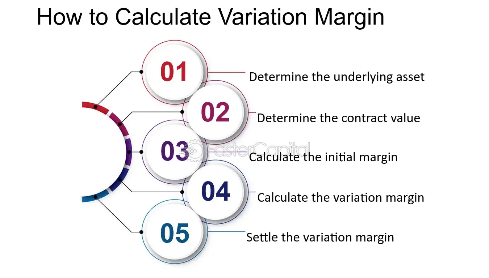

## Table of Contents

## What is variation margin?

Variation margin is a type of margin that is used in futures and derivatives trading. It is the amount of money that traders have to pay or receive daily to cover any losses or gains from the price changes of the futures contract they hold. This helps keep the account balance in line with the market value of the contract. If the market moves against a trader's position, they will need to add more money to their account to meet the variation margin requirement.

The variation margin is calculated at the end of each trading day based on the settlement price of the futures contract. This process ensures that the risk of default is minimized because the gains and losses are settled daily. For example, if a trader's futures contract loses value, they will need to deposit the variation margin to cover that loss. On the other hand, if the contract gains value, the trader will receive money into their account. This daily adjustment helps maintain the financial integrity of the futures market.

## Why is variation margin important in trading?

Variation margin is really important in trading because it helps keep things fair and safe. When people trade futures or derivatives, the prices can change every day. Variation margin makes sure that if the price goes down and a trader loses money, they have to add more money to their account right away. This stops traders from getting into big debts they can't pay back. It's like a safety net that keeps the market stable and trustworthy.

Also, variation margin helps everyone know where they stand each day. At the end of every trading day, the gains and losses are figured out and settled. If a trader's contract goes up in value, they get money added to their account. If it goes down, they have to pay more money. This daily check helps traders manage their money better and makes sure that everyone follows the rules. It's a key part of keeping the trading world running smoothly.

## How does variation margin differ from initial margin?

Variation margin and initial margin are both important in trading, but they serve different purposes. Initial margin is the money you need to put down when you start trading a futures or derivatives contract. It's like a deposit that shows you're serious about the trade and helps cover any potential losses. You only pay the initial margin once, at the beginning of your trade.

On the other hand, variation margin is the money you might need to add or get back every day while your trade is open. It's based on how the price of your contract changes each day. If the price goes up, you get money added to your account. If it goes down, you have to add more money to cover the loss. Variation margin makes sure that your account balance stays in line with the market value of your contract every day.

## What types of financial instruments typically require variation margin?

Variation margin is mostly used with futures contracts. These are agreements to buy or sell something at a set price in the future. When you trade futures, the price can change every day. So, variation margin makes sure that if the price goes down, you add more money to your account to cover the loss. If it goes up, you get money added to your account. This helps keep the trading safe and fair for everyone.

Variation margin is also used with other types of derivatives like options and swaps. Options give you the right to buy or sell something at a set price, while swaps let you exchange cash flows based on different rates or prices. Just like with futures, the value of these contracts can change daily. So, variation margin helps manage the daily ups and downs, making sure traders can handle any losses and keeping the market stable.

## How is variation margin calculated?

Variation margin is calculated at the end of each trading day based on the settlement price of the futures or derivatives contract. The settlement price is the price at which the contract is valued at the end of the day. To figure out the variation margin, you compare the settlement price to the price from the day before. If the settlement price is higher, you get money added to your account. If it's lower, you have to add money to cover the loss. The amount of money you need to add or get back is the difference between these two prices, multiplied by the size of your contract.

For example, let's say you have a futures contract for corn, and the size of the contract is 5,000 bushels. If the settlement price yesterday was $4.00 per bushel and today it's $4.10 per bushel, the price went up by $0.10. So, you would get $500 added to your account (5,000 bushels times $0.10). If the price had gone down to $3.90 instead, you would need to add $500 to your account (5,000 bushels times -$0.10). This daily calculation makes sure your account stays in line with the market value of your contract.

## What are the common methods used to determine the value of variation margin?

Variation margin is figured out every day by looking at how much the price of a futures or derivatives contract has changed. At the end of each trading day, the contract gets a new settlement price. This price is compared to the settlement price from the day before. If the new price is higher, you get money added to your account. If it's lower, you have to add money to cover the loss. The amount of money you need to add or get back is the difference between the two prices, times the size of your contract.

For example, if you have a contract for 1,000 barrels of oil, and the settlement price went from $70 to $72 per barrel, you would get $2,000 added to your account (1,000 barrels times $2). If the price dropped to $68, you would need to add $2,000 to your account (1,000 barrels times -$2). This daily calculation keeps your account balance in line with the market value of your contract, making sure everyone stays on track with their trades.

## Can you explain the role of variation margin in managing counterparty risk?

Variation margin helps manage counterparty risk by making sure that traders can cover their losses every day. Counterparty risk is the chance that someone you're trading with can't pay what they owe. In futures and derivatives trading, prices can change a lot, and if a trader loses money, they need to add more money to their account right away. This is called variation margin. By doing this every day, it stops traders from getting into big debts they can't handle, which lowers the risk that they won't be able to pay.

This daily adjustment also keeps the trading market stable and trustworthy. If traders have to cover their losses daily, it means that the gains and losses are settled quickly. This makes sure that everyone knows where they stand each day, and it stops one trader's problems from causing trouble for others. So, variation margin is a key part of keeping the trading world running smoothly and safely, reducing the chances that someone won't be able to meet their obligations.

## How do regulatory requirements affect the calculation and posting of variation margin?

Regulatory requirements play a big role in how variation margin is calculated and posted. Different countries and financial bodies have rules that say how much money traders need to put up every day to cover losses. These rules make sure that everyone follows the same standards, so the market stays fair and safe. For example, in the United States, the Commodity Futures Trading Commission (CFTC) sets rules for futures trading, and the rules they make can change how much variation margin traders need to post.

These regulations also affect how quickly traders have to post variation margin. Some rules might say that traders have to add money to their accounts by a certain time each day. This helps keep the market stable because it makes sure that losses are covered quickly. If traders don't follow these rules, they could face penalties or be stopped from trading. So, regulatory requirements are really important for making sure that variation margin is handled in a way that keeps the trading world running smoothly and safely.

## What are the operational challenges associated with managing variation margin?

Managing variation margin can be tough because it has to be done every day. Traders have to keep an eye on the market all the time and be ready to add money to their accounts if the price of their contracts goes down. This means they need good systems to track their trades and calculate how much money they need to post. If they don't do this quickly enough, they could miss the deadlines set by the rules and get into trouble. It's a lot of work to make sure everything is done right every single day.

Another challenge is dealing with different rules in different places. Each country or financial body might have its own rules about how much variation margin traders need to post and when they need to do it. This can make things confusing and hard to manage, especially if a trader is working in more than one country. They have to keep up with all these different rules and make sure they're following them all. It takes a lot of careful planning and good communication to handle variation margin well under these conditions.

## How does variation margin impact liquidity and funding for financial institutions?

Variation margin can affect how much money financial institutions have to use for other things. When the prices of futures or derivatives contracts change, banks and other financial groups might need to add more money to their accounts every day. This can take away money they could use for other important things, like giving out loans or making new investments. If they have to keep adding money to cover losses, it can make it harder for them to have enough cash on hand to do everything they need to do.

This daily need for money can also make it harder for financial institutions to manage their money well. They might need to borrow more money to cover the variation margin, which can be expensive. If they're always borrowing to keep up with the daily changes, it can make their financial situation less stable. It's like having to pay a bill every day; it can use up a lot of their money and make it tougher to plan for the future.

## What are the best practices for optimizing variation margin processes?

To optimize variation margin processes, it's important to have good systems in place. Traders need to use technology that can quickly calculate how much money they need to add or get back every day. This means having software that can track the prices of contracts and figure out the variation margin automatically. It's also helpful to have clear rules and steps for everyone to follow, so there's no confusion about what needs to be done. By making these processes smooth and fast, traders can make sure they meet the daily deadlines without any trouble.

Another key part of optimizing variation margin is staying on top of the rules. Different places have different rules about how much money traders need to post and when they need to do it. It's important to keep learning about these rules and making sure everyone follows them. Good communication within the team and with the people who set the rules can help a lot. By understanding and following the rules well, traders can avoid penalties and keep their trading safe and stable.

## How might future market trends influence the use and management of variation margin?

As markets keep changing, the way variation margin is used and managed might change too. If there's more trading happening every day, traders might need to be even quicker at adding money to their accounts to cover losses. New technology could help make this easier and faster. Also, if more people start trading things like cryptocurrencies, the rules for variation margin might need to change to fit these new kinds of contracts. Keeping up with these trends will be important for traders to stay safe and follow the rules.

Regulators might also change the rules about variation margin to make the market safer as it grows. If there are big events that shake up the market, like a financial crisis, they might make the rules stricter to stop big problems from happening. Traders will need to be ready to adjust how they handle variation margin based on what's happening in the world. By staying flexible and keeping an eye on new trends, they can manage their money better and keep trading smoothly.

## What is Variation Margin?

Variation margin is a pivotal financial mechanism used by clearinghouses to ensure stability within the financial markets. This mechanism involves the regular adjustment of a trader's account to reflect the current market value of their trades, thereby covering potential losses that may arise from market fluctuations. The primary objective of variation margin is to mitigate credit risk by ensuring that all parties involved in a transaction maintain adequate financial resources to cover any shortfalls.

In practice, variation margin functions as a risk management tool that responds dynamically to changes in market prices. When the market value of a trader's position decreases, resulting in a potential loss, the clearinghouse calls for additional funds (variation margin) to be deposited into the trader's account. This requirement protects the financial integrity of both the trader and the clearinghouse, preventing scenarios where market participants might be unable to meet their financial obligations.

Mathematically, variation margin can be expressed through the change in the market value of the open positions of a trader. If $V_t$ represents the market value of a position at time $t$, and $V_{t-1}$ its value at the previous assessment, then the variation margin requirement $\Delta VM$ can be formulated as:

$$
\Delta VM = V_t - V_{t-1}
$$

This formula indicates that the variation margin is positive when there's a loss and negative when there's a gain. By continuously updating margins according to real-time data, clearinghouses can maintain market discipline and reduce systemic risk.

In the context of futures contracts, variation margin plays an essential role in maintaining a balanced financial landscape. As futures contracts fluctuate in value, the variation margin adjusts the trader's collateral to account for these changes, thus ensuring that positions are adequately collateralized at all times. This mechanism is crucial in preventing defaults and preserving confidence in financial instruments that rely heavily on leveraged positions.

Overall, variation margin constitutes an integral part of the financial markets, acting as a safeguard against [volatility](/wiki/volatility-trading-strategies) and ensuring that all participants maintain the financial resources necessary to meet their obligations. It is a cornerstone in the architecture of contemporary financial risk management frameworks.

## What is the Impact of Market Volatility?

Market volatility plays a crucial role in shaping variation margin requirements within financial markets. Variation margin refers to the funds required by clearinghouses to adjust traders' accounts in response to market fluctuations. When markets are highly volatile, the prices of underlying assets can change rapidly within short periods, thereby affecting the variation margin demands.

During periods of high volatility, traders may experience increased margin calls. A margin call occurs when an account's equity falls below the required maintenance margin due to unfavorable market movements. This mechanism compels traders to deposit additional funds to cover potential losses. As a result, higher volatility can strain [liquidity](/wiki/liquidity-risk-premium) management, as traders must quickly source additional capital to meet these calls. The liquidity pressure is intensified when multiple assets in a portfolio are simultaneously affected by market swings.

For instance, consider the hypothetical scenario where a trader holds a futures contract on a stock index. If market conditions cause a significant decline in the index value, the trader may face a margin call to maintain their position. Mathematically, if $V_0$ is the initial contract value and $V_t$ is the new value due to market changes, then the variation margin $VM$ required can be represented by:

$$
VM = (V_0 - V_t) \times \text{Contract Multiplier}
$$

In such cases, a high value of $V_0 - V_t$ during market volatility results in a larger variation margin requirement, precipitating a margin call.

To manage these challenges, traders are encouraged to adopt adaptive strategies. One effective method is the implementation of real-time risk monitoring systems that provide instant updates on margin requirements. These systems enable traders to preemptively manage their positions and mitigate the impact of sudden volatility. Moreover, robust risk management strategies, such as diversifying asset holdings and employing hedging techniques, can help cushion against adverse market movements.

The ability to promptly react to market changes, particularly those induced by volatility, is vital for maintaining liquidity and avoiding forced liquidation of positions under severe conditions. Equipped with comprehensive strategies and technological tools, traders can better navigate volatile markets, ensuring they meet variation margin requirements while sustaining financial stability.

## References & Further Reading

[1]: Gregory, J. (2014). ["Counterparty Credit Risk and Credit Value Adjustment: A Continuing Challenge for Global Financial Markets."](https://onlinelibrary.wiley.com/doi/book/10.1002/9781118673638) Wiley Finance.

[2]: Hull, J. C. (2018). ["Options, Futures, and Other Derivatives."](https://www.semanticscholar.org/paper/Options%2C-Futures%2C-and-Other-Derivatives-Hull/89bdee500c8623864fc9eb7a471546aa713acc44) Pearson Education.

[3]: Murphy, J. J. (1999). ["Technical Analysis of the Financial Markets: A Comprehensive Guide to Trading Methods and Applications."](https://drive.google.com/file/d/1OcDrGakDhaejT7J7xGEE3HHKy7xmrafy/preview) Penguin.

[4]: Aldridge, I. (2013). ["High-Frequency Trading: A Practical Guide to Algorithmic Strategies and Trading Systems."](https://books.google.com/books/about/High_Frequency_Trading.html?id=6l0DDQAAQBAJ) Wiley Finance.

[5]: ["Principles for Financial Market Infrastructures"](https://www.bis.org/cpmi/info_pfmi.htm) by the Committee on Payments and Market Infrastructures (CPMI) and the International Organization of Securities Commissions (IOSCO).